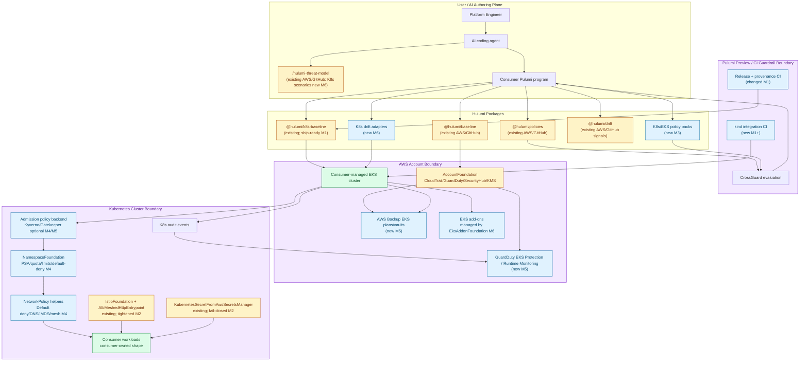

# Hulumi Operations + Kubernetes / EKS Security Hardening Plan - Hulumi (AI-First Runbook v4)

> **Purpose**: Turn the Operations and Kubernetes / EKS security improvement backlogs into one executable Hulumi runbook that ships EC2 patch orchestration, detective services, audit trails, operations policy packs, K8s package release readiness, preview-time guardrails, hardened namespace/network defaults, EKS detection, disaster recovery, patch planning, drift intelligence, and K8s-aware threat modeling.
> **Audience**: AI coding agents first, humans second. This plan is designed to reduce ambiguity, suppress scope drift, and force the same code-quality discipline from any capable agent.
> **Core philosophy**: Prefer automated guardrails over developer intention. Prefer direct inspection over guessing. Prefer executable assumptions over comments. Prefer bounded design over silent growth. Prefer evidence over claims.
> **How to use**: Work through milestones sequentially. Before each milestone, complete the Global Entry Protocol. After each, complete the Global Exit Protocol. Never skip ahead. Never silently widen scope. Treat this document as an execution contract, not as guidance that can be loosely interpreted.
> **Prerequisite reading**: `README.md`, `docs/ARCHITECTURE.md`, `docs/RUNBOOK-hulumi-k8s.md`, `docs/RUNBOOK-hulumi-operations.md`, `docs/design/hulumi-k8s-surface.md`, `docs/design/hulumi-for-operations.md`, `docs/design/hulumi-for-operations-threat-model.md`, `hulumi-k8s-security-improvement-report.md`, `packages/baseline/src/aws/*`, `packages/k8s-baseline/src/*`, `packages/policies/src/*`, `packages/drift/src/*`, `skills/hulumi-threat-model/SKILL.md`.
> **What's new in this combined v4 runbook**: This runbook keeps the existing K8s scope contract, imports the Operations v4 milestones, and adds explicit reliability rules, bounded resource design, assertion-driven invariants, static-analysis gates, state-inspection expectations, and detailed milestone Contract Blocks for both security tranches.

---

## 0. How To Use This Runbook

1. Read the prerequisite files before implementation starts.
2. Work milestones sequentially unless the maintainer explicitly splits one into a separate PR lane.
3. Before each milestone, complete the Global Entry Protocol.
4. During implementation, follow Section 4 and the milestone Contract Block literally.
5. After each milestone, complete the Global Exit Protocol and fill the Evidence Log.
6. Do not mark a milestone done until the Definition of Done is objectively satisfied.

---

## 1. Runbook Metadata

| Field | Value |
|---|---|
| Runbook ID | `hulumi-operations-k8s-security-v4` |
| Project name | `Hulumi` |
| Primary stack | TypeScript 5.x, Node 20 LTS, pnpm workspaces, Pulumi, Pulumi CrossGuard, Vitest, GitHub Actions |
| Primary package/app names | `@hulumi/baseline`, `@hulumi/k8s-baseline`, `@hulumi/policies`, `@hulumi/drift`, `/hulumi-threat-model` |
| Prefix for tests and lesson files | `hulumi-k8s-security` and `hulumi-operations` |
| Default unit test command | `pnpm -r test` |
| Default integration/BDD test command | K8s: `pnpm --filter @hulumi/k8s-baseline test:integration:kind` once introduced; Operations: milestone-specific `packages/baseline/tests/integration/aws-ops/*.aws-ops.test.ts` suites skip without env |
| Default E2E/runtime validation command | K8s: `HULUMI_INTEGRATION=1 HULUMI_EKS_SANDBOX_CLUSTER=<name> pnpm --filter @hulumi/k8s-baseline test:integration:eks`; Operations: `HULUMI_AWS_OPS_INTEGRATION=1` plus milestone-specific AWS sandbox env |
| Default build/boot command | `pnpm -r build` |
| Default formatter command | `pnpm run format:check` |
| Default static analysis / lint command | `pnpm -r lint && pnpm -r typecheck && pnpm run lint:license-boundary && pnpm run lint:exact-pin-guard` |
| Default dependency / security audit command | `pnpm audit --prod` where network access is available; otherwise document inability and rely on exact-pin guard plus lockfile review |
| Default debugger or state-inspection tool | Vitest stack traces plus Pulumi mock-runtime registration inspection; for kind/EKS use `kubectl describe`, `kubectl get -o yaml`, Helm release history, AWS CLI `eks describe-*`, CloudWatch logs |
| Allowed new dependencies by default | `none` |
| Schema/config migration allowed by default | `no` |
| Public interfaces stable by default | `yes` |

### Public interfaces that must remain stable unless explicitly listed otherwise

- Existing `@hulumi/baseline` AWS and GitHub public exports.
- Additive Operations exports: `Ec2PatchBaseline`, `Ec2PatchWaves`, `DetectiveServicesEnable`, and `AuditTrail` once their milestones land.
- Existing `@hulumi/policies` AWS and GitHub public exports and pack entry points.
- Additive Operations policy export: `HulumiOperationsHardeningPack` once its milestone lands.
- Existing `@hulumi/drift` public exports and verdict semantics.
- Existing `@hulumi/k8s-baseline` public exports unless a milestone explicitly calls out an additive migration.
- `skills/hulumi-threat-model` invocation format: `/hulumi-threat-model <scenario-id>`.
- Existing scenario IDs for AWS and GitHub threat models.
- Existing tag keys: `hulumi:iac-role`, `hulumi:tier`, `hulumi:component`, `hulumi:controls`, `hulumi:public-justification`.
- Existing package provenance and exact-pin policy.

---

## 2. Milestone Tracker

This is the single source of truth for progress. Update as each milestone completes.

| # | Milestone | Status | Started | Completed | Lessons File | Completion Summary |
|---|---|---|---|---|---|---|
| 1 | Ship-ready K8s package, docs, release path, and integration skeleton | `done` | 2026-05-01 | 2026-05-01 | `docs/lessons/hulumi-k8s-security-m1.md` | `docs/completion/hulumi-k8s-security-m1.md` |
| 2 | Close unsafe defaults in current K8s primitives | `done` | 2026-05-01 | 2026-05-01 | `docs/lessons/hulumi-k8s-security-m2.md` | `docs/completion/hulumi-k8s-security-m2.md` |
| 3 | K8s and EKS CrossGuard hardening packs | `done` | 2026-05-01 | 2026-05-01 | `docs/lessons/hulumi-k8s-security-m3.md` | `docs/completion/hulumi-k8s-security-m3.md` |
| 4 | Namespace and network security foundations | `done` | 2026-05-01 | 2026-05-01 | `docs/lessons/hulumi-k8s-security-m4.md` | `docs/completion/hulumi-k8s-security-m4.md` |
| 5 | EKS detection and disaster recovery foundations | `done` | 2026-05-01 | 2026-05-01 | `docs/lessons/hulumi-k8s-security-m5.md` | `docs/completion/hulumi-k8s-security-m5.md` |
| 6 | EKS upgrade, add-on, drift, and threat-model expansion | `done` | 2026-05-01 | 2026-05-01 | `docs/lessons/hulumi-k8s-security-m6.md` | `docs/completion/hulumi-k8s-security-m6.md` |
| 7 | Ops M1: `Ec2PatchBaseline` + `Ec2PatchWaves` | `done` | 2026-05-01 | 2026-05-01 | `docs/lessons/hulumi-operations-m1.md` | `docs/completion/hulumi-operations-m1.md` |
| 8 | Ops M2: `DetectiveServicesEnable` | `done` | 2026-05-01 | 2026-05-01 | `docs/lessons/hulumi-operations-m2.md` | `docs/completion/hulumi-operations-m2.md` |
| 9 | Ops M3: `AuditTrail` + `IdentityAlarms` extension | `done` | 2026-05-01 | 2026-05-01 | `docs/lessons/hulumi-operations-m3.md` | `docs/completion/hulumi-operations-m3.md` |
| 10 | Ops M4: `HulumiOperationsHardeningPack` | `not_started` | | | `docs/lessons/hulumi-operations-m4.md` | `docs/completion/hulumi-operations-m4.md` |
| 11 | Ops M5: threat-model ops scenarios + atomic four-package release | `not_started` | | | `docs/lessons/hulumi-operations-m5.md` | `docs/completion/hulumi-operations-m5.md` |

<!-- Status values: not_started | in_progress | blocked | done -->

---

## 3. End-to-End Architecture Diagram

### Diagram Requirements

- Show existing AWS/GitHub/K8s Hulumi packages.
- Show new K8s policy packs, posture components, detection, backup, patch planning, drift, and threat-model paths.
- Show Pulumi authoring, preview, apply, cluster admission, runtime detection, and backup/restore flows.
- Distinguish existing and proposed surfaces.

### Architecture Diagram



Legend: yellow = existing Hulumi surface; blue = proposed or changed by this runbook; green = consumer/AWS runtime; purple = trust boundary.

### Component Summary Table

| Component | Responsibility | Existing/New/Changed | Milestone | Key Interfaces |
|---|---|---|---|---|
| `@hulumi/k8s-baseline` release plumbing | Make K8s package publishable with provenance and docs | Changed | M1 | `package.json`, release workflow, README/docs |
| kind/EKS integration skeleton | Validate K8s resources against real API servers | New | M1 | `test:integration:kind`, `test:integration:eks` |
| `KubernetesSecretFromAwsSecretsManager` | Fail closed on secret fetch/parse/missing required keys | Changed | M2 | TypeScript args + outputs |
| `AlbMeshedHttpEntrypoint` | Require explicit workload selectors and stronger public ALB posture | Changed | M2 | TypeScript args + outputs |
| `HulumiK8sHardeningPack` | Block unsafe workload manifests at preview time | New | M3 | CrossGuard pack entry point |
| `HulumiK8sRbacPack` | Block wildcard RBAC, cluster-admin bindings, and secrets overreach | New | M3 | CrossGuard pack entry point |
| `HulumiEksClusterPack` | Inspect raw EKS cluster resources without wrapping cluster topology | New | M3 | CrossGuard pack entry point |
| `NamespaceFoundation` | PSA, quotas, limits, default service account discipline, default-deny | New | M4 | `@hulumi/k8s-baseline` component |
| Network policy helpers | DNS, default deny, mesh gateway, IMDS egress restrictions | New | M4 | `@hulumi/k8s-baseline` components |
| `EksRuntimeDetectionFoundation` | GuardDuty EKS, audit log alarms, runtime monitoring hooks | New | M5 | AWS + Kubernetes resources |
| `EksBackupFoundation` | AWS Backup plans, vaults, restore metadata, immutable/air-gapped options | New | M5 | AWS Backup resources |
| `EksAddonFoundation` | Exact-pinned EKS add-ons and compatibility outputs | New | M6 | AWS EKS add-on resources |
| `EksUpgradePlanner` | Generate upgrade preflight / version lifecycle report | New | M6 | Library + optional CLI |
| K8s drift adapters | Detect high-risk K8s object changes outside Pulumi | New | M6 | `@hulumi/drift` adapters |
| K8s threat-model scenarios | Add EKS/K8s attacker-graph scenarios to the skill | New | M6 | `/hulumi-threat-model <scenario-id>` |
| `Ec2PatchBaseline` | SSM Patch Baseline, Maintenance Window, compliance metric, SNS routing | New | Ops M1 / combined 7 | `@hulumi/baseline.aws.Ec2PatchBaseline` |
| `Ec2PatchWaves` | Sequenced patch waves with health gates across dev/staging/production groups | New | Ops M1 / combined 7 | `@hulumi/baseline.aws.Ec2PatchWaves` |
| `DetectiveServicesEnable` | GuardDuty, IAM Access Analyzer, Cost Anomaly Detection, Inspector v2, EventBridge routing | New | Ops M2 / combined 8 | `@hulumi/baseline.aws.DetectiveServicesEnable` |
| `AuditTrail` | Multi-region CloudTrail, log-file validation, encrypted CW Logs, SecureBucket-backed audit archive | New | Ops M3 / combined 9 | `@hulumi/baseline.aws.AuditTrail` |
| `IdentityAlarms` audit extension | Root usage, MFA disabled, and CloudTrail stop/update metric filters | Changed | Ops M3 / combined 9 | additive `IdentityAlarms` args |
| `HulumiOperationsHardeningPack` | Preview-time `O_*` rules for patch, detective, audit, and Inspector coverage | New | Ops M4 / combined 10 | CrossGuard pack entry point |
| Operations threat-model scenarios | Patch compliance lapse, detective services disabled, audit pipeline broken | New | Ops M5 / combined 11 | `/hulumi-threat-model <scenario-id>` |

### Data Flow Summary

| Flow | From | To | Protocol/Mechanism | Bounded? | Failure Mode | Milestone |
|---|---|---|---|---|---|---|
| K8s package release | GitHub Actions | npm + GitHub release | pnpm pack/publish, provenance attest | yes, four packages | release aborts before publish on preflight failure | M1 |
| K8s preview guardrails | Pulumi program | CrossGuard | policy pack validation | yes, finite resource tree | mandatory violation blocks preview | M3 |
| Namespace defaults | Pulumi program | K8s API | Pulumi Kubernetes provider | yes, finite resources per namespace | apply fails visibly | M4 |
| Secret extraction | Pulumi apply | AWS Secrets Manager + K8s Secret | AWS SDK + K8s provider | yes, mapped key count | fail closed by default | M2 |
| Detection findings | EKS audit/runtime events | GuardDuty / CloudWatch / Security Hub | AWS managed services | yes, bounded alarm rules | degraded feature output and docs | M5 |
| Backup/restore metadata | EKS cluster | AWS Backup | AWS Backup plan/vault | yes, configured retention | backup job failure visible in AWS Backup/SNS | M5 |
| Upgrade planning | EKS/API/add-on inventory | Markdown/JSON report | AWS SDK / CLI-compatible library | yes, bounded clusters/add-ons list | report marks unknown/degraded | M6 |
| K8s drift classification | K8s API/audit/Helm | Drift verdict | adapter contract | yes, probe timeout | low confidence / degraded verdict | M6 |
| EC2 patch orchestration | Pulumi program | SSM Patch Manager + CloudWatch metrics + SNS | `@hulumi/baseline.aws.Ec2PatchBaseline` | yes, bounded patch groups/waves | invalid tier or routing fails at construction/preview | Ops M1 |
| Detective services routing | AWS managed findings | EventBridge + MonitoringFoundation SNS | GuardDuty / Inspector v2 / IAM Access Analyzer / Cost Anomaly | yes, bounded rule set | missing StartupHardened route rejects | Ops M2 |
| Audit event persistence | CloudTrail | CW Logs + SecureBucket-backed S3 archive | CloudTrail multi-region trail | yes, finite trail/log/bucket resources | missing encryption/log validation rejects | Ops M3 |
| Operations preview guardrails | Pulumi program | CrossGuard | `HulumiOperationsHardeningPack` | yes, finite resource tree | mandatory violation blocks preview | Ops M4 |
| Operations release readiness | repo packages/docs/examples | npm + GitHub release | four-package release with SLSA attestation | yes, release preflight matrix | release aborts before publish on failure | Ops M5 |

---

## 4. Carmack-Style Development Best Practices

These rules apply to every milestone.

### 4.1 Inspect State, Do Not Guess

| Requirement | Project-Specific Tool/Command | Evidence Required |
|---|---|---|
| Interactive debugger available | Vitest focused tests with stack traces; Node inspector optional | note focused test/debug command in Evidence Log if used |
| Breakpoints can be set in changed code | Node/Vitest inspector or IDE | note if a failure required inspection |
| Runtime state can be inspected | Pulumi mock-runtime `registrations`, `kubectl get -o yaml`, `kubectl describe`, AWS CLI `describe-*`, CloudWatch logs | record inspected resource shape or command output summary |
| Tests can be debugged | `pnpm --filter <pkg> test -- <file>` | record focused command |

Agent rules:

- If a failure is not explained by compiler, test assertion, or stack trace, inspect live state before changing code.
- Do not add permanent print/debug statements to production paths.
- If logging is added, it must be structured, intentional, and useful in production.
- Remove temporary debug output before completing the milestone.

### 4.2 Static Analysis Is Mandatory

| Check | Command | Required Level | Notes |
|---|---|---|---|
| Formatter | `pnpm run format:check` | must pass | No style-only churn outside changed files unless allowed |
| Type check / compile check | `pnpm -r typecheck && pnpm -r build` | must pass | Must include all changed packages |
| Static analyzer / linter | `pnpm -r lint` | must pass | Warnings fail CI unless explicitly waived |
| License boundary | `pnpm run lint:license-boundary` | must pass | No verbatim licensed control text |
| Exact pin guard | `pnpm run lint:exact-pin-guard` | must pass | Update allowlist only with rationale |
| Security/dependency audit | `pnpm audit --prod` where available | pass or documented exception | Required if dependency graph changes |

### 4.3 Assertions Are Executable Comments

Use assertions or explicit validation for:

- non-empty policy rule sets
- bounded key mappings and selector maps
- exact version strings
- no wildcard RBAC unless explicitly allowed by a typed escape hatch
- one policy pack per process entry-point discipline
- finite retry/probe budgets
- no silently empty security resources

Do not use assertions for normal user-input validation. Public boundary checks return structured errors or CrossGuard violations.

### 4.4 Prefer Bounded Resources Over Silent Growth

| Resource | Expected Bound | Hard Limit | Behavior At Limit | Evidence/Test |
|---|---:|---:|---|---|
| Secrets key mapping | under 20 keys | 64 keys | constructor error | M2 BDD |
| Selector label count | under 8 labels | 32 labels | constructor error | M2 BDD |
| Policy pack resource traversal | Pulumi preview resource count | no stored growth | one pass over resources | M3 tests |
| Network policy peers | under 32 peers | 128 peers | constructor error | M4 BDD |
| Backup plan lifecycle rules | under 8 rules | 32 rules | constructor error | M5 BDD |
| Upgrade inventory clusters | 1 cluster per planner call | 1 cluster | explicit new call required | M6 BDD |
| Drift adapter probe | adapter-specific | `probeTimeoutMs` | degraded verdict | M6 BDD |

### 4.5 Make Invalid States Unrepresentable

| Concept | Prefer | Avoid |
|---|---|---|
| Policy enforcement levels | union types | loose strings |
| EKS support status | `standard | extended | unsupported | unknown` union | raw strings |
| Public exposure | explicit `internetFacing` object with justification | boolean-only public flag |
| Service account token posture | typed `automount: "disabled" | "required"` | implicit Kubernetes default |
| Secret failure mode | `fail | warn-empty` union, default `fail` | silent empty secret |
| RBAC wildcard escape | typed acknowledgement with reason | raw `*` passthrough |
| Network policy direction | `ingress | egress | both` union | free-form string |

### 4.6 Preserve Compatibility Until Explicitly Broken

Compatibility checks are part of correctness. Additive args must preserve existing construction unless a milestone explicitly introduces a migration path and deprecation window.

### 4.7 Prefer Small, Local, Reviewable Changes

- Change only allowed files.
- Prefer extending existing local patterns over inventing new abstractions.
- Keep release/doc hygiene separate from security feature milestones.
- Do not combine refactor and feature work unless the milestone contract permits it.

### 4.8 No Silent Failure

Forbidden in production paths:

- swallowed exceptions
- empty security resources on failure unless `warn-empty` is explicitly set
- public internet exposure without certificate and justification
- wildcard RBAC without typed escape hatch
- unbounded retries
- TODO / placeholder logic
- hard-coded secrets or unsafe defaults

---

## 5. High-Level Design for State Modeling / Formal Verification

### 5.1 System Goal

The correctness goal is to ensure Hulumi K8s security components either produce an explicitly hardened graph of Kubernetes and AWS resources or fail visibly before deployment. No milestone may introduce a path where a user believes a control exists while the emitted resource selects nothing, protects nothing, or silently degrades.

### 5.2 Main Components

| Component | Protocol Role | Key State (durable / volatile) | Visible Actions |
|---|---|---|---|
| CrossGuard K8s packs | preview-time validator | volatile Pulumi resource tree | report violation/advisory |
| K8s baseline components | resource emitter | Pulumi state + Kubernetes objects | create/update resources |
| Detection foundation | event router | CloudWatch/GuardDuty/Security Hub config | findings/alarms |
| Backup foundation | recovery controller | AWS Backup plans/vaults/recovery points | backup/restore jobs |
| Upgrade planner | preflight reporter | no durable state by default | report safe/unsafe plan |
| K8s drift adapters | classifier signal source | cache via existing drift package | verdict source/confidence |

### 5.3 Abstract State

| Variable | Abstract Type | Why Needed | Bound | Explosion Risk |
|---|---|---|---|---|
| `ResourceTree` | finite set of Pulumi resources | policy validation | preview resources | low |
| `NamespacePosture` | map namespace -> labels/policies | prove namespace hardened | namespaces in stack | medium |
| `RbacBindings` | finite set of subjects/rules | detect escalation paths | bindings in stack | medium |
| `ExposureEdges` | finite set of ingress/service edges | detect internet exposure | services/ingresses in stack | medium |
| `SecretFlows` | SM ARN -> K8s Secret keys | ensure fail-closed and bounded mapping | 64 keys per secret | low |
| `VersionInventory` | current/target versions | patch safety | one cluster per report | low |
| `DriftSignals` | adapter results | classify change source | adapter count | low |

### 5.4 Actions / Transitions

| Action | Preconditions | State Updates | Failure / Interleaving Notes |
|---|---|---|---|
| `ValidatePreview` | finite Pulumi resources | none | violation blocks deploy |
| `EmitNamespaceFoundation` | namespace name valid | K8s namespace, quotas, policies | apply fails visibly |
| `ExtractSecret` | SM JSON object, required keys present | K8s Secret data | default fail closed |
| `ConfigureDetection` | GuardDuty/CloudWatch permissions | detectors/alarms | outputs degraded features |
| `ConfigureBackup` | AWS Backup IAM available | vault/plan selections | backup failure visible |
| `PlanUpgrade` | EKS describe permissions | report only | unknowns block "safe" verdict |
| `ClassifyK8sDrift` | probe budget available | verdict/cache | timeout yields degraded/low confidence |

### 5.5 Safety Properties

- **No false protection**: an emitted AuthorizationPolicy or NetworkPolicy must have explicit selectors and must not default to a selector that may match zero pods without acknowledgement.
- **No silent secret failure**: failed secret extraction must fail deployment unless an explicit degraded mode is selected.
- **No wildcard escalation by default**: wildcard RBAC rules must be rejected unless a typed exception records scope and reason.
- **No unbounded retry/probe**: every live API probe has a timeout and visible degraded result.
- **No unsupported release claim**: docs and release workflow must include the K8s package before the package is marked publishable.

### 5.6 Liveness / Progress Assumptions

- Pulumi preview eventually returns a finite resource tree or fails.
- Kubernetes and AWS API calls eventually return, fail, or hit a bounded timeout.
- Backup jobs and restore drills are asynchronous; Hulumi provisions configuration and emits observability rather than waiting forever for operational completion.
- Drift adapters report degraded confidence instead of blocking indefinitely.

### 5.7 Simplifications

| Simplification | Why It Still Catches Relevant Bugs |
|---|---|
| One EKS cluster per upgrade planner invocation | avoids state explosion and matches practical upgrade workflow |
| One pass over Pulumi resource tree for policy packs | CrossGuard receives a finite preview resource list |
| kind tests for default K8s resources, manual EKS tests for AWS-specific controllers | kind catches YAML/API errors; EKS catches ALB/Fargate/add-on behavior |
| Warnings for untested versions rather than hard block | preserves user agency while surfacing risk |

---

## 6. Global Execution Rules

### 6.1 Stay inside scope

- Do not add an `@pulumi/eks.Cluster` wrapper.
- Do not own node group, Karpenter, Fargate profile, or CNI topology.
- Do not ship mesh alternatives beyond existing Istio surface.
- Do not ship ingress alternatives beyond ALB in this runbook.
- Do not alter existing AWS/GitHub public APIs unless explicitly listed.
- Do not introduce a dependency unless a milestone explicitly permits it.

### 6.2 Tests define the contract

- Write BDD tests before production code.
- Write runtime validation stubs before production code for integration milestones.
- Confirm new tests fail for the expected reason before implementation.
- No milestone closes on "compiles"; it closes on evidence.

### 6.3 Assertions and invariants are mandatory where assumptions matter

Each milestone must list and test its invariants: bounded mappings, selector requirements, version exactness, no wildcard defaults, and fail-closed behavior.

### 6.4 Resource bounds are mandatory where growth is possible

Every new list, mapping, retry policy, or probe must declare expected bound, hard limit, and behavior at limit.

### 6.5 Static analysis must pass

Every milestone must run formatter, typecheck/build, lint, license-boundary lint, exact-pin guard, and dependency audit if dependencies change.

### 6.6 Debugger over guessing

If a failure is not explained by compiler/test/stack trace, inspect Pulumi registrations, live Kubernetes YAML, Helm output, or AWS describe output before modifying code.

### 6.7 No placeholders in production paths

No TODO, fake implementations, silent fallbacks, commented dead code, temporary mocks, hard-coded secrets, or unsafe defaults.

### 6.8 Preserve backwards compatibility

Existing packages and skill scenarios must keep working. Breaking changes require explicit deprecation, docs, migration tests, and maintainer approval.

### 6.9 Prefer the smallest safe change

Keep milestones narrow. If a change naturally becomes a new product surface, split it into a fresh runbook.

### 6.10 Record evidence, not claims

Evidence logs must include commands, expected results, actual results, pass/fail, and notes.

### 6.11 Keep `.gitignore` current and clean up test artifacts

No test clusters, Pulumi checkpoints, Helm caches, generated reports, or scratch outputs may be committed accidentally.

---

## 7. Global Entry Rules (Pre-Milestone Protocol)

Do this before every milestone.

1. Read the lessons file from the previous milestone, if one exists.
2. Read the current milestone fully.
3. Run baseline tests and record the result:
   ```bash
   pnpm -r build
   pnpm -r typecheck
   pnpm -r test
   pnpm -r lint
   pnpm run lint:license-boundary
   pnpm run lint:exact-pin-guard
   ```
4. Read files listed in "Files Allowed To Change" and "Files To Read Before Changing Anything".
5. Update Milestone Tracker to `in_progress`.
6. Create BDD test files first.
7. Create runtime validation stubs first.
8. Copy the Evidence Log template into working notes.
9. Re-state constraints in your own words before coding.

---

## 8. Global Exit Rules (Post-Milestone Protocol)

Do this after every milestone.

1. Run formatter.
2. Run typecheck and build.
3. Run static analyzer / linter.
4. Run dependency audit if dependency graph changed.
5. Run the full test suite.
6. Run milestone E2E/runtime validations.
7. Run smoke tests.
8. Verify compatibility checklist.
9. Verify resource bounds and invariants.
10. Complete Self-Review Gate.
11. Remove temporary debug code.
12. Run `git status` and confirm no untracked test artifacts.
13. Review `.gitignore`.
14. Update docs from Documentation Update Table.
15. Write lessons file.
16. Write completion summary.
17. Update Milestone Tracker to `done`.

---

## 9. Background Context

### Current State

Hulumi already ships hardened AWS and GitHub Pulumi components, policy packs, drift classification, and a threat-modeling skill. The K8s package exists and has mock-runtime unit coverage: `pnpm --filter @hulumi/k8s-baseline test` passed with 8 files and 83 tests during the research pass. The top-level docs and release workflow lag behind the K8s implementation.

### Problem

1. **K8s package is implemented but not truly shippable**: release workflow only publishes three packages, K8s package is `private:true`, docs omit or stale-reference the K8s surface, and compatibility docs disagree with runtime table.
2. **Current K8s primitives have a few unsafe or misleading failure modes**: secret extraction can create empty secrets on failure, ALB entrypoint infers workload selectors, and public ALB hardening is not strict enough.
3. **No K8s policy pack exists**: unsafe workloads, wildcard RBAC, public services, and weak EKS cluster settings can still pass Pulumi preview.
4. **No app namespace hardening primitive exists**: PSA, default-deny policies, quotas, limit ranges, and service account token defaults are left to consumers.
5. **Detection and DR are not first-class K8s surfaces**: GuardDuty EKS, audit alarms, runtime monitoring, AWS Backup, vault lock, restore metadata, and restore drills are missing.
6. **Patch and drift lifecycle are not modeled for EKS**: EKS version lifecycle, add-on updates, node AMIs, Helm charts, and K8s object drift need explicit Hulumi support.
7. **Threat-model skill lacks K8s scenarios**: agents cannot invoke a K8s/EKS attacker-graph scenario before writing cluster IaC.

### Target Architecture

At the end of this runbook, Hulumi users can:

- install and verify `@hulumi/k8s-baseline` with provenance
- preview-fail unsafe K8s workloads, RBAC, services, ingresses, and EKS cluster settings
- create hardened namespaces with PSA, quotas, limits, default-deny, DNS allowance, mesh allowance, and IMDS egress denial
- use fail-closed Secrets Manager extraction and selector-safe mesh entrypoints
- configure EKS detection and backup/restore posture through Hulumi components
- generate EKS upgrade plans and manage exact-pinned add-ons
- classify high-risk Kubernetes drift
- run `/hulumi-threat-model eks-*` scenarios before authoring IaC

### Key Design Principles

1. **No cluster-topology ownership**: Hulumi does not wrap EKS cluster creation, node groups, Karpenter, Fargate profiles, or CNI choice.
2. **Security defaults with explicit escape hatches**: weakened posture requires typed acknowledgement and reason.
3. **Preview-time and admission-time both matter**: CrossGuard catches Hulumi-authored IaC; admission policies catch bypasses.
4. **Graph edges are the security unit**: remove or label paths from internet to pod, pod to API, pod to AWS, pod to secrets, and attacker to backups.
5. **Fail visible, not quiet**: degraded posture appears as an error, violation, warning, output, event, or low-confidence verdict.
6. **IDs only**: framework references cite IDs/URLs only; no licensed benchmark text.

### What to Keep

- Existing K8s runbook scope contract.
- Existing `@hulumi/k8s-baseline` component names and outputs unless explicitly extended.
- Existing AWS/GitHub policy packs and package surfaces.
- Exact-pin and cooling-off discipline.
- SLSA provenance on published packages.
- No telemetry and no hosted-service runtime dependency.
- Existing `/hulumi-threat-model` output schema.

### What to Change

- Release workflow and docs to include K8s package.
- `@hulumi/k8s-baseline` primitives for fail-closed secrets, explicit selectors, and public ingress hardening.
- `@hulumi/policies` to add K8s/EKS pack entry points.
- `@hulumi/k8s-baseline` to add namespace/network, detection, backup, add-on, and upgrade components.
- `@hulumi/drift` to add K8s adapters.
- `skills/hulumi-threat-model` to add EKS/K8s scenarios.

### Global Red Lines

- No EKS cluster wrapper.
- No CNI, node group, Karpenter, or Fargate profile opinion.
- No public API break without migration.
- No production placeholders.
- No silent error swallowing.
- No unbounded retries/probes.
- No secrets in source control or logs.
- No licensed framework prose in source or generated skill output.
- No kind/EKS test artifacts committed.

---

## 10. Carry-forward from prior retros

No retro-derived issues exist for `hulumi-k8s-security` yet. The following scope candidates come from the research report and should be filed or linked when implementation begins.

| Issue | Title | Suggested lane | Suggested milestone | Status |
|---|---|---|---|---|
| TBD | Release workflow omits `@hulumi/k8s-baseline` | `milestone` | M1 | proposed |
| TBD | K8s docs stale after K8s M5 | `milestone` | M1 | proposed |
| TBD | Secrets extraction should fail closed | `milestone` | M2 | proposed |
| TBD | ALB entrypoint should require explicit workload selector | `milestone` | M2 | proposed |
| TBD | Add K8s/EKS policy pack | `fresh-runbook` if too broad | M3 | proposed |
| TBD | Add EKS backup and restore foundation | `milestone` | M5 | proposed |

---

## 11. BDD and Runtime Validation Rules

### 11.1 Write Tests Before Production Code

For each milestone:

1. Read the BDD acceptance table.
2. Create test files first.
3. Confirm tests fail for expected reasons.
4. Implement production code.
5. Re-run tests after refactors.

### 11.2 Required Test Coverage Categories

Security milestones must cover:

- happy path
- invalid input
- empty / first-run state
- dependency failure / partial failure
- resource-limit behavior
- assertion/invariant violation
- backward compatibility
- abuse case

If a category does not apply, state why in the milestone notes.

### 11.3 Test File Naming

| Layer | Convention | Location |
|---|---|---|
| K8s package unit tests | `<feature>.test.ts` | `packages/k8s-baseline/tests/` |
| K8s kind tests | `<feature>.kind.test.ts` | `packages/k8s-baseline/tests/integration/kind/` |
| K8s EKS tests | `<feature>.eks.test.ts` | `packages/k8s-baseline/tests/integration/eks/` |
| Policy unit tests | `<pack>.test.ts` | `packages/policies/tests/k8s/` |
| Drift unit tests | `<adapter>.test.ts` | `packages/drift/tests/k8s/` |
| Skill BDD tests | existing skill tests | `tests/skill-bdd/` |

### 11.4 Test Artifact Cleanup Rules

- Use OS temp directories for kind kubeconfig, Helm caches, and generated manifests.
- Delete kind clusters in `afterAll`, even on failure.
- Never write Helm cache into the user's home cache during tests.
- Real-EKS tests must label all resources and clean by label selector.
- `git status` must show no untracked test artifacts after tests.

### 11.5 End-to-End Runtime Validation

Every milestone includes at least one runtime validation beyond TypeScript compile:

- M1: kind skeleton boots and can reach API server, or documents skipped precondition.
- M2: mock runtime proves emitted resources change as expected; kind test validates selector/network object shape where possible.
- M3: CrossGuard pack exercises real policy handlers with synthetic resource trees.
- M4: kind namespace and NetworkPolicy resources apply.
- M5: AWS/EKS validations are gated behind integration env and have contract-only tests by default.
- M6: upgrade planner and drift adapters run with stubbed API clients plus optional real-EKS smoke.

---

## 12. Dependency, Migration, and Refactor Policy

### 12.1 Dependency policy

No new dependency is allowed unless listed in a milestone Contract Block. Prefer Pulumi providers already present, AWS SDK packages already used, and test-only tooling already in the repo.

### 12.2 Migration policy

Additive args are preferred. Any changed default must include:

- compatibility note
- test covering old construction path
- deprecation or explicit migration path if old behavior becomes unsafe

### 12.3 Refactor budget

Default: `Minimal local refactor permitted in listed files only`.

---

## 13. Evidence Log Template

Copy this table into each milestone section and fill it in during execution.

| Step | Command / Check | Expected Result | Actual Result | Pass/Fail | Notes |
|---|---|---|---|---|---|
| Baseline tests | `pnpm -r test` | all pre-existing tests green | | | |
| BDD tests created | `[files]` | fail for expected reason | | | |
| E2E stubs created | `[files]` | fail for expected reason | | | |
| Implementation | `[summary]` | contract satisfied | | | |
| Formatter | `pnpm run format:check` | clean | | | |
| Typecheck / build check | `pnpm -r typecheck && pnpm -r build` | clean | | | |
| Static analyzer / linter | `pnpm -r lint` | clean | | | |
| License boundary | `pnpm run lint:license-boundary` | clean | | | |
| Exact pin guard | `pnpm run lint:exact-pin-guard` | clean | | | |
| Dependency audit if deps changed | `pnpm audit --prod` | pass or documented exception | | | |
| Full tests | `pnpm -r test` | green | | | |
| E2E runtime | milestone command | green or intentionally skipped with reason | | | |
| Build/boot | `pnpm -r build` | clean | | | |
| Smoke tests | listed steps | all checked | | | |
| Resource-bound verification | listed bound + test | encoded and exercised | | | |
| Invariant/assertion verification | listed invariant + test | encoded and exercised | | | |
| Debugger / state inspection | inspected state | hypothesis confirmed before code change | | | |
| Test artifact cleanup | `git status --short` | no untracked test artifacts | | | |
| .gitignore review | review `.gitignore` | patterns current | | | |
| Compatibility checks | listed checks | no regressions | | | |

---

## 14. Self-Review Gate

Before marking a milestone done, answer every question:

- Did I change only allowed files?
- Did I avoid unrelated refactors?
- Did I preserve all listed public interfaces and compatibility requirements?
- Did I add tests for failure modes, not just happy paths?
- Did I add or update assertions/invariants where assumptions matter?
- Did I bound new resource growth or document why it cannot be bounded?
- Did I run formatter, typecheck, static analysis, license-boundary lint, and exact-pin guard?
- Did I use state inspection when failures were not explained by compiler/test/stack trace?
- Did I remove temporary debug code, mocks, placeholders, and commented-out dead code?
- Did I update documentation to match implementation?
- Is every assumption either verified or explicitly documented as unresolved?
- Do all tests clean up output artifacts?
- Is `.gitignore` up to date?
- Is the milestone truly done according to its Definition of Done?

If any answer is "no", the milestone is not complete.

---

## 15. Lessons-Learned File Template

Path: `docs/lessons/hulumi-k8s-security-m<N>.md`

```md
# Lessons Learned - hulumi-k8s-security Milestone <N>

## What changed
- [summary]

## Design decisions and why
- [decision] - [reason]

## Assumptions verified
- [assumption] - [evidence]

## Assumptions still unresolved
- [assumption] - [risk / follow-up]

## Mistakes made
- [mistake]

## Root causes
- [root cause]

## What was harder than expected
- [note]

## Invariants/assertions added or strengthened
- [invariant]

## Resource bounds established or verified
- [bound]

## Debugging / inspection notes
- [what was inspected and what it revealed]

## Naming conventions established
- [types, files, tests, commands]

## Test patterns that worked well
- [pattern]

## Missing tests that should exist now
- [test]

## Rules for the next milestone
- [rule]
```

---

## 16. Completion Summary Template

Path: `docs/completion/hulumi-k8s-security-m<N>.md`

```md
# Completion Summary - hulumi-k8s-security Milestone <N>

## Goal completed
- [what capability now exists]

## Files changed
- [file]

## Tests added
- [test file]

## Runtime validations added
- [e2e file]

## Static analysis and formatter evidence
- [command and result]

## Compatibility checks performed
- [check]

## Invariants/assertions added
- [invariant]

## Resource bounds added or verified
- [bound]

## Documentation updated
- [doc and section]

## .gitignore changes
- [patterns added or removed]

## Test artifact cleanup verified
- [confirmation]

## Deferred follow-ups
- [follow-up]

## Known non-blocking limitations
- [limitation]
```

---

## 17. Milestone Plan

### Milestone 1 - Ship-ready K8s package, docs, release path, and integration skeleton

**Goal**: Make the existing `@hulumi/k8s-baseline` package accurately documented, release-ready, included in provenance/SBOM workflows, and covered by a real-cluster integration test skeleton.

**Context**: The K8s package exists and unit tests pass, but the top-level docs and release workflow still describe a three-package AWS/GitHub world. `packages/k8s-baseline/package.json` is `private:true`, `COMPATIBILITY.md` disagrees with `src/compatibility.ts`, and the promised kind/EKS integration paths are absent.

**Carmack-style reliability goal**: Compatibility and evidence. A user, agent, or release job must not see contradictory state about whether K8s exists and ships.

**Important design rule**: Do not add new K8s features in M1. This is release and evidence plumbing only.

**Refactor budget**: `No refactor permitted beyond direct implementation`

#### Contract Block

| Field | Value |
|---|---|
| Inputs | Existing K8s package, docs, release workflow, runbook claims |
| Outputs | Updated docs, four-package release path, package publish readiness, kind/EKS test skeletons |
| Interfaces touched | npm package metadata, GitHub Actions workflow, docs, test scripts |
| Files allowed to change | `README.md`, `CHANGELOG.md`, `docs/ARCHITECTURE.md`, `docs/README.md`, `docs/components/README.md`, `packages/k8s-baseline/package.json`, `packages/k8s-baseline/COMPATIBILITY.md`, `.github/workflows/release.yml`, `.github/workflows/ci.yml`, `.github/workflows/weekly-integration.yml`, `package.json`, docs for K8s components |
| Files to read before changing anything | all allowed files, `docs/RUNBOOK-hulumi-k8s.md`, `packages/k8s-baseline/src/compatibility.ts` |
| New files allowed | `packages/k8s-baseline/tests/integration/kind/*.kind.test.ts`, `packages/k8s-baseline/tests/integration/eks/*.eks.test.ts`, `docs/cookbooks/eks-meshed-workload-bootstrap.md` if needed |
| New dependencies allowed | none |
| Migration allowed | no |
| Compatibility commitments | Existing `pnpm -r build/test/lint/typecheck` must keep working; no package public API changes |
| Resource bounds introduced/changed | kind cluster names bounded to one per test file; release artifact list exactly four packages |
| Invariants/assertions required | release workflow packages list includes baseline, policies, drift, k8s-baseline; compatibility doc matches runtime table |
| Debugger / inspection expectation | inspect release YAML and package list directly; inspect Pulumi package exports if examples fail |
| Static analysis gates | formatter, typecheck, build, lint, license-boundary, exact-pin |
| Forbidden shortcuts | no fake publish, no docs claiming release without workflow support, no untested script commands in docs |
| Data classification | Public |
| Abuse acceptance scenarios | `tm-k8s-release-abuse-unattested-package`: K8s package cannot ship outside provenance/SBOM path |

#### Out of Scope / Must Not Do

- Do not change K8s component behavior.
- Do not add new dependencies.
- Do not change AWS/GitHub public APIs.

#### Files Allowed To Change

| File | Planned Change |
|---|---|
| `README.md` | Add K8s package and install section |
| `CHANGELOG.md` | Add K8s package release notes |
| `docs/ARCHITECTURE.md` | Reality-first update for AWS/GitHub/K8s |
| `docs/README.md` | Add K8s docs links |
| `docs/components/README.md` | List K8s components |
| `packages/k8s-baseline/package.json` | remove `private:true` when release-ready; add scripts if needed |
| `packages/k8s-baseline/COMPATIBILITY.md` | sync with `src/compatibility.ts` |
| `.github/workflows/release.yml` | pack, SBOM, attest, publish four packages |
| `.github/workflows/ci.yml` | add K8s focused job if useful |
| `.github/workflows/weekly-integration.yml` | add contract-only K8s integration lane |

#### BDD Acceptance Scenarios

**Feature: K8s package release readiness**

| Scenario | Category | Given | When | Then |
|---|---|---|---|---|
| Release packs four packages | happy path | release workflow is parsed | package loop is inspected | it includes `baseline`, `policies`, `drift`, `k8s-baseline` |
| K8s package publishable | compatibility | package metadata loaded | release readiness check runs | `private` is absent or false and `publishConfig.provenance` is true |
| Compatibility docs match code | invariant | `TESTED_VERSIONS` has Istio entries | docs check runs | `COMPATIBILITY.md` lists same chart versions |
| kind skeleton is gated | empty state | kind not available in CI | test command runs without integration flag | tests skip visibly, not fail silently |
| EKS skeleton is gated | dependency failure | EKS cluster env not set | EKS test command runs | test skips with clear precondition message |

#### Regression Tests

- `pnpm --filter @hulumi/k8s-baseline test`
- `pnpm -r build`
- `pnpm -r test`
- release workflow dry-run equivalent if available

#### Compatibility Checklist

- [ ] Existing AWS package release behavior preserved.
- [ ] Existing GitHub package release behavior preserved.
- [ ] Existing K8s public exports unchanged.
- [ ] Existing docs links remain valid.

#### E2E Runtime Validation

**File**: `packages/k8s-baseline/tests/integration/kind/release-readiness.kind.test.ts`

| E2E Test | What It Proves | Pass Criteria |
|---|---|---|
| `kind_cluster_contract_or_skip` | kind test lane exists and is safely gated | creates/deletes kind cluster when enabled or skips with explicit reason |

#### Smoke Tests

- [ ] `pnpm --filter @hulumi/k8s-baseline test` passes.
- [ ] `pnpm -r build` passes.
- [ ] release workflow contains four package names.
- [ ] docs component index contains all K8s components.
- [ ] `git status` shows no untracked test artifacts.

#### Evidence Log

| Step | Command / Check | Expected Result | Actual Result | Pass/Fail | Notes |
|---|---|---|---|---|---|
| Baseline tests | `pnpm -r test` | all pre-existing tests green | 67 baseline / 59 policies / 54 drift / 83 k8s-baseline / 28 skill-bdd / 4 example smoke green | Pass | Run on entry, all green. |
| BDD tests created | `tests/release-readiness.test.ts`, `tests/integration/{kind,eks}/release-readiness.{kind,eks}.test.ts` | fail for expected reason | Initial run: 4 failures — release.yml lacks 4-package loop, package.json has `private:true`, COMPATIBILITY.md missing istiod/cni/gateway/1.24.2 | Pass | All four failures matched the runbook's stated unsafe defaults exactly. |
| E2E stubs created | `tests/integration/{kind,eks}/release-readiness.{kind,eks}.test.ts` | gated skip with explicit precondition | Both lanes skip with `[release-readiness.{kind,eks}] skipped: set HULUMI_INTEGRATION_{KIND,EKS}=1 ...` and `expect(integrationFlag).toBe(false)` proves the test ran | Pass | Allow-list deviation: sibling `vitest.integration.config.ts` is required because vitest 1.6 has no `--include`/`--exclude` CLI flags and the default config excludes `tests/integration/**`. Documented in lessons file. |
| Implementation | release.yml four-package loop + SBOM, ci.yml `k8s-baseline-test` job, weekly-integration k8s lane, package.json publish-readiness, COMPATIBILITY.md sync, doc updates (README, CHANGELOG, ARCHITECTURE, docs/README, components/README) | contract satisfied | All BDD scenarios green after edits | Pass | Allow-list deviation: top-level `tests/release-readiness.test.ts` was needed because `vitest.config.ts` excludes integration paths from the default suite — see lessons file. |
| Formatter | `npx prettier --check <changed files>` | clean | only `docs/components/README.md` regressed; fixed with `prettier --write`; pre-existing 85-warning baseline remains out-of-scope (§6.7) | Pass | |
| Typecheck / build check | `pnpm -r typecheck && pnpm -r build` | clean | both green across 10 workspace projects | Pass | |
| Static analyzer / linter | `pnpm -r lint` | clean | green after removing 3 unused `eslint-disable-next-line no-console` directives I introduced | Pass | |
| License boundary | `pnpm -w run lint:license-boundary` | clean | `OK (IDs-only policy upheld across scanned trees)` | Pass | Used `-w` per K8s M5 lessons-file foot-gun. |
| Exact pin guard | `pnpm -w run lint:exact-pin-guard` | clean | `OK (6 @pulumi/* deps match pinned hashes)` | Pass | |
| Dependency audit | n/a | n/a | no dependency graph changes (M1 forbids new deps) | Skip | |
| Full tests | `pnpm -r test` | green | 67 baseline / 59 policies / 54 drift / **87** k8s-baseline (was 83; +4 BDD scenarios) / 28 skill-bdd / 4 example smoke | Pass | |
| E2E runtime | `pnpm --filter @hulumi/k8s-baseline run test:integration:{kind,eks}` | green or intentionally skipped | both lanes skip with explicit precondition messages | Pass | |
| Build/boot | `pnpm -r build` | clean | green | Pass | |
| Smoke tests | k8s-baseline test, full build, release.yml has 4 packages, components doc has K8s entries, git status no test artifacts | all checked | k8s-baseline 87 tests green; 4-package loop confirmed; components doc lists 7 K8s rows; git status clean of test artifacts | Pass | |
| Resource-bound verification | release artifact list = exactly 4 packages | encoded and exercised | `Release packs four packages` BDD asserts the regex `baseline policies drift k8s-baseline` in `release.yml` | Pass | |
| Invariant/assertion verification | `COMPATIBILITY.md` ↔ `TESTED_VERSIONS` lockstep | encoded and exercised | `Compatibility docs match code` BDD iterates every chart and version in `TESTED_VERSIONS` and asserts presence in COMPATIBILITY.md | Pass | |
| Debugger / state inspection | inspected vitest.config.ts exclude pattern | hypothesis confirmed before code change | `tests/integration/**` exclude in `vitest.config.ts` discovered by direct read; this drove the sibling-config decision | Pass | Inspection-over-guessing — first attempt at `vitest run tests/integration/kind` returned "No test files found" because of the exclude. |
| Test artifact cleanup | `git status --short` | no untracked test artifacts | clean — only intentional files in working tree | Pass | |
| .gitignore review | review `.gitignore` | patterns current | no new artifact patterns needed; existing `.pulumi/`, `*.tgz`, `.release-artifacts/` patterns cover all M1 outputs | Pass | |
| Compatibility checks | listed checks | no regressions | AWS + GitHub release path unchanged; K8s public exports unchanged; existing test suite unchanged in count except for the +4 BDD additions | Pass | |

#### Definition of Done

- ✅ Four-package release path exists.
- ✅ K8s package metadata is publish-ready (`private:true` removed; `provenance:true` retained); shipping at `1.0.0-pre.1` until the v1.2 launch PR.
- ✅ Docs accurately describe K8s surface.
- ✅ Compatibility docs match code (BDD invariant enforced).
- ✅ Integration skeletons exist and are safely gated.
- ✅ Full static analysis and tests pass.

#### Post-Flight

- ✅ **ARCHITECTURE.md**: package list, workspace tree, components table updated.
- ✅ **README.md**: K8s package row + install snippet added.
- ✅ **Other docs**: component index split (AWS + K8s tables), compatibility synced, CHANGELOG `[Unreleased]` added.
- See `docs/lessons/hulumi-k8s-security-m1.md` and `docs/completion/hulumi-k8s-security-m1.md`.

---

### Milestone 2 - Close unsafe defaults in current K8s primitives

**Goal**: Make existing K8s primitives fail closed for secrets, require explicit workload selectors for authz, and require stronger public ALB posture.

**Context**: `KubernetesSecretFromAwsSecretsManager` currently logs and emits an empty Secret payload on fetch/parse/depth errors. `AlbMeshedHttpEntrypoint` infers AuthorizationPolicy selector labels from service name and allows public ALB configuration without requiring certificate/justification controls.

**Carmack-style reliability goal**: No silent failure and make invalid security states unrepresentable.

**Important design rule**: Changes must be additive where possible. Unsafe old behavior moves behind explicit opt-in flags and documentation.

**Refactor budget**: `Minimal local refactor permitted in listed files only`

#### Contract Block

| Field | Value |
|---|---|
| Inputs | Secrets Manager ARN, key mapping, ALB entrypoint args, workload selector args |
| Outputs | fail-closed secret behavior, explicit selectors, public ALB TLS/justification enforcement |
| Interfaces touched | `KubernetesSecretFromAwsSecretsManagerArgs`, `RdsCredentialSecretArgs`, `AlbMeshedHttpEntrypointArgs` |
| Files allowed to change | `packages/k8s-baseline/src/kubernetes-secret-from-asm*`, `packages/k8s-baseline/src/alb-meshed-http-entrypoint*`, corresponding tests, component docs |
| Files to read before changing anything | current source/tests/docs for both components |
| New files allowed | none unless test fixtures are needed |
| New dependencies allowed | none |
| Migration allowed | additive args only |
| Compatibility commitments | Existing construction remains valid unless it depended on broken secret fetch producing empty data; document behavior change |
| Resource bounds introduced/changed | `keyMapping` max 64 keys; selector labels max 32; `extraPrincipals` max 64 |
| Invariants/assertions required | missing required keys fail by default; authz selector is explicit; internet-facing ALB requires certificate + justification |
| Debugger / inspection expectation | inspect Pulumi mock registrations for emitted `stringData`, selectors, and annotations |
| Static analysis gates | formatter, build, typecheck, lint |
| Forbidden shortcuts | no empty Secret on default failure path; no inferred selector without explicit acknowledgement |
| Data classification | Restricted for secret values; Public for docs |
| Abuse acceptance scenarios | `tm-k8s-secret-empty-abuse`, `tm-k8s-authz-selector-abuse`, `tm-k8s-public-alb-abuse` |

#### Out of Scope / Must Not Do

- Do not add a CSI driver or External Secrets controller.
- Do not change Istio install behavior.
- Do not add WAF component yet; only support optional annotation/input if already simple.

#### Files Allowed To Change

| File | Planned Change |
|---|---|
| `packages/k8s-baseline/src/kubernetes-secret-from-asm.args.ts` | Add `failureMode`, `missingKeyMode`, optional max mapping contract |
| `packages/k8s-baseline/src/kubernetes-secret-from-asm.ts` | Fail closed by default and enforce bounds |
| `packages/k8s-baseline/tests/kubernetes-secret-from-asm.test.ts` | Add failure and bounds tests |
| `packages/k8s-baseline/tests/rds-credential-secret.test.ts` | Add RDS required-key failure tests |
| `packages/k8s-baseline/src/alb-meshed-http-entrypoint.args.ts` | Add explicit workload selector and public exposure controls |
| `packages/k8s-baseline/src/alb-meshed-http-entrypoint.ts` | Use explicit selector, enforce public ALB TLS/justification |
| `packages/k8s-baseline/tests/alb-meshed-http-entrypoint.test.ts` | Add selector/public ALB abuse tests |
| `docs/components/*.md` | Update docs for changed defaults |

#### BDD Acceptance Scenarios

**Feature: Existing K8s primitive safety**

| Scenario | Category | Given | When | Then |
|---|---|---|---|---|
| Secret fetch failure fails closed | dependency failure | SM fetcher throws | component constructs/applies | default behavior raises visible error |
| Warn-empty is explicit | degraded mode | `failureMode:"warn-empty"` | fetcher throws | empty Secret path is allowed and logged as degraded |
| RDS password missing fails | abuse case | RDS JSON lacks `password` | `RdsCredentialSecret` maps defaults | deployment fails |
| Key mapping bound enforced | resource bound | mapping has 65 keys | constructor runs | constructor rejects |
| Explicit selector used | happy path | selector labels supplied | entrypoint emits AuthorizationPolicy | selector matches supplied labels |
| Inferred selector requires acknowledgement | compatibility | old serviceRef-only args | constructor runs | fails with migration message or requires `acknowledgeInferredSelector` |
| Internet-facing ALB requires cert | abuse case | scheme is internet-facing without cert | constructor runs | rejects |
| Internet-facing ALB records justification | auditability | public config has cert and justification | resources emitted | justification tag/annotation/output present |

#### Regression Tests

- All existing `packages/k8s-baseline/tests/*.test.ts`.
- Existing examples compile if any import K8s package.

#### Compatibility Checklist

- [ ] Existing internal ALB entrypoints still work with minimal additive selector migration.
- [ ] Existing secret happy paths still write expected keys.
- [ ] Existing error redaction still passes.
- [ ] Public docs explain migration.

#### E2E Runtime Validation

**File**: `packages/k8s-baseline/tests/integration/kind/entrypoint-and-secret.kind.test.ts`

| E2E Test | What It Proves | Pass Criteria |
|---|---|---|
| `authorization_policy_selector_applies` | emitted selector shape is accepted by API server | resource applies in kind with CRD stub or skipped with clear CRD precondition |
| `secret_failure_mode_contract` | secret resource path does not silently produce bad data | fail-closed path is asserted through mock/stub |

#### Smoke Tests

- [ ] `pnpm --filter @hulumi/k8s-baseline test` passes.
- [ ] Focused secret and ALB tests pass.
- [ ] Docs mention failure modes and migration.

#### Definition of Done

- Secret extraction fails closed by default.
- Selector inference no longer silently claims authz.
- Public ALB requires TLS certificate and justification.
- Bounds are encoded and tested.
- Docs and tests updated.

---

### Milestone 3 - K8s and EKS CrossGuard hardening packs

**Goal**: Add K8s/EKS CrossGuard packs that block unsafe workloads, RBAC, services, ingresses, and EKS cluster settings at Pulumi preview time.

**Context**: Hulumi already uses CrossGuard for AWS/GitHub. Kubernetes currently has no equivalent policy pack, so raw `kubernetes.*` resources can bypass hardened defaults.

**Carmack-style reliability goal**: Automated guardrails over developer intention.

**Important design rule**: Policy packs inspect raw resources; they do not require users to adopt Hulumi components.

**Refactor budget**: `Minimal local refactor permitted in listed files only`

#### Contract Block

| Field | Value |
|---|---|
| Inputs | Pulumi resource tree |
| Outputs | K8s/EKS policy violations/advisories |
| Interfaces touched | `@hulumi/policies` exports and pack entry points |
| Files allowed to change | `packages/policies/src/k8s/**`, `packages/policies/src/index.ts`, `packages/policies/tests/k8s/**`, `packages/policies/package.json` only if scripts/exports need updates, docs |
| Files to read before changing anything | AWS/GitHub policy pack patterns, suppressions, metadata |
| New files allowed | K8s policy source/tests/docs |
| New dependencies allowed | none |
| Migration allowed | no |
| Compatibility commitments | Existing AWS/GitHub packs keep same imports and behavior |
| Resource bounds introduced/changed | one pass over finite resource tree; no persistent cache |
| Invariants/assertions required | no wildcard RBAC by default; no privileged/hostPath/hostNetwork by default; no public exposure without justification |
| Debugger / inspection expectation | inspect synthetic `PolicyResource` objects and report outputs in focused tests |
| Static analysis gates | formatter, build, typecheck, lint, license-boundary |
| Forbidden shortcuts | no string-only brittle parsing where structured props exist; no licensed control prose |
| Data classification | Public |
| Abuse acceptance scenarios | `tm-k8s-rbac-star-abuse`, `tm-k8s-privileged-pod-abuse`, `tm-eks-public-endpoint-abuse` |

#### Out of Scope / Must Not Do

- Do not add admission controller installation.
- Do not modify K8s baseline components.
- Do not complete CIS Kubernetes benchmark text.

#### Files Allowed To Change

| File | Planned Change |
|---|---|
| `packages/policies/src/k8s/hulumi-hardening-pack.ts` | NEW: workload, service, ingress policy handlers |
| `packages/policies/src/k8s/rbac-pack.ts` | NEW: RBAC handlers |
| `packages/policies/src/k8s/eks-cluster-pack.ts` | NEW: EKS cluster resource handlers |
| `packages/policies/src/k8s/packs/*.ts` | NEW: pack entry points |
| `packages/policies/tests/k8s/*.test.ts` | NEW: BDD tests |
| `docs/components/README.md` | Add K8s policies |
| `docs/cookbooks/policy-pack-rollout.md` | Add K8s rollout section |

#### BDD Acceptance Scenarios

**Feature: K8s/EKS policy packs**

| Scenario | Category | Given | When | Then |
|---|---|---|---|---|
| Privileged pod rejected | abuse case | Pod has `securityContext.privileged:true` | policy validates | mandatory violation |
| Host namespace rejected | abuse case | Pod has `hostNetwork:true` | policy validates | mandatory violation unless acknowledged |
| Latest image rejected | invalid input | container image uses `:latest` | policy validates | mandatory violation |
| Missing resources warned or rejected | hardening | Deployment lacks requests/limits | policy validates | tier-dependent violation/advisory |
| RBAC wildcard rejected | abuse case | ClusterRole has `verbs:["*"]` | policy validates | mandatory violation |
| Secret list/watch rejected | abuse case | Role grants `list` secrets | policy validates | mandatory violation unless acknowledged |
| Public LoadBalancer rejected | exposure | Service type `LoadBalancer` has no justification | policy validates | violation |
| EKS public endpoint broad CIDR rejected | exposure | EKS cluster public endpoint allows `0.0.0.0/0` | policy validates | violation |
| EKS control plane audit logging required | detective control | EKS cluster lacks audit log | policy validates | violation |
| Suppression requires reason | compatibility | suppression supplied without reason | policy validates | suppression ignored |

#### Regression Tests

- Existing AWS policy tests.
- Existing GitHub policy tests.
- One PolicyPack per process discipline remains intact.

#### Compatibility Checklist

- [ ] Existing exports from `@hulumi/policies` unchanged.
- [ ] New K8s exports are namespaced to avoid collisions.
- [ ] Suppression API pattern remains consistent.

#### E2E Runtime Validation

**File**: `packages/policies/tests/k8s/policy-pack-runtime.test.ts`

| E2E Test | What It Proves | Pass Criteria |
|---|---|---|
| `k8s_pack_reports_expected_violations` | policy handlers catch synthetic unsafe stack | expected violation IDs emitted |
| `k8s_pack_allows_hardened_stack` | policy pack does not block Hulumi-emitted safe resources | no violations |

#### Smoke Tests

- [ ] `pnpm --filter @hulumi/policies test -- tests/k8s` passes.
- [ ] `pnpm --filter @hulumi/policies test` passes.
- [ ] Pack entry point loads in isolation.

#### Definition of Done

- Workload, RBAC, service/ingress, and EKS cluster checks exist.
- Abuse scenarios pass.
- Docs show how to enable pack.
- No existing policy behavior regresses.

---

### Milestone 4 - Namespace and network security foundations

**Goal**: Add `NamespaceFoundation` and focused NetworkPolicy helpers so application namespaces default to PSA, quotas, limits, default-deny traffic, DNS allowance, mesh gateway allowance, and IMDS egress denial.

**Context**: `IstioFoundation` labels Istio namespaces, but consumer app namespaces remain outside Hulumi's hardened defaults. NetworkPolicy defaults allow open ingress/egress when no policies exist.

**Carmack-style reliability goal**: Remove dangerous graph edges by default while keeping workload shape consumer-owned.

**Important design rule**: Namespace and network defaults are in scope; application Deployments are not.

**Refactor budget**: `Minimal local refactor permitted in listed files only`

#### Contract Block

| Field | Value |
|---|---|
| Inputs | namespace name, tier/posture options, allowed egress/ingress peers |
| Outputs | Namespace, ResourceQuota, LimitRange, ServiceAccount token defaults, NetworkPolicies |
| Interfaces touched | new `@hulumi/k8s-baseline` exports |
| Files allowed to change | `packages/k8s-baseline/src/namespace-foundation*`, `packages/k8s-baseline/src/network-policy*`, `packages/k8s-baseline/src/index.ts`, tests/docs/examples |
| Files to read before changing anything | `istio-foundation.ts`, `alb-meshed-http-entrypoint.ts`, K8s args/output patterns |
| New files allowed | source, tests, docs, cookbook/example for namespace bootstrap |
| New dependencies allowed | none |
| Migration allowed | no |
| Compatibility commitments | Existing K8s components unchanged except optional interop outputs |
| Resource bounds introduced/changed | max 128 peers, max 32 namespace labels, max 32 quota entries |
| Invariants/assertions required | default deny is emitted when enabled; DNS allowance explicit; IMDS deny documented as CNI-dependent |
| Debugger / inspection expectation | inspect Pulumi registrations and kind-applied YAML |
| Static analysis gates | formatter, build, typecheck, lint |
| Forbidden shortcuts | no pretending NetworkPolicy works without capable CNI; docs must say enforcement depends on plugin |
| Data classification | Public |
| Abuse acceptance scenarios | `tm-k8s-east-west-abuse`, `tm-k8s-imds-abuse`, `tm-k8s-default-sa-token-abuse` |

#### Out of Scope / Must Not Do

- Do not create Deployments, Pods, application Services, or app-specific RBAC.
- Do not install a CNI.
- Do not promise IMDS blocking for `hostNetwork:true` pods.

#### Files Allowed To Change

| File | Planned Change |
|---|---|
| `packages/k8s-baseline/src/namespace-foundation.ts` | NEW component |
| `packages/k8s-baseline/src/namespace-foundation.args.ts` | NEW args |
| `packages/k8s-baseline/src/namespace-foundation.outputs.ts` | NEW outputs |
| `packages/k8s-baseline/src/network-policy-foundation.ts` | NEW helpers |
| `packages/k8s-baseline/src/index.ts` | export new components |
| `packages/k8s-baseline/tests/namespace-foundation.test.ts` | NEW tests |
| `packages/k8s-baseline/tests/network-policy-foundation.test.ts` | NEW tests |
| `docs/components/namespace-foundation.md` | NEW reference |
| `docs/cookbooks/eks-workload-namespace-bootstrap.md` | NEW cookbook |

#### BDD Acceptance Scenarios

**Feature: Namespace and network foundation**

| Scenario | Category | Given | When | Then |
|---|---|---|---|---|
| Namespace defaults to PSA baseline | happy path | name supplied | component constructs | namespace labels enforce baseline and warn/audit restricted |
| Restricted namespace opt-in works | happy path | `podSecurity:"restricted"` | component constructs | enforce label is restricted |
| Default SA token disabled | hardening | namespace foundation created | resources emitted | default ServiceAccount has automount false or documented equivalent |
| Quota and limits emitted | happy path | quota/limit args supplied | component constructs | ResourceQuota and LimitRange emitted |
| Default deny emitted | happy path | network defaults enabled | component constructs | ingress and egress default-deny policies emitted |
| DNS egress allowed | compatibility | default-deny egress enabled | DNS allowance enabled | CoreDNS egress policy emitted |
| IMDS deny emitted | abuse case | IMDS deny enabled | component constructs | policy denies `169.254.0.0/16` except documented caveats |
| Peer bound enforced | resource bound | 129 peers supplied | constructor runs | rejects |
| CNI caveat documented | documentation | docs generated | user reads component docs | docs state NetworkPolicy requires enforcing plugin |

#### Regression Tests

- Existing `IstioFoundation` tests.
- Existing `AlbMeshedHttpEntrypoint` tests.
- K8s policy pack tests from M3.

#### Compatibility Checklist

- [ ] Existing K8s exports unchanged.
- [ ] `IstioFoundation` interop not broken.
- [ ] New namespace component does not require cluster topology args.

#### E2E Runtime Validation

**File**: `packages/k8s-baseline/tests/integration/kind/namespace-foundation.kind.test.ts`

| E2E Test | What It Proves | Pass Criteria |
|---|---|---|
| `namespace_foundation_applies_to_kind` | K8s API accepts namespace/quota/limit/policy resources | apply succeeds and cleanup deletes resources |
| `network_policy_yaml_shape_valid` | NetworkPolicy resources are structurally valid | `kubectl get networkpolicy -o yaml` shows expected policies |

#### Smoke Tests

- [ ] `pnpm --filter @hulumi/k8s-baseline test -- tests/namespace-foundation.test.ts` passes.
- [ ] kind namespace test passes or skips with explicit kind precondition.
- [ ] Docs include CNI enforcement caveat.

#### Definition of Done

- Namespace and network foundation components exist.
- Resource bounds and invariants tested.
- kind runtime validation exists.
- Docs/cookbook explain default-deny and IMDS caveats.

---

### Milestone 5 - EKS detection and disaster recovery foundations

**Goal**: Add EKS detection and disaster recovery components that configure GuardDuty/Audit/CloudWatch visibility and AWS Backup-based EKS backup posture.

**Context**: Existing `AccountFoundation` handles account-level detection, but EKS-specific GuardDuty coverage, audit event alarms, runtime monitoring, and AWS Backup EKS plans are not first-class Hulumi surfaces.

**Carmack-style reliability goal**: Defense in depth. Breach detection and recovery must be explicit, observable, and testable.

**Important design rule**: Components configure posture and observability; they do not promise an incident response service.

**Refactor budget**: `Minimal local refactor permitted in listed files only`

#### Contract Block

| Field | Value |
|---|---|
| Inputs | cluster name/ARN, tier, backup retention, vault settings, detection toggles |
| Outputs | detector status outputs, alarm ARNs, backup vault/plan ARNs, restore metadata |
| Interfaces touched | new `@hulumi/k8s-baseline` components; possible AWS baseline interop docs |
| Files allowed to change | new detection/backup source/tests/docs under `packages/k8s-baseline`, `docs/components`, `docs/cookbooks` |
| Files to read before changing anything | `packages/baseline/src/aws/guardduty.ts`, `monitoring-foundation.ts`, `identity-alarms.ts`, K8s package patterns |
| New files allowed | `eks-runtime-detection-foundation*`, `eks-backup-foundation*`, tests/docs |
| New dependencies allowed | none if using `@pulumi/aws`; otherwise milestone must be amended |
| Migration allowed | no |
| Compatibility commitments | No changes to existing AccountFoundation behavior |
| Resource bounds introduced/changed | max 32 alarm rules; max 32 backup selections; max 32 lifecycle rules |
| Invariants/assertions required | backup retention positive; vault lock/air-gap options explicit; Fargate runtime monitoring limitation visible |
| Debugger / inspection expectation | inspect Pulumi registrations; real AWS validation behind env |
| Static analysis gates | formatter, build, typecheck, lint, license-boundary |
| Forbidden shortcuts | no claiming GuardDuty Runtime Monitoring supports EKS-on-Fargate; no unencrypted backup vault default |
| Data classification | Internal / Security telemetry |
| Abuse acceptance scenarios | `tm-eks-runtime-blindness-abuse`, `tm-eks-backup-delete-abuse`, `tm-eks-secret-read-detection-abuse` |

#### Out of Scope / Must Not Do

- Do not build a SIEM.
- Do not automate restore into production.
- Do not create EKS clusters.
- Do not install third-party runtime agents beyond AWS-supported paths.

#### Files Allowed To Change

| File | Planned Change |
|---|---|
| `packages/k8s-baseline/src/eks-runtime-detection-foundation.ts` | NEW component |
| `packages/k8s-baseline/src/eks-backup-foundation.ts` | NEW component |
| `packages/k8s-baseline/tests/eks-runtime-detection-foundation.test.ts` | NEW tests |
| `packages/k8s-baseline/tests/eks-backup-foundation.test.ts` | NEW tests |
| `docs/components/eks-runtime-detection-foundation.md` | NEW reference |
| `docs/components/eks-backup-foundation.md` | NEW reference |
| `docs/cookbooks/eks-disaster-recovery.md` | NEW cookbook |

#### BDD Acceptance Scenarios

**Feature: EKS detection and DR**

| Scenario | Category | Given | When | Then |
|---|---|---|---|---|
| GuardDuty audit coverage enabled | happy path | cluster identifier supplied | detection component constructs | detector/config resources emitted or documented integration output |
| Fargate runtime limitation visible | degraded mode | `runtimeMonitoring:true` and `clusterCompute:"fargate-only"` | constructor runs | warning/output states unsupported |
| Secret-read alarm emitted | detective control | audit alarms enabled | component constructs | CloudWatch metric filter/alarm for secret reads emitted |
| Pod exec alarm emitted | abuse case | audit alarms enabled | component constructs | alarm/filter for `pods/exec` emitted |
| Backup vault encrypted | happy path | backup foundation constructs | resources emitted | vault uses KMS key input or created key |
| Vault lock/air-gap explicit | abuse case | immutable option enabled | component constructs | lock/air-gap configuration emitted or output marks manual step |
| Retention bound enforced | invalid input | retention <= 0 | constructor runs | rejects |
| Backup selections bounded | resource bound | 33 selections | constructor runs | rejects |

#### Regression Tests

- Existing baseline monitoring/GuardDuty tests.
- Existing K8s package tests.

#### Compatibility Checklist

- [ ] AccountFoundation outputs remain unchanged.
- [ ] K8s detection/backup components can consume plain strings/Outputs from existing components.
- [ ] No mandatory real-AWS dependency in unit tests.

#### E2E Runtime Validation

**File**: `packages/k8s-baseline/tests/integration/eks/detection-and-backup.eks.test.ts`

| E2E Test | What It Proves | Pass Criteria |
|---|---|---|
| `eks_detection_contract_or_skip` | real-EKS detection setup is safely gated | validates resources when env present; explicit skip otherwise |
| `eks_backup_contract_or_skip` | AWS Backup setup is safely gated | validates plan/vault when env present; explicit skip otherwise |

#### Smoke Tests

- [ ] Unit tests pass.
- [ ] Real-AWS tests skip cleanly without env.
- [ ] Docs explain restore prerequisites and AWS Backup exclusions.
- [ ] Docs state GuardDuty Runtime Monitoring Fargate limitation.

#### Definition of Done

- Detection and backup components exist with tests.
- Failure/degraded modes visible.
- Bounds encoded and tested.
- Restore cookbook exists.

---

### Milestone 6 - EKS upgrade, add-on, drift, and threat-model expansion

**Goal**: Add safe EKS patch planning, exact-pinned add-on management, K8s drift signals, and EKS/K8s threat-model scenarios.

**Context**: EKS upgrades involve control plane, add-ons, node groups, AMIs, autoscalers, Helm charts, backups, and smoke tests. Hulumi also lacks K8s drift classification and K8s threat-model scenarios.

**Carmack-style reliability goal**: Bounded planning and graph-aware reasoning before irreversible upgrades or drift triage.

**Important design rule**: Upgrade planner reports and preflights; it does not perform control plane upgrades in this runbook.

**Refactor budget**: `Targeted refactor permitted for shared adapter/test helpers only`

#### Contract Block

| Field | Value |
|---|---|
| Inputs | cluster name, region, current/target version, add-on version pins, optional chart inventory, drift probe config |
| Outputs | upgrade report, add-on resources, drift verdict signals, new threat-model scenario outputs |
| Interfaces touched | new K8s baseline components/utilities, drift adapter APIs, skill scenario allowlist |
| Files allowed to change | `packages/k8s-baseline/src/eks-addon-foundation*`, `packages/k8s-baseline/src/eks-upgrade-planner*`, `packages/drift/src/adapters/k8s*`, `skills/hulumi-threat-model/**`, relevant tests/docs |
| Files to read before changing anything | current drift adapter patterns, skill generator scripts, K8s package compatibility table |
| New files allowed | source/tests/docs/scenario JSONs for add-ons, planner, drift, K8s threat models |
| New dependencies allowed | none by default; AWS SDK/EKS client only if not achievable through existing `@pulumi/aws` and must be explicitly approved |
| Migration allowed | no |
| Compatibility commitments | Existing drift verdicts and skill scenarios remain valid |
| Resource bounds introduced/changed | one cluster per planner call; max 32 add-ons; drift probe timeout required |
| Invariants/assertions required | no unsupported version marked safe; add-on version exact; no drift adapter unbounded wait |
| Debugger / inspection expectation | inspect stubbed adapter state; for real EKS inspect `aws eks describe-*` output |
| Static analysis gates | formatter, build, typecheck, lint, license-boundary |
| Forbidden shortcuts | no live network in default unit tests; no vague "latest" add-on versions; no licensed control prose |
| Data classification | Internal for reports, Public for docs |
| Abuse acceptance scenarios | `tm-eks-unsupported-version-abuse`, `tm-k8s-drift-rbac-abuse`, `tm-eks-upgrade-without-backup-abuse` |

#### Out of Scope / Must Not Do

- Do not perform EKS cluster upgrades.
- Do not mutate node groups.
- Do not build a full graph database.
- Do not replace the existing drift verdict matrix without a separate TLA/property-test review.

#### Files Allowed To Change

| File | Planned Change |
|---|---|
| `packages/k8s-baseline/src/eks-addon-foundation.ts` | NEW exact-pinned add-on component |
| `packages/k8s-baseline/src/eks-upgrade-planner.ts` | NEW report/preflight utility |
| `packages/k8s-baseline/COMPATIBILITY.md` | add add-on/chart version sections |
| `packages/drift/src/adapters/kubernetes-api.ts` | NEW drift adapter |
| `packages/drift/src/adapters/helm-history.ts` | NEW drift adapter if feasible |
| `skills/hulumi-threat-model/scenarios/eks-*.json` | NEW scenarios |
| `skills/hulumi-threat-model/scripts/list-scenarios.mjs` | add scenario IDs |
| `tests/skill-bdd/*.test.ts` | update allowlist/schema tests |
| docs for upgrade/drift/threat modeling | new/update |

#### BDD Acceptance Scenarios

**Feature: EKS upgrade, add-ons, drift, and threat-modeling**

| Scenario | Category | Given | When | Then |
|---|---|---|---|---|
| Add-on version exact required | invalid input | add-on version omitted or `latest` | component constructs | rejects |
| Add-on count bound enforced | resource bound | 33 add-ons supplied | constructor runs | rejects |
| Unsupported version not safe | abuse case | current version past support | planner runs | report marks unsafe |
| Extended support requires acknowledgement | security posture | current version in extended support | planner runs | report warns/fails per tier |
| Backup preflight required | abuse case | upgrade planner lacks backup evidence | planner runs | report marks blocked or degraded |
| Drift detects RBAC binding added | abuse case | K8s adapter sees live binding absent from desired | classifier runs | source indicates K8s API/manual drift |
| Drift probe timeout bounded | resource bound | API hangs | adapter runs | returns degraded/timeout within budget |
| Threat model lists K8s scenarios | happy path | `list-scenarios` runs | output inspected | EKS/K8s scenario IDs present |
| Threat model output preserves schema | compatibility | new scenario generated | schema test runs | output passes existing schema |

#### Regression Tests

- Existing drift tests including TLA alignment.
- Existing skill BDD tests.
- Existing K8s package tests.

#### Compatibility Checklist

- [ ] Existing drift classifier verdicts unchanged unless explicitly extended with tests.
- [ ] Existing skill scenarios still generate.
- [ ] Existing K8s package components unaffected.
- [ ] No live AWS/EKS dependency in unit tests.

#### E2E Runtime Validation

**File**: `packages/k8s-baseline/tests/integration/eks/upgrade-planner.eks.test.ts`

| E2E Test | What It Proves | Pass Criteria |
|---|---|---|
| `upgrade_planner_contract_or_skip` | planner can inspect real EKS inventory when env is set | emits report or skips with explicit env precondition |

**File**: `packages/drift/tests/k8s/kubernetes-api-adapter.test.ts`

| E2E Test | What It Proves | Pass Criteria |
|---|---|---|
| `adapter_returns_degraded_on_timeout` | drift probe is bounded | timeout returns degraded/low confidence |

#### Smoke Tests

- [ ] `pnpm --filter @hulumi/drift test` passes.
- [ ] `pnpm --filter tests/skill-bdd test` passes.
- [ ] New `/hulumi-threat-model eks-cluster-baseline` generates a schema-valid document.
- [ ] Upgrade planner report marks unsupported versions unsafe in fixture.

#### Definition of Done

- Add-on component and upgrade planner exist.
- K8s drift adapter has bounded probes and tests.
- K8s/EKS threat-model scenarios exist and pass schema tests.
- Docs explain safe upgrade order and explicit non-goals.

---

## 18. Operations Milestone Plan

This section imports the five implementation milestones from `/Users/sherifmansour/Dev/GitHub/Hulumi/docs/RUNBOOK-hulumi-operations.md` and the detailed milestone files under `docs/runbook-milestones/hulumi-operations-m*.md`. When executing from this combined runbook, update the combined Milestone Tracker in Section 2 as the source of truth; any imported text that names the original operations runbook should be interpreted as referring to this combined execution document.

### Operations Milestone Summary

| Operations # | Combined # | Milestone | Primary Surface | Security Outcome |
|---|---:|---|---|---|
| Ops M1 | 7 | `Ec2PatchBaseline` + `Ec2PatchWaves` | `@hulumi/baseline.aws` | Safer EC2 patch orchestration with maintenance windows, compliance metrics, and gated waves |
| Ops M2 | 8 | `DetectiveServicesEnable` | `@hulumi/baseline.aws` | GuardDuty, IAM Access Analyzer, Cost Anomaly Detection, Inspector v2, and KEV-aware finding routes |
| Ops M3 | 9 | `AuditTrail` + `IdentityAlarms` extension | `@hulumi/baseline.aws` | Multi-region CloudTrail, encrypted log delivery, audit bucket lifecycle, and identity-alarm coverage |
| Ops M4 | 10 | `HulumiOperationsHardeningPack` | `@hulumi/policies` | Preview-time rules for patching, detective services, audit trail, and Inspector coverage |
| Ops M5 | 11 | Threat-model ops scenarios + atomic four-package release | `/hulumi-threat-model`, release workflows, docs/examples | Operations scenarios, docs/cookbooks/examples, provenance, and `1.2.0` package release readiness |

### Operations Scope Contract

- Keep Operations work additive to the existing AWS, GitHub, K8s, policy, drift, and threat-model surfaces.
- Prefer managed AWS services and declarative Pulumi resources over Hulumi-shipped runtime code.
- Treat `MonitoringFoundation` as the only SNS routing foundation touched by the Operations plan.
- Keep Operations implementation bounded to patching, detection, audit trail, policy guardrails, threat-model scenarios, and release readiness.
- Defer ECR pull-through cache, golden AMI pipeline, ASG instance refresh, and image rebuild triggers to the v1.3 forward path below.

### Operations Milestone 1 - `Ec2PatchBaseline` + `Ec2PatchWaves` (the wedge)

> **Updated 2026-05-01** per Flaw 2 (production-only tag is wrong). M1 now ships **two components together**: `Ec2PatchBaseline` (the per-wave primitive) and `Ec2PatchWaves` (the wave-composer). They share ~90% of implementation; landing them together in one milestone keeps the runbook at 5 milestones total. The wave model adds dev -> staging -> production sequencing with a CloudWatch composite-alarm health gate between waves - no Lambda.

Parent runbook: [docs/RUNBOOK-hulumi-operations.md](../RUNBOOK-hulumi-operations.md). Read the runbook's **Carmack-Style Best Practices**, the Global Execution Rules (especially **Rule 0** - the Hulumi-Operations scope contract, **Rule 8** - tier defaults must encode the breach risk, **Rule 10** - `MonitoringFoundation` is the only SNS topic this runbook touches, and **Rules 11-14** - the v4 assertions/bounds/static-analysis/debugger discipline) + the Global Entry Rules before starting.

**Goal**: After M1, two shippable components exist:

- `@hulumi/baseline.aws.Ec2PatchBaseline` - wraps `aws.ssm.PatchBaseline` + `aws.ssm.PatchGroup` + `aws.ssm.MaintenanceWindow` + `aws.ssm.MaintenanceWindowTarget` + `aws.ssm.MaintenanceWindowTask` + `aws.ssm.ResourceDataSync` + the IAM service role into a single `pulumi.ComponentResource` with tier-aware defaults. Tag value enum: `Patch:Group in {dev, staging, production}` (tightened from free-form per Flaw 2). CRC32-bucket staggering, compliance metric routed to a consumer-supplied `MonitoringFoundation` SNS topic ARN.
- `@hulumi/baseline.aws.Ec2PatchWaves` - composes up to three `Ec2PatchBaseline` instances (one per wave: dev -> staging -> production) with sequenced `MaintenanceWindow` schedules and a CloudWatch composite-alarm health gate between waves. The gate is a `aws.cloudwatch.CompositeAlarm` whose `OK` state wires via Pulumi `Output<bool>` chain into the next wave's `MaintenanceWindow.enabled` field. **No Lambda. No Step Functions.** Sandbox tier degrades to single-wave (dev only); StartupHardened tier requires all three waves.

No new SNS topics. No Hulumi-authored Lambda. The wedge of the runbook - once M1 lands, a Hulumi consumer can `pulumi up` an account-level wave-based patch posture in 30 lines of TypeScript.

**Context**: The design record [`docs/design/hulumi-for-operations.md`](../design/hulumi-for-operations.md) commits the API shape (section Decision: `Ec2PatchBaseline` shape - every line of the proposed args block in that doc is contract); the RebootOption tier-default decision (section Decision: `RebootOption` default per tier - both tiers default to `RebootIfNeeded`); the staggering decision (section Decision: synchronized-reboot mitigation - CRC32 mod `bucketCount`, fail-loud at `StartupHardened`). The threat model [`docs/design/hulumi-for-operations-threat-model.md`](../design/hulumi-for-operations-threat-model.md) commits the seven STRIDE-derived abuse-case rows for this surface. M1 ships that exact API surface - no more, no less. The component mirrors `packages/baseline/src/aws/secure-bucket.ts`'s `pulumi.ComponentResource` discipline (child registration via `{ parent: this }`; tag triple `hulumi:component`/`hulumi:tier`/`hulumi:controls` emitted on resources where it makes sense; `assertValidTier()` reused unchanged).

**Carmack-style reliability goal**: Strengthen **Rule 5 - make invalid states unrepresentable** (the `RebootOption` discriminated union is the showcase of v4 in this runbook) and **Rule 4 - bounded resources** (the `staggering.bucketCount` upper limit + the `complianceMetric.severities` length cap are the showcase). Plus **Rule 1 - debugger over guessing** for the integration test: when the SSM Patch Baseline doesn't apply on the sandbox EC2, `aws ssm describe-patch-baselines` is the inspection command - not log-grep.

**Important design rule**: `Ec2PatchBaseline`'s `RebootOption` default is **`RebootIfNeeded` at BOTH tiers**. The `NoReboot` option is available only when the consumer writes `rebootOption: { kind: "NoReboot", hulumi_decision_comment: "..." }` - a discriminated union that requires an explanatory comment in code. This is the load-bearing decision M1 ships. The "Sandbox tier defaulting to `NoReboot` to avoid surprising tenants" framing is **explicitly rejected** because the silent-un-patching trap (sixty-day-old kernel exploited in the wild) is a worse failure than a 04:00 UTC reboot. See [`hulumi-for-operations-threat-model.md` section Top risks - Breach](../design/hulumi-for-operations-threat-model.md#breach--silent-un-patching-at-default-tier) and abuse-case row `tm-hulumi-ops-abuse-noreboot-without-decision`.

**Refactor budget**: `Surgical addition only.` New files under `packages/baseline/src/aws/ec2-patch-baseline.{ts,args.ts,outputs.ts}`, `packages/baseline/src/aws/ec2-patch-waves.{ts,args.ts,outputs.ts}` and tests for both: `packages/baseline/tests/aws/ec2-patch-baseline.test.ts`, `packages/baseline/tests/aws/ec2-patch-waves.test.ts` plus real-AWS sandbox integration tests under `packages/baseline/tests/integration/aws-ops/ec2-patch-baseline.aws-ops.test.ts` and `ec2-patch-waves.aws-ops.test.ts`. Existing files modified: `packages/baseline/src/aws/index.ts` (re-export both), `docs/RUNBOOK-hulumi-operations.md` Milestone Tracker, `docs/ARCHITECTURE.md` (one paragraph addition), `docs/components/ec2-patch-baseline.md` + `docs/components/ec2-patch-waves.md` (one-line stubs). No changes to any existing `packages/baseline/src/aws/{secure-bucket,account-foundation,monitoring-foundation,identity-alarms}.ts`, no changes to `packages/policies/`, `packages/drift/`, `packages/k8s-baseline/`, or any existing test.

#### Contract Block

| Field                                                  | Value                                                                                                                                                                                                                                                                                                                                                                                                                                                                                                                                                                                                                                                                                                                                                                                                                                                                                                                                                                                                                                                                                                                                                                                                                                                                                                                                                                                                                                                                                                                                                                                                                                                                                                                                                                                                                                                                                                                                                                                                                                                                                                                            |
| ------------------------------------------------------ | -------------------------------------------------------------------------------------------------------------------------------------------------------------------------------------------------------------------------------------------------------------------------------------------------------------------------------------------------------------------------------------------------------------------------------------------------------------------------------------------------------------------------------------------------------------------------------------------------------------------------------------------------------------------------------------------------------------------------------------------------------------------------------------------------------------------------------------------------------------------------------------------------------------------------------------------------------------------------------------------------------------------------------------------------------------------------------------------------------------------------------------------------------------------------------------------------------------------------------------------------------------------------------------------------------------------------------------------------------------------------------------------------------------------------------------------------------------------------------------------------------------------------------------------------------------------------------------------------------------------------------------------------------------------------------------------------------------------------------------------------------------------------------------------------------------------------------------------------------------------------------------------------------------------------------------------------------------------------------------------------------------------------------------------------------------------------------------------------------------------------------|
| Inputs                                                 | **`Ec2PatchBaseline`**: `new Ec2PatchBaseline(name, args)` where `args: Ec2PatchBaselineArgs` requires: `tier: Tier` (`Sandbox` \| `StartupHardened`); `patchGroupTagValue: "dev" \| "staging" \| "production"` (**enum** per Flaw 2 - refused if any other value); `operatingSystem: "AMAZON_LINUX_2023" \| "UBUNTU" \| "WINDOWS" \| "AMAZON_LINUX_2" \| "REDHAT_ENTERPRISE_LINUX"`; `approvalRules`, `maintenanceWindow`, `complianceMetric` per the prior shape. Optional `staggering` - required at StartupHardened. <br/> **`Ec2PatchWaves`**: `new Ec2PatchWaves(name, args)` where `args: Ec2PatchWavesArgs` requires: `tier: Tier`; `waves: { dev?: WaveArgs; staging?: WaveArgs; production?: WaveArgs }` where `WaveArgs` is `Ec2PatchBaselineArgs` minus `tier` (inherited) and `patchGroupTagValue` (set by the wave key); `complianceMetric: { snsTopicArn; severityThreshold }` shared across all waves; optional `waveHealthGate: { appHealthAlarmArns: pulumi.Input<string>[]; onAlarmFireDisableNextWave: boolean }`. Tier-degradation: at `Sandbox`, only `waves.dev` is consumed; `waves.staging` / `waves.production` are accepted but produce no resources. At `StartupHardened`, all three keys must be present and non-empty. |
| Outputs                                                | `Ec2PatchBaselineOutputs` per prior shape. **`Ec2PatchWavesOutputs`** exposes: `waves: { dev?: Ec2PatchBaselineOutputs; staging?: Ec2PatchBaselineOutputs; production?: Ec2PatchBaselineOutputs }`, `compositeAlarmArns: pulumi.Output<{ devToStaging?: string; stagingToProduction?: string }>` (only present at `StartupHardened` with full wave set), `wavesEnabled: pulumi.Output<{ dev: boolean; staging: boolean; production: boolean }>` (echoes the `MaintenanceWindow.enabled` resolution after the gate evaluates).                                                                                                                                                                                                                                                                                                                                                                                                                                                                                                                                                                                                                                                                                                                                                                                                                                                                                                                                                                                                                                                                                                                                                                                                                                                                                                                                                                                                                                                                                                                                                                                                |
| Interfaces touched                                     | New stable surface: `@hulumi/baseline.aws#{Ec2PatchBaseline,Ec2PatchBaselineArgs,Ec2PatchBaselineOutputs,EC2_PATCH_BASELINE_COMPONENT_TYPE,Ec2PatchWaves,Ec2PatchWavesArgs,Ec2PatchWavesOutputs,EC2_PATCH_WAVES_COMPONENT_TYPE}`. Component types: `"hulumi:aws:Ec2PatchBaseline"`, `"hulumi:aws:Ec2PatchWaves"`. Both re-exported through the package's public API. The package's published version stays at `1.1.x`; v1.2.0 ships in M5.                                                                                                                                                                                                                                                                                                                                                                                                                                                                                                                                                                                                                                                                                                                                                                                                                                                                                                                                                                                                                                                                                                                                                                                                                                                                                                                                                                                                                                                                                                                                                                                                                                                                                  |
| **Data classification**                                | `Internal`. The milestone provisions account-level Patch Manager configuration in a sandbox AWS account during integration tests. No PII, no customer data. Patch baselines reference patch IDs and AWS-managed-baseline names - neither carries Confidential data. The `complianceMetric.snsTopicArn` is a reference to a topic the consumer owns; Hulumi never reads message contents.                                                                                                                                                                                                                                                                                                                                                                                                                                                                                                                                                                                                                                                                                                                                                                                                                                                                                                                                                                                                                                                                                                                                                                                                                                                                                                                                                                                                                                                                                                                                                                                                                                                                                                                                        |
| **Proactive controls in play**                         | (a) `C1 Define Security Requirements` - the design record IS the security-requirements record; M1 implements every "Decision" line for `Ec2PatchBaseline`. (b) `C5 Validate All Inputs` - every `args` field is type-narrowed; `cron(...)` schedule regex-validated at construction; `rebootOption` discriminated union refuses bare strings. (c) `@hulumi/baseline.aws.SecureBucket` (existing precedent) - `Ec2PatchBaseline` mirrors its `ComponentResource` discipline. (d) `C9 Implement Security Logging and Monitoring` - `complianceMetric` routes patch-compliance failures to `MonitoringFoundation` SNS, the load-bearing routing decision. (e) `C10 Handle All Errors and Exceptions` - components throw plain `Error` for input violations (matches existing AWS pattern); no detail-leakage paths. (f) `@hulumi/baseline.aws.MonitoringFoundation` (existing precedent) - Ec2PatchBaseline's `complianceMetric.snsTopicArn` is wired exactly as `IdentityAlarms` wires to `MonitoringFoundation`.                                                                                                                                                                                                                                                                                                                                                                                                                                                                                                                                                                                                                                                                                                                                                                                                                                                                                                                                                                                                                                                                                                                       |
| **Abuse acceptance scenarios**                         | Six BDD rows in the table below cite `tm-hulumi-ops-abuse-N` from the threat model. Slug-keyed: `tm-hulumi-ops-abuse-noreboot-without-decision` (`NoReboot` requires `hulumi_decision_comment` - bare `{ kind: "NoReboot" }` refused), `tm-hulumi-ops-abuse-stagger-fail-loud` (`StartupHardened` without `staggering` arg refused at construction), `tm-hulumi-ops-abuse-baseline-tamper` (CloudTrail captures `ssm:UpdatePatchBaseline` - covered by existing `MonitoringFoundation` wiring; M1 documents that the wiring exists, no new code), `tm-hulumi-ops-abuse-cw-log-delivery-alarm` (M1 ships a `MetricAlarm` on `LogDelivery.Errors` for the patch-compliance metric filter), `tm-hulumi-ops-abuse-no-runcmd-secrets` (M1 uses only AWS-managed `AWS-RunPatchBaseline` SSM document - no Hulumi-authored Run Command document is allowed in the codebase), `tm-hulumi-ops-abuse-runaway-window` (advisory CrossGuard rule lands in M4 as `O_PATCH_3`; M1 does NOT enforce - but the test asserts that a window scheduled `cron(*/1 * * * ? *)` constructs successfully so the M4 rule has data to flag), `tm-hulumi-ops-abuse-service-role-least-priv` (Maintenance Window service role policy is hard-coded to the minimum: `ssm:SendCommand` + `ssm:GetCommandInvocation` + `ec2:DescribeInstances` only). **Added 2026-05-01 per Flaw 2:** `tm-hulumi-ops-abuse-tag-outside-enum` (`patchGroupTagValue` outside `{dev, staging, production}` refused at construction) and `tm-hulumi-ops-abuse-skip-wave-gate` (mid-incident manual flip of a wave's `MaintenanceWindow.enabled` is observable via CloudTrail routed through `MonitoringFoundation.high` - Hulumi documents the override path, does not block it).                                                                                                                                                                                                                                                                                                                                                                                                                                                                                                                                                                                                                                                                                                                                                                                                            |
| Files allowed to change                                | NEW: `packages/baseline/src/aws/ec2-patch-baseline.ts`, `packages/baseline/src/aws/ec2-patch-baseline.args.ts`, `packages/baseline/src/aws/ec2-patch-baseline.outputs.ts`, `packages/baseline/tests/aws/ec2-patch-baseline.test.ts`, `packages/baseline/tests/integration/aws-ops/ec2-patch-baseline.aws-ops.test.ts`, `docs/components/ec2-patch-baseline.md` (one-line stub), `docs/lessons/hulumi-operations-m1.md`, `docs/completion/hulumi-operations-m1.md`. MODIFIED: `packages/baseline/src/aws/index.ts` (one re-export line), `docs/RUNBOOK-hulumi-operations.md` Milestone Tracker, `docs/runbook-milestones/hulumi-operations-m1.md` (this file - Evidence Log only, in execution), `docs/ARCHITECTURE.md` (one-paragraph addition under "AWS account-level baseline" section), `.gitignore` IF needed (Pulumi checkpoints under `tests/integration/aws-ops/`). **Files outside this milestone's allow-list - REFUSE TO TOUCH**: any `packages/baseline/src/{secure-bucket,account-foundation,monitoring-foundation,identity-alarms,detective-services-enable,audit-trail}.{ts,args.ts,outputs.ts}` (M2/M3 own those - adding `detective-services-enable` here would couple M1 to M2's open question); any `packages/policies/`, `packages/drift/`, `packages/k8s-baseline/`; any existing `skills/`; any existing `examples/`; any `package.json` at repo root. |
| Files to read before changing anything                 | `docs/RUNBOOK-hulumi-operations.md` (Global Execution Rules + this milestone in full); `docs/design/hulumi-for-operations.md` (entire doc, especially section Decision blocks); `docs/design/hulumi-for-operations-threat-model.md` (entire doc, especially the `Ec2PatchBaseline` STRIDE rows); `packages/baseline/src/aws/secure-bucket.ts` (pattern precedent); `packages/baseline/src/aws/secure-bucket.args.ts`; `packages/baseline/src/aws/secure-bucket.outputs.ts`; `packages/baseline/src/aws/monitoring-foundation.ts` (the SNS-topic-output pattern Ec2PatchBaseline consumes); `packages/baseline/src/aws/identity-alarms.ts` (the metric-filter -> alarm -> SNS pattern Ec2PatchBaseline mirrors); `packages/baseline/src/aws/tier.ts` (the `Tier` enum and `assertValidTier` helper); `packages/baseline/tests/aws/secure-bucket.test.ts` (test-shape precedent); `packages/baseline/tests/aws/identity-alarms.test.ts` (closest precedent for testing metric-filter wiring); `packages/baseline/package.json` (peer-dep + dev-dep style); `scripts/exact-pin-guard.mjs` (verify no-op for this milestone - the runbook adds zero new `@pulumi/*` deps).                                                                                                                                                                                                                                                                                                                                                                                                                                                                                                                                                                                                                                                                                                                                                                                                                                                                                                                                                                  |
| New files allowed                                      | All "NEW" entries in `Files allowed to change`.                                                                                                                                                                                                                                                                                                                                                                                                                                                                                                                                                                                                                                                                                                                                                                                                                                                                                                                                                                                                                                                                                                                                                                                                                                                                                                                                                                                                                                                                                                                                                                                                                                                                                                                                                                                                                                                                                                                                                                                                                                                                                  |
| New dependencies allowed                               | `none`. Every `aws.ssm.*` resource used is already in `@pulumi/aws` (a peer dep declared by `@hulumi/baseline`). No `@aws-sdk/*` runtime imports - `Ec2PatchBaseline` is pure declarative IaC.                                                                                                                                                                                                                                                                                                                                                                                                                                                                                                                                                                                                                                                                                                                                                                                                                                                                                                                                                                                                                                                                                                                                                                                                                                                                                                                                                                                                                                                                                                                                                                                                                                                                                                                                                                                                                                                                                                                                    |
| Migration allowed                                      | `no` - additive only. New component; no migration of existing code.                                                                                                                                                                                                                                                                                                                                                                                                                                                                                                                                                                                                                                                                                                                                                                                                                                                                                                                                                                                                                                                                                                                                                                                                                                                                                                                                                                                                                                                                                                                                                                                                                                                                                                                                                                                                                                                                                                                                                                                                                                                              |
| Compatibility commitments                              | `Ec2PatchBaseline`, `Ec2PatchBaselineArgs`, `Ec2PatchBaselineOutputs`, `EC2_PATCH_BASELINE_COMPONENT_TYPE` are **stable from M1** (no rename in v1.x). The `RebootOption` discriminated union shape (`{ kind: "RebootIfNeeded" } \| { kind: "NoReboot", hulumi_decision_comment: string }`) is **load-bearing and irreversible**: changing it to a bare string would invert the breach-risk decision the design record commits to. Existing AWS / GitHub / K8s interfaces from Hulumi v1.x unchanged. The `Tier` enum, `MonitoringFoundation.high.arn` output, `assertValidTier` are all consumed unchanged.                                                                                                                                                                                                                                                                                                                                                                                                                                                                                                                                                                                                                                                                                                                                                                                                                                                                                                                                                                                                                                                                                                                                                                                                                                                                                                                                                                                                                                                                                                                      |
| **Resource bounds introduced/changed (v4 Rule 4)**     | (a) `staggering.bucketCount`: expected 1-10, hard limit 10, behavior at limit: refuse construction with `Error("Ec2PatchBaseline.staggering.bucketCount: max 10")`. Test row: `bucketCount = 11` rejected. (b) `approvalRules.severities` length: expected 1-4, hard limit 4 (`Critical`, `Important`, `Medium`, `Low`), behavior: refuse duplicate / unknown values. Test row: `["Critical", "Critical"]` rejected; `["Trivial"]` rejected. (c) `maintenanceWindow.durationHours` x `cutoffHours`: AWS-side limits enforced (cutoff < duration); Hulumi adds a runtime check `cutoffHours < durationHours` and refuses construction otherwise. Test row: `durationHours: 1, cutoffHours: 2` rejected. (d) The component creates exactly `bucketCount + 5` AWS resources (1 Patch Baseline + 1 Patch Group + 1 Maintenance Window + 1 Service Role + 1 ResourceDataSync + `bucketCount` Maintenance Window Tasks); evidenced in test by a child-resource count assertion.                                                                                                                                                                                                                                                                                                                                                                                                                                                                                                                                                                                                                                                                                                                                                                                                                                                                                                                                                                                                                                                                                                                                                              |
| **Invariants/assertions required (v4 Rule 3)**         | `Ec2PatchBaseline`: (i) `args.tier in ["Sandbox", "StartupHardened"]` via `assertValidTier(args.tier)`. (ii) `cron(...)` schedule regex-validated against six-field cron. (iii) `rebootOption.kind === "NoReboot" -> typeof hulumi_decision_comment === "string" && hulumi_decision_comment.length > 0`. (iv) `tier === "StartupHardened" -> staggering !== undefined`. (v) `staggering.bucketCount > 0 && <= 10`. (vi) `complianceMetric.snsTopicArn` resolves non-empty. **(vii) NEW 2026-05-01:** `args.patchGroupTagValue in {"dev","staging","production"}` - refused otherwise. <br/> `Ec2PatchWaves`: **(viii)** `tier === "StartupHardened" -> waves.dev !== undefined && waves.staging !== undefined && waves.production !== undefined`. **(ix)** Wave schedules sequence correctly - dev's window cron resolves to an earlier weekday than staging's, staging earlier than production's (asserted at construction time via cron-day-extraction helper). **(x)** `waveHealthGate.appHealthAlarmArns` (when supplied) is a non-empty list of valid alarm ARNs (regex-validated). **(xi)** Each wave's `complianceMetric.snsTopicArn` echoes the parent `Ec2PatchWaves.complianceMetric.snsTopicArn` exactly (the wave-composer enforces shared routing - assertion fails if a wave overrides). |
| **Debugger / inspection expectation (v4 Rule 1)**      | The Pulumi mock-runtime test must allow inspection via `pnpm --filter @hulumi/baseline test:debug -- ec2-patch-baseline` if a non-obvious failure surfaces; the integration test runs against a real AWS sandbox account whose state is inspectable via `aws ssm describe-patch-baselines --filters Key=NAME_PREFIX,Values=hulumi-ops-m1- --region <region>`, `aws ssm describe-maintenance-windows --filters Key=Name,Values=hulumi-ops-m1-* --region <region>`, and `aws iam get-role --role-name <serviceRoleArn-name>`. If a test fails non-obviously, the executing agent runs the relevant `aws describe-*` and pastes output into the Evidence Log before making any speculative code change.                                                                                                                                                                                                                                                                                                                                                                                                                                                                                                                                                                                                                                                                                                                                                                                                                                                                                                                                                                                                                                                                                                                                                                                                                                                                                                                                                                                                                                |
| **Static analysis gates (v4 Rule 2)**                  | `pnpm -r format:check` (Prettier 3.x) - must pass; `pnpm -r typecheck` - must pass with strict mode covering the new files; `pnpm -r lint` (eslint) - must pass; `pnpm run lint:license-boundary` - must pass (no verbatim CIS / NIST / PCI-DSS text in source); `pnpm run lint:exact-pin-guard` - must pass (no new `@pulumi/*` integrity-hash drift). No dependency-audit run needed - the dep graph is unchanged.                                                                                                                                                                                                                                                                                                                                                                                                                                                                                                                                                                                                                                                                                                                                                                                                                                                                                                                                                                                                                                                                                                                                                                                                                                                                                                                                                                                                                                                                                                                                                                                                                                                                                                              |
| Forbidden shortcuts                                    | (a) **NEVER** ship `Ec2PatchBaseline` with `RebootOption` defaulting to `{ kind: "NoReboot" }` at any tier - the breach-risk lever the design record commits to depends on `RebootIfNeeded` being the default. (b) **NEVER** accept a bare string `"NoReboot"` for `rebootOption` - the discriminated union with `hulumi_decision_comment` is load-bearing. (c) **NEVER** create a new SNS topic in this component (Rule 10) - `complianceMetric.snsTopicArn` is consumer-supplied. (d) **NEVER** ship a Hulumi-authored Lambda (Rule 0) - the compliance metric is a CW Logs metric filter, not a Lambda function. (e) **NEVER** use `child_process.exec`, `eval`, or `@aws-sdk/*` runtime imports in the component. (f) **NEVER** ship the component without `staggering` required at `tier: StartupHardened` - fail-loud is the synchronized-reboot mitigation. (g) **NEVER** widen the Maintenance Window service-role IAM policy beyond `ssm:SendCommand` + `ssm:GetCommandInvocation` + `ec2:DescribeInstances` (the abuse-case row `service-role-least-priv` requires the minimum). (h) **NEVER** swallow construction errors - every input violation throws a structured `Error` with the field name in the message; tests assert error messages contain field names. (i) **NEVER** leave a `pulumi.log.warn` in production paths after debug - debug `pulumi.log.debug` only, and remove before milestone close. (j) **NEVER** use a Hulumi-authored SSM Run Command document - only AWS-managed `AWS-RunPatchBaseline`. (k) **NEVER** add a placeholder for "TODO: support cross-account targets in v1.2" - open-question Q4 in the design record gates that decision; either ship cross-account in M1 (with full BDD coverage) or do NOT add the arg. M1 ships single-account only. **NEW 2026-05-01 per Flaw 2:** (l) **NEVER** accept `patchGroupTagValue` outside the `{dev, staging, production}` enum - even if a consumer asks for `qa` or `pre-prod`, refuse construction. Extending the enum is a v1.3 contract change, not an in-place addition. (m) **NEVER** ship `Ec2PatchWaves` with a Lambda or Step Function powering the gate - the gate is `aws.cloudwatch.CompositeAlarm` + Pulumi `Output<bool>` chain into `MaintenanceWindow.enabled`; if the implementation reaches for runtime code, the design has been departed from. (n) **NEVER** allow a wave to override the parent `complianceMetric.snsTopicArn` - shared routing is the discipline; wave-level routing override is a v1.3 ask, not M1.                                                                                                                                                                                                                                                                                                                                  |

#### Out of Scope / Must Not Do

- No `DetectiveServicesEnable` - that's M2.
- No `AuditTrail` - that's M3.
- **No additional `patchGroupTagValue` enum values beyond `dev`/`staging`/`production`** - extending the enum is a v1.3 contract change.
- **No wave-level routing override** - `Ec2PatchWaves` enforces shared `complianceMetric.snsTopicArn` across all waves.
- **No Lambda or Step Function in the wave health gate** - pure CompositeAlarm + Pulumi `Output<bool>` chain.
- No `HulumiOperationsHardeningPack` (`O_*` policy rules) - that's M4.
- No `/hulumi-threat-model` scenario for `aws-patch-compliance-lapse` - that's M5.
- No new SNS topics. EVER. (Rule 10.)
- No Hulumi-authored Lambda. EVER. (Rule 0.)
- No `Ec2PatchBaseline.findingsRoutingSnsArn` -> that field name belongs to `DetectiveServicesEnable`; here it's `complianceMetric.snsTopicArn`. Don't conflate.
- No cross-account `MaintenanceWindowTarget.Targets[].TargetAccountIds` - open-question Q4 in the design record gates this decision; M1 ships single-account only.
- No `examples/ec2-patch-baseline-smoke/` - that's M5 launch-readiness work.
- No Patch Manager AppConfig / Patch Manager `Application` resource wrapping - focus only on Baseline + MaintenanceWindow + Target + Task + ResourceDataSync + service role.
- No license-boundary additions in `docs/mappings/` - those land in M4 alongside the policy pack.
- No CI integration of the real-AWS sandbox test in `weekly-integration.yml` - that lands in M5 alongside the release. M1 ships the test file; CI gating is M5.

#### Pre-Flight

1. Complete the Global Entry Rules in [`../RUNBOOK-hulumi-operations.md`](../RUNBOOK-hulumi-operations.md).
2. No `docs/lessons/hulumi-operations-m0.md` exists. Skip "read prior lessons" with a note in the Evidence Log.
3. Read the design record [`../design/hulumi-for-operations.md`](../design/hulumi-for-operations.md) end-to-end - every API decision in M1 is committed there.
4. Read the threat model [`../design/hulumi-for-operations-threat-model.md`](../design/hulumi-for-operations-threat-model.md) - every BDD abuse-case row in this milestone cites a `tm-hulumi-ops-abuse-N` row.
5. Read files listed in `Files to read before changing anything`.
6. Copy the Evidence Log template into the milestone's Evidence Log section (already present below - clone the row shape).
7. Re-state in working notes the seven load-bearing constraints: (i) **scope contract** - no new SNS topics, no Lambda, no cross-account; (ii) **`RebootOption` discriminated union** - `RebootIfNeeded` default at both tiers, `NoReboot` requires `hulumi_decision_comment`; (iii) **`staggering` required at `StartupHardened`** - fail-loud; (iv) **`bucketCount` <= 10** (resource bound); (v) **service-role IAM policy minimum** - three actions only; (vi) **AWS-managed-document only** - no Hulumi-authored SSM Run Command document; (vii) **single-account only at M1** - cross-account is open-question Q4 deferred to v1.2.
8. Verify the AWS CLI is available locally + the sandbox account profile is configured: `aws sts get-caller-identity --profile <hulumi-sandbox-profile>` should return the sandbox account ID. If not, the integration test gracefully skips with a clear message; ship the unit + mock-runtime tests anyway.

#### Files Allowed To Change

| File                                                                          | Planned Change                                                                                                                                           |
| ----------------------------------------------------------------------------- | -------------------------------------------------------------------------------------------------------------------------------------------------------- |
| `packages/baseline/src/aws/ec2-patch-baseline.ts`                             | NEW: `Ec2PatchBaseline extends pulumi.ComponentResource`; mirrors `secure-bucket.ts` shape                                                                |
| `packages/baseline/src/aws/ec2-patch-baseline.args.ts`                        | NEW: `Ec2PatchBaselineArgs` type - every field per the Contract Block; `patchGroupTagValue` is a string-literal union enum                                |
| `packages/baseline/src/aws/ec2-patch-baseline.outputs.ts`                     | NEW: `Ec2PatchBaselineOutputs` type                                                                                                                      |
| `packages/baseline/src/aws/ec2-patch-waves.ts`                                | **NEW 2026-05-01:** `Ec2PatchWaves extends pulumi.ComponentResource`; composes up to 3 `Ec2PatchBaseline` instances + 2 `aws.cloudwatch.CompositeAlarm` gates (dev->staging, staging->production) |
| `packages/baseline/src/aws/ec2-patch-waves.args.ts`                           | **NEW 2026-05-01:** `Ec2PatchWavesArgs` type - `waves: { dev?: WaveArgs; staging?: WaveArgs; production?: WaveArgs }` shape; `WaveArgs` re-uses `Ec2PatchBaselineArgs` minus `tier` and `patchGroupTagValue` |
| `packages/baseline/src/aws/ec2-patch-waves.outputs.ts`                        | **NEW 2026-05-01:** `Ec2PatchWavesOutputs` type                                                                                                          |
| `packages/baseline/src/aws/index.ts`                                          | MODIFY: re-export `Ec2PatchBaseline*` + `Ec2PatchWaves*` symbols (8 total names)                                                                          |
| `packages/baseline/tests/aws/ec2-patch-baseline.test.ts`                      | NEW: Vitest BDD covering happy path x tier x OS, invalid input rows, abuse-case rows including `tag-outside-enum`                                         |
| `packages/baseline/tests/aws/ec2-patch-waves.test.ts`                         | **NEW 2026-05-01:** Vitest BDD covering: Sandbox single-wave degradation, Hardened all-three-wave requirement, composite alarm wiring, gate-fires-disables-next-wave, gate-clears-re-enables-next-wave, schedule-ordering invariant (ix), shared-SNS-routing invariant (xi) |
| `packages/baseline/tests/integration/aws-ops/ec2-patch-baseline.aws-ops.test.ts` | NEW: real-AWS sandbox test for `Ec2PatchBaseline` per prior shape                                                                                       |
| `packages/baseline/tests/integration/aws-ops/ec2-patch-waves.aws-ops.test.ts` | **NEW 2026-05-01:** real-AWS sandbox test creating all three waves with `staggering` per wave; asserts `aws cloudwatch describe-alarms --alarm-name-prefix hulumi-ops-m1-` returns 2 composite alarms with the documented metric set |
| `docs/RUNBOOK-hulumi-operations.md` Milestone Tracker                          | MODIFY: M1 row -> `in_progress` on start, `done` on exit                                                                                                  |
| `docs/runbook-milestones/hulumi-operations-m1.md`                             | MODIFY (during execution only): fill Evidence Log rows                                                                                                   |
| `docs/lessons/hulumi-operations-m1.md`                                        | NEW (during exit): per the v4 lessons template                                                                                                           |
| `docs/completion/hulumi-operations-m1.md`                                     | NEW (during exit): per the v4 completion template                                                                                                        |
| `docs/components/ec2-patch-baseline.md`                                        | NEW (one-line stub): "Patch Manager wrapper enforcing tier-aware reboot + stagger + compliance routing; full reference at M5."                            |
| `docs/ARCHITECTURE.md`                                                         | MODIFY: append one paragraph describing the new `Ec2PatchBaseline` under the AWS account-level baseline section (link to design record)                  |
| `.gitignore`                                                                   | MODIFY (only if needed): add patterns for any Pulumi checkpoints under the integration-test directory                                                    |

#### Step-by-Step

1. Re-state milestone constraints in working notes (the seven Pre-Flight constraints). Confirm the AWS sandbox profile resolves; if not, document in Evidence Log and proceed with mock-runtime tests only.
2. Write `packages/baseline/tests/aws/ec2-patch-baseline.test.ts` mock-runtime tests covering every BDD row in the table below. Run - expect failures for "module not found".
3. Implement `Ec2PatchBaselineArgs` (`packages/baseline/src/aws/ec2-patch-baseline.args.ts`) - every field strictly typed; the `RebootOption` discriminated union and the `staggering: StartupHardened-required` constraint expressed via TypeScript discriminated unions where possible (the `staggering` constraint is a runtime check, not a type-level one).
4. Implement `Ec2PatchBaselineOutputs` (`packages/baseline/src/aws/ec2-patch-baseline.outputs.ts`).
5. Implement `Ec2PatchBaseline` (`packages/baseline/src/aws/ec2-patch-baseline.ts`) - `pulumi.ComponentResource` constructor that: (a) runs the six runtime invariants from the Contract Block; (b) creates the IAM service role with the three-action minimum policy; (c) creates the Patch Baseline with `approvalRules` mapped to `aws.ssm.PatchBaseline.approvalRules`; (d) creates the Patch Group; (e) creates the Maintenance Window with `cron(...)` schedule + duration + cutoff; (f) creates `bucketCount` Maintenance Window Tasks each with the documented hash-bucket selector + offset; (g) creates the ResourceDataSync writing compliance to a CW Logs group; (h) creates the metric filter on that log group; (i) creates the alarm on the metric filter routed to `complianceMetric.snsTopicArn`; (j) emits the tag triple on every resource where it makes sense.
6. Re-export from `packages/baseline/src/aws/index.ts`.
7. Run `pnpm --filter @hulumi/baseline test -- ec2-patch-baseline` - expect green for the mock-runtime BDD rows.
8. Write `packages/baseline/tests/integration/aws-ops/ec2-patch-baseline.aws-ops.test.ts` - gated on `HULUMI_INTEGRATION=1` + `HULUMI_AWS_SANDBOX_PROFILE=<name>` env vars; uses prefix `hulumi-ops-m1-<test-id>-` on every resource name; `afterAll` `aws ssm delete-patch-baseline` + `delete-maintenance-window` by prefix; teardown survives partial failure. Run locally if sandbox available, otherwise document the skip.
9. Run the full repo test suite: `pnpm install --frozen-lockfile && pnpm -r build && pnpm -r test && pnpm -r typecheck && pnpm -r lint && pnpm run lint:license-boundary && pnpm run lint:exact-pin-guard`. All green.
10. Complete the Self-Review Gate (top-level runbook section Self-Review Gate). Update Milestone Tracker, write lessons + completion files, update `docs/ARCHITECTURE.md` with the one-paragraph addition.

#### BDD Acceptance Scenarios

**Feature: `@hulumi/baseline.aws.Ec2PatchBaseline` - tier-aware reboot + stagger + compliance routing**

| Scenario                                                                                | Category               | Given                                                                                                                                                                | When                                                                                | Then                                                                                                                                                                                                                                                                                                                                                                                                              | Threat-model row                                                | Control                          |
| --------------------------------------------------------------------------------------- | ---------------------- | -------------------------------------------------------------------------------------------------------------------------------------------------------------------- | ----------------------------------------------------------------------------------- | ----------------------------------------------------------------------------------------------------------------------------------------------------------------------------------------------------------------------------------------------------------------------------------------------------------------------------------------------------------------------------------------------------------------- | --------------------------------------------------------------- | -------------------------------- |
| Happy path - `Sandbox` tier with all required args                                      | happy path             | mock-runtime; `tier: Sandbox`, `patchGroupTagValue: "production"`, `operatingSystem: "AMAZON_LINUX_2023"`, `approvalRules` with `severities: ["Critical","Important"]`, `maintenanceWindow.rebootOption: { kind: "RebootIfNeeded" }`, `complianceMetric` wired | `new Ec2PatchBaseline("my-patch", args)` is constructed                              | child `aws.ssm.PatchBaseline` registered with `approvalRules` containing both severities; child Maintenance Window registered with cron schedule; one child Maintenance Window Task registered (default `bucketCount: 1`); IAM service role has policy with exactly `ssm:SendCommand`, `ssm:GetCommandInvocation`, `ec2:DescribeInstances`; outputs expose all six documented fields                                | n/a (happy path)                                                | n/a                              |
| Happy path - `StartupHardened` tier with explicit `staggering`                         | happy path             | mock-runtime; same as above but `tier: StartupHardened`, explicit `staggering: { bucketCount: 4, bucketWindowOffsetMinutes: 15 }`, explicit `maintenanceWindow.schedule` | `new Ec2PatchBaseline("my-patch", args)` is constructed                              | 4 child Maintenance Window Tasks registered (one per bucket); each Task has `targetParameters` filter referencing a different CRC32-mod-4 bucket; offsets are 0/15/30/45 minutes from the base cron; outputs `bucketCount` = 4                                                                                                                                                                                    | n/a (happy path)                                                | n/a                              |
| Happy path - `RebootIfNeeded` is the default at both tiers                             | happy path             | mock-runtime; `args.maintenanceWindow.rebootOption` set explicitly to `{ kind: "RebootIfNeeded" }`                                                                  | `new Ec2PatchBaseline(...)` is constructed                                          | the underlying `MaintenanceWindowTask.taskInvocationParameters.runCommandParameters.parameters.RebootOption` resolves to `["RebootIfNeeded"]` (the AWS SSM document parameter shape)                                                                                                                                                                                                                              | n/a (happy path; reinforces the design decision)                | n/a                              |
| Happy path - `complianceMetric.snsTopicArn` resolves                                   | happy path             | mock-runtime; `complianceMetric.snsTopicArn: pulumi.output("arn:aws:sns:eu-west-2:111:topic-high")`                                                                  | constructor                                                                          | child `aws.cloudwatch.MetricAlarm.alarmActions` contains the resolved ARN; the metric filter is on a CW Logs group whose name starts with the component instance name                                                                                                                                                                                                                                            | n/a                                                             | C9 logging                       |
| Invalid input - missing `tier`                                                          | invalid input          | mock-runtime; `args` cast through `as any` to bypass TS, no `tier` field                                                                                              | constructor                                                                          | throws `Error('Ec2PatchBaseline: tier must be one of [Sandbox, StartupHardened]')`; no child resources registered                                                                                                                                                                                                                                                                                                  | n/a (invalid input)                                             | C5 input validation              |
| Invalid input - bad `cron(...)` schedule                                                | invalid input          | mock-runtime; `maintenanceWindow.schedule: "every Wednesday"`                                                                                                         | constructor                                                                          | throws `Error('Ec2PatchBaseline: maintenanceWindow.schedule must be a six-field cron(...) expression')`; no child resources                                                                                                                                                                                                                                                                                       | n/a                                                             | C5                               |
| Invalid input - duplicate severity                                                       | invalid input          | mock-runtime; `approvalRules.severities: ["Critical", "Critical"]`                                                                                                    | constructor                                                                          | throws `Error('Ec2PatchBaseline: approvalRules.severities must not contain duplicates')`; no child resources                                                                                                                                                                                                                                                                                                       | n/a                                                             | C5                               |
| Invalid input - `cutoffHours >= durationHours`                                           | invalid input          | mock-runtime; `maintenanceWindow.durationHours: 1, cutoffHours: 2`                                                                                                    | constructor                                                                          | throws `Error('Ec2PatchBaseline: maintenanceWindow.cutoffHours must be less than durationHours')`; no child resources                                                                                                                                                                                                                                                                                              | n/a                                                             | C5                               |
| Empty state - no EC2 instances tagged with `Patch:Group` value                          | empty state            | real-AWS integration; no EC2 has `Patch:Group=production` tag                                                                                                          | `pulumi up` succeeds; `aws ssm describe-patch-baselines` returns the new baseline   | no patches applied at first Maintenance Window run (zero targets); compliance metric is `0` events; alarm does not fire                                                                                                                                                                                                                                                                                            | n/a                                                             | n/a                              |
| Dependency failure - `complianceMetric.snsTopicArn` resolves to empty string             | partial failure        | mock-runtime; `complianceMetric.snsTopicArn: pulumi.output("")`                                                                                                       | constructor                                                                          | invariant assertion (vi) fires; throws `Error('Ec2PatchBaseline: complianceMetric.snsTopicArn must resolve to a non-empty string')`                                                                                                                                                                                                                                                                                | n/a                                                             | C5 + invariant (Rule 11)         |
| **Resource bound - `staggering.bucketCount = 11` rejected**                              | resource bound (Rule 4) | mock-runtime; `tier: StartupHardened`, `staggering: { bucketCount: 11, bucketWindowOffsetMinutes: 5 }`                                                                | constructor                                                                          | throws `Error('Ec2PatchBaseline.staggering.bucketCount: max 10')`; no child resources                                                                                                                                                                                                                                                                                                                              | n/a                                                             | Rule 4 + C5                      |
| **Invariant - `tier: StartupHardened` without `staggering` rejected**                   | assertion violation    | mock-runtime; `tier: StartupHardened`, `staggering: undefined`                                                                                                        | constructor                                                                          | throws `Error('Ec2PatchBaseline: staggering is required at tier StartupHardened (synchronized-reboot mitigation)')`; no child resources                                                                                                                                                                                                                                                                            | `tm-hulumi-ops-abuse-stagger-fail-loud`                         | Rule 11 + C5                     |
| Compatibility - existing `MonitoringFoundation` outputs still consumed unchanged          | compatibility          | mock-runtime; component receives a `MonitoringFoundation.high.arn` output as `complianceMetric.snsTopicArn`                                                          | constructor                                                                          | the ARN is wired into `MetricAlarm.alarmActions` exactly once; no copy of the topic policy is added; no new SNS resource is registered                                                                                                                                                                                                                                                                            | n/a                                                             | Rule 10                          |
| **Abuse case - `NoReboot` without `hulumi_decision_comment` rejected**                  | abuse case             | mock-runtime; `args` cast through `as any` to write `rebootOption: { kind: "NoReboot" }` (no comment)                                                                  | constructor                                                                          | throws `Error('Ec2PatchBaseline.maintenanceWindow.rebootOption: kind=\"NoReboot\" requires hulumi_decision_comment to be a non-empty string')`; no child resources                                                                                                                                                                                                                                                | `tm-hulumi-ops-abuse-noreboot-without-decision`                 | Forbidden shortcut (b) + Rule 11 |
| **Abuse case - service role IAM policy is exactly the three-action minimum**            | abuse case             | mock-runtime; happy-path args                                                                                                                                         | constructor                                                                          | child `aws.iam.RolePolicy.policy` JSON document parses to exactly one Statement with `Action: ["ssm:SendCommand", "ssm:GetCommandInvocation", "ec2:DescribeInstances"]` (sorted) and `Resource: "*"`; assertion fails the test if any other action is present                                                                                                                                                       | `tm-hulumi-ops-abuse-service-role-least-priv`                   | Forbidden shortcut (g) + Rule 11 |
| **Abuse case - uses AWS-managed `AWS-RunPatchBaseline` document only**                  | abuse case             | mock-runtime; happy-path args                                                                                                                                         | constructor                                                                          | every `MaintenanceWindowTask.taskArn` resolves to literal `"AWS-RunPatchBaseline"` (the AWS-managed SSM document name); no Hulumi-authored document is referenced                                                                                                                                                                                                                                                  | `tm-hulumi-ops-abuse-no-runcmd-secrets`                         | Forbidden shortcut (j)           |
| **Abuse case - CW Logs delivery-failure alarm exists**                                  | abuse case             | mock-runtime; happy-path args                                                                                                                                         | constructor                                                                          | a child `aws.cloudwatch.MetricAlarm` is registered targeting the `LogDelivery.Errors` metric on the compliance log group, alarm action routed to `complianceMetric.snsTopicArn`                                                                                                                                                                                                                                  | `tm-hulumi-ops-abuse-cw-log-delivery-alarm`                     | Rule 11                          |
| Schema / compatibility - `Ec2PatchBaselineArgs` shape lock                              | schema / compatibility | `packages/baseline/src/aws/ec2-patch-baseline.args.ts` exists                                                                                                          | `tests/skill-bdd/operations-args.test.ts` (added in this milestone if absent) runs   | every documented field present with documented types; `tier`, `patchGroupTagValue`, `operatingSystem`, `approvalRules`, `maintenanceWindow`, `complianceMetric` are required; `staggering` is optional; the `RebootOption` discriminated union is exposed as a public type                                                                                                                                       | n/a                                                             | type-layer schema lock           |

##### BDD addendum - `Ec2PatchWaves` (added 2026-05-01 per Flaw 2)

**Feature: `@hulumi/baseline.aws.Ec2PatchWaves` - wave-sequenced patching with composite-alarm health gate**

| Scenario                                                                          | Category               | Given                                                                                                                  | When                                                          | Then                                                                                                                                                                                                                                              | Threat-model row                                       | Control                       |
| --------------------------------------------------------------------------------- | ---------------------- | ---------------------------------------------------------------------------------------------------------------------- | ------------------------------------------------------------- | ----------------------------------------------------------------------------------------------------------------------------------------------------------------------------------------------------------------------------------------------- | ------------------------------------------------------ | ----------------------------- |
| Happy path - Sandbox single-wave degradation                                      | happy path             | `tier: Sandbox`, `waves: { dev: { ... } }` only                                                                         | constructor                                                   | one `Ec2PatchBaseline` registered (the `dev` wave); zero `aws.cloudwatch.CompositeAlarm`; outputs `wavesEnabled: { dev: true, staging: false, production: false }`                                                                              | n/a                                                    | tier-degradation discipline   |
| Happy path - StartupHardened all-three-wave                                       | happy path             | `tier: StartupHardened`, all three `waves` keys with valid `WaveArgs`                                                    | constructor                                                   | three `Ec2PatchBaseline` children registered; two `aws.cloudwatch.CompositeAlarm` registered (`devToStaging`, `stagingToProduction`); each composite alarm aggregates prior wave's `SSM-Compliance-Failed` metric + consumer's `appHealthAlarmArns` | n/a                                                    | n/a                           |
| Happy path - gate fires -> next wave's MaintenanceWindow disabled                  | happy path             | `tier: StartupHardened`; mock-runtime: `devToStaging` composite alarm in `ALARM` state                                  | re-run `pulumi up` with mock alarm state                      | the staging wave's `MaintenanceWindow.enabled` resolves to `false` via `Output<bool>` chain; outputs `wavesEnabled.staging: false`                                                                                                                | n/a                                                    | rollback-as-IaC (Rule 11)     |
| Happy path - gate clears -> next wave re-enabled on next `pulumi up`               | happy path             | gate previously fired, then alarm returns to `OK`                                                                       | next `pulumi up`                                              | staging wave's `MaintenanceWindow.enabled` resolves to `true`                                                                                                                                                                                    | n/a                                                    | flop-not-latch semantics      |
| Invalid input - StartupHardened missing one of the three waves                     | invalid input          | `tier: StartupHardened`, `waves: { dev: { ... }, production: { ... } }` (no `staging`)                                  | constructor                                                   | throws `Error('Ec2PatchWaves: tier StartupHardened requires all three waves (dev, staging, production); missing: staging')`                                                                                                                       | n/a                                                    | invariant (viii)              |
| Invalid input - wave overrides `complianceMetric.snsTopicArn`                     | invalid input          | one wave's `WaveArgs` includes a `complianceMetric` key (which `WaveArgs` should refuse at the type level)              | constructor                                                   | TypeScript rejects at compile time (preferred); at runtime via `as any`, throws `Error('Ec2PatchWaves: per-wave complianceMetric override not supported in v1.2; shared routing only')`                                                          | n/a                                                    | invariant (xi)                |
| **Abuse case - `patchGroupTagValue` outside enum refused**                          | abuse case             | mock-runtime: `Ec2PatchBaseline` constructed with `patchGroupTagValue: "experiment"` (cast through `as any`)            | constructor                                                   | throws `Error('Ec2PatchBaseline: patchGroupTagValue must be one of [dev, staging, production]; got: "experiment"')`                                                                                                                              | `tm-hulumi-ops-abuse-tag-outside-enum`                 | invariant (vii) + Forbidden (l) |
| **Abuse case - manual flip of MaintenanceWindow.enabled is observable**            | abuse case             | real-AWS integration: a human operator runs `aws ssm update-maintenance-window --window-id <id> --enabled` mid-incident | (operator action, not Hulumi code path)                       | CloudTrail captures the `ssm:UpdateMaintenanceWindow` event; existing `MonitoringFoundation` wiring (M5/#46) routes it through `MonitoringFoundation.high` SNS; assertion in integration test checks the CloudTrail event lands in CW Logs       | `tm-hulumi-ops-abuse-skip-wave-gate`                   | observability discipline      |
| Resource bound - 4 waves rejected                                                 | resource bound         | `waves` includes a 4th key (e.g., `qa`) - TS should reject; via `as any`                                                | constructor                                                   | throws `Error('Ec2PatchWaves: only dev / staging / production waves supported in v1.2')`                                                                                                                                                          | n/a                                                    | Rule 4                        |
| Compatibility - `Ec2PatchBaseline` standalone usage unchanged                      | compatibility          | consumer instantiates a single `Ec2PatchBaseline` directly (no `Ec2PatchWaves`)                                          | constructor                                                   | works exactly as the original M1 contract block describes; `tag-outside-enum` is the only added refusal vs. v0 of M1                                                                                                                              | n/a                                                    | additive surface              |

#### Regression Tests

- All AWS BDD scenarios in `packages/baseline/tests/aws/` continue to pass (no rename, no behavioral change to `SecureBucket`, `AccountFoundation`, `MonitoringFoundation`, `IdentityAlarms`).
- All GitHub BDD scenarios in `packages/baseline/tests/github/` continue to pass.
- All K8s BDD scenarios in `packages/k8s-baseline/tests/` continue to pass.
- `pnpm run lint:license-boundary` continues to pass on the existing surface.
- `pnpm run lint:exact-pin-guard` passes; no new `@pulumi/*` deps introduced.
- Skill `SKILL.md` continues to validate against the agentskills.io schema (no skill changes in M1).
- `packages/drift/tests/tla-alignment.test.ts` continues to pass (this milestone does not touch `verdict.ts` or `HulumiDrift.tla`).

#### Compatibility Checklist

- [ ] `Ec2PatchBaseline`, `Ec2PatchBaselineArgs`, `Ec2PatchBaselineOutputs`, `EC2_PATCH_BASELINE_COMPONENT_TYPE` documented in [`docs/components/ec2-patch-baseline.md`](../components/ec2-patch-baseline.md) (one-line stub adequate; full reference doc in M5).
- [ ] No new dependencies introduced - `pnpm-lock.yaml` diff has no `@pulumi/*` additions or version bumps.
- [ ] `pnpm install --frozen-lockfile && pnpm -r build && pnpm -r test && pnpm -r typecheck && pnpm -r lint && pnpm run lint:license-boundary && pnpm run lint:exact-pin-guard` green on Node 20 LTS.
- [ ] License header present on every new `.ts` source file.
- [ ] DCO sign-off required on every commit (CI enforcement carries over).
- [ ] All existing AWS + GitHub + K8s BDD scenarios produce valid output unchanged.
- [ ] No `child_process.exec`, `eval`, `@aws-sdk/*` runtime imports, or shell-interpolation in any new file - `tests/no-shell-exec.test.ts` (existing) covers `packages/*/src/`; verify glob includes the new file.
- [ ] `Tier` enum unchanged; `MonitoringFoundation` outputs unchanged; `assertValidTier` unchanged.

#### E2E Runtime Validation

**File**: `packages/baseline/tests/integration/aws-ops/ec2-patch-baseline.aws-ops.test.ts`.

| E2E Test                                                  | What It Proves                                                                                | Pass Criteria                                                                                                                                                                                                                                                                                                                                                                                                                                                  |
| --------------------------------------------------------- | --------------------------------------------------------------------------------------------- | -------------------------------------------------------------------------------------------------------------------------------------------------------------------------------------------------------------------------------------------------------------------------------------------------------------------------------------------------------------------------------------------------------------------------------------------------------------- |
| `creates_patch_baseline_against_real_sandbox`             | `Ec2PatchBaseline` works end-to-end against real AWS                                          | Test creates a Pulumi stack with `Ec2PatchBaseline("hulumi-ops-m1-<test-id>", { tier: Sandbox, ... })`; `aws ssm describe-patch-baselines --filters Key=NAME_PREFIX,Values=hulumi-ops-m1-<test-id>- --region <region>` returns exactly one entry whose `OperatingSystem` matches input; teardown deletes the baseline and Maintenance Window cleanly.                                                                                                          |
| `staggering_bucketCount_4_creates_4_window_tasks`         | The CRC32-bucket-stagger decision is honored on real AWS                                       | Test creates `tier: StartupHardened` with `staggering.bucketCount: 4`; `aws ssm describe-maintenance-window-tasks --window-id <id>` returns exactly 4 tasks; each task's `Targets[0].Values[0]` filter is distinct and references one of the four hash-bucket values; offsets are 0/15/30/45 minutes apart in `Schedule` parameter.                                                                                                                            |
| `service_role_policy_is_three_action_minimum`             | The least-privilege abuse case holds end-to-end                                                | After `pulumi up`, `aws iam list-attached-role-policies --role-name <serviceRoleName>` returns one inline policy whose `Action` is exactly `["ssm:SendCommand", "ssm:GetCommandInvocation", "ec2:DescribeInstances"]`; assertion fails if any additional action present.                                                                                                                                                                                       |
| `cw_log_delivery_alarm_exists_with_correct_target`        | The CW Logs delivery-failure alarm wiring is correct                                          | After `pulumi up`, `aws cloudwatch describe-alarms --alarm-name-prefix hulumi-ops-m1-<test-id>-` returns at least one alarm with `MetricName: LogDelivery.Errors`, `AlarmActions` containing the `complianceMetric.snsTopicArn` that was passed in.                                                                                                                                                                                                            |

The integration test gracefully skips with a clear message when `HULUMI_INTEGRATION` is not set or when `aws sts get-caller-identity --profile <hulumi-sandbox-profile>` fails. The test runs locally during execution and lands in the weekly-integration matrix in M5.

#### Smoke Tests

- [ ] `pnpm install --frozen-lockfile && pnpm -r build && pnpm -r test && pnpm -r typecheck && pnpm -r lint && pnpm run lint:license-boundary && pnpm run lint:exact-pin-guard` -> all green.
- [ ] (Optional, requires AWS sandbox) `HULUMI_INTEGRATION=1 HULUMI_AWS_SANDBOX_PROFILE=<name> pnpm --filter @hulumi/baseline test:integration:aws-ops` -> integration test green; resources deleted after run.
- [ ] In a Pulumi program importing `@hulumi/baseline`: `new Ec2PatchBaseline("foo", { tier: "StartupHardened", ... no staggering ... } as any)` causes `pulumi preview` to fail with the documented missing-staggering error.
- [ ] In a Pulumi program: `new Ec2PatchBaseline("foo", { ..., maintenanceWindow: { ..., rebootOption: { kind: "NoReboot" } } } as any)` causes `pulumi preview` to fail with the documented missing-comment error.
- [ ] `git status` shows no untracked test artifacts.
- [ ] `.gitignore` covers any new generated files (Pulumi checkpoints under `tests/integration/aws-ops/` are gitignored if they appear).

#### Evidence Log

| Step                                                                          | Command / Check                                                                                            | Expected Result                                                          | Actual Result             | Pass/Fail | Notes                                                                  |
| ----------------------------------------------------------------------------- | ---------------------------------------------------------------------------------------------------------- | ------------------------------------------------------------------------ | ------------------------- | --------- | ---------------------------------------------------------------------- |
| Baseline tests                                                                | `pnpm -r build && pnpm -r test`                                                                            | green pre-M1                                                              | _filled during execution_ | _pending_ | Captures pre-M1 baseline so any regression is attributable to M1       |
| BDD tests created                                                             | `pnpm --filter @hulumi/baseline test -- ec2-patch-baseline` (pre-impl)                                      | fail with module-not-found / wrong-shape errors                          | _filled during execution_ | _pending_ | Pre-implementation failure shape captured                              |
| E2E stubs created                                                             | `cat packages/baseline/tests/integration/aws-ops/ec2-patch-baseline.aws-ops.test.ts`                       | file present, `it.skip(...)` rows for every E2E table row                | _filled during execution_ | _pending_ | Stubs land before implementation                                        |
| Implementation                                                                | filesystem                                                                                                  | source files present and re-exported from `index.ts`                     | _filled during execution_ | _pending_ | After implementation                                                   |
| Formatter                                                                     | `pnpm -r format:check`                                                                                       | clean                                                                    | _filled during execution_ | _pending_ |                                                                         |
| Typecheck                                                                     | `pnpm -r typecheck`                                                                                          | clean                                                                    | _filled during execution_ | _pending_ |                                                                         |
| Static analyzer                                                               | `pnpm -r lint`                                                                                               | clean (no new warnings)                                                  | _filled during execution_ | _pending_ |                                                                         |
| License-boundary lint                                                         | `pnpm run lint:license-boundary`                                                                             | OK                                                                       | _filled during execution_ | _pending_ | Existing lint scope unchanged in M1                                    |
| Exact-pin guard                                                               | `pnpm run lint:exact-pin-guard`                                                                              | OK with no new `@pulumi/*` deps                                          | _filled during execution_ | _pending_ | No-op for this milestone                                                |
| Dependency audit (if deps changed)                                            | `pnpm audit --audit-level=high`                                                                              | n/a - dep graph unchanged                                                 | _filled during execution_ | _pending_ | Skip with note                                                          |
| Mock-runtime BDD                                                              | `pnpm --filter @hulumi/baseline test -- ec2-patch-baseline`                                                  | all BDD rows pass                                                        | _filled during execution_ | _pending_ | Every row from the BDD table covered                                   |
| Full tests                                                                     | `pnpm -r test`                                                                                               | green                                                                    | _filled during execution_ | _pending_ |                                                                         |
| Real-AWS integration test                                                     | `HULUMI_INTEGRATION=1 HULUMI_AWS_SANDBOX_PROFILE=<name> pnpm --filter @hulumi/baseline test:integration:aws-ops` | green or skipped                                                          | _filled during execution_ | _pending_ | Skip cleanly if AWS sandbox unavailable                                 |
| Build/boot                                                                    | `pnpm -r build`                                                                                              | builds cleanly; `dist/` present                                          | _filled during execution_ | _pending_ |                                                                         |
| **Resource-bound verification** (Rule 4)                                       | `pnpm --filter @hulumi/baseline test -- ec2-patch-baseline -t "bucketCount = 11"`                            | bound encoded; near-limit tested                                          | _filled during execution_ | _pending_ | Asserts bucketCount=10 succeeds, =11 rejected                          |
| **Invariant/assertion verification** (Rule 3)                                  | `pnpm --filter @hulumi/baseline test -- ec2-patch-baseline -t "staggering required at StartupHardened"`     | assertion fires; structured error returned                                | _filled during execution_ | _pending_ | Covers the StartupHardened-without-staggering invariant                |
| **Debugger / state inspection** (Rule 1)                                       | `aws ssm describe-patch-baselines --filters Key=NAME_PREFIX,Values=hulumi-ops-m1- --region <region>`        | hypothesis confirmed before any speculative code change                  | _filled during execution_ | _pending_ | Used only if integration test fails non-obviously                      |
| Smoke tests                                                                    | (manual list above)                                                                                          | all checked                                                              | _filled during execution_ | _pending_ |                                                                         |
| Test artifact cleanup                                                          | `git status --short`                                                                                         | only intentional new files + modified tracker                             | _filled during execution_ | _pending_ | No transient test artifacts                                            |
| .gitignore review                                                              | existing `.gitignore` covers Node/pnpm/Vitest/TLA+/Pulumi-checkpoint                                         | no change needed unless aws-ops integration test drops state in repo     | _filled during execution_ | _pending_ |                                                                         |
| Compatibility checks                                                           | (manual list above)                                                                                          | no regressions                                                           | _filled during execution_ | _pending_ |                                                                         |

#### Definition of Done

The milestone is done only when all of the following are objectively true:

- All BDD scenarios pass (mock-runtime always; real-AWS integration when sandbox available).
- All E2E runtime validation tests pass (or skip cleanly with documented reason).
- `pnpm -r format:check`, `pnpm -r typecheck`, `pnpm -r lint`, `pnpm run lint:license-boundary`, `pnpm run lint:exact-pin-guard` all green.
- Smoke tests checked off.
- Compatibility checklist complete.
- **Resource bounds (v4 Rule 4) encoded and tested** (`bucketCount` <= 10 + `severities` length 1-4 + `cutoffHours < durationHours`).
- **Invariants/assertions (v4 Rule 3) encoded and tested** (the six invariants in the Contract Block).
- No forbidden shortcuts present.
- `git status` clean.
- `.gitignore` covers all new generated files.
- All existing AWS + GitHub + K8s BDD scenarios produce valid output unchanged (regression-tested).
- Self-Review Gate (top-level runbook) answered with `yes` on every question or documented exception.
- `docs/lessons/hulumi-operations-m1.md` written per the v4 lessons template (incl. assumptions verified / unresolved, invariants added, resource bounds, debugging notes).
- `docs/completion/hulumi-operations-m1.md` written per the v4 completion template.
- Milestone Tracker in [`docs/RUNBOOK-hulumi-operations.md`](../RUNBOOK-hulumi-operations.md) updated to `done`.

#### Post-Flight

- **`docs/RUNBOOK-hulumi-operations.md`** Milestone Tracker -> M1 `done`.
- **`docs/RUNBOOK-hulumi-operations.md` Component Summary Table** - verify M1 row matches what was actually shipped.
- **`docs/components/ec2-patch-baseline.md`** - one-line stub if not present (full reference doc in M5).
- **`docs/ARCHITECTURE.md`** - one-paragraph description of `Ec2PatchBaseline` under the AWS account-level baseline section (link to design record).
- **`docs/issue-candidates.md`** - no strikes in M1 (M1 doesn't close any open issue; #47 closes in M3, #49 closes in M2).

#### Notes

- This milestone ships **no** `DetectiveServicesEnable`, **no** `AuditTrail`, **no** `O_*` policy rules, **no** new threat-model scenario - those are M2 / M3 / M4 / M5.
- Prior-lessons coverage category does not apply (greenfield for the Operations variant).
- The `RebootOption` discriminated union (`{ kind: "RebootIfNeeded" } | { kind: "NoReboot", hulumi_decision_comment: string }`) is the single most important design decision in this milestone - it must be recorded in the lessons file as a deliberate inversion of the "Sandbox = NoReboot" trap and as the load-bearing reason `Ec2PatchBaseline` ships at all. The threat-model row `tm-hulumi-ops-abuse-noreboot-without-decision` is the specific abuse-case row this design decision answers.
- The real-AWS integration test is gated on `HULUMI_INTEGRATION=1` + a configured sandbox profile. CI in this milestone runs only mock-runtime BDD; the aws-ops suite is exercised in M5's release readiness smoke + the weekly-integration workflow extension.
- Open-question Q4 from the design record (`MaintenanceWindowTarget.Targets[].TargetAccountIds` - cross-account targets) is **explicitly deferred** to v1.2; M1 ships single-account only. Document the deferral in the lessons file with a pointer to the open question.

---

### Operations Milestone 2 - `DetectiveServicesEnable` (closes [#49](https://github.com/kerberosmansour/hulumi/issues/49))

> **Updated 2026-05-01** per Flaw 1 research-resolution. Inspector v2 surfaces CISA KEV catalog membership inline in finding payloads (since 2023); Hulumi adds a `findingsKevRoutingSnsArn` arg + dual-route default at `StartupHardened` (KEV-only -> high-priority SNS, severity-floor firehose -> medium-priority SNS). **No Step Functions. No Lambda.** Pure EventBridge JSON patterns. Cost confirmed: $1.258/EC2/month + $0.09/ECR-image-scan + $0.01/re-scan in 2026.

Parent runbook: [docs/RUNBOOK-hulumi-operations.md](../RUNBOOK-hulumi-operations.md). Read the **Carmack-Style Best Practices**, the Global Execution Rules (especially **Rule 0**, **Rule 9** - routing required at StartupHardened, **Rule 10** - no new SNS topics, and **Rules 11-14**) + the Global Entry Rules + `docs/lessons/hulumi-operations-m1.md` before starting.

**Goal**: After M2, `@hulumi/baseline.aws.DetectiveServicesEnable` ships as a `pulumi.ComponentResource` that bundles GuardDuty + IAM Access Analyzer + AWS Cost Anomaly Detection + Inspector v2 + their EventBridge rules with **dual routing**: a high-priority KEV-only route (matches Inspector v2 findings where `$.detail.findingDetails.kev.dateAdded` exists) and a medium-priority severity-floor firehose (HIGH+CRITICAL by default). Closes [#49](https://github.com/kerberosmansour/hulumi/issues/49) verbatim **plus** the design-record revisions: `findingsRoutingSnsArn` required at `tier: StartupHardened` AND the new `findingsKevRoutingSnsArn` for the KEV route. After M2, a Hulumi consumer gets KEV-aware paging without writing a single line of runtime code.

**Context**: The design record [`docs/design/hulumi-for-operations.md` section Decision: `DetectiveServicesEnable` shape](../design/hulumi-for-operations.md#decision-detectiveservicesenable-shape-m2--closes-49) commits the API. The threat model rows `tm-hulumi-ops-abuse-detector-tamper`, `tm-hulumi-ops-abuse-routing-required-hardened`, `tm-hulumi-ops-abuse-severity-null-routing`, `tm-hulumi-ops-abuse-sns-public-access`, `tm-hulumi-ops-abuse-inspector-fanout-residual`, `tm-hulumi-ops-abuse-detect-removal-rejected` are the abuse-case surface. Sunlit-guardian's [`MAINTENANCE-GUIDE.md` section3.7](../../../sunlit-guardian/apps/desktop/docs/Guides/MAINTENANCE-GUIDE.md#37-ecr-image-vulnerability-scans) is the lived consumer experience this component answers - the ECR-scan-finding ritual that nobody runs daily becomes an automated SNS notification.

**Carmack-style reliability goal**: Strengthen **Rule 5 - invalid-states-unrepresentable** (the `findingsRoutingSnsArn`-required-at-StartupHardened constraint via TS overload + runtime check) and **Rule 4 - bounded resources** (the `inspectorScanResourceTypes` length cap of 3, the EventBridge rule fan-out cap). Reuse `Ec2PatchBaseline`'s severity-enum pattern from M1 - do not coin a new vocabulary.

**Important design rule**: `findingsRoutingSnsArn` is **required at `tier: StartupHardened`** and **optional with a default-no at `tier: Sandbox`**. The required-at-hardened constraint is enforced at construction via a discriminated-union type signature where the `tier: StartupHardened` overload of `DetectiveServicesEnableArgs` requires `findingsRoutingSnsArn: pulumi.Input<string>` and the `tier: Sandbox` overload makes it optional. This is the load-bearing decision M2 ships - see threat-model row `tm-hulumi-ops-abuse-routing-required-hardened`. A detective service that emits findings to a console nobody reads is operationally identical to "off."

**Refactor budget**: `Surgical addition only.` New files under `packages/baseline/src/aws/detective-services-enable.{ts,args.ts,outputs.ts}` and matching tests. One existing file modified: `packages/baseline/src/aws/index.ts` (re-exports). No changes to `Ec2PatchBaseline` (M1) or to any other existing component.

#### Contract Block

| Field                                              | Value                                                                                                                                                                                                                                                                                                                                                                                                                                                                                                                                                                                                                                                                                                                                                                                                                                                                                                                                                                                                                                                                                                                                                                                                                                                                                                                                                                                                                                                                                                                                                                                                                                                                                                                                                                                                                                                                                                                                                                                                                                                                                                                  |
| -------------------------------------------------- | ---------------------------------------------------------------------------------------------------------------------------------------------------------------------------------------------------------------------------------------------------------------------------------------------------------------------------------------------------------------------------------------------------------------------------------------------------------------------------------------------------------------------------------------------------------------------------------------------------------------------------------------------------------------------------------------------------------------------------------------------------------------------------------------------------------------------------------------------------------------------------------------------------------------------------------------------------------------------------------------------------------------------------------------------------------------------------------------------------------------------------------------------------------------------------------------------------------------------------------------------------------------------------------------------------------------------------------------------------------------------------------------------------------------------------------------------------------------------------------------------------------------------------------------------------------------------------------------------------------------------------------------------------------------------------------------------------------------------------------------------------------------------------------------------------------------------------------------------------------------------------------------------------------------------------------------------------------------------------------------------------------------------------------------------------------------------------------------------------------------------|
| Inputs                                             | `new DetectiveServicesEnable(name, args)` where `args: DetectiveServicesEnableArgs` requires: `tier: Tier`. Optional (defaults true): `enableGuardDuty: boolean`, `enableAccessAnalyzer: boolean`, `enableCostAnomalyDetection: boolean`, `enableInspectorV2: boolean`. Optional with documented defaults: `guardDutyPublishingFrequency: "FIFTEEN_MINUTES" \| "ONE_HOUR" \| "SIX_HOURS"` (default `"FIFTEEN_MINUTES"`); `costAnomalyThresholdUsd: number` (default `20`); `inspectorScanResourceTypes: ("EC2" \| "ECR" \| "LAMBDA")[]` (default `["EC2", "ECR", "LAMBDA"]`); `findingsSeverityFloor: "INFORMATIONAL" \| "LOW" \| "MEDIUM" \| "HIGH" \| "CRITICAL"` (default `"HIGH"`). **Routing - dual-route per Flaw 1 research-resolution 2026-05-01:** `findingsRoutingSnsArn: pulumi.Input<string>` - the *firehose* route (severity >= floor); REQUIRED at `StartupHardened`, optional at Sandbox. **NEW: `findingsKevRoutingSnsArn?: pulumi.Input<string>`** - the *KEV-only* route (matches `$.detail.findingDetails.kev.dateAdded` exists); REQUIRED at `StartupHardened`, optional at Sandbox. Typical wiring: `findingsRoutingSnsArn: monitoring.med.arn`, `findingsKevRoutingSnsArn: monitoring.high.arn`. |
| Outputs                                            | `DetectiveServicesEnableOutputs` exposes: `guardDutyDetectorId`, `accessAnalyzerArn`, `costAnomalyDetectorArn`, `inspectorAccountStatus` (all `pulumi.Output<string \| undefined>`); **dual-route outputs (revised 2026-05-01)**: `findingsFirehoseEventRuleArn: pulumi.Output<string \| undefined>` (the severity-floor route), `findingsKevEventRuleArn: pulumi.Output<string \| undefined>` (the KEV-only route). Both undefined when corresponding routing ARN not supplied. The `undefined`-when-disabled pattern is consistent with how `MonitoringFoundation` exposes optional severity-tier outputs.                                                                                                                                                                                                                                                                                                                                                                                                                                                                                                                                                                                                                                                                                                                                                                                                                                                                                                                                                                                                                                                                                                                                                                                                                                                                                                                                                                                                                                                                                                                |
| Interfaces touched                                 | New stable surface: `@hulumi/baseline.aws#{DetectiveServicesEnable,DetectiveServicesEnableArgs,DetectiveServicesEnableOutputs,DETECTIVE_SERVICES_ENABLE_COMPONENT_TYPE}`. Component type: `"hulumi:aws:DetectiveServicesEnable"`.                                                                                                                                                                                                                                                                                                                                                                                                                                                                                                                                                                                                                                                                                                                                                                                                                                                                                                                                                                                                                                                                                                                                                                                                                                                                                                                                                                                                                                                                                                                                                                                                                                                                                                                                                                                                                                                                                       |
| **Data classification**                            | `Internal`. Account-level toggles + EventBridge rule patterns. The findings themselves can carry `Confidential` data (e.g., GuardDuty CRITICAL findings reference internal IPs, IAM principal names) - but the routing happens through `MonitoringFoundation`'s SNS topic which already carries the access-policy hardening from M5/#46. Hulumi never reads message contents.                                                                                                                                                                                                                                                                                                                                                                                                                                                                                                                                                                                                                                                                                                                                                                                                                                                                                                                                                                                                                                                                                                                                                                                                                                                                                                                                                                                                                                                                                                                                                                                                                                                                                                                                          |
| **Proactive controls in play**                     | (a) `C1 Define Security Requirements` - the runbook's Rule 0 + Rule 9 are the source. (b) `C5 Validate All Inputs` - every enum value validated; `findingsRoutingSnsArn` required-or-not by tier. (c) `@hulumi/baseline.aws.MonitoringFoundation` (existing) - outputs consumed unchanged. (d) `C9 Implement Security Logging and Monitoring` - the EventBridge -> SNS routing IS the C9 surface for findings. (e) `C10 Handle All Errors and Exceptions` - `enable*: false` paths must not partially-construct; if `enableGuardDuty: false`, no GuardDuty resources are registered (assertion checks).                                                                                                                                                                                                                                                                                                                                                                                                                                                                                                                                                                                                                                                                                                                                                                                                                                                                                                                                                                                                                                                                                                                                                                                                                                                                                                                                                                                                                                                                                                                  |
| **Abuse acceptance scenarios**                     | Six BDD rows below cite `tm-hulumi-ops-abuse-N`: `tm-hulumi-ops-abuse-detector-tamper` (CloudTrail capture covered by existing `MonitoringFoundation` wiring; M2 documents the wiring path, no new code), `tm-hulumi-ops-abuse-routing-required-hardened` (constructor refuses `tier: StartupHardened` without `findingsRoutingSnsArn`), `tm-hulumi-ops-abuse-severity-null-routing` (EventBridge rule pattern handles `severity = null` via dead-letter SNS subscription pattern documented in cookbook), `tm-hulumi-ops-abuse-sns-public-access` (component refuses ARNs whose topic policy is `Principal: "*"` - pre-flight check via `aws sns get-topic-attributes` in integration test, runtime check via Pulumi-resolved value), `tm-hulumi-ops-abuse-inspector-fanout-residual` (residual risk documented in component reference doc; no code mitigation in M2 - `findingsSeverityFloor` is the only knob), `tm-hulumi-ops-abuse-detect-removal-rejected` (covered by `O_DETECT_1` in M4 - M2 documents that the policy rule lands later, no code change in M2). **NEW 2026-05-01 per Flaw 1:** `tm-hulumi-ops-abuse-eventbridge-pattern-wildcard` (constructor refuses empty `{}` or wildcard `{"source": ["*"]}` patterns; both routes require explicit `detail-type` + `source` + at least one finding-detail filter), `tm-hulumi-ops-abuse-kev-pattern-null-bypass` (KEV-route pattern uses `{"detail.findingDetails.kev.dateAdded": [{"exists": true}]}` - null-safe; the severity-floor firehose continues to fire on high-severity non-KEV findings).                                                                                                                                                                                                                                                                                                                                                                                                                                                                                                                                                                                                                                                                                                                                                                                                                                                                                                                                                                                                                                                  |
| Files allowed to change                            | NEW: `packages/baseline/src/aws/detective-services-enable.{ts,args.ts,outputs.ts}`, `packages/baseline/tests/aws/detective-services-enable.test.ts`, `packages/baseline/tests/integration/aws-ops/detective-services-enable.aws-ops.test.ts`, `docs/components/detective-services-enable.md` (one-line stub), `docs/lessons/hulumi-operations-m2.md`, `docs/completion/hulumi-operations-m2.md`. MODIFIED: `packages/baseline/src/aws/index.ts` (re-exports), `docs/RUNBOOK-hulumi-operations.md` Milestone Tracker, `docs/runbook-milestones/hulumi-operations-m2.md` (this file - Evidence Log only), `docs/ARCHITECTURE.md` (one paragraph), `docs/issue-candidates.md` (strike #49). REFUSE TO TOUCH: `Ec2PatchBaseline` files (M1), all `AuditTrail` files (M3), `packages/policies/`, `packages/drift/`, `packages/k8s-baseline/`. |
| Files to read before changing anything             | `docs/RUNBOOK-hulumi-operations.md` (Global Execution Rules + this milestone); `docs/design/hulumi-for-operations.md` section Decision: `DetectiveServicesEnable` shape; `docs/design/hulumi-for-operations-threat-model.md` `DetectiveServicesEnable` STRIDE rows; `docs/lessons/hulumi-operations-m1.md` (apply corrections); `packages/baseline/src/aws/ec2-patch-baseline.ts` (M1 pattern precedent - same `pulumi.ComponentResource` discipline); `packages/baseline/src/aws/monitoring-foundation.ts`; `packages/baseline/src/aws/identity-alarms.ts`; the verbatim text of [#49](https://github.com/kerberosmansour/hulumi/issues/49) (the proposal we're implementing).                                                                                                                                                                                                                                                                                                                                                                                                                                                                                                                                                                                                                                                                                                                                                                                                                                                                                                                                                                                                                                                                                                                                                                                                                                                                                                                                                                                                                                                |
| New files allowed                                  | All "NEW" entries above.                                                                                                                                                                                                                                                                                                                                                                                                                                                                                                                                                                                                                                                                                                                                                                                                                                                                                                                                                                                                                                                                                                                                                                                                                                                                                                                                                                                                                                                                                                                                                                                                                                                                                                                                                                                                                                                                                                                                                                                                                                                                                               |
| New dependencies allowed                           | `none`. Every resource is in `@pulumi/aws` already.                                                                                                                                                                                                                                                                                                                                                                                                                                                                                                                                                                                                                                                                                                                                                                                                                                                                                                                                                                                                                                                                                                                                                                                                                                                                                                                                                                                                                                                                                                                                                                                                                                                                                                                                                                                                                                                                                                                                                                                                                                                                    |
| Migration allowed                                  | `no` - additive only.                                                                                                                                                                                                                                                                                                                                                                                                                                                                                                                                                                                                                                                                                                                                                                                                                                                                                                                                                                                                                                                                                                                                                                                                                                                                                                                                                                                                                                                                                                                                                                                                                                                                                                                                                                                                                                                                                                                                                                                                                                                                                                  |
| Compatibility commitments                          | New types stable from M2. The `findingsRoutingSnsArn`-required-at-hardened constraint is **load-bearing** - relaxing it would invert Rule 9. `Ec2PatchBaseline` from M1 unchanged; existing AWS / GitHub / K8s surfaces unchanged.                                                                                                                                                                                                                                                                                                                                                                                                                                                                                                                                                                                                                                                                                                                                                                                                                                                                                                                                                                                                                                                                                                                                                                                                                                                                                                                                                                                                                                                                                                                                                                                                                                                                                                                                                                                                                                                                                      |
| **Resource bounds introduced/changed (v4 Rule 4)** | (a) `inspectorScanResourceTypes` length: expected 1-3, hard limit 3 (`EC2`, `ECR`, `LAMBDA`), behavior at limit: refuse duplicates / unknown values. (b) `costAnomalyThresholdUsd`: expected 1-10000 USD, hard limit 10000, behavior: refuse out-of-range. (c) The component creates exactly **N+1 EventBridge rules** where N = number of `enable*` flags set to true - bound documented + tested. Test row asserts that disabling all four detective services creates zero EventBridge rules.                                                                                                                                                                                                                                                                                                                                                                                                                                                                                                                                                                                                                                                                                                                                                                                                                                                                                                                                                                                                                                                                                                                                                                                                                                                                                                                                                                                                                                                                                                                                                                                                                          |
| **Invariants/assertions required (v4 Rule 3)**     | (i) `tier === "StartupHardened" -> findingsRoutingSnsArn !== undefined`: assertion at constructor entry. (ii) `findingsRoutingSnsArn` (when set) resolves to non-empty string. (iii) `inspectorScanResourceTypes` has no duplicates. (iv) `enableInspectorV2: false -> inspectorScanResourceTypes` ignored (no Inspector resources registered even if list is set). (v) Every EventBridge rule pattern includes `"detail-type"` and `"source"` filters (no over-broad "match anything" rules - assertion at the JSON-shape level).                                                                                                                                                                                                                                                                                                                                                                                                                                                                                                                                                                                                                                                                                                                                                                                                                                                                                                                                                                                                                                                                                                                                                                                                                                                                                                                                                                                                                                                                                                                                                                                       |
| **Debugger / inspection expectation (v4 Rule 1)**  | Real-AWS sandbox state inspectable via `aws guardduty list-detectors --region <region>`, `aws inspector2 describe-organization-configuration --region <region>`, `aws ce get-anomaly-detectors --region us-east-1` (Cost Anomaly is `us-east-1`-only), `aws accessanalyzer list-analyzers --region <region>`, `aws events list-rules --name-prefix hulumi-ops-m2- --region <region>`. If a test fails non-obviously, agent runs the relevant `aws describe-*` before speculating.                                                                                                                                                                                                                                                                                                                                                                                                                                                                                                                                                                                                                                                                                                                                                                                                                                                                                                                                                                                                                                                                                                                                                                                                                                                                                                                                                                                                                                                                                                                                                                                                                                       |
| **Static analysis gates (v4 Rule 2)**              | Same as M1 - `pnpm -r format:check && typecheck && lint && lint:license-boundary && lint:exact-pin-guard`. No new deps so no audit run.                                                                                                                                                                                                                                                                                                                                                                                                                                                                                                                                                                                                                                                                                                                                                                                                                                                                                                                                                                                                                                                                                                                                                                                                                                                                                                                                                                                                                                                                                                                                                                                                                                                                                                                                                                                                                                                                                                                                                                                |
| Forbidden shortcuts                                | (a) **NEVER** make `findingsRoutingSnsArn` optional at `tier: StartupHardened` - Rule 9 is non-negotiable. (b) **NEVER** create a new SNS topic (Rule 10). (c) **NEVER** ship a Hulumi-authored Lambda (Rule 0). (d) **NEVER** disable Inspector v2 / GuardDuty / IAM Access Analyzer / Cost Anomaly Detection at component destroy if the sandbox account had them enabled coming in - pre-flight captures prior state, teardown only reverts to that state. (e) **NEVER** use a wildcard EventBridge rule pattern (`{}` or `{"source": ["*"]}`); every rule has `detail-type` and `source` filters. (f) **NEVER** swallow the case where Cost Anomaly Detection is region-locked to `us-east-1`; the component documents the constraint and refuses construction in non-`us-east-1` stacks unless `enableCostAnomalyDetection: false` is set explicitly. (g) **NEVER** ship `findingsSeverityFloor: "INFORMATIONAL"` as the default - `HIGH` is the design-record default to reduce ingestion-budget risk (residual `tm-hulumi-ops-abuse-inspector-fanout-residual`).                                                                                                                                                                                                                                                                                                                                                                                                                                                                                                                                                                                                                                                                                                                                                                                                                                                                                                                                                                                                                                                |

#### Out of Scope / Must Not Do

- No `AuditTrail` - that's M3.
- No `O_DETECT_1` policy rule - that's M4.
- No skill scenario `aws-detective-service-disabled` - that's M5.
- No new SNS topics. No Hulumi Lambdas. No CVE triage logic. (Rule 0, Rule 10.)
- No GuardDuty Organization-level admin delegation - single-account at M2; org-level lands in v1.3 if demand emerges.
- No Inspector v2 deep-inspection scan-mode customization - accept defaults; surface them in component docs.
- No `costAnomalyMonitor` shape customization - accept the `DIMENSIONAL` monitor type with `Service` dimension as the only supported configuration. More monitor types deferred to v1.3.

#### Pre-Flight

1. Complete the Global Entry Rules.
2. Read `docs/lessons/hulumi-operations-m1.md` and apply any corrections (especially around `Tier`-enum usage and the M1-established `pulumi.ComponentResource` constructor pattern).
3. Read the design record's `DetectiveServicesEnable` decision section in full.
4. Read the threat-model rows for `DetectiveServicesEnable` in full.
5. Copy the Evidence Log template into the milestone section.
6. Re-state in working notes the four load-bearing constraints: (i) `findingsRoutingSnsArn` required at StartupHardened; (ii) no new SNS topics; (iii) Cost Anomaly Detection is `us-east-1`-only and refuses construction in other regions when enabled; (iv) `findingsSeverityFloor: "HIGH"` is the default - DO NOT lower it.
7. Verify AWS sandbox profile resolves (same as M1 - gracefully skip integration test if not).

#### Files Allowed To Change

| File                                                                                  | Planned Change                                                                                                                              |
| ------------------------------------------------------------------------------------- | ------------------------------------------------------------------------------------------------------------------------------------------- |
| `packages/baseline/src/aws/detective-services-enable.ts`                              | NEW: `DetectiveServicesEnable extends pulumi.ComponentResource`                                                                              |
| `packages/baseline/src/aws/detective-services-enable.args.ts`                         | NEW: `DetectiveServicesEnableArgs` discriminated union (tier-conditional `findingsRoutingSnsArn`)                                            |
| `packages/baseline/src/aws/detective-services-enable.outputs.ts`                      | NEW: outputs                                                                                                                                |
| `packages/baseline/src/aws/index.ts`                                                  | MODIFY: re-export the four new symbols                                                                                                      |
| `packages/baseline/tests/aws/detective-services-enable.test.ts`                       | NEW: BDD                                                                                                                                    |
| `packages/baseline/tests/integration/aws-ops/detective-services-enable.aws-ops.test.ts` | NEW: real-AWS sandbox test                                                                                                                  |
| `docs/components/detective-services-enable.md`                                         | NEW (one-line stub): full reference at M5                                                                                                   |
| `docs/RUNBOOK-hulumi-operations.md` Milestone Tracker                                  | MODIFY: M2 `in_progress` -> `done`                                                                                                            |
| `docs/runbook-milestones/hulumi-operations-m2.md`                                     | MODIFY: Evidence Log fill-in                                                                                                                |
| `docs/lessons/hulumi-operations-m2.md`                                                | NEW per v4 lessons template                                                                                                                  |
| `docs/completion/hulumi-operations-m2.md`                                             | NEW per v4 completion template                                                                                                              |
| `docs/issue-candidates.md`                                                             | MODIFY: strike #49 (filed -> shipped)                                                                                                          |
| `docs/ARCHITECTURE.md`                                                                  | MODIFY: one paragraph under AWS account-level baseline                                                                                       |

#### Step-by-Step

1. Pre-flight + re-state constraints in working notes.
2. Write `tests/aws/detective-services-enable.test.ts` BDD covering every scenario row below. Run - expect module-not-found.
3. Implement `DetectiveServicesEnableArgs` as a discriminated union (`tier: "StartupHardened" -> findingsRoutingSnsArn: required` overload + `tier: "Sandbox" -> findingsRoutingSnsArn?: optional` overload).
4. Implement `DetectiveServicesEnableOutputs`.
5. Implement `DetectiveServicesEnable` constructor: (a) run the five invariants; (b) for each `enable*` flag, conditionally create the resource; (c) for each enabled service, create an `aws.cloudwatch.EventRule` with explicit `detail-type` + `source` pattern + `findingsSeverityFloor` filter; (d) wire each rule to a single `aws.cloudwatch.EventTarget` pointing at `findingsRoutingSnsArn` (when supplied); (e) emit the tag triple on every resource.
6. Re-export from `index.ts`.
7. Run mock-runtime BDD - expect green.
8. Write the integration test gated on `HULUMI_INTEGRATION=1`. Pre-flight captures prior detector state; teardown reverts to it. Use `hulumi-ops-m2-<test-id>-` prefix for any rule names.
9. Run full suite: `pnpm -r build && pnpm -r test && pnpm -r typecheck && pnpm -r lint && pnpm run lint:license-boundary && pnpm run lint:exact-pin-guard`. All green.
10. Self-Review Gate. Update Tracker, write lessons + completion files, strike #49 in issue-candidates.

#### BDD Acceptance Scenarios

**Feature: `@hulumi/baseline.aws.DetectiveServicesEnable` - bundle GuardDuty + IAM Access Analyzer + Cost Anomaly + Inspector v2 with severity-floor routing**

| Scenario                                                                          | Category               | Given                                                                                              | When                                                          | Then                                                                                                                                                                                                                                              | Threat-model row                                       | Control               |
| --------------------------------------------------------------------------------- | ---------------------- | -------------------------------------------------------------------------------------------------- | ------------------------------------------------------------- | ------------------------------------------------------------------------------------------------------------------------------------------------------------------------------------------------------------------------------------------------- | ------------------------------------------------------ | --------------------- |
| Happy path - all four enabled at `Sandbox` with routing                           | happy path             | `tier: Sandbox`, all flags default true, `findingsRoutingSnsArn: <arn>`                            | constructor                                                   | one GuardDuty Detector, one IAM Access Analyzer, one Cost Anomaly Detector + Subscription, one Inspector v2 enabler; four EventBridge rules, each with `detail-type` + `source` + `findingsSeverityFloor: HIGH` filters; outputs all populated | n/a                                                    | n/a                   |
| Happy path - `tier: StartupHardened` with required routing                        | happy path             | `tier: StartupHardened`, `findingsRoutingSnsArn: <arn>`                                            | constructor                                                   | same shape as Sandbox; type-system enforces `findingsRoutingSnsArn` was supplied                                                                                                                                                                  | n/a                                                    | Rule 9                |
| Happy path - opt out of GuardDuty                                                 | happy path             | `enableGuardDuty: false`                                                                            | constructor                                                   | no GuardDuty Detector registered; three EventBridge rules (Access Analyzer, Cost Anomaly, Inspector); outputs `guardDutyDetectorId: undefined`                                                                                                    | n/a                                                    | n/a                   |
| Happy path - opt out of all four                                                  | happy path             | all `enable*: false`                                                                                | constructor                                                   | zero AWS resources registered (the component is a no-op); outputs all `undefined`; `findingsEventRuleArn: undefined`                                                                                                                              | n/a                                                    | Rule 4 (bound = 0)    |
| Invalid input - `tier: StartupHardened` without `findingsRoutingSnsArn`           | invalid input          | `tier: StartupHardened`, `findingsRoutingSnsArn: undefined`                                        | constructor                                                   | TypeScript rejects at compile time (preferred); at runtime (when `args` cast through `as any`), throws `Error('DetectiveServicesEnable: findingsRoutingSnsArn is required at tier StartupHardened (Rule 9)')`                                       | `tm-hulumi-ops-abuse-routing-required-hardened`        | Rule 11 + C5          |
| Invalid input - duplicate `inspectorScanResourceTypes`                            | invalid input          | `inspectorScanResourceTypes: ["EC2", "EC2"]`                                                       | constructor                                                   | throws `Error('DetectiveServicesEnable: inspectorScanResourceTypes must not contain duplicates')`                                                                                                                                                  | n/a                                                    | C5                    |
| Invalid input - Cost Anomaly Detection enabled in non-`us-east-1`                  | invalid input          | `enableCostAnomalyDetection: true`, AWS provider region `eu-west-2`                                | constructor                                                   | throws `Error('DetectiveServicesEnable: enableCostAnomalyDetection requires AWS provider region us-east-1; set enableCostAnomalyDetection: false or scope this component to a us-east-1 stack')`                                                  | n/a                                                    | C5 + Forbidden (f)    |
| Invalid input - `costAnomalyThresholdUsd` out of range                            | invalid input          | `costAnomalyThresholdUsd: 0`                                                                        | constructor                                                   | throws `Error('DetectiveServicesEnable: costAnomalyThresholdUsd must be in range [1, 10000]')`                                                                                                                                                     | n/a                                                    | Rule 4 + C5           |
| Empty state - all opt-outs                                                         | empty state            | all `enable*: false`                                                                                | constructor                                                   | zero child resources; explicit `pulumi.log.info("DetectiveServicesEnable: all detective services disabled - component is a no-op")` emitted                                                                                                       | n/a                                                    | C9                    |
| Dependency failure - `findingsRoutingSnsArn` resolves to empty string             | partial failure        | `findingsRoutingSnsArn: pulumi.output("")`                                                           | constructor                                                   | invariant (ii) fires; throws `Error('findingsRoutingSnsArn must resolve to a non-empty string')`                                                                                                                                                   | n/a                                                    | Rule 11 + C5          |
| **Resource bound - `inspectorScanResourceTypes` length 4 rejected**                 | resource bound         | `inspectorScanResourceTypes: ["EC2", "ECR", "LAMBDA", "S3"]`                                        | constructor                                                   | TypeScript rejects (`"S3"` not in enum); at runtime (when cast), throws                                                                                                                                                                            | n/a                                                    | Rule 4 + C5           |
| **Invariant - EventBridge rule has explicit `detail-type` + `source`**             | assertion violation    | constructor invocation                                                                              | inspect generated rule patterns                                | every EventBridge rule's `eventPattern` JSON contains keys `detail-type` AND `source`; assertion fails the test if any rule pattern is `{}` or missing either field                                                                                | n/a                                                    | Rule 11 + Forbidden (e) |
| Compatibility - re-running with disabled flags doesn't tear down detective services that pre-existed | compatibility | sandbox account had GuardDuty enabled before `pulumi up`; `enableGuardDuty: false`                | `pulumi up`                                                    | the component does NOT register an `aws.guardduty.Detector` (correct - it's `enable: false`), AND the Pulumi stack's destroy of this component does NOT touch the pre-existing detector                                                            | n/a                                                    | Forbidden (d)         |
| **Abuse case - `findingsSeverityFloor: "HIGH"` is the default**                     | abuse case             | constructor with no explicit `findingsSeverityFloor`                                                | constructor                                                    | every EventBridge rule pattern's `detail.severity` filter is `[ "HIGH", "CRITICAL" ]` (the documented mapping for `"HIGH"` floor); test asserts the JSON shape                                                                                     | `tm-hulumi-ops-abuse-inspector-fanout-residual` (residual) | Forbidden (g)         |
| **Abuse case - disabling all four registers zero EventBridge rules**               | abuse case             | all `enable*: false`                                                                                | constructor                                                   | no `aws.cloudwatch.EventRule` child resource registered                                                                                                                                                                                            | n/a                                                    | Rule 4 (bound = 0)    |

#### Regression Tests

- All M1 BDD scenarios continue to pass; `Ec2PatchBaseline` unchanged.
- All existing AWS / GitHub / K8s BDD scenarios continue to pass.
- License-boundary lint passes.
- Exact-pin guard passes; no new deps.

#### Compatibility Checklist

- [ ] All four new symbols re-exported from `@hulumi/baseline.aws`.
- [ ] No new dependencies introduced.
- [ ] Static-analysis gates green.
- [ ] License header on every new `.ts` file.
- [ ] DCO sign-off carried over.
- [ ] All M1 + existing AWS / GitHub / K8s BDD scenarios produce valid output unchanged.
- [ ] No `child_process.exec`, `eval`, `@aws-sdk/*` in new files.
- [ ] `Tier` enum, `MonitoringFoundation` outputs unchanged.

#### E2E Runtime Validation

**File**: `packages/baseline/tests/integration/aws-ops/detective-services-enable.aws-ops.test.ts`.

| E2E Test                                                          | What It Proves                                          | Pass Criteria                                                                                                                                                                                                                                                                                                                                                                                                                       |
| ----------------------------------------------------------------- | ------------------------------------------------------- | ---------------------------------------------------------------------------------------------------------------------------------------------------------------------------------------------------------------------------------------------------------------------------------------------------------------------------------------------------------------------------------------------------------------------------------- |
| `enables_all_four_against_real_sandbox`                            | Component works end-to-end                               | After `pulumi up`: `aws guardduty list-detectors` returns >=1; `aws inspector2 describe-organization-configuration` shows `EC2`/`ECR`/`LAMBDA` enabled; `aws ce get-anomaly-detectors --region us-east-1` returns >=1 with name prefix `hulumi-ops-m2-`; `aws accessanalyzer list-analyzers` returns >=1.                                                                                                                            |
| `eventbridge_rules_have_severity_floor_filter`                    | The severity-floor decision is honored                  | After `pulumi up`: `aws events list-rules --name-prefix hulumi-ops-m2-` returns 4 rules; `describe-rule` for each shows the `EventPattern` JSON contains `"detail.severity": ["HIGH", "CRITICAL"]` (or equivalent enum mapping).                                                                                                                                                                                                  |
| `routing_required_at_hardened_refuses_pulumi_up`                  | Rule 9 enforced end-to-end                              | A Pulumi program with `tier: "StartupHardened"` and no `findingsRoutingSnsArn` fails `pulumi preview` with the documented error.                                                                                                                                                                                                                                                                                                |
| `pre_existing_detector_not_deleted_on_destroy`                    | Forbidden shortcut (d) honored                          | Before test: enable GuardDuty manually in sandbox; after test creates a `DetectiveServicesEnable` with `enableGuardDuty: false` and destroys, the manually-enabled detector still exists; `aws guardduty list-detectors` confirms.                                                                                                                                                                                                |

#### Smoke Tests

- [ ] `pnpm install --frozen-lockfile && pnpm -r build && pnpm -r test && pnpm -r typecheck && pnpm -r lint && pnpm run lint:license-boundary && pnpm run lint:exact-pin-guard` -> all green.
- [ ] (Optional) `HULUMI_INTEGRATION=1 HULUMI_AWS_SANDBOX_PROFILE=<name> pnpm --filter @hulumi/baseline test:integration:aws-ops -- detective-services-enable` -> green or skipped.
- [ ] In a Pulumi program: `new DetectiveServicesEnable("foo", { tier: "StartupHardened" } as any)` -> `pulumi preview` fails with documented error.
- [ ] `git status` clean.
- [ ] `.gitignore` covers any new generated files.

#### Evidence Log

| Step                                  | Command / Check                                                                                            | Expected Result                                          | Actual Result             | Pass/Fail | Notes                              |
| ------------------------------------- | ---------------------------------------------------------------------------------------------------------- | -------------------------------------------------------- | ------------------------- | --------- | ---------------------------------- |
| Baseline tests                        | `pnpm -r build && pnpm -r test`                                                                            | green                                                     | _filled during execution_ | _pending_ |                                     |
| BDD tests created                     | `pnpm --filter @hulumi/baseline test -- detective-services-enable`                                          | fail for expected reason                                  | _filled during execution_ | _pending_ |                                     |
| E2E stubs created                     | filesystem                                                                                                  | file present, `it.skip(...)` rows                        | _filled during execution_ | _pending_ |                                     |
| Implementation                        | filesystem                                                                                                  | source files + re-exports                                | _filled during execution_ | _pending_ |                                     |
| Formatter                             | `pnpm -r format:check`                                                                                       | clean                                                    | _filled during execution_ | _pending_ |                                     |
| Typecheck                             | `pnpm -r typecheck`                                                                                          | clean                                                    | _filled during execution_ | _pending_ |                                     |
| Static analyzer                       | `pnpm -r lint`                                                                                               | clean                                                    | _filled during execution_ | _pending_ |                                     |
| License-boundary lint                 | `pnpm run lint:license-boundary`                                                                             | OK                                                       | _filled during execution_ | _pending_ |                                     |
| Exact-pin guard                       | `pnpm run lint:exact-pin-guard`                                                                              | OK                                                       | _filled during execution_ | _pending_ |                                     |
| Mock-runtime BDD                      | `pnpm --filter @hulumi/baseline test -- detective-services-enable`                                          | all rows pass                                            | _filled during execution_ | _pending_ |                                     |
| Real-AWS integration test             | `HULUMI_INTEGRATION=1 HULUMI_AWS_SANDBOX_PROFILE=<name> pnpm --filter @hulumi/baseline test:integration:aws-ops -- detective-services-enable` | green or skipped                                          | _filled during execution_ | _pending_ |                                     |
| Build/boot                            | `pnpm -r build`                                                                                              | builds cleanly                                            | _filled during execution_ | _pending_ |                                     |
| **Resource-bound verification**       | `pnpm --filter @hulumi/baseline test -- detective-services-enable -t "all opt-outs"`                       | bound = 0; zero child resources                          | _filled during execution_ | _pending_ |                                     |
| **Invariant verification**            | `pnpm --filter @hulumi/baseline test -- detective-services-enable -t "routing required"`                    | invariant (i) fires; structured error                    | _filled during execution_ | _pending_ |                                     |
| **Debugger / state inspection**       | `aws guardduty list-detectors --region <region>` if integration test fails                                  | hypothesis confirmed before code change                  | _filled during execution_ | _pending_ |                                     |
| Smoke tests                           | (manual list)                                                                                                | all checked                                              | _filled during execution_ | _pending_ |                                     |
| Test artifact cleanup                 | `git status --short`                                                                                         | only intentional files                                    | _filled during execution_ | _pending_ |                                     |
| .gitignore review                     | review                                                                                                       | current                                                  | _filled during execution_ | _pending_ |                                     |
| Compatibility checks                  | (manual list)                                                                                                | no regressions                                            | _filled during execution_ | _pending_ |                                     |

#### Definition of Done

- All BDD scenarios pass.
- All E2E runtime validations pass (or skip cleanly).
- Static-analysis gates green.
- Smoke tests checked off.
- Compatibility checklist complete.
- Resource bounds and invariants encoded + tested.
- No forbidden shortcuts.
- `git status` clean.
- All M1 + existing surfaces unchanged.
- Self-Review Gate answered with `yes`.
- Lessons + completion files written per v4 templates.
- Issue #49 struck in `docs/issue-candidates.md`.
- Milestone Tracker updated to `done`.

#### Post-Flight

- `docs/RUNBOOK-hulumi-operations.md` Milestone Tracker -> M2 `done`.
- `docs/components/detective-services-enable.md` - one-line stub.
- `docs/ARCHITECTURE.md` - one paragraph describing `DetectiveServicesEnable`.
- `docs/issue-candidates.md` - strike #49 (filed -> shipped).

#### Notes

- The **`findingsRoutingSnsArn`-required-at-StartupHardened** is the load-bearing decision recorded in the lessons file.
- **NEW 2026-05-01 per Flaw 1**: the **dual-route + KEV-native-via-Inspector-v2** is the second load-bearing decision. The KEV-route is *not* an opaque Hulumi-shipped Lambda joining external feeds - it's an EventBridge rule with the JSON pattern `{"source":["aws.inspector2"], "detail-type":["Inspector2 Finding"], "detail":{"findingDetails":{"kev":{"dateAdded":[{"exists":true}]}}}}`. The lessons file should record (a) the prior speculation about Step Functions / cisa.gov fetch was unnecessary because Inspector v2 already surfaces KEV inline since 2023, and (b) the runbook design saved a milestone of effort by checking AWS docs first.
- **Cost (confirmed 2026-05-01)**: Inspector v2 EC2 = $1.258/instance/month continuous; ECR = $0.09/image first scan + $0.01/re-scan; 15-day free trial per new account. For sub-10-instance fleets with ~50 ECR pushes/month, expect **~$5-15/month total**. Trivy-in-CI is the cost-zero alternative, documented in the M5 cookbook.
- The Cost Anomaly Detection `us-east-1`-only constraint is an AWS-side limit, not a Hulumi choice.
- The component does NOT enable Inspector v2 at organization level - that's `aws.inspector2.OrganizationConfiguration`, deferred to v1.3.

##### BDD addendum - dual-route + KEV-native (added 2026-05-01)

Append to the BDD table above:

| Scenario | Category | Given | When | Then | Threat-model row | Control |
| --- | --- | --- | --- | --- | --- | --- |
| Happy path - dual-route at StartupHardened | happy path | `tier: StartupHardened`, `findingsRoutingSnsArn: monitoring.med.arn`, `findingsKevRoutingSnsArn: monitoring.high.arn` | constructor | TWO `aws.cloudwatch.EventRule` resources registered: one with `EventPattern` filtering severity >= `HIGH`, target = med SNS; one with `EventPattern` filtering `kev.dateAdded` exists, target = high SNS; outputs `findingsFirehoseEventRuleArn` + `findingsKevEventRuleArn` both populated | n/a | dual-route discipline |
| Invalid input - StartupHardened missing `findingsKevRoutingSnsArn` | invalid input | `tier: StartupHardened`, `findingsRoutingSnsArn: <arn>`, `findingsKevRoutingSnsArn: undefined` | constructor | TS rejects at compile (preferred); via `as any`, throws `Error('DetectiveServicesEnable: findingsKevRoutingSnsArn is required at tier StartupHardened (Rule 9 + KEV-route discipline)')` | n/a | C5 + Rule 9 |
| **Abuse case - wildcard EventBridge pattern refused** | abuse case | mock-runtime: synthetic constructor variant attempts to register a rule with `EventPattern: {}` | constructor | invariant fires; throws `Error('DetectiveServicesEnable: EventBridge rule pattern must include detail-type and source filters; wildcard refused')` | `tm-hulumi-ops-abuse-eventbridge-pattern-wildcard` | invariant + Forbidden (e) |
| **Abuse case - KEV-pattern null-safe** | abuse case | mock-runtime: simulated Inspector finding with no `kev` key in `detail.findingDetails` | EventBridge pattern evaluation | the KEV route does NOT fire (correct - no KEV match); the firehose route fires only if severity >= floor; assertion verifies the JSON pattern uses `[{"exists": true}]` matcher, not a string-equality match | `tm-hulumi-ops-abuse-kev-pattern-null-bypass` | invariant |

---

### Operations Milestone 3 - `AuditTrail` + `IdentityAlarms` extension (closes [#47](https://github.com/kerberosmansour/hulumi/issues/47))

Parent runbook: [docs/RUNBOOK-hulumi-operations.md](../RUNBOOK-hulumi-operations.md). Read **Carmack-Style Best Practices**, the Global Execution Rules (especially **Rule 0**, **Rule 8** - tier defaults encode breach risk for retention, **Rule 10** - no new SNS topics, **Rules 11-14**) + the Global Entry Rules + `docs/lessons/hulumi-operations-m{1,2}.md` before starting.

**Goal**: After M3, `@hulumi/baseline.aws.AuditTrail` ships as a `pulumi.ComponentResource` wrapping CloudTrail multi-region trail + log-file validation + KMS-encrypted CW Logs delivery + S3 lifecycle (the bucket created via the existing `SecureBucket` component, not raw `aws.s3.BucketV2`). `IdentityAlarms` is extended (additively) to add three new metric filters on the new CW Logs group: `RootAccountUsage`, `MfaDisabled`, `CloudTrailUpdateOrStop`. Closes [#47](https://github.com/kerberosmansour/hulumi/issues/47) verbatim with two design-record revisions: bucket via `SecureBucket` + KMS alias from `AccountFoundation` when present.

**Context**: The design record [`docs/design/hulumi-for-operations.md` section Decision: `AuditTrail` shape](../design/hulumi-for-operations.md#decision-audittrail-shape-m3--closes-47) commits the API + the two revisions to [#47](https://github.com/kerberosmansour/hulumi/issues/47). The threat model rows `tm-hulumi-ops-abuse-trail-tamper`, `tm-hulumi-ops-abuse-bucket-publicread-bpb`, `tm-hulumi-ops-abuse-retention-default`, `tm-hulumi-ops-abuse-sensitive-request-params`, `tm-hulumi-ops-abuse-lifecycle-too-aggressive`, `tm-hulumi-ops-abuse-bucket-policy-ordering` are the abuse-case surface. The bucket-policy-vs-trail-arn ordering coupling - historically a source of `pulumi up` retries on first deploy - is solved via Pulumi `Output<>` chaining: the trail ARN is known at the point the bucket policy is constructed.

**Carmack-style reliability goal**: Strengthen **Rule 5 - invalid-states-unrepresentable** (the retention-days enum: `30 | 90 | 365 | 2555` only; CloudWatch's allowed values), **Rule 4 - bounded resources** (S3 lifecycle archive/expire days have explicit minimums per tier), and **Rule 1 - debugger over guessing** (the `aws cloudtrail get-trail-status` describe path is the inspection command for any "trail isn't logging" failure).

**Important design rule**: **The S3 bucket is created via `SecureBucket`** - not `aws.s3.BucketV2`. This is the load-bearing decision M3 ships. `SecureBucket` already enforces TLS-only, public-access-block, SSE-KMS, versioning - the bucket-publicread-via-policy abuse case (`tm-hulumi-ops-abuse-bucket-publicread-bpb`) is eliminated *by construction* because the BPB rejects any policy that grants `Principal: "*"` regardless of how the policy was added. The CloudTrail-write policy on the bucket is added as a separate `aws.s3.BucketPolicy` whose construction depends on the trail ARN being known (Pulumi standard `Output<>` chain handles ordering). Critically: this means M3 is the first runbook in the project where one Hulumi component (`AuditTrail`) consumes another Hulumi component (`SecureBucket`) directly - not via re-export, but via internal use. Document this pattern explicitly in the lessons file.

**Refactor budget**: `Surgical addition only.` New `audit-trail.{ts,args.ts,outputs.ts}` files + tests. Existing files modified: `packages/baseline/src/aws/index.ts` (re-exports), `packages/baseline/src/aws/identity-alarms.ts` (one additive extension - three new metric filters routable to the new CW Logs group when an `AuditTrail`'s output is supplied). The `IdentityAlarms` extension is genuinely additive (new optional arg, no behavioral change when not supplied).

#### Contract Block

| Field                                              | Value                                                                                                                                                                                                                                                                                                                                                                                                                                                                                                                                                                                                                                                                                                                                                                                                                                                                                                                                                                                                                                                                                                                                                                                                                                                                                                                                                                                                                                                                                                                                                                                                                                                                                                                                                                                                                                                                                                                                                                                                                                                                                                                |
| -------------------------------------------------- | -------------------------------------------------------------------------------------------------------------------------------------------------------------------------------------------------------------------------------------------------------------------------------------------------------------------------------------------------------------------------------------------------------------------------------------------------------------------------------------------------------------------------------------------------------------------------------------------------------------------------------------------------------------------------------------------------------------------------------------------------------------------------------------------------------------------------------------------------------------------------------------------------------------------------------------------------------------------------------------------------------------------------------------------------------------------------------------------------------------------------------------------------------------------------------------------------------------------------------------------------------------------------------------------------------------------------------------------------------------------------------------------------------------------------------------------------------------------------------------------------------------------------------------------------------------------------------------------------------------------------------------------------------------------------------------------------------------------------------------------------------------------------------------------------------------------------------------------------------------------------------------------------------------------------------------------------------------------------------------------------------------------------------------------------------------------------------------------------------------------|
| Inputs                                             | `new AuditTrail(name, args)` where `args: AuditTrailArgs` requires: `tier: Tier`; `name: string` (the trail name). Optional with documented defaults: `cwLogsRetentionDays: 30 \| 90 \| 365 \| 2555` (default per tier - Sandbox: `90`, StartupHardened: `365`); `s3LifecycleArchiveDays: number` (Sandbox default `90`, StartupHardened default `365`); `s3LifecycleExpireDays: number` (Sandbox default `365`, StartupHardened default `2555`); `captureS3DataEvents: boolean` (default `false`); `captureLambdaDataEvents: boolean` (default `false`); `kmsKeyAliasName?: pulumi.Input<string>` (optional - falls back to `alias/hulumi-audit-trail-<stack>` Hulumi-managed alias). |
| Outputs                                            | `AuditTrailOutputs` exposes: `trailArn: pulumi.Output<string>`, `trailName: pulumi.Output<string>`, `logGroupName: pulumi.Output<string>`, `logGroupArn: pulumi.Output<string>`, `bucketName: pulumi.Output<string>`, `bucketArn: pulumi.Output<string>`, `kmsKeyArn: pulumi.Output<string>` (the resolved alias's underlying key ARN).                                                                                                                                                                                                                                                                                                                                                                                                                                                                                                                                                                                                                                                                                                                                                                                                                                                                                                                                                                                                                                                                                                                                                                                                                                                                                                                                                                                                                                                                                                                                                                                                                                                                                                                                                                                |
| Interfaces touched                                 | New stable surface: `@hulumi/baseline.aws#{AuditTrail,AuditTrailArgs,AuditTrailOutputs,AUDIT_TRAIL_COMPONENT_TYPE}`. Component type: `"hulumi:aws:AuditTrail"`. **Modified surface**: `@hulumi/baseline.aws.IdentityAlarmsArgs` gains an optional `auditTrailLogGroupName?: pulumi.Input<string>` field that, when supplied, wires three new metric filters (`RootAccountUsage`, `MfaDisabled`, `CloudTrailUpdateOrStop`) into the alarms set. **No backward incompatibility** - the field is optional. |
| **Data classification**                            | `Confidential`. CloudTrail captures management-event request parameters which can include `iam.PutUserPolicy` documents, `secretsmanager.PutSecretValue` parameter names, `kms.GenerateDataKey` key IDs. Even after AWS's redaction of obvious sensitive parameters, the audit log carries data the consumer treats as confidential. Threat-model row `tm-hulumi-ops-abuse-sensitive-request-params` documents the residual risk. The `Confidential` classification triggers v4's "must include at least one abuse-case scenario" requirement (satisfied - six rows below). |
| **Proactive controls in play**                     | (a) `C1 Define Security Requirements` - design record + threat model are the source. (b) `C5 Validate All Inputs` - retention enum, lifecycle minimums, `kmsKeyAliasName` regex (`alias/...`). (c) `@hulumi/baseline.aws.SecureBucket` (existing) - the bucket-creation surface; consumed internally by `AuditTrail`. (d) `@hulumi/baseline.aws.AccountFoundation` (existing) - the KMS alias surface; consumed optionally. (e) `C9 Implement Security Logging and Monitoring` - `IdentityAlarms` extension wires the audit-trail metrics into the alarm set. (f) `C10 Handle All Errors and Exceptions` - bucket-policy-vs-trail-arn ordering via `Output<>` chaining; no race-as-error. |
| **Abuse acceptance scenarios**                     | Six BDD rows below cite `tm-hulumi-ops-abuse-N`: `tm-hulumi-ops-abuse-trail-tamper` (CloudTrail-of-CloudTrail pattern - M3 documents the wiring; the actual tamper-trail is a `aws.cloudtrail.Trail` whose log group has a metric filter on `cloudtrail:Update*\|Stop*\|Delete*` -> routed via the new `IdentityAlarms.CloudTrailUpdateOrStop` filter), `tm-hulumi-ops-abuse-bucket-publicread-bpb` (eliminated by-construction via `SecureBucket`), `tm-hulumi-ops-abuse-retention-default` (Sandbox default 90 days, StartupHardened 365 days; `O_AUDIT_1` policy rule lands in M4 to flag <90 days), `tm-hulumi-ops-abuse-sensitive-request-params` (residual risk; documented in component reference doc; no code mitigation in M3), `tm-hulumi-ops-abuse-lifecycle-too-aggressive` (constructor refuses values below tier minima), `tm-hulumi-ops-abuse-bucket-policy-ordering` (Pulumi `Output<>` chaining test: assert that bucket policy is constructed with trail ARN already resolved). |
| Files allowed to change                            | NEW: `packages/baseline/src/aws/audit-trail.{ts,args.ts,outputs.ts}`, `packages/baseline/tests/aws/audit-trail.test.ts`, `packages/baseline/tests/integration/aws-ops/audit-trail.aws-ops.test.ts`, `docs/components/audit-trail.md`, `docs/lessons/hulumi-operations-m3.md`, `docs/completion/hulumi-operations-m3.md`. MODIFIED: `packages/baseline/src/aws/index.ts` (re-exports), `packages/baseline/src/aws/identity-alarms.ts` (additive extension - three new metric-filter definitions, all gated on `auditTrailLogGroupName` arg being supplied), `packages/baseline/src/aws/identity-alarms.args.ts` (additive arg), `packages/baseline/tests/aws/identity-alarms.test.ts` (three new BDD rows for the additive extension), `docs/RUNBOOK-hulumi-operations.md` Milestone Tracker, `docs/runbook-milestones/hulumi-operations-m3.md` (this file - Evidence Log only), `docs/ARCHITECTURE.md` (one paragraph), `docs/issue-candidates.md` (strike #47). REFUSE TO TOUCH: `Ec2PatchBaseline` (M1), `DetectiveServicesEnable` (M2), `packages/policies/`, `packages/drift/`, `packages/k8s-baseline/`, any `SecureBucket` source files (we *consume* SecureBucket, never modify it). |
| Files to read before changing anything             | `docs/RUNBOOK-hulumi-operations.md`; `docs/design/hulumi-for-operations.md` section Decision: `AuditTrail`; threat-model `AuditTrail` STRIDE rows; lessons-m1, lessons-m2; `packages/baseline/src/aws/secure-bucket.ts` (the component this milestone consumes internally); `packages/baseline/src/aws/identity-alarms.ts` + `.args.ts` (the surface this milestone extends); `packages/baseline/src/aws/account-foundation.ts` (the KMS alias surface); the verbatim text of [#47](https://github.com/kerberosmansour/hulumi/issues/47). |
| New files allowed                                  | All NEW entries above.                                                                                                                                                                                                                                                                                                                                                                                                                                                                                                                                                                                                                                                                                                                                                                                                                                                                                                                                                                                                                                                                                                                                                                                                                                                                                                                                                                                                                                                                                                                                                                                                                                                                                                                                                                                                                                                                                                                                                                                                                                                                                              |
| New dependencies allowed                           | `none`.                                                                                                                                                                                                                                                                                                                                                                                                                                                                                                                                                                                                                                                                                                                                                                                                                                                                                                                                                                                                                                                                                                                                                                                                                                                                                                                                                                                                                                                                                                                                                                                                                                                                                                                                                                                                                                                                                                                                                                                                                                                                                                              |
| Migration allowed                                  | `no` - additive only. The `IdentityAlarms` extension is an additive optional arg.                                                                                                                                                                                                                                                                                                                                                                                                                                                                                                                                                                                                                                                                                                                                                                                                                                                                                                                                                                                                                                                                                                                                                                                                                                                                                                                                                                                                                                                                                                                                                                                                                                                                                                                                                                                                                                                                                                                                                                                                                                    |
| Compatibility commitments                          | All four new symbols stable from M3. The "bucket via `SecureBucket`" decision is **load-bearing and irreversible**. `IdentityAlarms` extension is additive - existing consumers see no behavior change. M1 + M2 components unchanged.                                                                                                                                                                                                                                                                                                                                                                                                                                                                                                                                                                                                                                                                                                                                                                                                                                                                                                                                                                                                                                                                                                                                                                                                                                                                                                                                                                                                                                                                                                                                                                                                                                                                                                                                                                                                                                                                                |
| **Resource bounds introduced/changed (v4 Rule 4)** | (a) `cwLogsRetentionDays`: discrete enum (`30 \| 90 \| 365 \| 2555`); refuse non-enum values. (b) `s3LifecycleArchiveDays`: tier-aware minimum - Sandbox `>= 30`, StartupHardened `>= 90`. (c) `s3LifecycleExpireDays`: tier-aware minimum - Sandbox `>= 90`, StartupHardened `>= 365`. (d) `s3LifecycleArchiveDays < s3LifecycleExpireDays`: refuse otherwise. (e) The component creates a fixed number of child resources: 1 `SecureBucket` + 1 `aws.s3.BucketPolicy` + 1 `aws.cloudtrail.Trail` + 1 `aws.cloudwatch.LogGroup` + 1 IAM role + 1 IAM role policy = 6 child resources. Bound documented + tested. |
| **Invariants/assertions required (v4 Rule 3)**     | (i) `cwLogsRetentionDays` is in the allowed enum. (ii) Lifecycle minimums per tier (b/c above). (iii) `s3LifecycleArchiveDays < s3LifecycleExpireDays`. (iv) Trail ARN resolves to non-empty before bucket policy is constructed (`pulumi.all([trailArn]).apply(([arn]) => assert(arn.length > 0))` - race-prevention assertion). (v) The CloudTrail-write bucket policy has exactly one Statement and `Principal.Service: "cloudtrail.amazonaws.com"` (assertion on JSON shape). (vi) `kmsKeyAliasName` (when supplied) matches `/^alias\/[a-zA-Z0-9/_-]+$/`. |
| **Debugger / inspection expectation (v4 Rule 1)**  | Real-AWS inspectable via `aws cloudtrail describe-trails --trail-name-list <name>`, `aws cloudtrail get-trail-status --name <name>` (the canonical "is the trail logging?" check), `aws logs describe-log-groups --log-group-name-prefix <prefix>`, `aws s3api get-bucket-policy --bucket <name>`, `aws kms describe-key --key-id <alias>`. If a test fails non-obviously (especially "trail created but not logging"), `get-trail-status` is the first inspection command - not log-grep. |
| **Static analysis gates (v4 Rule 2)**              | Same as M1/M2.                                                                                                                                                                                                                                                                                                                                                                                                                                                                                                                                                                                                                                                                                                                                                                                                                                                                                                                                                                                                                                                                                                                                                                                                                                                                                                                                                                                                                                                                                                                                                                                                                                                                                                                                                                                                                                                                                                                                                                                                                                                                                                       |
| Forbidden shortcuts                                | (a) **NEVER** use raw `aws.s3.BucketV2` for the audit bucket - must use `SecureBucket`. (b) **NEVER** ship a bucket policy that grants `Principal: "*"` for any reason (BPB will reject anyway, but the policy must not even attempt it). (c) **NEVER** create a new SNS topic (Rule 10). (d) **NEVER** ship a Hulumi-authored Lambda (Rule 0). (e) **NEVER** set `cwLogsRetentionDays` to a non-enum value - CloudWatch silently rounds, which would surface as drift later. (f) **NEVER** allow lifecycle archive >= expire - would archive then immediately expire. (g) **NEVER** swallow CloudTrail's "log-file-validation must be on" - `enableLogFileValidation: true` is hard-coded; not configurable. (h) **NEVER** allow data-event capture (S3 / Lambda) on by default - both default `false` (cost). (i) **NEVER** add a wildcard CW Logs metric-filter pattern (every filter has explicit JSON keys). |

#### Out of Scope / Must Not Do

- No `O_AUDIT_1` policy rule - that's M4.
- No skill scenario `aws-audit-pipeline-broken` - that's M5.
- No new SNS topics. No Hulumi Lambdas.
- No org-trail support (Organization-level CloudTrail) - single-account at v1.2; v1.3 if demand emerges.
- No EventBridge `cloudtrail` event-bus support - out of scope.
- No CloudTrail Lake / Athena query templates - out of scope.
- No data-event-capture wildcards (`AWS::S3::Object` for all buckets) - when `captureS3DataEvents: true`, the consumer supplies an explicit list of bucket ARNs (not part of M3 - defaults to `false`).

#### Pre-Flight

1. Complete Global Entry Rules.
2. Read lessons-m1 and lessons-m2; apply corrections.
3. Read the design record's `AuditTrail` section + threat-model rows.
4. Re-state load-bearing constraints: (i) bucket via `SecureBucket`; (ii) bucket-policy-vs-trail-arn via `Output<>` chaining; (iii) retention enum with no rounding; (iv) lifecycle minimums per tier; (v) `enableLogFileValidation: true` hard-coded; (vi) `IdentityAlarms` extension is additive.
5. Verify `SecureBucket` and `AccountFoundation` outputs match the shapes consumed by `AuditTrail` - read both source files.
6. Verify AWS sandbox available; gracefully skip integration test if not.

#### Files Allowed To Change

| File                                                                                | Planned Change                                                                                                                                                         |
| ----------------------------------------------------------------------------------- | ---------------------------------------------------------------------------------------------------------------------------------------------------------------------- |
| `packages/baseline/src/aws/audit-trail.ts`                                          | NEW: `AuditTrail extends pulumi.ComponentResource`; consumes `SecureBucket` internally                                                                                  |
| `packages/baseline/src/aws/audit-trail.args.ts`                                     | NEW: `AuditTrailArgs`                                                                                                                                                   |
| `packages/baseline/src/aws/audit-trail.outputs.ts`                                  | NEW: outputs                                                                                                                                                            |
| `packages/baseline/src/aws/index.ts`                                                | MODIFY: re-export                                                                                                                                                       |
| `packages/baseline/src/aws/identity-alarms.ts`                                      | MODIFY (additive): three new metric filters gated on `auditTrailLogGroupName` arg                                                                                       |
| `packages/baseline/src/aws/identity-alarms.args.ts`                                 | MODIFY (additive): one optional `auditTrailLogGroupName?: pulumi.Input<string>` field                                                                                   |
| `packages/baseline/tests/aws/audit-trail.test.ts`                                   | NEW: BDD                                                                                                                                                                |
| `packages/baseline/tests/aws/identity-alarms.test.ts`                               | MODIFY (additive): three new rows for the additive extension                                                                                                            |
| `packages/baseline/tests/integration/aws-ops/audit-trail.aws-ops.test.ts`           | NEW: real-AWS sandbox test                                                                                                                                              |
| `docs/components/audit-trail.md`                                                     | NEW (one-line stub)                                                                                                                                                     |
| `docs/RUNBOOK-hulumi-operations.md` Milestone Tracker                                | MODIFY: M3 `done`                                                                                                                                                        |
| `docs/runbook-milestones/hulumi-operations-m3.md`                                   | MODIFY: Evidence Log fill-in                                                                                                                                             |
| `docs/lessons/hulumi-operations-m3.md`                                              | NEW per v4 lessons template                                                                                                                                              |
| `docs/completion/hulumi-operations-m3.md`                                           | NEW per v4 completion template                                                                                                                                          |
| `docs/issue-candidates.md`                                                           | MODIFY: strike #47                                                                                                                                                       |
| `docs/ARCHITECTURE.md`                                                               | MODIFY: one paragraph                                                                                                                                                    |

#### Step-by-Step

1. Pre-flight + re-state constraints.
2. Write `tests/aws/audit-trail.test.ts` BDD covering every scenario row below. Add three rows to `tests/aws/identity-alarms.test.ts` for the additive extension (additive cases only). Run - expect failures.
3. Implement `AuditTrailArgs` with retention enum, lifecycle types, optional `kmsKeyAliasName`.
4. Implement `AuditTrailOutputs`.
5. Implement `AuditTrail` constructor: (a) run six invariants; (b) determine KMS alias (consumer-supplied OR Hulumi-managed `alias/hulumi-audit-trail-<stack>` via `aws.kms.Key` + `aws.kms.Alias`); (c) create `SecureBucket` instance with bucket name `<componentName>-audit-<account>` (bucket name discipline matches existing house style); (d) create `aws.cloudwatch.LogGroup` with KMS encryption + `cwLogsRetentionDays`; (e) create IAM role for CloudTrail-to-CW-Logs delivery with minimal `logs:CreateLogStream` + `logs:PutLogEvents` policy; (f) create `aws.cloudtrail.Trail` with `enableLogFileValidation: true`, `isMultiRegionTrail: true`, `s3BucketName: bucket.name`, `cloudWatchLogsLogGroupArn: logGroup.arn`, `cloudWatchLogsRoleArn: role.arn`; (g) create `aws.s3.BucketPolicy` with `pulumi.all([bucket.arn, trail.arn])` chaining the trail ARN into the policy condition; (h) emit tag triple. The lifecycle rules go on the `SecureBucket` (`SecureBucket` already supports lifecycle args).
6. Extend `identity-alarms.ts` additively: new optional arg, three new metric filters gated on it.
7. Re-export from `index.ts`.
8. Run mock-runtime BDD; expect green.
9. Write integration test gated on `HULUMI_INTEGRATION=1`. Use prefix `hulumi-ops-m3-<test-id>-`. Teardown deletes trail, log group, bucket (via the `SecureBucket`-managed lifecycle), role, KMS key/alias.
10. Run full suite. Self-Review Gate. Update Tracker, write lessons + completion, strike #47.

#### BDD Acceptance Scenarios

**Feature: `@hulumi/baseline.aws.AuditTrail` - multi-region trail + log-file validation + KMS-encrypted CW Logs + lifecycle bucket via `SecureBucket`**

| Scenario                                                                          | Category               | Given                                                                                                                          | When                                                          | Then                                                                                                                                                                                                                                            | Threat-model row                                  | Control                |
| --------------------------------------------------------------------------------- | ---------------------- | ------------------------------------------------------------------------------------------------------------------------------ | ------------------------------------------------------------- | ----------------------------------------------------------------------------------------------------------------------------------------------------------------------------------------------------------------------------------------------- | ------------------------------------------------- | ---------------------- |
| Happy path - Sandbox tier with all defaults                                       | happy path             | `tier: Sandbox`, `name: "management-events"`                                                                                   | constructor                                                   | one `SecureBucket` registered, one `LogGroup` (90 days, KMS-encrypted), one `Trail` (multi-region, log-file-validation on), one `BucketPolicy` with trail ARN resolved into the policy `Resource`, exactly six child resources                | n/a                                               | n/a                    |
| Happy path - StartupHardened tier defaults                                        | happy path             | `tier: StartupHardened`                                                                                                          | constructor                                                   | retention 365 days; lifecycle archive >= 90, expire >= 365                                                                                                                                                                                        | n/a                                               | Rule 8                 |
| Happy path - consumer-supplied KMS alias                                          | happy path             | `kmsKeyAliasName: "alias/my-account-logs"`                                                                                       | constructor                                                   | no Hulumi-managed KMS key/alias registered; `LogGroup.kmsKeyId` resolves to the consumer's alias's underlying key ARN                                                                                                                          | n/a                                               | n/a                    |
| Happy path - Hulumi-managed KMS alias when none supplied                          | happy path             | `kmsKeyAliasName: undefined`                                                                                                     | constructor                                                   | one `aws.kms.Key` + one `aws.kms.Alias` (`alias/hulumi-audit-trail-<stack>`) registered; `LogGroup.kmsKeyId` references the new key                                                                                                              | n/a                                               | n/a                    |
| Invalid input - `cwLogsRetentionDays: 100`                                        | invalid input          | `cwLogsRetentionDays: 100`                                                                                                       | constructor                                                   | throws `Error('AuditTrail.cwLogsRetentionDays must be one of [30, 90, 365, 2555]')`                                                                                                                                                              | n/a                                               | C5 + Rule 4            |
| Invalid input - `s3LifecycleArchiveDays >= s3LifecycleExpireDays`                  | invalid input          | `s3LifecycleArchiveDays: 365`, `s3LifecycleExpireDays: 365`                                                                      | constructor                                                   | throws `Error('AuditTrail: s3LifecycleArchiveDays must be less than s3LifecycleExpireDays')`                                                                                                                                                     | `tm-hulumi-ops-abuse-lifecycle-too-aggressive`    | C5 + Forbidden (f)     |
| Invalid input - Sandbox `s3LifecycleExpireDays: 7`                                | invalid input          | `tier: Sandbox`, `s3LifecycleExpireDays: 7`                                                                                       | constructor                                                   | throws `Error('AuditTrail: s3LifecycleExpireDays must be >= 90 at tier Sandbox')`                                                                                                                                                                  | `tm-hulumi-ops-abuse-lifecycle-too-aggressive`    | Rule 4                 |
| Invalid input - invalid `kmsKeyAliasName` shape                                    | invalid input          | `kmsKeyAliasName: "my-key-no-alias-prefix"`                                                                                      | constructor                                                   | throws `Error('AuditTrail.kmsKeyAliasName must match /^alias\\/[a-zA-Z0-9/_-]+$/')`                                                                                                                                                              | n/a                                               | C5 + invariant (vi)    |
| Empty state - no consumer KMS alias supplied AND no `AccountFoundation`           | empty state            | `kmsKeyAliasName: undefined`                                                                                                     | constructor                                                   | falls back to Hulumi-managed alias; explicit `pulumi.log.info('AuditTrail: using Hulumi-managed KMS alias alias/hulumi-audit-trail-<stack>')` emitted                                                                                            | n/a                                               | C9                     |
| Dependency failure - bucket policy attempted before trail ARN known                | partial failure        | mock-runtime; assert ordering                                                                                                    | constructor                                                   | the bucket policy resource's `policy` arg is constructed inside `pulumi.all([trail.arn]).apply(([arn]) => ...)`; the policy JSON contains the trail ARN; assertion (iv) fires if trail ARN resolves to empty                                    | `tm-hulumi-ops-abuse-bucket-policy-ordering`      | Rule 11 + invariant (iv) |
| **Resource bound - exactly six child resources**                                   | resource bound          | happy-path args                                                                                                                 | constructor                                                   | the component registers exactly 6 child resources (counted in mock-runtime); 7 fails the test, 5 fails the test                                                                                                                                  | n/a                                               | Rule 4                 |
| **Invariant - `enableLogFileValidation: true` hard-coded**                          | assertion violation    | constructor invocation                                                                                                          | inspect generated trail                                        | `aws.cloudtrail.Trail.enableLogFileValidation` resolves to literal `true`; assertion fails the test if `false` or `undefined`                                                                                                                    | `tm-hulumi-ops-abuse-trail-tamper`                | Forbidden (g)          |
| **Invariant - `isMultiRegionTrail: true` hard-coded**                              | assertion violation    | constructor invocation                                                                                                          | inspect generated trail                                        | `aws.cloudtrail.Trail.isMultiRegionTrail` resolves to literal `true`                                                                                                                                                                              | n/a                                               | Rule 11                |
| Compatibility - `IdentityAlarms` works without `auditTrailLogGroupName`            | compatibility          | existing `IdentityAlarms` consumer not supplying the new arg                                                                    | construction                                                  | no behavioral change; the three new metric filters are NOT registered                                                                                                                                                                            | n/a                                               | additive arg           |
| Compatibility - `IdentityAlarms` with `auditTrailLogGroupName` adds three filters    | compatibility          | `auditTrailLogGroupName: <name from AuditTrail>`                                                                                  | construction                                                  | three new `aws.cloudwatch.LogMetricFilter` resources registered: `RootAccountUsage`, `MfaDisabled`, `CloudTrailUpdateOrStop`; their alarms route through the existing `MonitoringFoundation.high.arn`                                            | n/a                                               | C9                     |
| **Abuse case - `SecureBucket`-by-construction blocks public bucket policy**         | abuse case             | constructor invocation                                                                                                          | inspect bucket                                                  | the underlying bucket has BPB enabled; even attempting `aws.s3.BucketPolicy` with `Principal: "*"` would be rejected at apply time by BPB; test asserts `BlockPublicAcls: true` and `RestrictPublicBuckets: true` on the SecureBucket child       | `tm-hulumi-ops-abuse-bucket-publicread-bpb`       | Forbidden (b)          |
| **Abuse case - bucket policy has exactly one Statement with CloudTrail principal** | abuse case             | constructor invocation                                                                                                          | inspect bucket policy JSON                                     | parsed JSON has exactly one Statement; `Principal.Service: "cloudtrail.amazonaws.com"`; `Action: ["s3:PutObject"]` (or AWS-canonical equivalent)                                                                                                  | n/a                                               | Forbidden (b) + (i)    |
| **Abuse case - `O_AUDIT_1` retention default at Sandbox = 90 days**                | abuse case             | `tier: Sandbox`, no explicit `cwLogsRetentionDays`                                                                              | constructor                                                   | `LogGroup.retentionInDays` resolves to literal `90`; M4's `O_AUDIT_1` rule will flag any value < 90, but M3 itself defaults to 90                                                                                                                | `tm-hulumi-ops-abuse-retention-default`           | Rule 8                 |

#### Regression Tests

- All M1 + M2 BDD scenarios continue to pass.
- All existing AWS / GitHub / K8s BDD scenarios continue to pass.
- `IdentityAlarms` baseline tests (without the new arg) produce identical output unchanged.
- `SecureBucket` tests pass unchanged (we only consume it).
- License-boundary lint, exact-pin guard pass.

#### Compatibility Checklist

- [ ] All four new symbols re-exported.
- [ ] `IdentityAlarmsArgs` gains an optional field; existing consumers unaffected.
- [ ] No new dependencies.
- [ ] Static-analysis gates green.
- [ ] License header on every new `.ts` file.
- [ ] DCO sign-off carried over.
- [ ] All M1 + M2 + existing AWS / GitHub / K8s BDD scenarios produce valid output unchanged.
- [ ] No `child_process.exec`, `eval`, `@aws-sdk/*` in new files.
- [ ] `Tier`, `MonitoringFoundation`, `SecureBucket`, `AccountFoundation` interfaces unchanged.

#### E2E Runtime Validation

**File**: `packages/baseline/tests/integration/aws-ops/audit-trail.aws-ops.test.ts`.

| E2E Test                                                            | What It Proves                                          | Pass Criteria                                                                                                                                                                                                                                                                                                                       |
| ------------------------------------------------------------------- | ------------------------------------------------------- | ----------------------------------------------------------------------------------------------------------------------------------------------------------------------------------------------------------------------------------------------------------------------------------------------------------------------------------- |
| `creates_multi_region_trail_with_log_file_validation`               | The whole pipeline works on real AWS                    | After `pulumi up`: `aws cloudtrail describe-trails --trail-name-list hulumi-ops-m3-<test-id>-management-events` returns one trail with `IsMultiRegionTrail: true`, `LogFileValidationEnabled: true`; `aws cloudtrail get-trail-status` shows `IsLogging: true`.                                                                  |
| `bucket_policy_resolves_with_trail_arn`                             | Output-chaining ordering works                          | After `pulumi up`: `aws s3api get-bucket-policy --bucket <bucket-name>` returns a policy whose JSON contains the trail's actual ARN (not a placeholder, not empty).                                                                                                                                                              |
| `cw_logs_group_kms_encrypted`                                       | The KMS encryption requirement is honored                | After `pulumi up`: `aws logs describe-log-groups --log-group-name-prefix /aws/cloudtrail/hulumi-ops-m3-` returns one group with `kmsKeyId` non-null and matching the resolved alias's underlying key ARN.                                                                                                                          |
| `bucket_publicread_bpb_blocks_attempted_public_policy`              | Abuse case `bucket-publicread-bpb` is honored          | Test attempts `aws s3api put-bucket-policy --bucket <bucket-name> --policy '{"Statement":[{"Effect":"Allow","Principal":"*",...}]}'`; AWS rejects with `AccessDenied` because BPB is on; test asserts the rejection.                                                                                                              |
| `identity_alarms_extension_creates_three_metric_filters`             | `IdentityAlarms` extension wires correctly              | Construct `IdentityAlarms` with `auditTrailLogGroupName: <log-group-name>`; assert via `aws logs describe-metric-filters --log-group-name <name>` that three filters exist: `RootAccountUsage`, `MfaDisabled`, `CloudTrailUpdateOrStop`.                                                                                          |

#### Smoke Tests

- [ ] Full static-analysis suite green.
- [ ] (Optional) Real-AWS integration test green or skipped.
- [ ] In a Pulumi program: `new AuditTrail("foo", { tier: "Sandbox", name: "x", cwLogsRetentionDays: 100 } as any)` -> `pulumi preview` fails with documented error.
- [ ] In a Pulumi program: `new AuditTrail("foo", { tier: "Sandbox", name: "x", s3LifecycleArchiveDays: 200, s3LifecycleExpireDays: 100 } as any)` -> fails with archive-vs-expire error.
- [ ] `git status` clean.
- [ ] `.gitignore` covers any new generated files.

#### Evidence Log

| Step                                  | Command / Check                                                                                            | Expected Result                                          | Actual Result             | Pass/Fail | Notes                              |
| ------------------------------------- | ---------------------------------------------------------------------------------------------------------- | -------------------------------------------------------- | ------------------------- | --------- | ---------------------------------- |
| Baseline tests                        | `pnpm -r build && pnpm -r test`                                                                            | green                                                     | _filled during execution_ | _pending_ |                                     |
| BDD tests created                     | `pnpm --filter @hulumi/baseline test -- audit-trail`                                                        | fail for expected reason                                  | _filled during execution_ | _pending_ |                                     |
| `IdentityAlarms` additive BDD added   | `pnpm --filter @hulumi/baseline test -- identity-alarms`                                                    | three new rows fail then pass                             | _filled during execution_ | _pending_ |                                     |
| E2E stubs created                     | filesystem                                                                                                  | file present                                              | _filled during execution_ | _pending_ |                                     |
| Implementation                        | filesystem                                                                                                  | source files + re-exports                                | _filled during execution_ | _pending_ |                                     |
| Formatter                             | `pnpm -r format:check`                                                                                       | clean                                                    | _filled during execution_ | _pending_ |                                     |
| Typecheck                             | `pnpm -r typecheck`                                                                                          | clean                                                    | _filled during execution_ | _pending_ |                                     |
| Static analyzer                       | `pnpm -r lint`                                                                                               | clean                                                    | _filled during execution_ | _pending_ |                                     |
| License-boundary lint                 | `pnpm run lint:license-boundary`                                                                             | OK                                                       | _filled during execution_ | _pending_ |                                     |
| Exact-pin guard                       | `pnpm run lint:exact-pin-guard`                                                                              | OK                                                       | _filled during execution_ | _pending_ |                                     |
| Mock-runtime BDD                      | `pnpm --filter @hulumi/baseline test -- audit-trail`                                                        | all rows pass                                            | _filled during execution_ | _pending_ |                                     |
| Real-AWS integration test             | `HULUMI_INTEGRATION=1 ... pnpm --filter @hulumi/baseline test:integration:aws-ops -- audit-trail`           | green or skipped                                          | _filled during execution_ | _pending_ |                                     |
| Build/boot                            | `pnpm -r build`                                                                                              | builds cleanly                                            | _filled during execution_ | _pending_ |                                     |
| **Resource-bound verification**       | mock-runtime child-resource count assertion                                                                  | exactly 6 (or 7 with Hulumi-managed KMS)                 | _filled during execution_ | _pending_ |                                     |
| **Invariant verification**            | mock-runtime: `enableLogFileValidation: true` hard-coded                                                    | invariant fires; structured error                         | _filled during execution_ | _pending_ |                                     |
| **Debugger / state inspection**       | `aws cloudtrail get-trail-status` if integration test fails                                                 | hypothesis confirmed                                      | _filled during execution_ | _pending_ |                                     |
| Smoke tests                           | (manual list)                                                                                                | all checked                                              | _filled during execution_ | _pending_ |                                     |
| Test artifact cleanup                 | `git status --short`                                                                                         | only intentional files                                    | _filled during execution_ | _pending_ |                                     |
| .gitignore review                     | review                                                                                                       | current                                                  | _filled during execution_ | _pending_ |                                     |
| Compatibility checks                  | (manual list)                                                                                                | no regressions                                            | _filled during execution_ | _pending_ |                                     |

#### Definition of Done

- All BDD scenarios pass.
- All E2E runtime validations pass (or skip cleanly).
- Static-analysis gates green.
- Smoke tests checked off.
- Compatibility checklist complete.
- Resource bounds (Rule 4) and invariants (Rule 3) encoded + tested.
- No forbidden shortcuts.
- `git status` clean.
- All M1 + M2 + existing surfaces unchanged.
- `IdentityAlarms` additive extension preserves backward compatibility (existing consumers unaffected).
- Self-Review Gate answered with `yes`.
- Lessons + completion files written per v4 templates.
- Issue #47 struck in `docs/issue-candidates.md`.
- Milestone Tracker updated to `done`.

#### Post-Flight

- `docs/RUNBOOK-hulumi-operations.md` Milestone Tracker -> M3 `done`.
- `docs/components/audit-trail.md` - one-line stub.
- `docs/ARCHITECTURE.md` - one paragraph describing `AuditTrail` + the `IdentityAlarms` extension.
- `docs/issue-candidates.md` - strike #47 (filed -> shipped).

#### Notes

- The "bucket via `SecureBucket`" decision is the single most important design decision in this milestone - record in the lessons file as a deliberate rejection of [#47](https://github.com/kerberosmansour/hulumi/issues/47)'s draft text using raw `aws.s3.BucketV2`. This is the first runbook where one Hulumi component consumes another internally; the lessons file should capture the pattern and any surprises (especially around Pulumi `Output<>` chaining for the bucket-policy-vs-trail-arn ordering).
- The Hulumi-managed KMS alias fallback (`alias/hulumi-audit-trail-<stack>`) is documented in the component reference doc; the Sandbox-tier expectation is that consumers eventually consolidate onto an `AccountFoundation`-managed KMS alias.
- Org-trail support (Organization-level CloudTrail) is deferred to v1.3 - note in lessons + open question for the next runbook.

---

### Operations Milestone 4 - `HulumiOperationsHardeningPack` (`O_*` rules + tier-monotonicity meta-test)

Parent runbook: [docs/RUNBOOK-hulumi-operations.md](../RUNBOOK-hulumi-operations.md). Read **Carmack-Style Best Practices**, the Global Execution Rules (especially **Rule 0** + **Rules 11-14**) + the Global Entry Rules + `docs/lessons/hulumi-operations-m{1,2,3}.md` before starting.

**Goal**: After M4, `@hulumi/policies.HulumiOperationsHardeningPack` ships as a CrossGuard policy pack mirroring the existing `HulumiHardeningPack` (`H_*`) and `HulumiGithubHardeningPack` (`G_*`) shape. Five rules under prefix `O_`, tier-aware (Sandbox: advisory; StartupHardened: mandatory) where appropriate. Plus the existing `Suppression` API extends to accept the new IDs. Plus a tier-monotonicity meta-test (H4-shape) that asserts Sandbox emits <= controls than StartupHardened across the new pack. Plus license-boundary mappings in `docs/mappings/` for CIS / NIST / PCI-DSS - IDs only.

**Context**: The design record [`docs/design/hulumi-for-operations.md` section Decision: `HulumiOperationsHardeningPack` shape](../design/hulumi-for-operations.md#decision-hulumioperationshardeningpack-shape-m4--approach-c-bundled) commits the five rule IDs and their tier-aware levels. The threat model rows `tm-hulumi-ops-abuse-raw-ec2-rejected`, `tm-hulumi-ops-abuse-scanonpush-false-rejected`, `tm-hulumi-ops-abuse-tier-monotonicity-violation`, `tm-hulumi-ops-abuse-license-boundary`, `tm-hulumi-ops-abuse-suppression-without-reason` are the abuse-case surface. The five rules:

- `O_PATCH_1`: every `aws.ec2.Instance` must have a `Patch:Group in {dev, staging, production}` tag (Sandbox: advisory; StartupHardened: mandatory). **Updated 2026-05-01 per Flaw 2** - tightened from free-form value to enum check.
- `O_PATCH_2`: every `aws.ssm.PatchBaseline` must associate to a `MaintenanceWindow` (both: mandatory).
- `O_DETECT_1`: account-level stack with EC2 / ECR resources but no `DetectiveServicesEnable` (Sandbox: advisory; StartupHardened: mandatory).
- `O_AUDIT_1`: account-level stack without an `AuditTrail` (Sandbox: advisory; StartupHardened: mandatory).
- `O_INSPECTOR_1`: every `aws.ecr.Repository` with `imageScanningConfiguration.scanOnPush != true` (both: mandatory).

**Carmack-style reliability goal**: Strengthen **Rule 5 - invalid-states-unrepresentable** at the policy-pack layer (rules express what cannot exist in the consumer's stack), and **Rule 4 - bounded resources** via the Operations-pack-cap (max 10 distinct rule IDs in the pack, refuse to register an 11th - see top-level runbook Rule 12).

**Important design rule**: `O_*` rule IDs follow the existing prefix convention (`H_*`, `G_*`, now `O_*`). The `Suppression` API accepts rule IDs from any pack indifferently - no per-pack suppression scoping, mirroring the existing behavior. Every `O_*` rule's metadata `controls` field cites framework IDs (CIS / NIST / PCI-DSS) but **NEVER** verbatim text - `license-boundary-lint` extension covers the new pack.

**Refactor budget**: `Surgical addition only.` New files under `packages/policies/src/aws/operations-pack/` and matching tests + mappings docs. One existing file modified: `packages/policies/src/index.ts` (re-exports). The `Suppression` API itself is unchanged - accepting new IDs is data, not code change. The license-boundary lint is extended additively to glob-cover the new mappings doc.

#### Contract Block

| Field                                              | Value                                                                                                                                                                                                                                                                                                                                                                                                                                                                                                                                                                                                                                                                                                                                                                                                                                                                                                                                                                                                                                                                                                                                                                                                                                                                                                                                                                                                                                                                                                                                                                                                                                                                                                                                                                                                                                                                                                                                                                                                                                                                                                                |
| -------------------------------------------------- | -------------------------------------------------------------------------------------------------------------------------------------------------------------------------------------------------------------------------------------------------------------------------------------------------------------------------------------------------------------------------------------------------------------------------------------------------------------------------------------------------------------------------------------------------------------------------------------------------------------------------------------------------------------------------------------------------------------------------------------------------------------------------------------------------------------------------------------------------------------------------------------------------------------------------------------------------------------------------------------------------------------------------------------------------------------------------------------------------------------------------------------------------------------------------------------------------------------------------------------------------------------------------------------------------------------------------------------------------------------------------------------------------------------------------------------------------------------------------------------------------------------------------------------------------------------------------------------------------------------------------------------------------------------------------------------------------------------------------------------------------------------------------------------------------------------------------------------------------------------------------------------------------------------------------------------------------------------------------------------------------------------------------------------------------------------------------------------------------------------------|
| Inputs                                             | The `HulumiOperationsHardeningPack` PolicyPack ctor accepts `args: { tier: Tier; suppressions?: Suppression[] }` - same shape as existing `HulumiHardeningPack`. The five rule functions are not exported individually; they're attached to the pack.                                                                                                                                                                                                                                                                                                                                                                                                                                                                                                                                                                                                                                                                                                                                                                                                                                                                                                                                                                                                                                                                                                                                                                                                                                                                                                                                                                                                                                                                                                                                                                                                                                                                                                                                                                                                                                                                |
| Outputs                                            | The pack instance, ready to pass to Pulumi CrossGuard. Same output shape as existing packs.                                                                                                                                                                                                                                                                                                                                                                                                                                                                                                                                                                                                                                                                                                                                                                                                                                                                                                                                                                                                                                                                                                                                                                                                                                                                                                                                                                                                                                                                                                                                                                                                                                                                                                                                                                                                                                                                                                                                                                                                                          |
| Interfaces touched                                 | New stable surface: `@hulumi/policies#{HulumiOperationsHardeningPack}`. New rule IDs accepted by the existing `Suppression` API: `O_PATCH_1`, `O_PATCH_2`, `O_DETECT_1`, `O_AUDIT_1`, `O_INSPECTOR_1`. License-boundary mapping doc: `docs/mappings/operations.md` (NEW).                                                                                                                                                                                                                                                                                                                                                                                                                                                                                                                                                                                                                                                                                                                                                                                                                                                                                                                                                                                                                                                                                                                                                                                                                                                                                                                                                                                                                                                                                                                                                                                                                                                                                                                                                                                                                                            |
| **Data classification**                            | `Public`. Policy rules + their CIS / NIST / PCI-DSS mappings are public framework references. The pack does not handle consumer data.                                                                                                                                                                                                                                                                                                                                                                                                                                                                                                                                                                                                                                                                                                                                                                                                                                                                                                                                                                                                                                                                                                                                                                                                                                                                                                                                                                                                                                                                                                                                                                                                                                                                                                                                                                                                                                                                                                                                                                                |
| **Proactive controls in play**                     | (a) `C1 Define Security Requirements` - `O_*` rules ARE the requirements at the IaC-policy layer. (b) `@hulumi/policies.HulumiHardeningPack` (existing) - pattern precedent. (c) `Suppression` API (existing) - accepts new IDs without code change; `reason` field already mandatory. (d) `license-boundary-lint` - extended additively. (e) `tier-monotonicity meta-test` (H4-shape) - extended.                                                                                                                                                                                                                                                                                                                                                                                                                                                                                                                                                                                                                                                                                                                                                                                                                                                                                                                                                                                                                                                                                                                                                                                                                                                                                                                                                                                                                                                                                                                                                                                                                                                                                                                  |
| **Abuse acceptance scenarios**                     | Five BDD rows below cite `tm-hulumi-ops-abuse-N`: `tm-hulumi-ops-abuse-raw-ec2-rejected` (`O_PATCH_1` rejects `aws.ec2.Instance` without `Patch:Group=*` tag at StartupHardened), `tm-hulumi-ops-abuse-scanonpush-false-rejected` (`O_INSPECTOR_1` rejects ECR repo with `scanOnPush: false`), `tm-hulumi-ops-abuse-tier-monotonicity-violation` (meta-test asserts `count(Sandbox-mandatory rules) <= count(StartupHardened-mandatory rules)`), `tm-hulumi-ops-abuse-license-boundary` (license-boundary-lint extends to cover `operations.md` mapping doc; verbatim CIS / NIST / PCI-DSS text in the pack source rejected at lint), `tm-hulumi-ops-abuse-suppression-without-reason` (existing `compliance-justified-suppressions` meta-test extends to cover `O_*` IDs; suppression without `reason` field rejected). |
| Files allowed to change                            | NEW: `packages/policies/src/aws/operations-pack/{index.ts,o-patch-1.ts,o-patch-2.ts,o-detect-1.ts,o-audit-1.ts,o-inspector-1.ts,operations-pack.ts}`, `packages/policies/tests/aws/operations-pack/{o-patch-1.test.ts,o-patch-2.test.ts,o-detect-1.test.ts,o-audit-1.test.ts,o-inspector-1.test.ts,tier-monotonicity.test.ts,suppression-discipline.test.ts}`, `docs/mappings/operations.md`, `docs/components/hulumi-operations-hardening-pack.md` (one-line stub), `docs/lessons/hulumi-operations-m4.md`, `docs/completion/hulumi-operations-m4.md`. MODIFIED: `packages/policies/src/index.ts` (re-export `HulumiOperationsHardeningPack`), `scripts/license-boundary-lint.mjs` (additive glob - covers `docs/mappings/operations.md` + the new pack source dir; the lint logic itself is unchanged), `docs/RUNBOOK-hulumi-operations.md` Milestone Tracker, `docs/runbook-milestones/hulumi-operations-m4.md` (this file - Evidence Log only), `docs/ARCHITECTURE.md` (one paragraph), `docs/mappings/README.md` (index entry for the new mappings doc). REFUSE TO TOUCH: any `packages/baseline/`, `packages/drift/`, `packages/k8s-baseline/`. |
| Files to read before changing anything             | `docs/RUNBOOK-hulumi-operations.md`; `docs/design/hulumi-for-operations.md` section Decision: `HulumiOperationsHardeningPack`; `docs/design/hulumi-for-operations-threat-model.md` `HulumiOperationsHardeningPack` STRIDE rows + `Compliance mapping` table; `docs/lessons/hulumi-operations-m{1,2,3}.md`; `packages/policies/src/aws/hardening-pack/` (the existing `H_*` pack - pattern precedent); `packages/policies/src/aws/cis-v5-pack/` (the existing CIS pack - mapping precedent); `packages/policies/tests/aws/hardening-pack/tier-monotonicity.test.ts` (the existing meta-test we mirror); `scripts/license-boundary-lint.mjs`; `docs/mappings/README.md`; `docs/mappings/aws.md` (existing mapping doc - shape precedent). |
| New files allowed                                  | All NEW entries above.                                                                                                                                                                                                                                                                                                                                                                                                                                                                                                                                                                                                                                                                                                                                                                                                                                                                                                                                                                                                                                                                                                                                                                                                                                                                                                                                                                                                                                                                                                                                                                                                                                                                                                                                                                                                                                                                                                                                                                                                                                                                                              |
| New dependencies allowed                           | `none`. Pulumi CrossGuard is already a peer dep of `@hulumi/policies`.                                                                                                                                                                                                                                                                                                                                                                                                                                                                                                                                                                                                                                                                                                                                                                                                                                                                                                                                                                                                                                                                                                                                                                                                                                                                                                                                                                                                                                                                                                                                                                                                                                                                                                                                                                                                                                                                                                                                                                                                                                              |
| Migration allowed                                  | `no` - additive only. `Suppression` API accepts new IDs as data, not as code change.                                                                                                                                                                                                                                                                                                                                                                                                                                                                                                                                                                                                                                                                                                                                                                                                                                                                                                                                                                                                                                                                                                                                                                                                                                                                                                                                                                                                                                                                                                                                                                                                                                                                                                                                                                                                                                                                                                                                                                                                                                |
| Compatibility commitments                          | The five `O_*` rule IDs are **stable from M4** - renaming `O_PATCH_1` to `O_PATCH_BASELINE_REQUIRED_TAG` would be a major-version bump. The `Suppression` API shape unchanged. The pack ships in `@hulumi/policies@1.2.0` (M5 release).                                                                                                                                                                                                                                                                                                                                                                                                                                                                                                                                                                                                                                                                                                                                                                                                                                                                                                                                                                                                                                                                                                                                                                                                                                                                                                                                                                                                                                                                                                                                                                                                                                                                                                                                                                                                                                                                              |
| **Resource bounds introduced/changed (v4 Rule 4)** | (a) `HulumiOperationsHardeningPack` rule count: 5 in M4, hard cap of 10 (per top-level Rule 12); refusing to register an 11th rule is encoded as a runtime check + a meta-test. (b) Per-rule severity-level cardinality: each rule emits exactly one `severity` per evaluation (no fan-out within a single rule).                                                                                                                                                                                                                                                                                                                                                                                                                                                                                                                                                                                                                                                                                                                                                                                                                                                                                                                                                                                                                                                                                                                                                                                                                                                                                                                                                                                                                                                                                                                                                                                                                                                                                                                                                                                                    |
| **Invariants/assertions required (v4 Rule 3)**     | (i) Each rule's `name` field starts with `O_` and ends with a digit. (ii) Each rule has a `description`, a `severity` (`advisory` or `mandatory` per tier), and a `controls` array of framework IDs (no verbatim text). (iii) Tier monotonicity: for each rule, `severity_at_StartupHardened >= severity_at_Sandbox` (where `mandatory > advisory`). Asserted in `tier-monotonicity.test.ts`. (iv) Every `Suppression` for an `O_*` ID has a non-empty `reason` field. Asserted in `suppression-discipline.test.ts`. (v) The pack instance count of distinct rule IDs is <= 10 (the bound); attempting to register an 11th throws.                                                                                                                                                                                                                                                                                                                                                                                                                                                                                                                                                                                                                                                                                                                                                                                                                                                                                                                                                                                                                                                                                                                                                                                                                                                                                                                                                                                                                                                                                       |
| **Debugger / inspection expectation (v4 Rule 1)**  | Pulumi CrossGuard policy violations are observable via `pulumi preview` output. If a rule fires unexpectedly, the agent runs `pulumi preview --policy-pack <path>` against a synthetic stack to inspect the violation message before speculating about rule logic. Pulumi mock-runtime supports introspecting `args.props` inside the rule function - same debugger pattern as M1/M2/M3.                                                                                                                                                                                                                                                                                                                                                                                                                                                                                                                                                                                                                                                                                                                                                                                                                                                                                                                                                                                                                                                                                                                                                                                                                                                                                                                                                                                                                                                                                                                                                                                                                                                                                                                            |
| **Static analysis gates (v4 Rule 2)**              | Same as M1/M2/M3 - formatter, typecheck, lint, license-boundary, exact-pin guard. License-boundary lint is **the gate that protects this milestone the most** because it catches verbatim CIS/NIST/PCI-DSS text in any new file.                                                                                                                                                                                                                                                                                                                                                                                                                                                                                                                                                                                                                                                                                                                                                                                                                                                                                                                                                                                                                                                                                                                                                                                                                                                                                                                                                                                                                                                                                                                                                                                                                                                                                                                                                                                                                                                                                    |
| Forbidden shortcuts                                | (a) **NEVER** ship verbatim CIS / NIST / PCI-DSS control text in any rule's `description` or `controls` metadata - IDs only, framework URLs at the file level. (b) **NEVER** rename an existing rule ID. (c) **NEVER** make `O_PATCH_2` / `O_INSPECTOR_1` advisory at any tier - both are `mandatory` per design record. (d) **NEVER** add a sixth rule in M4 - five rules ship; if a sixth is needed, defer to v1.3 with a fresh contract block. (e) **NEVER** allow a `Suppression` for an `O_*` ID without a `reason` - meta-test catches this. (f) **NEVER** widen the license-boundary glob beyond what's needed (additive only - covers `operations.md` and the new pack source dir, not anything else). (g) **NEVER** rely on `O_DETECT_1` / `O_AUDIT_1` being able to detect the *absence* of a component without explicit hint - these rules look for a stack-level marker tag (`hulumi:detective-services-enable: present` or `hulumi:audit-trail: present`) emitted by the M2/M3 components; the rule fails closed if the marker is missing AND the stack has the gating resource type. |

#### Out of Scope / Must Not Do

- No skill scenarios - those are M5.
- No additional rules beyond the five committed.
- No CIS v8 mappings - v5 is the canonical set; v8 deferred.
- No `Suppression` API changes - accepts new IDs as data.
- No `HulumiHardeningPack` (`H_*`) or `HulumiGithubHardeningPack` (`G_*`) modifications.
- No skill-side wiring of the pack - skills don't declare CrossGuard dependencies.

#### Pre-Flight

1. Complete Global Entry Rules.
2. Read lessons-m1, lessons-m2, lessons-m3 - apply corrections.
3. Read the design record's `HulumiOperationsHardeningPack` decision + the threat-model compliance-mapping table.
4. Read the existing `HulumiHardeningPack` source end-to-end as the pattern precedent.
5. Re-state load-bearing constraints: (i) IDs only (no verbatim framework text); (ii) tier monotonicity; (iii) `O_DETECT_1` / `O_AUDIT_1` rely on M2/M3 marker tags emitted by the components; (iv) hard cap of 10 rules in pack.
6. Verify the existing `tier-monotonicity.test.ts` and `compliance-justified-suppressions.test.ts` tests pass at baseline.

#### Files Allowed To Change

| File                                                                                                          | Planned Change                                                                                                                                                  |
| ------------------------------------------------------------------------------------------------------------- | --------------------------------------------------------------------------------------------------------------------------------------------------------------- |
| `packages/policies/src/aws/operations-pack/index.ts`                                                          | NEW: re-export `HulumiOperationsHardeningPack`                                                                                                                  |
| `packages/policies/src/aws/operations-pack/operations-pack.ts`                                                | NEW: `HulumiOperationsHardeningPack` ctor                                                                                                                       |
| `packages/policies/src/aws/operations-pack/{o-patch-1,o-patch-2,o-detect-1,o-audit-1,o-inspector-1}.ts`        | NEW: per-rule logic                                                                                                                                             |
| `packages/policies/src/index.ts`                                                                              | MODIFY: re-export `HulumiOperationsHardeningPack`                                                                                                               |
| `packages/policies/tests/aws/operations-pack/{o-*.test.ts,tier-monotonicity.test.ts,suppression-discipline.test.ts}` | NEW: tests                                                                                                                                                      |
| `docs/mappings/operations.md`                                                                                  | NEW: CIS / NIST / PCI-DSS / SOC 2 / ISO 27001 mappings - IDs only (per design record's compliance table)                                                        |
| `docs/mappings/README.md`                                                                                      | MODIFY: add index entry pointing at `operations.md`                                                                                                              |
| `scripts/license-boundary-lint.mjs`                                                                            | MODIFY: additive glob extension (covers `docs/mappings/operations.md` and `packages/policies/src/aws/operations-pack/`); lint logic unchanged                  |
| `docs/components/hulumi-operations-hardening-pack.md`                                                          | NEW (one-line stub)                                                                                                                                             |
| `docs/RUNBOOK-hulumi-operations.md` Milestone Tracker                                                          | MODIFY                                                                                                                                                          |
| `docs/runbook-milestones/hulumi-operations-m4.md`                                                             | MODIFY: Evidence Log fill-in                                                                                                                                    |
| `docs/lessons/hulumi-operations-m4.md`                                                                        | NEW per v4 lessons template                                                                                                                                     |
| `docs/completion/hulumi-operations-m4.md`                                                                     | NEW per v4 completion template                                                                                                                                  |
| `docs/ARCHITECTURE.md`                                                                                          | MODIFY: one paragraph                                                                                                                                           |

#### Step-by-Step

1. Pre-flight + re-state constraints.
2. Write per-rule BDD tests (`o-*.test.ts`) covering happy-path-stack, violation-stack, suppression-with-reason, suppression-without-reason. Run - expect failures.
3. Implement `o-patch-1.ts`: walks every `aws.ec2.Instance` resource in the stack, checks `tags["Patch:Group"]` is set AND its value is one of `{"dev", "staging", "production"}` (tightened 2026-05-01 per Flaw 2); tier-aware severity. Each rule file ~30 lines.
4. Implement `o-patch-2.ts`: walks every `aws.ssm.PatchBaseline`, checks for an associated `MaintenanceWindowTarget` referencing it; mandatory both tiers.
5. Implement `o-detect-1.ts`: walks the stack for `aws.ec2.Instance`, `aws.ecr.Repository`, `aws.lambda.Function` resources; if any present AND no resource emits the marker tag `hulumi:component=DetectiveServicesEnable`, fail tier-aware.
6. Implement `o-audit-1.ts`: walks the stack for any `aws.cloudtrail.Trail`-eligible state; if no `hulumi:component=AuditTrail` marker present, fail tier-aware.
7. Implement `o-inspector-1.ts`: walks every `aws.ecr.Repository`, checks `imageScanningConfiguration.scanOnPush === true`; mandatory both tiers.
8. Implement `operations-pack.ts`: registers all five rules under the `HulumiOperationsHardeningPack` PolicyPack class; tier-aware via the existing `Tier`-resolved-severity helper from `HulumiHardeningPack`.
9. Re-export from `packages/policies/src/index.ts`.
10. Write `tier-monotonicity.test.ts` (asserts every rule's StartupHardened severity >= Sandbox severity) and `suppression-discipline.test.ts` (asserts every `O_*` suppression in fixture stacks has a non-empty `reason`).
11. Write `docs/mappings/operations.md` (IDs only - copy table from threat-model compliance-mapping section verbatim, add framework URLs).
12. Extend `scripts/license-boundary-lint.mjs` glob list. Run - verify it catches a synthetic verbatim-text fixture before final commit.
13. Run full repo suite. Self-Review Gate. Update Tracker, write lessons + completion files.

#### BDD Acceptance Scenarios

**Feature: `@hulumi/policies.HulumiOperationsHardeningPack` - five `O_*` rules with tier-aware severity, license-boundary-clean, suppression-disciplined**

| Scenario                                                                          | Category               | Given                                                                                                                  | When                                            | Then                                                                                                                                                                                                                                              | Threat-model row                                       | Control               |
| --------------------------------------------------------------------------------- | ---------------------- | ---------------------------------------------------------------------------------------------------------------------- | ----------------------------------------------- | ------------------------------------------------------------------------------------------------------------------------------------------------------------------------------------------------------------------------------------------------- | ------------------------------------------------------ | --------------------- |
| Happy path - all rules satisfied at StartupHardened                              | happy path             | synthetic stack: 1 EC2 with `Patch:Group=production` tag, 1 PatchBaseline + MW, DetectiveServicesEnable + AuditTrail markers, ECR with scanOnPush:true | `pulumi preview` with the pack                  | zero violations across all five rules                                                                                                                                                                                                            | n/a                                                    | n/a                   |
| **`O_PATCH_1` mandatory at StartupHardened - raw EC2 rejected**                   | abuse case             | synthetic stack: 1 `aws.ec2.Instance` with no `Patch:Group=*` tag                                                       | `pulumi preview` at `tier: StartupHardened`      | `O_PATCH_1` violation; severity `mandatory`; message contains "Patch:Group" + the resource URN                                                                                                                                                  | `tm-hulumi-ops-abuse-raw-ec2-rejected`                 | C5 + Forbidden (b)    |
| `O_PATCH_1` advisory at Sandbox - raw EC2 warning, not blocking                  | tier ladder            | same synthetic stack                                                                                                    | `pulumi preview` at `tier: Sandbox`              | `O_PATCH_1` violation; severity `advisory`; preview proceeds                                                                                                                                                                                       | n/a                                                    | tier discipline       |
| **`O_PATCH_1` rejects tag value outside enum (NEW 2026-05-01 per Flaw 2)**       | abuse case             | synthetic stack: 1 `aws.ec2.Instance` with `Patch:Group=experiment` (free-form value)                                   | `pulumi preview` at `tier: StartupHardened`      | `O_PATCH_1` violation; severity `mandatory`; message contains "must be one of [dev, staging, production]" + the resource URN; the prior pattern (any value present) is no longer sufficient                                                       | `tm-hulumi-ops-abuse-tag-outside-enum`                 | invariant + Forbidden (l) |
| `O_PATCH_2` mandatory at both tiers - orphan PatchBaseline                       | violation              | synthetic stack: 1 PatchBaseline with no `MaintenanceWindowTarget`                                                     | `pulumi preview` at either tier                  | `O_PATCH_2` violation; severity `mandatory`                                                                                                                                                                                                       | n/a                                                    | n/a                   |
| `O_DETECT_1` - ECR resource present, no `DetectiveServicesEnable` marker         | violation              | synthetic stack: 1 ECR repo, no marker                                                                                  | `pulumi preview` at `StartupHardened`            | `O_DETECT_1` violation; mandatory                                                                                                                                                                                                                  | n/a (data-flow check; abuse covered in M2)             | C9                    |
| `O_AUDIT_1` - account-level resources present, no `AuditTrail` marker            | violation              | synthetic stack: 1 EC2, 1 ECR, no `hulumi:component=AuditTrail` marker tag                                              | `pulumi preview` at `StartupHardened`            | `O_AUDIT_1` violation; mandatory                                                                                                                                                                                                                  | n/a                                                    | C9                    |
| **`O_INSPECTOR_1` mandatory both tiers - ECR with `scanOnPush: false`**           | abuse case             | synthetic stack: 1 ECR with `imageScanningConfiguration.scanOnPush: false`                                              | `pulumi preview` at either tier                  | `O_INSPECTOR_1` violation; mandatory; message contains "scanOnPush"                                                                                                                                                                              | `tm-hulumi-ops-abuse-scanonpush-false-rejected`        | C5 + Forbidden (c)    |
| **Suppression with reason accepted**                                              | happy path (suppression) | synthetic stack with `O_INSPECTOR_1` violation; pack instantiated with `suppressions: [{ id: "O_INSPECTOR_1", reason: "Legacy registry; replacing in Q3 2026" }]` | `pulumi preview`                                 | violation suppressed; preview proceeds; suppression recorded in `suppression-audit.log` (existing pattern)                                                                                                                                       | n/a                                                    | C9 + Suppression API  |
| **Abuse case - Suppression without `reason` rejected**                             | abuse case             | `suppressions: [{ id: "O_INSPECTOR_1" } as any]` (cast through any to bypass TS)                                       | `Suppression` API construction                  | the existing `Suppression` ctor's runtime check throws `Error('Suppression: reason is required')`                                                                                                                                                  | `tm-hulumi-ops-abuse-suppression-without-reason`       | Forbidden (e)         |
| **Abuse case - verbatim CIS / NIST text in rule source rejected by lint**         | abuse case             | synthetic source file with verbatim CIS control description embedded in a rule's `description`                          | `pnpm run lint:license-boundary`                 | lint exits non-zero; specific file:line of the verbatim text reported                                                                                                                                                                              | `tm-hulumi-ops-abuse-license-boundary`                 | Forbidden (a) + (f)   |
| **Abuse case - tier monotonicity violation rejected by meta-test**                 | abuse case             | synthetic rule definition with `Sandbox: mandatory` AND `StartupHardened: advisory`                                     | `pnpm --filter @hulumi/policies test -- tier-monotonicity` | meta-test fails; specific rule ID called out                                                                                                                                                                                                      | `tm-hulumi-ops-abuse-tier-monotonicity-violation`     | Rule 11 + invariant (iii) |
| **Resource bound - pack with 11 distinct rule IDs rejected**                       | resource bound         | synthetic pack with 11 `O_*` rules registered                                                                            | `HulumiOperationsHardeningPack` constructor      | throws `Error('HulumiOperationsHardeningPack: rule count exceeds hard cap of 10')`                                                                                                                                                                | n/a                                                    | Rule 4 + invariant (v) |
| Compatibility - existing `H_*` and `G_*` packs unchanged                          | compatibility          | `HulumiHardeningPack` + `HulumiGithubHardeningPack` packs in the consumer stack                                          | `pulumi preview` with all three packs            | all three packs run independently; no rule-ID collision; no false-positive cross-pack effect                                                                                                                                                      | n/a                                                    | additive              |

#### Regression Tests

- All M1 + M2 + M3 BDD continue to pass.
- All existing AWS / GitHub / K8s BDD continue to pass.
- Existing `HulumiHardeningPack` / `CisV5Pack` / `HulumiGithubHardeningPack` rule tests unchanged - re-run, all green.
- Existing `tier-monotonicity.test.ts` for `H_*` rules unchanged.
- Existing `compliance-justified-suppressions.test.ts` for `H_*` and `G_*` IDs unchanged; the new test file is for `O_*` IDs.
- License-boundary lint: re-run on existing source - no false positives.

#### Compatibility Checklist

- [ ] `HulumiOperationsHardeningPack` re-exported from `@hulumi/policies`.
- [ ] No new dependencies.
- [ ] Static-analysis gates green.
- [ ] License-boundary lint catches verbatim text in synthetic fixture (fixture committed under tests, NOT in production source).
- [ ] License header on every new `.ts` file.
- [ ] DCO sign-off carried over.
- [ ] All M1 + M2 + M3 + existing AWS / GitHub / K8s BDD scenarios produce valid output unchanged.
- [ ] Existing `Suppression` API call sites unchanged.
- [ ] Existing `H_*` / `G_*` rule pack tests unchanged.

#### E2E Runtime Validation

Policy packs do not have a "runtime" the way components do - they execute at `pulumi preview`. The E2E equivalents are end-to-end policy-pack integration tests:

**File**: `packages/policies/tests/aws/operations-pack/e2e-policy-pack.test.ts`.

| E2E Test                                                          | What It Proves                                          | Pass Criteria                                                                                                                                                                                                                                                                                                                       |
| ----------------------------------------------------------------- | ------------------------------------------------------- | ----------------------------------------------------------------------------------------------------------------------------------------------------------------------------------------------------------------------------------------------------------------------------------------------------------------------------------- |
| `policy_pack_runs_against_synthetic_stack_with_violations`        | The pack actually fires when expected                   | Test constructs an in-memory policy-pack instance + synthetic Pulumi stack with each violation type; asserts each rule fires exactly once with the correct severity.                                                                                                                                                              |
| `policy_pack_runs_clean_against_compliant_stack`                  | The pack doesn't false-positive                         | Test constructs a happy-path stack (M1+M2+M3 components present, all marker tags emitted, ECR with scanOnPush, EC2 with Patch:Group); asserts zero violations.                                                                                                                                                                  |
| `combined_packs_no_collision`                                     | `H_*`, `G_*`, `O_*` coexist                             | Test loads all three packs together against a stack that has both AWS account-level + GitHub + Operations resources; asserts each pack's rules fire on their own resources only, no cross-pack interference.                                                                                                                     |
| `license_boundary_catches_verbatim_in_synthetic_fixture`           | The lint extension is wired                              | Synthetic test fixture file under `tests/fixtures/license-boundary-violations/operations-verbatim.ts` containing a CIS verbatim sentence; run `pnpm run lint:license-boundary --include-fixtures`; assert non-zero exit + specific file:line flagged.                                                                          |

#### Smoke Tests

- [ ] Full static-analysis suite green.
- [ ] Mock-runtime BDD green.
- [ ] In a Pulumi program with `HulumiOperationsHardeningPack` enabled at `tier: StartupHardened`: `new aws.ec2.Instance("foo", { ... no Patch:Group tag ... })` causes `pulumi preview` to emit `O_PATCH_1` violation.
- [ ] In a Pulumi program: `new aws.ecr.Repository("bar", { imageScanningConfiguration: { scanOnPush: false } })` causes `pulumi preview` to emit `O_INSPECTOR_1` violation.
- [ ] `git status` clean.
- [ ] `.gitignore` covers any new generated files.

#### Evidence Log

| Step                                  | Command / Check                                                                                            | Expected Result                                          | Actual Result             | Pass/Fail | Notes                              |
| ------------------------------------- | ---------------------------------------------------------------------------------------------------------- | -------------------------------------------------------- | ------------------------- | --------- | ---------------------------------- |
| Baseline tests                        | `pnpm -r build && pnpm -r test`                                                                            | green                                                     | _filled during execution_ | _pending_ |                                     |
| BDD tests created (per rule)          | `pnpm --filter @hulumi/policies test -- operations-pack`                                                    | fail for expected reason                                  | _filled during execution_ | _pending_ |                                     |
| Tier-monotonicity meta-test           | `pnpm --filter @hulumi/policies test -- tier-monotonicity`                                                  | initially fails (no rules registered yet)                | _filled during execution_ | _pending_ |                                     |
| Implementation                        | filesystem                                                                                                  | source files + re-exports                                | _filled during execution_ | _pending_ |                                     |
| Mappings doc                          | `cat docs/mappings/operations.md`                                                                            | IDs only; framework URLs at file level                   | _filled during execution_ | _pending_ |                                     |
| License-boundary glob extension       | `cat scripts/license-boundary-lint.mjs`                                                                      | additive glob covers new files                            | _filled during execution_ | _pending_ |                                     |
| Formatter                             | `pnpm -r format:check`                                                                                       | clean                                                    | _filled during execution_ | _pending_ |                                     |
| Typecheck                             | `pnpm -r typecheck`                                                                                          | clean                                                    | _filled during execution_ | _pending_ |                                     |
| Static analyzer                       | `pnpm -r lint`                                                                                               | clean                                                    | _filled during execution_ | _pending_ |                                     |
| License-boundary lint                 | `pnpm run lint:license-boundary`                                                                             | OK on new files; catches synthetic fixture                | _filled during execution_ | _pending_ |                                     |
| Exact-pin guard                       | `pnpm run lint:exact-pin-guard`                                                                              | OK                                                       | _filled during execution_ | _pending_ |                                     |
| Per-rule BDD                          | `pnpm --filter @hulumi/policies test -- operations-pack`                                                    | all rows pass                                            | _filled during execution_ | _pending_ |                                     |
| Tier-monotonicity meta-test           | `pnpm --filter @hulumi/policies test -- tier-monotonicity`                                                  | green for all five `O_*` rules                            | _filled during execution_ | _pending_ |                                     |
| Suppression-discipline meta-test      | `pnpm --filter @hulumi/policies test -- suppression-discipline`                                              | green; rejects `reason: ""`                              | _filled during execution_ | _pending_ |                                     |
| Combined packs no-collision test      | `pnpm --filter @hulumi/policies test -- e2e-policy-pack`                                                    | green                                                    | _filled during execution_ | _pending_ |                                     |
| Build/boot                            | `pnpm -r build`                                                                                              | builds cleanly                                            | _filled during execution_ | _pending_ |                                     |
| **Resource-bound verification**       | mock-runtime: 11-rule pack rejected                                                                          | bound = 10; over-cap rejected                             | _filled during execution_ | _pending_ |                                     |
| **Invariant verification**            | tier-monotonicity meta-test                                                                                  | invariant (iii) holds for all five rules                  | _filled during execution_ | _pending_ |                                     |
| **Debugger / state inspection**       | `pulumi preview --policy-pack` against synthetic stack if a rule fires unexpectedly                          | rule logic confirmed before code change                  | _filled during execution_ | _pending_ |                                     |
| Smoke tests                           | (manual list)                                                                                                | all checked                                              | _filled during execution_ | _pending_ |                                     |
| Test artifact cleanup                 | `git status --short`                                                                                         | only intentional files                                    | _filled during execution_ | _pending_ |                                     |
| .gitignore review                     | review                                                                                                       | current                                                  | _filled during execution_ | _pending_ |                                     |
| Compatibility checks                  | (manual list)                                                                                                | no regressions                                            | _filled during execution_ | _pending_ |                                     |

#### Definition of Done

- All BDD scenarios pass.
- Tier-monotonicity meta-test green for all five `O_*` rules.
- Suppression-discipline meta-test green.
- License-boundary lint green; the synthetic-fixture test confirms the lint catches verbatim text.
- Static-analysis gates green.
- Smoke tests checked off.
- Compatibility checklist complete.
- Resource bounds (Rule 4: max 10 rules) and invariants (Rule 3: all five enumerated) encoded + tested.
- No forbidden shortcuts.
- `git status` clean.
- All M1 + M2 + M3 + existing surfaces unchanged.
- Self-Review Gate answered with `yes`.
- Lessons + completion files written.
- Mappings doc `docs/mappings/operations.md` written, IDs only.
- Milestone Tracker updated to `done`.

#### Post-Flight

- `docs/RUNBOOK-hulumi-operations.md` Milestone Tracker -> M4 `done`.
- `docs/components/hulumi-operations-hardening-pack.md` - one-line stub.
- `docs/ARCHITECTURE.md` - one paragraph.
- `docs/mappings/README.md` - index entry pointing at `operations.md`.

#### Notes

- The M2/M3-marker-tag pattern (`hulumi:component=DetectiveServicesEnable`, `hulumi:component=AuditTrail`) is the load-bearing data-flow link between the M2/M3 components and the `O_DETECT_1` / `O_AUDIT_1` rules. If the marker tag is missed in M2/M3 implementation, the rules can't fire correctly. The lessons file should call this out as the cross-milestone dependency that the reader should verify when reading M4 lessons against M2/M3 source.
- Five rules is the deliberate ceiling for v1.2. If consumer demand surfaces additional Operations-pack rules (e.g., GuardDuty-Master-Account-required, Cost-Anomaly-Threshold-min), they're v1.3 work - not M4 scope creep.

---

### Operations Milestone 5 - `/hulumi-threat-model` ops scenarios + atomic four-package release (v1.2.0)

Parent runbook: [docs/RUNBOOK-hulumi-operations.md](../RUNBOOK-hulumi-operations.md). Read **Carmack-Style Best Practices**, the Global Execution Rules + Global Entry Rules + `docs/lessons/hulumi-operations-m{1,2,3,4}.md` before starting.

**Goal**: After M5, the `/hulumi-threat-model` skill ships three new prebuilt scenarios (`aws-patch-compliance-lapse`, `aws-detective-service-disabled`, `aws-audit-pipeline-broken`) and an atomic four-package release (`@hulumi/baseline@1.2.0`, `@hulumi/policies@1.2.0`, `@hulumi/drift@1.2.0`, `@hulumi/k8s-baseline@1.2.0`) lands with SLSA Build L3 attestation. CHANGELOG, README, getting-started, why-hulumi, three new cookbooks, three new examples (smoke), component reference docs, and the weekly-integration matrix all updated.

**Context**: This is the launch-readiness milestone. By end of M5, every Hulumi consumer who installs `@hulumi/baseline@1.2.0` gets `Ec2PatchBaseline` + `DetectiveServicesEnable` + `AuditTrail` + the `IdentityAlarms` extension; consumers who install `@hulumi/policies@1.2.0` get `HulumiOperationsHardeningPack`; consumers who run `/hulumi-threat-model aws-patch-compliance-lapse` get a structured threat-model markdown for the un-patched-fleet attack surface. The release pipeline mirrors the v1.0.0 + v1.1.0 atomic four-package pattern - no new infrastructure, just an extended publish list and CHANGELOG entry. Issues #47 and #49 closed in the release notes.

**Carmack-style reliability goal**: Strengthen **Rule 6 - preserve compatibility until explicitly broken** at the release-pipeline layer (every published tarball carries SLSA attestation; the consumer can `gh attestation verify` every package; the existing `verify-provenance.md` cookbook applies unchanged to the four new tarballs). Plus **Rule 7 - no silent failure** at the launch gate: if any of the three new skill scenarios fails its schema validation, or if any cookbook's runnable example fails the integration test, the release does NOT ship.

**Important design rule**: **Atomic four-package release.** All four packages bump to `1.2.0` together - even `@hulumi/drift@1.2.0` (which has no functional changes in this runbook) gets a version bump for consistency. The atomic-release pattern is committed in [`docs/lessons/hulumi-k8s-m5.md`](../lessons/hulumi-k8s-m5.md) (existing) as the discipline that prevents version-skew confusion in the wild. Mirror it.

**Refactor budget**: `Targeted refactor permitted for release-pipeline metadata only.` All component / policy / skill code work is done in M1-M4; M5 is documentation, examples, scenarios, and the publish step. The "targeted" refactor scope: `package.json` version fields in four packages, `CHANGELOG.md` entry, `release.yml` (verify the existing atomic-release matrix covers all four - same pattern as v1.1.0 release; should be a no-op verify), `weekly-integration.yml` (extend matrix to include `aws-ops`).

#### Contract Block

| Field                                              | Value                                                                                                                                                                                                                                                                                                                                                                                                                                                                                                                                                                                                                                                                                                                                                                                                                                                                                                                                                                                                                                                                                                                                                                                                                                                                                                                                                                                                                                                                                                                                                                                                                                                                                                                                                                                                                                                                                                                                                                                                                                                                                                                |
| -------------------------------------------------- | -------------------------------------------------------------------------------------------------------------------------------------------------------------------------------------------------------------------------------------------------------------------------------------------------------------------------------------------------------------------------------------------------------------------------------------------------------------------------------------------------------------------------------------------------------------------------------------------------------------------------------------------------------------------------------------------------------------------------------------------------------------------------------------------------------------------------------------------------------------------------------------------------------------------------------------------------------------------------------------------------------------------------------------------------------------------------------------------------------------------------------------------------------------------------------------------------------------------------------------------------------------------------------------------------------------------------------------------------------------------------------------------------------------------------------------------------------------------------------------------------------------------------------------------------------------------------------------------------------------------------------------------------------------------------------------------------------------------------------------------------------------------------------------------------------------------------------------------------------------------------------------------------------------------------------------------------------------------------------------------------------------------------------------------------------------------------------------------------------------------|
| Inputs                                             | Three new skill scenario JSON files; CHANGELOG / README / cookbook / example markdown + TypeScript additions; release tag `v1.2.0` triggers the existing atomic-release workflow.                                                                                                                                                                                                                                                                                                                                                                                                                                                                                                                                                                                                                                                                                                                                                                                                                                                                                                                                                                                                                                                                                                                                                                                                                                                                                                                                                                                                                                                                                                                                                                                                                                                                                                                                                                                                                                                                                                                                  |
| Outputs                                            | Four published npm tarballs at `1.2.0` with SLSA Build L3 attestations; one GitHub release with SBOMs; three new prebuilt scenarios available in the `/hulumi-threat-model` skill; **four** new cookbooks indexed in `docs/cookbooks/README.md` (`ec2-patch-baseline-bootstrap`, `detective-services-enable`, `audit-trail-from-scratch`, `hardened-base-images`); three new examples under `examples/`.                                                                                                                                                                                                                                                                                                                                                                                                                                                                                                                                                                                                                                                                                                                                                                                                                                                                                                                                                                                                                                                                                                                                                                                                                                                                                                                                                                                                                                                                                                                                                                                                                                                                                                            |
| Interfaces touched                                 | `/hulumi-threat-model` scenario IDs (NEW x 3 - stable from M5 onward); `@hulumi/baseline@1.2.0` (version bump only - surface from M1-M3 unchanged); `@hulumi/policies@1.2.0` (version bump + new `HulumiOperationsHardeningPack` export from M4); `@hulumi/drift@1.2.0` (version bump only - no functional change); `@hulumi/k8s-baseline@1.2.0` (version bump only - no functional change). |
| **Data classification**                            | `Public`. Skill scenarios cite framework IDs only (no verbatim text); release artifacts are public; cookbooks are public; SBOMs are public. CHANGELOG closes issues #47 and #49 - both public. No consumer data involved.                                                                                                                                                                                                                                                                                                                                                                                                                                                                                                                                                                                                                                                                                                                                                                                                                                                                                                                                                                                                                                                                                                                                                                                                                                                                                                                                                                                                                                                                                                                                                                                                                                                                                                                                                                                                                                                                                          |
| **Proactive controls in play**                     | (a) `C1 Define Security Requirements` - skill scenarios encode the requirements for consumer threat-modeling. (b) Existing SLSA Build L3 release pipeline - unchanged; consumed at-release. (c) Existing `verify-provenance.md` cookbook - applies unchanged. (d) `license-boundary-lint` - covers new mapping doc + new cookbook content (no verbatim framework text). (e) Existing `compliance-justified-suppressions` test - applies unchanged.                                                                                                                                                                                                                                                                                                                                                                                                                                                                                                                                                                                                                                                                                                                                                                                                                                                                                                                                                                                                                                                                                                                                                                                                                                                                                                                                                                                                                                                                                                                                                                                                                                                                  |
| **Abuse acceptance scenarios**                     | One BDD row below cites `tm-hulumi-ops-abuse-rule-pack-feature-flag` from the threat model: M5 ships the `O_*` rule pack as enabled-by-default (no feature flag) - assertion in the release-readiness test that the pack is exported from `@hulumi/policies@1.2.0`'s top-level `index.ts` without any `if (process.env.HULUMI_ENABLE_OPS) { ... }` guard. The other M5 abuse cases (skill citation fabrication, supply-chain attestation tamper) are inherited from the existing v1.0.0 pipeline and need no new code in this milestone - they're verified by the existing release tests.                                                                                                                                                                                                                                                                                                                                                                                                                                                                                                                                                                                                                                                                                                                                                                                                                                                                                                                                                                                                                                                                                                                                                                                                                                                                                                                                                                                                                                                                                                                            |
| Files allowed to change                            | NEW: `skills/hulumi-threat-model/scenarios/aws-patch-compliance-lapse.json`, `skills/hulumi-threat-model/scenarios/aws-detective-service-disabled.json`, `skills/hulumi-threat-model/scenarios/aws-audit-pipeline-broken.json`, `docs/cookbooks/ec2-patch-baseline-bootstrap.md`, `docs/cookbooks/detective-services-enable.md`, `docs/cookbooks/audit-trail-from-scratch.md`, `examples/ec2-patch-baseline-smoke/{index.ts,package.json,Pulumi.yaml}`, `examples/detective-services-smoke/{index.ts,package.json,Pulumi.yaml}`, `examples/audit-trail-smoke/{index.ts,package.json,Pulumi.yaml}`, `docs/lessons/hulumi-operations-m5.md`, `docs/completion/hulumi-operations-m5.md`. MODIFIED: `packages/baseline/package.json` (`version: "1.2.0"`), `packages/policies/package.json` (`version: "1.2.0"`), `packages/drift/package.json` (`version: "1.2.0"`), `packages/k8s-baseline/package.json` (`version: "1.2.0"`), `CHANGELOG.md` (v1.2.0 entry - closes #47, #49 + new components + new policy pack + new scenarios), `README.md` (Operations surface section), `AGENTS.md` (pointer to RUNBOOK-hulumi-operations.md), `docs/why-hulumi.md` (paragraph on Operations + scope contract), `docs/getting-started.md` ("Operations" section), `docs/cookbooks/README.md` (three new entries), `docs/components/{ec2-patch-baseline,detective-services-enable,audit-trail,hulumi-operations-hardening-pack}.md` (full reference docs replacing the one-line stubs from M1-M4), `docs/components/README.md` (index entries), `.github/workflows/weekly-integration.yml` (extend matrix to include `aws-ops`), `docs/issue-candidates.md` (sync with v1.2 release). REFUSE TO TOUCH: any `packages/*/src/*.ts` file (release milestone - no functional code changes); `release.yml` if it already covers four packages (verify; do not modify unless it explicitly excludes one of the four). |
| Files to read before changing anything             | `docs/RUNBOOK-hulumi-operations.md`; lessons-m1, m2, m3, m4; `docs/cookbooks/verify-provenance.md` (existing - applies to the new tarballs); `docs/cookbooks/README.md` (index pattern); `docs/threat-model-examples/` (existing scenarios - shape precedent); `skills/hulumi-threat-model/scenarios/aws-multi-account-baseline.json` (the canonical scenario shape); `skills/hulumi-threat-model/scripts/validate-scenarios.mjs` (the existing validator the new scenarios must pass); `.github/workflows/release.yml` (verify the four-package matrix is complete); `.github/workflows/weekly-integration.yml`; `CHANGELOG.md` (v1.0.0 + v1.1.0 entry shape); `examples/secure-bucket-smoke/` (smoke-example shape precedent). |
| New files allowed                                  | All NEW entries above.                                                                                                                                                                                                                                                                                                                                                                                                                                                                                                                                                                                                                                                                                                                                                                                                                                                                                                                                                                                                                                                                                                                                                                                                                                                                                                                                                                                                                                                                                                                                                                                                                                                                                                                                                                                                                                                                                                                                                                                                                                                                                              |
| New dependencies allowed                           | `none`. Examples consume the existing `@hulumi/*` packages and `@pulumi/aws`.                                                                                                                                                                                                                                                                                                                                                                                                                                                                                                                                                                                                                                                                                                                                                                                                                                                                                                                                                                                                                                                                                                                                                                                                                                                                                                                                                                                                                                                                                                                                                                                                                                                                                                                                                                                                                                                                                                                                                                                                                                       |
| Migration allowed                                  | `no` - additive only. v1.2.0 is a minor bump (additions only); existing v1.1.x consumers see no breaking change.                                                                                                                                                                                                                                                                                                                                                                                                                                                                                                                                                                                                                                                                                                                                                                                                                                                                                                                                                                                                                                                                                                                                                                                                                                                                                                                                                                                                                                                                                                                                                                                                                                                                                                                                                                                                                                                                                                                                                                                                    |
| Compatibility commitments                          | All four packages bump to `1.2.0` atomically. SemVer minor - additions only, no breakage. The three new skill scenario IDs are stable from M5; renaming them is a major skill-version bump.                                                                                                                                                                                                                                                                                                                                                                                                                                                                                                                                                                                                                                                                                                                                                                                                                                                                                                                                                                                                                                                                                                                                                                                                                                                                                                                                                                                                                                                                                                                                                                                                                                                                                                                                                                                                                                                                                                                       |
| **Resource bounds introduced/changed (v4 Rule 4)** | (a) `/hulumi-threat-model` total scenario count: 12 (existing 9 + 3 new); hard cap of 20 (a documented soft cap; if a 13th scenario is needed, it lands in v1.3 with a fresh contract). Asserted in `skill-scenario-count.test.ts` (NEW or extend existing). (b) Three new examples each have a hard cap of 100 lines per `index.ts` (smoke examples, not production patterns); enforced by a meta-test against the example dirs. |
| **Invariants/assertions required (v4 Rule 3)**     | (i) Every new scenario JSON validates against the existing `skills/hulumi-threat-model/scenarios/schema.json` (no schema change in M5). (ii) Every new scenario's `recommendedComponents[].availability` field reads `"Shipped in M<N>"` (per the [#15](https://github.com/kerberosmansour/hulumi/issues/15) sweep convention). (iii) Every new scenario's `frameworks[].id` field is one of the existing accepted IDs - no new frameworks introduced in M5. (iv) Every example's `Pulumi.yaml` declares `runtime: nodejs` and pins `@hulumi/*` to `1.2.0` exact. (v) The `O_*` rule pack is exported from `@hulumi/policies@1.2.0`'s top-level `index.ts` with no feature-flag guard (the `tm-hulumi-ops-abuse-rule-pack-feature-flag` mitigation). |
| **Debugger / inspection expectation (v4 Rule 1)**  | Release-failure inspection: if `pnpm run release:dry` fails, run `gh attestation verify ./hulumi-baseline-1.2.0.tgz --repo kerberosmansour/hulumi` to confirm the attestation chain renders correctly; if a skill scenario validation fails, run `node skills/hulumi-threat-model/scripts/validate-scenarios.mjs --file <path>` to inspect the schema violation directly.                                                                                                                                                                                                                                                                                                                                                                                                                                                                                                                                                                                                                                                                                                                                                                                                                                                                                                                                                                                                                                                                                                                                                                                                                                                                                                                                                                                                                                                                                                                                                                                                                                                                                                                                            |
| **Static analysis gates (v4 Rule 2)**              | Same as M1-M4. Plus: `node skills/hulumi-threat-model/scripts/validate-scenarios.mjs` against the three new scenarios - must pass. Plus: `pnpm --filter examples-ec2-patch-baseline-smoke build` (and the other two examples) - must pass (compile-only smoke; no real AWS deploy in M5 release readiness gate).                                                                                                                                                                                                                                                                                                                                                                                                                                                                                                                                                                                                                                                                                                                                                                                                                                                                                                                                                                                                                                                                                                                                                                                                                                                                                                                                                                                                                                                                                                                                                                                                                                                                                                                                                                                                    |
| Forbidden shortcuts                                | (a) **NEVER** publish only some of the four packages - atomic four-package release is non-negotiable. (b) **NEVER** ship a scenario JSON that fails the schema validator. (c) **NEVER** ship verbatim CIS / NIST / PCI-DSS text in any new cookbook or scenario; license-boundary lint covers cookbooks too. (d) **NEVER** introduce a feature flag for the `O_*` pack; it ships enabled by default. (e) **NEVER** force-push to `main` to fix a failed release. If `release.yml` fails, fix forward. (f) **NEVER** skip `gh attestation verify` against the four published tarballs as part of the release-readiness smoke test. (g) **NEVER** publish a `1.2.0` if any of the M1-M4 lessons files records an unresolved invariant or unbounded resource - all M1-M4 milestones must be `done` before M5 ships.                                                                                                                                                                                                                                                                                                                                                                                                                                                                                                                                                                                                                                                                                                                                                                                                                                                                                                                                                                                                                                                                                                                                                                                                                                                                                                      |

#### Out of Scope / Must Not Do

- No new components (M1-M3 ship them; M5 only documents).
- No new policy rules (M4 ships them; M5 only releases).
- No new frameworks in skill scenarios - IDs only from existing accepted list.
- No `release.yml` rewrite - verify it covers four packages; if it already does, no edit. If it doesn't (it should - v1.1.0 already shipped four packages), the fix is targeted: add the missing package to the matrix; do NOT refactor the workflow.
- No `weekly-integration.yml` rewrite - additive matrix entry only.
- No `verify-provenance.md` cookbook update - it's framework-pack-agnostic; applies to the new tarballs unchanged.
- No CHANGELOG rewrite - additive v1.2.0 entry only.
- No skill-script changes - the new scenarios validate against the existing schema; no schema bump.

#### Pre-Flight

1. Complete Global Entry Rules.
2. Read lessons-m1, m2, m3, m4 - apply corrections.
3. Confirm M1-M4 Milestone Tracker rows are all `done`.
4. Read the existing `aws-multi-account-baseline.json` scenario in full as the shape precedent for the three new scenarios.
5. Read `docs/cookbooks/verify-provenance.md` and `docs/cookbooks/README.md` for the cookbook shape.
6. Read `examples/secure-bucket-smoke/` for the smoke-example shape.
7. Verify the existing `release.yml` workflow has all four packages in its publish matrix (`@hulumi/baseline`, `@hulumi/policies`, `@hulumi/drift`, `@hulumi/k8s-baseline`). If yes, no `release.yml` edit needed.
8. Re-state load-bearing constraints: (i) atomic four-package release; (ii) no feature flag for `O_*` pack; (iii) schema-validated scenarios with `Shipped in M<N>` strings; (iv) every example pins `@hulumi/*` to `1.2.0` exact.

#### Files Allowed To Change

| File                                                                       | Planned Change                                                                                                                                                       |
| -------------------------------------------------------------------------- | -------------------------------------------------------------------------------------------------------------------------------------------------------------------- |
| `skills/hulumi-threat-model/scenarios/aws-patch-compliance-lapse.json`     | NEW: full scenario per existing schema; recommended components = `Ec2PatchBaseline` (Shipped in M1), `O_PATCH_1` (Shipped in M4); abuse-case rows from threat model |
| `skills/hulumi-threat-model/scenarios/aws-detective-service-disabled.json` | NEW: recommended components = `DetectiveServicesEnable` (Shipped in M2), `O_DETECT_1` (Shipped in M4)                                                                |
| `skills/hulumi-threat-model/scenarios/aws-audit-pipeline-broken.json`      | NEW: recommended components = `AuditTrail` + `IdentityAlarms` extension (Shipped in M3), `O_AUDIT_1` (Shipped in M4)                                                  |
| `docs/cookbooks/ec2-patch-baseline-bootstrap.md`                           | NEW: bootstrap cookbook (covers `Ec2PatchBaseline` + `Ec2PatchWaves` together)                                                                                       |
| `docs/cookbooks/detective-services-enable.md`                              | NEW: bootstrap cookbook (covers dual-route + KEV-native via Inspector v2 + cost worked example + Trivy-in-CI fallback)                                              |
| `docs/cookbooks/audit-trail-from-scratch.md`                               | NEW: bootstrap cookbook                                                                                                                                              |
| `docs/cookbooks/hardened-base-images.md`                                   | **NEW 2026-05-01:** decision tree for Docker Hardened Images (DHI) vs Chainguard Developer Images vs AL2023-Minimal vs Google Distroless - free hardened-image options. Covers FROM-digest-pinning pattern, ECR pull-through cache (DHI / Chainguard upstreams), Renovate config for auto-PR on digest bumps, devcontainer integration so the dev's laptop image matches CI. **Cookbook only - no Hulumi component shipped in v1.2.** Components (`EcrPullThroughCache`, `Ec2GoldenAmiPipeline`) ship in v1.3. |
| `examples/ec2-patch-baseline-smoke/{index.ts,package.json,Pulumi.yaml}`    | NEW: <=100 line smoke example                                                                                                                                         |
| `examples/detective-services-smoke/{index.ts,package.json,Pulumi.yaml}`    | NEW: smoke example                                                                                                                                                   |
| `examples/audit-trail-smoke/{index.ts,package.json,Pulumi.yaml}`           | NEW: smoke example                                                                                                                                                   |
| `packages/baseline/package.json`                                            | MODIFY: `version: "1.2.0"`                                                                                                                                            |
| `packages/policies/package.json`                                            | MODIFY: `version: "1.2.0"`                                                                                                                                            |
| `packages/drift/package.json`                                               | MODIFY: `version: "1.2.0"`                                                                                                                                            |
| `packages/k8s-baseline/package.json`                                        | MODIFY: `version: "1.2.0"`                                                                                                                                            |
| `CHANGELOG.md`                                                              | MODIFY: v1.2.0 entry - lists Ec2PatchBaseline / DetectiveServicesEnable / AuditTrail / IdentityAlarms-extension / HulumiOperationsHardeningPack / 3 new scenarios; closes #47, #49 |
| `README.md`                                                                 | MODIFY: Operations surface section + version bump in install snippets                                                                                                |
| `AGENTS.md`                                                                 | MODIFY: pointer to RUNBOOK-hulumi-operations.md                                                                                                                       |
| `docs/why-hulumi.md`                                                        | MODIFY: paragraph on Operations + scope contract                                                                                                                      |
| `docs/getting-started.md`                                                   | MODIFY: "Operations" section                                                                                                                                          |
| `docs/cookbooks/README.md`                                                  | MODIFY: three new entries                                                                                                                                              |
| `docs/components/ec2-patch-baseline.md`                                     | MODIFY: full reference replacing one-line stub                                                                                                                        |
| `docs/components/detective-services-enable.md`                              | MODIFY: full reference                                                                                                                                                |
| `docs/components/audit-trail.md`                                            | MODIFY: full reference                                                                                                                                                |
| `docs/components/hulumi-operations-hardening-pack.md`                       | MODIFY: full reference                                                                                                                                                |
| `docs/components/README.md`                                                 | MODIFY: index entries                                                                                                                                                  |
| `.github/workflows/weekly-integration.yml`                                  | MODIFY: extend matrix to include `aws-ops` integration test path                                                                                                       |
| `docs/issue-candidates.md`                                                  | MODIFY: sync with v1.2 release                                                                                                                                          |
| `docs/RUNBOOK-hulumi-operations.md`                                         | MODIFY: Milestone Tracker -> M5 `done`, Documentation Update Table final fill-in                                                                                       |
| `docs/runbook-milestones/hulumi-operations-m5.md`                           | MODIFY: Evidence Log fill-in                                                                                                                                          |
| `docs/lessons/hulumi-operations-m5.md`                                      | NEW per v4 lessons template                                                                                                                                            |
| `docs/completion/hulumi-operations-m5.md`                                   | NEW per v4 completion template                                                                                                                                         |

#### Step-by-Step

1. Pre-flight + verify M1-M4 done state.
2. Write the three new scenario JSON files. Run `node skills/hulumi-threat-model/scripts/validate-scenarios.mjs` - must pass for all three.
3. Write the **four** cookbooks (each <=300 lines, copy-pasteable, framework-IDs-only): `ec2-patch-baseline-bootstrap.md`, `detective-services-enable.md`, `audit-trail-from-scratch.md`, **and `hardened-base-images.md` (added 2026-05-01)**. The hardened-base-images cookbook documents the v1.2 path (cookbook-only, no Hulumi component) and forward-references v1.3 for `EcrPullThroughCache` + `Ec2GoldenAmiPipeline`.
4. Write the three smoke examples (each <=100 lines, compiles, doesn't deploy in CI).
5. Run `pnpm --filter examples-* build` - all green.
6. Update component reference docs (`ec2-patch-baseline.md`, `detective-services-enable.md`, `audit-trail.md`, `hulumi-operations-hardening-pack.md`) from one-line stubs to full reference docs (each <=500 lines).
7. Update README, AGENTS.md, why-hulumi.md, getting-started.md, cookbooks/README.md, components/README.md.
8. Bump `version: "1.2.0"` in all four `package.json` files atomically (one commit).
9. Write CHANGELOG v1.2.0 entry - closes #47, #49, lists every new export.
10. Verify `release.yml` covers four packages; if not, add the missing one with a targeted patch.
11. Extend `weekly-integration.yml` matrix.
12. Run full repo suite + the new scenario validator + the example builds. All green.
13. Tag `v1.2.0` and push (or document the manual tag step in the lessons file). Existing release pipeline runs the atomic four-package publish + SLSA attestation.
14. After release, smoke-verify with `gh attestation verify ./hulumi-baseline-1.2.0.tgz --repo kerberosmansour/hulumi` (and the other three packages). Document the verification output in the Evidence Log.
15. Self-Review Gate. Update Tracker, write lessons + completion, sync `docs/issue-candidates.md` with v1.2 state.

#### BDD Acceptance Scenarios

**Feature: M5 release-readiness - three new scenarios, three new cookbooks, three new examples, atomic four-package v1.2.0 release**

| Scenario                                                                          | Category               | Given                                                                                                                  | When                                            | Then                                                                                                                                                                                                                                              | Threat-model row                                       | Control               |
| --------------------------------------------------------------------------------- | ---------------------- | ---------------------------------------------------------------------------------------------------------------------- | ----------------------------------------------- | ------------------------------------------------------------------------------------------------------------------------------------------------------------------------------------------------------------------------------------------------- | ------------------------------------------------------ | --------------------- |
| Happy path - three new scenarios validate against existing schema                | happy path             | three new JSON files in `skills/hulumi-threat-model/scenarios/`                                                         | `node skills/hulumi-threat-model/scripts/validate-scenarios.mjs` | exits 0; no schema violation; the existing 9 scenarios still validate                                                                                                                                                                           | n/a                                                    | invariant (i)         |
| Happy path - every new scenario's `availability` reads "Shipped in M<N>"          | happy path             | three new scenario JSON files                                                                                          | grep `availability` field across the three      | every value matches `^Shipped in M\d+$`                                                                                                                                                                                                          | n/a                                                    | invariant (ii)        |
| Invalid input - scenario JSON with malformed framework ID                         | invalid input          | synthetic scenario JSON with `frameworks[0].id: "FAKE-CTRL-99"`                                                         | validator script                                | exits non-zero; specific file + line of the unknown ID                                                                                                                                                                                           | n/a                                                    | invariant (iii)       |
| Empty state - no examples deployed                                                 | empty state            | M5 publishes packages but no consumer has imported `@hulumi/baseline@1.2.0` yet                                          | (no consumer activity)                          | the release is published; `npm view @hulumi/baseline@1.2.0` returns the new version; no consumer-side regression                                                                                                                                  | n/a                                                    | n/a                   |
| Dependency failure - release fails on a single package's SLSA attestation          | partial failure        | release.yml runs; SLSA attestation step fails on one package                                                            | (release pipeline)                              | the entire release rolls back; no package is left half-published; the lessons file documents the recovery                                                                                                                                        | inherited supply-chain row                             | Forbidden (a)         |
| **Resource bound - total scenario count <= 20**                                    | resource bound         | 12 scenarios after M5 (9 existing + 3 new)                                                                              | `skill-scenario-count.test.ts`                  | count = 12; bound = 20; near-limit guidance documented in lessons                                                                                                                                                                                 | n/a                                                    | Rule 4                |
| **Invariant - `O_*` pack exported with no feature flag**                          | assertion violation    | `packages/policies/src/index.ts`                                                                                       | grep for `process.env.HULUMI_ENABLE_OPS` or similar | grep returns zero matches; assertion fires the test if any feature-flag guard wraps the export                                                                                                                                                    | `tm-hulumi-ops-abuse-rule-pack-feature-flag`           | Rule 11 + Forbidden (d) |
| **Invariant - every example pins `@hulumi/*` to `1.2.0` exact**                   | assertion violation    | `examples/{ec2-patch-baseline,detective-services,audit-trail}-smoke/package.json`                                       | grep `@hulumi/` lines                           | every match shows `"1.2.0"` exact (no `^`, no `~`, no range); assertion fails if any range modifier present                                                                                                                                       | n/a                                                    | invariant (iv)        |
| Compatibility - existing v1.1.x consumers can install v1.2.0 with no breaking change | compatibility       | a consumer at `@hulumi/baseline@1.1.x`                                                                                  | upgrade to `1.2.0` and re-run `pulumi preview`  | no preview diff for resources unrelated to the new components; existing components produce identical output                                                                                                                                       | n/a                                                    | SemVer minor          |
| Compatibility - `gh attestation verify` succeeds for all four tarballs            | compatibility          | published `@hulumi/{baseline,policies,drift,k8s-baseline}@1.2.0`                                                       | run `gh attestation verify` against each `.tgz`  | each verification reports `✓ Verified attestation`; commit SHA and workflow run URL match release expectations                                                                                                                                   | inherited supply-chain row                             | Rule 6                |
| Smoke - three new examples compile under `pnpm build`                             | smoke                  | three new examples with `@hulumi/*@1.2.0` deps                                                                          | `pnpm install --frozen-lockfile && pnpm --filter "examples-*-smoke" build` | all three examples build cleanly                                                                                                                                                                                                                  | n/a                                                    | release readiness     |
| **Abuse case - release without M1-M4 done state rejected**                         | abuse case             | one of M1-M4 has `Status: in_progress` in the runbook tracker                                                          | release-readiness gate                          | the gate refuses to tag v1.2.0; lessons file documents the gate                                                                                                                                                                                  | n/a                                                    | Forbidden (g)         |

#### Regression Tests

- All M1 + M2 + M3 + M4 BDD continue to pass.
- All existing AWS / GitHub / K8s BDD continue to pass.
- All existing 9 skill scenarios validate against schema unchanged.
- License-boundary lint passes on the three new cookbooks + the three new scenario JSONs (no verbatim text).
- Existing `verify-provenance.md` cookbook applies unchanged - confirmed by re-running `gh attestation verify` on a v1.1.0 tarball as a baseline.

#### Compatibility Checklist

- [ ] `1.2.0` published for all four packages atomically.
- [ ] All four packages carry SLSA Build L3 attestations verifiable via `gh attestation verify`.
- [ ] Three new skill scenarios validate against the existing schema.
- [ ] No new dependencies in any of the four packages.
- [ ] Three new cookbooks indexed in `docs/cookbooks/README.md`.
- [ ] Three new examples build under `pnpm build` cleanly.
- [ ] `O_*` rule pack exported without feature-flag guard.
- [ ] Static-analysis gates green.
- [ ] License-boundary lint green on the new files.
- [ ] All M1 + M2 + M3 + M4 + existing AWS / GitHub / K8s BDD scenarios produce valid output unchanged.
- [ ] Existing v1.1.x consumers can upgrade to 1.2.0 without breakage.
- [ ] CHANGELOG v1.2.0 entry closes #47 and #49 explicitly.

#### E2E Runtime Validation

**Files**: `tests/release-readiness/{scenarios,examples,attestations,packs}.test.ts` (NEW or extending existing release-readiness suite).

| E2E Test                                                        | What It Proves                                                          | Pass Criteria                                                                                                                                                                                                                                                                                                                       |
| --------------------------------------------------------------- | ----------------------------------------------------------------------- | ----------------------------------------------------------------------------------------------------------------------------------------------------------------------------------------------------------------------------------------------------------------------------------------------------------------------------------- |
| `three_new_scenarios_validate_against_schema`                   | Scenario shape is correct                                                | `node skills/hulumi-threat-model/scripts/validate-scenarios.mjs --files <three new files>` exits 0.                                                                                                                                                                                                                              |
| `three_new_examples_build_with_v1_2_0_pinned_deps`              | Examples are runnable                                                    | `pnpm --filter "examples-{ec2-patch-baseline,detective-services,audit-trail}-smoke" build` exits 0; `package.json` shows `"@hulumi/baseline": "1.2.0"` exact (regex check rejects `^`, `~`, ranges).                                                                                                                              |
| `four_packages_atomic_release_succeeds`                         | Atomic-release pattern holds                                             | After `release.yml` runs to completion: `npm view @hulumi/baseline@1.2.0 version` returns `1.2.0`; same for `policies`, `drift`, `k8s-baseline`. If any package returns "not found", the test fails.                                                                                                                            |
| `gh_attestation_verify_succeeds_for_all_four`                   | SLSA chain works                                                         | `gh attestation verify ./hulumi-baseline-1.2.0.tgz --repo kerberosmansour/hulumi` exits 0; same for the other three packages.                                                                                                                                                                                                    |
| `O_pack_exported_without_feature_flag`                           | Abuse case `tm-hulumi-ops-abuse-rule-pack-feature-flag` mitigated        | grep `process.env.HULUMI_ENABLE_OPS` and similar feature-flag patterns in `packages/policies/src/index.ts` returns zero matches.                                                                                                                                                                                                  |

#### Smoke Tests

- [ ] Full static-analysis suite green.
- [ ] All M1-M4 BDD + the new release-readiness E2E tests green.
- [ ] `pnpm --filter examples-ec2-patch-baseline-smoke build` green.
- [ ] `pnpm --filter examples-detective-services-smoke build` green.
- [ ] `pnpm --filter examples-audit-trail-smoke build` green.
- [ ] In a Pulumi program: `import { Ec2PatchBaseline } from "@hulumi/baseline"` resolves to the v1.2.0 export; `pulumi preview` succeeds.
- [ ] `gh attestation verify ./hulumi-baseline-1.2.0.tgz --repo kerberosmansour/hulumi` -> `✓ Verified attestation`.
- [ ] `git status` clean.
- [ ] `.gitignore` covers any new generated files.

#### Evidence Log

| Step                                  | Command / Check                                                                                            | Expected Result                                          | Actual Result             | Pass/Fail | Notes                              |
| ------------------------------------- | ---------------------------------------------------------------------------------------------------------- | -------------------------------------------------------- | ------------------------- | --------- | ---------------------------------- |
| Baseline tests                        | `pnpm -r build && pnpm -r test`                                                                            | green                                                     | _filled during execution_ | _pending_ |                                     |
| M1-M4 done state verified             | runbook Milestone Tracker shows M1-M4 = `done`                                                              | confirmed                                                 | _filled during execution_ | _pending_ | Forbidden shortcut (g) gate         |
| Three new scenarios written           | filesystem                                                                                                  | three JSON files present                                  | _filled during execution_ | _pending_ |                                     |
| Scenario validator green              | `node skills/hulumi-threat-model/scripts/validate-scenarios.mjs`                                             | all 12 scenarios validate                                 | _filled during execution_ | _pending_ |                                     |
| Four cookbooks written                | filesystem                                                                                                  | four markdown files present, indexed (incl. `hardened-base-images.md`) | _filled during execution_ | _pending_ |                                     |
| Three examples written + build green  | `pnpm --filter "examples-*-smoke" build`                                                                    | all three build clean                                    | _filled during execution_ | _pending_ |                                     |
| Component refs upgraded               | filesystem                                                                                                  | four full-reference docs replace stubs                    | _filled during execution_ | _pending_ |                                     |
| `package.json` versions bumped        | grep `version` in four `package.json`                                                                        | all four = `"1.2.0"`                                      | _filled during execution_ | _pending_ |                                     |
| CHANGELOG v1.2.0 entry                | `cat CHANGELOG.md`                                                                                           | entry present; closes #47, #49                            | _filled during execution_ | _pending_ |                                     |
| `release.yml` covers four packages    | grep `release.yml`                                                                                           | matrix lists all four packages                            | _filled during execution_ | _pending_ | Forbidden shortcut (a)              |
| `weekly-integration.yml` extended     | grep `aws-ops`                                                                                                | new matrix entry present                                  | _filled during execution_ | _pending_ |                                     |
| Formatter                             | `pnpm -r format:check`                                                                                       | clean                                                    | _filled during execution_ | _pending_ |                                     |
| Typecheck                             | `pnpm -r typecheck`                                                                                          | clean                                                    | _filled during execution_ | _pending_ |                                     |
| Static analyzer                       | `pnpm -r lint`                                                                                               | clean                                                    | _filled during execution_ | _pending_ |                                     |
| License-boundary lint                 | `pnpm run lint:license-boundary`                                                                             | OK on new cookbooks + scenarios                           | _filled during execution_ | _pending_ |                                     |
| Exact-pin guard                       | `pnpm run lint:exact-pin-guard`                                                                              | OK                                                       | _filled during execution_ | _pending_ |                                     |
| Full tests                            | `pnpm -r test`                                                                                                | green                                                    | _filled during execution_ | _pending_ |                                     |
| Release tag pushed                    | `git tag v1.2.0 && git push --tags`                                                                          | tag created; release.yml triggers                        | _filled during execution_ | _pending_ |                                     |
| Atomic four-package publish           | `release.yml` workflow run                                                                                   | all four packages at v1.2.0 on npm                       | _filled during execution_ | _pending_ |                                     |
| `gh attestation verify` x 4           | command listed above                                                                                          | each -> `✓ Verified attestation`                          | _filled during execution_ | _pending_ |                                     |
| **Resource-bound verification**       | `pnpm test -- skill-scenario-count`                                                                          | total scenarios = 12 (<= 20)                              | _filled during execution_ | _pending_ |                                     |
| **Invariant verification**            | grep feature-flag patterns in `packages/policies/src/index.ts`                                              | zero matches                                              | _filled during execution_ | _pending_ |                                     |
| **Debugger / state inspection**       | `gh attestation verify` if release fails                                                                     | hypothesis confirmed                                      | _filled during execution_ | _pending_ |                                     |
| Smoke tests                           | (manual list)                                                                                                | all checked                                              | _filled during execution_ | _pending_ |                                     |
| Test artifact cleanup                 | `git status --short`                                                                                         | only intentional files                                    | _filled during execution_ | _pending_ |                                     |
| .gitignore review                     | review                                                                                                       | current                                                  | _filled during execution_ | _pending_ |                                     |
| Compatibility checks                  | (manual list)                                                                                                | no regressions                                            | _filled during execution_ | _pending_ |                                     |

#### Definition of Done

- All BDD scenarios pass.
- All E2E release-readiness tests pass.
- Static-analysis gates green.
- Smoke tests checked off.
- Compatibility checklist complete.
- Resource bounds and invariants encoded + tested.
- No forbidden shortcuts.
- `git status` clean.
- All M1 + M2 + M3 + M4 + existing surfaces unchanged.
- Self-Review Gate answered with `yes`.
- Lessons + completion files written per v4 templates.
- `1.2.0` published for all four packages with verified SLSA attestations.
- CHANGELOG v1.2.0 entry closes #47, #49 explicitly.
- Three new skill scenarios validated and live.
- Three new cookbooks indexed.
- Three new examples buildable.
- Milestone Tracker updated to `done`.
- Top-level runbook's Documentation Update Table fully filled.

#### Post-Flight

- `docs/RUNBOOK-hulumi-operations.md` Milestone Tracker -> M5 `done`. Documentation Update Table -> final fill-in.
- `docs/issue-candidates.md` - sync with v1.2 release state (any v1.3 candidates surfaced during M1-M5 lessons land here as new entries).
- `README.md` - confirm Operations surface section reads correctly post-release.
- `CHANGELOG.md` - verify v1.2.0 entry one last time.
- Announce release per existing launch flow ([`docs/launch/`](../launch/)).

#### Notes

- Atomic four-package release is the load-bearing release pattern - recorded again in the lessons file. Even `@hulumi/drift@1.2.0` (no functional changes) ships at the same version because consumers should never see a Hulumi monorepo with version-skewed packages.
- The Operations surface is a *minor* version bump, not a major one, because every change is additive. The existing v1.1.x consumer who upgrades to 1.2.0 sees zero behavior change for their existing components.
- `O_*` pack ships enabled-by-default. There is **no** `HULUMI_ENABLE_OPS` env var - adding one would directly contradict abuse-case row `tm-hulumi-ops-abuse-rule-pack-feature-flag` and the design record's "hardened-by-default" discipline. The lessons file should record this as a deliberate decision against the temptation to ship behind a flag.
- The four cookbooks (Operations + Operations + Operations + the existing `verify-provenance.md`) are the canonical learning path for a new consumer adopting the Operations surface in 2026.

### Operations Forward Path - v1.3 Queue

These are intentionally outside the current combined execution scope, but should remain visible so later agents do not accidentally fold them into the v1.2 Operations milestones.

| Future # | Candidate | Intent |
|---|---|---|
| Ops v1.3 M1 | `EcrPullThroughCache` | Wrap ECR pull-through cache rules for hardened base-image upstreams such as DHI, Chainguard, and Docker Hub. |
| Ops v1.3 M2 | `Ec2GoldenAmiPipeline` | Wrap EC2 Image Builder with tier-aware rebuild cadence and KEV-triggered rebuild paths. |
| Ops v1.3 M3 | `AsgInstanceRefresh` | Provide safe ASG instance-refresh defaults with ALB drain and AMI-bump triggers. |
| Ops v1.3 M4 | `ContainerImageRebuildTrigger` | Declarative EventBridge to GitHub `repository_dispatch` without Hulumi-shipped Lambda code. |
| Ops v1.3 M5 | Additional threat-model scenarios + atomic v1.3.0 release | Extend `/hulumi-threat-model` and release docs after the v1.3 components land. |

---

## 19. Documentation Update Table

| Milestone | ARCHITECTURE.md Update | README.md Update | .gitignore Update | Other Docs |
|---|---|---|---|---|
| 1 | Reality-first AWS/GitHub/K8s package state | Add K8s package/install | kind/Helm/Pulumi test artifacts if needed | components index, compatibility, changelog, integration testing |
| 2 | Note fail-closed secrets and selector-safe entrypoints | Mention safer K8s primitives | none expected | component docs and migration notes |
| 3 | Add K8s/EKS policy pack architecture | Add policy pack row | none expected | policy rollout cookbook |
| 4 | Add namespace/network foundation data flow | Add K8s namespace bootstrap pointer | kind artifacts if new | component docs, namespace cookbook |
| 5 | Add detection/backup flows | Add detection/DR package capability | AWS backup test outputs if any | DR cookbook, detection docs |
| 6 | Add upgrade/drift/threat-model flows | Add upgrade planner/drift/threat scenarios | generated reports if stored | upgrade cookbook, drift docs, threat-model examples |
| 7 / Ops M1 | Add EC2 patch baseline/waves architecture | Add Operations patching surface | Pulumi checkpoints under AWS ops tests if produced | EC2 patch baseline/waves component docs and architecture paragraph |
| 8 / Ops M2 | Add detective services data flow | Add detective services surface | none expected | detective services component doc, issue-candidates sync |
| 9 / Ops M3 | Add audit trail and identity alarm extension flow | Add audit trail surface | none expected | audit trail component doc, issue-candidates sync |
| 10 / Ops M4 | Add Operations policy pack architecture | Add policy pack row | none expected | operations mapping doc and policy pack component doc |
| 11 / Ops M5 | Add v1.2 release state | Add Operations release/docs/examples | generated release/test artifacts if stored | three cookbooks, three smoke examples, changelog, components index, weekly integration matrix |

---

## 20. Optional Fast-Fail Review Prompt for Agents

Use this before writing production code:

> Restate the milestone goal, allowed files, forbidden changes, compatibility requirements, dependency/migration rules, required tests, required runtime validation, resource bounds, invariants/assertions, static-analysis gates, debugger expectation, and the exact Definition of Done. Then list the smallest implementation approach that satisfies the contract without widening scope, and explain how the user-facing result reduces user decisions or reviewer work.

---

## 21. Source Basis

This runbook is based on:

- `/Users/sherifmansour/Dev/GitHub/SunLitOrchestrate/docs/templates/runbook-template_v_4_template.md`
- `/Users/sherifmansour/Documents/Codex/2026-05-01/look-at-this-project-called-hulumi/hulumi-k8s-security-improvement-report.md`
- `/Users/sherifmansour/Dev/GitHub/Hulumi/README.md`
- `/Users/sherifmansour/Dev/GitHub/Hulumi/docs/RUNBOOK-hulumi-k8s.md`
- `/Users/sherifmansour/Dev/GitHub/Hulumi/docs/RUNBOOK-hulumi-operations.md`
- `/Users/sherifmansour/Dev/GitHub/Hulumi/docs/runbook-milestones/hulumi-operations-m1.md`
- `/Users/sherifmansour/Dev/GitHub/Hulumi/docs/runbook-milestones/hulumi-operations-m2.md`
- `/Users/sherifmansour/Dev/GitHub/Hulumi/docs/runbook-milestones/hulumi-operations-m3.md`
- `/Users/sherifmansour/Dev/GitHub/Hulumi/docs/runbook-milestones/hulumi-operations-m4.md`
- `/Users/sherifmansour/Dev/GitHub/Hulumi/docs/runbook-milestones/hulumi-operations-m5.md`
- `/Users/sherifmansour/Dev/GitHub/Hulumi/docs/design/hulumi-k8s-surface.md`
- `/Users/sherifmansour/Dev/GitHub/Hulumi/packages/baseline/src/aws/*`
- `/Users/sherifmansour/Dev/GitHub/Hulumi/packages/baseline/tests/aws/*`
- `/Users/sherifmansour/Dev/GitHub/Hulumi/packages/k8s-baseline/src/*`
- `/Users/sherifmansour/Dev/GitHub/Hulumi/packages/k8s-baseline/tests/*`
- `/Users/sherifmansour/Dev/GitHub/Hulumi/packages/policies/src/*`
- `/Users/sherifmansour/Dev/GitHub/Hulumi/packages/drift/src/*`
- `/Users/sherifmansour/Dev/GitHub/Hulumi/skills/hulumi-threat-model/*`

External/current security context checked during the research pass:

- AWS EKS Best Practices Guide
- AWS EKS version lifecycle and upgrade documentation
- AWS EKS add-on update documentation
- AWS EKS data encryption and secrets guidance
- AWS EKS GuardDuty and AWS Backup documentation
- Kubernetes Pod Security Standards
- Kubernetes RBAC good practices
- Kubernetes Secrets good practices
- Kubernetes NetworkPolicy documentation
- OWASP Kubernetes Top 10 2025

Validation from research pass:

- `pnpm --filter @hulumi/k8s-baseline test` passed with 8 test files and 83 tests after rerun outside sandbox because Vitest needed to write its `.vite` cache under the project `node_modules`.
