# Hulumi for Operations — AI-First Runbook v4

> **Purpose**: Open a *time-based* hardening surface in Hulumi, in five milestones, as committed in [`docs/design/hulumi-for-operations.md`](./design/hulumi-for-operations.md). Hulumi v1.1 ships hardened defaults *at the moment infrastructure is created*; this runbook adds the missing piece — defaults that hold *over time*. The hard scope contract — **"Hulumi codifies *time-based* defaults as IaC. The consumer's *findings triage* and *runtime orchestration* are theirs."** — is pinned in the Global Execution Rules and is not negotiable per-milestone.
> **Audience**: AI coding agents first, humans second. Written to reduce ambiguity, prevent scope drift into Hulumi-authored Lambda territory (the design's Approach B that we explicitly deferred), and ship Hulumi for Operations at the same trust posture as the AWS, GitHub, and K8s variants.
> **Core philosophy**: Prefer automated guardrails over developer intention. Prefer direct inspection over guessing. Prefer executable assumptions (assertions) over comments. Prefer bounded design over silent growth. Prefer evidence over claims.
> **How to use**: Work milestones sequentially. Before starting any milestone, read its full file under `docs/runbook-milestones/hulumi-operations-m{N}.md`, the Global Execution Rules, and the prior milestone's lessons file. After completing it, follow the Global Exit Rules. Never skip ahead. Never silently widen scope into Hulumi-authored runtime code.
> **Prerequisite reading — Hulumi-for-Operations planning corpus**: The authoritative pre-implementation artifact is the design record at [`docs/design/hulumi-for-operations.md`](./design/hulumi-for-operations.md) (`/slo-architect` was inlined into the design doc — Hulumi-for-Operations is a feature addition to an already-designed workspace, not a new product). The threat model is at [`docs/design/hulumi-for-operations-threat-model.md`](./design/hulumi-for-operations-threat-model.md) (every per-milestone abuse-case row `tm-hulumi-ops-abuse-N` cited in this runbook traces back to a row there). The two open issues that motivated the surface ([#47](https://github.com/kerberosmansour/hulumi/issues/47), [#49](https://github.com/kerberosmansour/hulumi/issues/49)) are the field evidence; the [sunlit-guardian guides](../../sunlit-guardian/apps/desktop/docs/Guides/) are the lived consumer experience that surfaced the gap. `/slo-tla` is N/A — no concurrent actors / distributed-state guarantees beyond Pulumi's standard apply ordering. Each milestone file under [`docs/runbook-milestones/`](./runbook-milestones/) cites the relevant subset in its "Files to read before changing anything" row.
>
> **What's new in v4 vs v3**: explicit Carmack-style reliability rules (debugger-first inspection, mandatory static analysis, assertion-driven invariants, bounded resource design, "make invalid states unrepresentable"); extended Contract Block with resource bounds + invariants + debugger expectation + static-analysis gates; a Self-Review Gate before every milestone close-out; a Carry-forward-from-prior-retros placeholder. v3's Global Execution Rules are preserved as Operations-specific extensions on top of the v4 baseline.

---

## Runbook Metadata

- **Runbook ID**: `hulumi-operations-v1`
- **Prefix for test files and lessons files**: `hulumi-operations`
- **Primary stack**: TypeScript 5.x on Node 20 LTS, pnpm workspaces, Pulumi CrossGuard v2+, Vitest, Apache-2.0 — same as existing Hulumi workspace; this runbook **extends** `@hulumi/baseline` with new exports under `@hulumi/baseline.aws.*` (no new package — see design record § Decision: package layout).
- **Primary surface added by this runbook**:
  - `@hulumi/baseline.aws.Ec2PatchBaseline` + `Args` + `Outputs` (lands in M1)
  - `@hulumi/baseline.aws.Ec2PatchWaves` + `Args` + `Outputs` (**lands in M1, added 2026-05-01 per Flaw 2** — wraps multiple `Ec2PatchBaseline`s with sequenced wave gates)
  - `@hulumi/baseline.aws.DetectiveServicesEnable` + `Args` + `Outputs` (lands in M2; closes [#49](https://github.com/kerberosmansour/hulumi/issues/49))
  - `@hulumi/baseline.aws.AuditTrail` + `Args` + `Outputs` (lands in M3; closes [#47](https://github.com/kerberosmansour/hulumi/issues/47))
  - `@hulumi/policies.HulumiOperationsHardeningPack` (`O_PATCH_1`, `O_PATCH_2`, `O_DETECT_1`, `O_AUDIT_1`, `O_INSPECTOR_1` — lands in M4)
  - Three new `/hulumi-threat-model` scenarios: `aws-patch-compliance-lapse`, `aws-detective-service-disabled`, `aws-audit-pipeline-broken` (lands in M5)
- **Default test commands** (additive to existing AWS + GitHub commands):
  - Unit (mocks, every PR): `pnpm -r test`
  - Integration (real AWS sandbox, weekly): `HULUMI_INTEGRATION=1 HULUMI_AWS_SANDBOX_ACCOUNT=<id> pnpm --filter @hulumi/baseline test:integration:aws-ops`
  - Build: `pnpm -r build`
  - Lint / typecheck: `pnpm -r lint && pnpm -r typecheck`
  - License-boundary lint: `pnpm run lint:license-boundary` (existing — extends to the `O_*` rule pack mappings in M4)
  - Exact-pin guard: `pnpm run lint:exact-pin-guard` (existing — no new `@pulumi/*` deps, so no extension needed)
- **Allowed new dependencies by default**: `none` (per-milestone exceptions must be explicit in the Contract Block). Anticipated allow-listed exceptions: none — every component built in this runbook uses `@pulumi/aws` resources already present in the existing `@hulumi/baseline` package.
- **Schema/config migration allowed by default**: `no`
- **Public interfaces from existing Hulumi v1.x that MUST remain stable** (the Operations work cannot break them):
  - All AWS surfaces from Hulumi v1.0.0: `AccountFoundation`, `SecureBucket`, `Tier`, `MonitoringFoundation`, `IdentityAlarms`.
  - All GitHub surfaces from Hulumi v1.1.0: `SecureRepository`, `OrgFoundation`, `OrgRulesets`, `OrgActions`, `OrgOidcTemplate`, `OrgSecurityDefaults`.
  - All K8s surfaces from `@hulumi/k8s-baseline@1.0.0`: `HardenedHelmRelease`, `EksSubnetTagger`, `IstioFoundation`, `AlbMeshedHttpEntrypoint`, `KubernetesSecretFromAwsSecretsManager`, `RdsCredentialSecret`, `GitHubAppCredential`.
  - All policy and drift surfaces: `HulumiHardeningPack`, `CisV5Pack`, `HulumiGithubHardeningPack`, `CisGithubV1Pack`, `G_OIDC_1`, `DriftClassifier`, every `DriftAdapter`.
  - Tag keys `hulumi:iac-role`, `hulumi:tier`, `hulumi:component`, `hulumi:controls`, `hulumi:public-justification`.
  - Skill name `/hulumi-threat-model` and its 9 prebuilt scenarios; `SKILL.md` agentskills.io frontmatter.
- **Cross-component contracts** (committed in design record § Cross-package contracts):
  - `Ec2PatchBaseline` consumes `MonitoringFoundation` outputs as plain `Output<string>` SNS ARNs — **no shared module state**.
  - `AuditTrail` may consume an `AccountFoundation`'s KMS alias as input — optional, falls back to a Hulumi-managed alias when absent.
  - `DetectiveServicesEnable` does **not** depend on any other `@hulumi/baseline.aws.*` component — usable in a 5-line `index.ts`.
  - The new `O_*` policy rules are siblings to `H_*` and `G_*`; the existing `Suppression` API accepts rule IDs from any pack indifferently.

---

## Milestone Tracker

Update this table as each milestone is completed. This is the single source of truth for progress.

| #   | Milestone                                                                                                                                                | Status        | Started | Completed | Lessons File                                                       | Completion Summary                                                       |
| --- | -------------------------------------------------------------------------------------------------------------------------------------------------------- | ------------- | ------- | --------- | ------------------------------------------------------------------ | ------------------------------------------------------------------------ |
| 1   | `Ec2PatchBaseline` + `Ec2PatchWaves` (Patch Baseline + Maintenance Window + tier ladder + compliance → SNS routing + dev/staging/prod wave gates) — *renamed 2026-05-01 per Flaw 2* | `not_started` | —       | —         | [docs/lessons/hulumi-operations-m1.md](./lessons/hulumi-operations-m1.md) (TBD) | [docs/completion/hulumi-operations-m1.md](./completion/hulumi-operations-m1.md) (TBD) |
| 2   | `DetectiveServicesEnable` — closes [#49](https://github.com/kerberosmansour/hulumi/issues/49)                                                            | `not_started` | —       | —         | TBD                                                                | TBD                                                                      |
| 3   | `AuditTrail` + `IdentityAlarms` extension — closes [#47](https://github.com/kerberosmansour/hulumi/issues/47)                                            | `not_started` | —       | —         | TBD                                                                | TBD                                                                      |
| 4   | `HulumiOperationsHardeningPack` (`O_PATCH_*` / `O_DETECT_*` / `O_AUDIT_*` / `O_INSPECTOR_*`)                                                             | `not_started` | —       | —         | TBD                                                                | TBD                                                                      |
| 5   | `/hulumi-threat-model` ops scenarios + atomic four-package release (`@hulumi/baseline@1.2.0`, `@hulumi/policies@1.2.0`, `@hulumi/drift@1.2.0`, `@hulumi/k8s-baseline@1.2.0`) | `not_started` | —       | —         | TBD                                                                | TBD                                                                      |

<!-- Status values: not_started | in_progress | blocked | done -->

---

## End-to-End Architecture Diagram

Target end state after M5. Solid lines exist by end of v1.1; the Operations surface is the new addition. Existing AWS + GitHub + K8s surfaces remain unchanged.

```mermaid
%%{init: {"flowchart": {"curve": "basis"}}}%%
flowchart TB
    subgraph User["User Environment (laptop or CI)"]
        Eng[Platform Engineer]
        CC[Claude Code]
        Git[(Local git repo with Pulumi program)]
        PulumiCLI[Pulumi CLI + Automation API]
        Baseline["@hulumi/baseline (v1.2.x — adds Operations surface)"]
        Policies["@hulumi/policies (v1.2.x — adds HulumiOperationsHardeningPack)"]
        Drift["@hulumi/drift (v1.2.x)"]
        K8sBaseline["@hulumi/k8s-baseline (v1.2.x)"]
    end

    subgraph PulumiSide["Pulumi State Plane"]
        StateBackend[(State Backend — Pulumi Cloud or S3+DDB)]
    end

    subgraph AwsSide["AWS Account"]
        IacRole["IaC Role tagged hulumi:iac-role=true"]
        Foundation["AccountFoundation (existing — KMS, IAM, baseline GuardDuty/Config)"]
        Monitoring["MonitoringFoundation SNS topics (existing — high/med/low)"]

        Ec2Fleet["EC2 fleet — tagged Patch:Group=*"]
        EcrRepos["ECR repositories"]
        Lambda["Lambda functions"]

        Ssm["SSM Patch Manager (NEW: Ec2PatchBaseline)"]
        Inspector["Inspector v2 (NEW: DetectiveServicesEnable)"]
        GuardDuty["GuardDuty detector (NEW: DetectiveServicesEnable)"]
        AccessAnalyzer["IAM Access Analyzer (NEW: DetectiveServicesEnable)"]
        CostAnomaly["Cost Anomaly Detection (NEW: DetectiveServicesEnable)"]
        CloudTrail["CloudTrail multi-region (NEW: AuditTrail)"]

        EventBridge["EventBridge rules (findings routing)"]
        CwLogs["CW Logs groups (CloudTrail + patch-compliance metric filter)"]
        S3Audit["S3 audit bucket (NEW: AuditTrail wraps SecureBucket)"]
    end

    subgraph Deferred["Deferred — landing in v1.3 (see docs/idea/hulumi-for-operations-v1-3.md)"]
        EcrCache["EcrPullThroughCache (v1.3 M1)"]
        AmiPipeline["Ec2GoldenAmiPipeline (v1.3 M2)"]
        AsgRefresh["AsgInstanceRefresh (v1.3 M3)"]
        RebuildTrigger["ContainerImageRebuildTrigger — declarative EventBridge → GitHub dispatch, no Lambda (v1.3 M4)"]
    end

    subgraph OutOfScope["Out of scope entirely (different runbook OR cookbook-only)"]
        TriageLogic["CVE triage / suppression logic (consumer's)"]
        VpnFederated["AwsClientVpnFederated (different runbook)"]
        EksOidcBundle["EksGithubActionsAccessBundle (different runbook)"]
        DevLaptopErgonomics["Renovate / devcontainer / pre-commit hooks (cookbook-only — repo-level, not IaC)"]
        HulumiLambda["Hulumi-shipped Lambda runtime code (Rule 0 — principles-level decision)"]
    end

    Eng -->|prompts| CC
    CC -->|writes Pulumi| Git
    Git -->|imports| Baseline
    Git -->|imports| Policies

    Eng -->|pulumi up| PulumiCLI
    PulumiCLI -->|reads/writes| StateBackend
    PulumiCLI -->|via IacRole| AwsSide

    Ssm -->|scans + applies| Ec2Fleet
    Inspector -->|continuous CVE scan| Ec2Fleet
    Inspector -->|continuous CVE scan| EcrRepos
    Inspector -->|continuous CVE scan| Lambda
    GuardDuty -->|VPC + DNS + CloudTrail signal| AwsSide
    AccessAnalyzer -->|external-share findings| AwsSide
    CostAnomaly -->|ML-detect anomaly| AwsSide
    CloudTrail -->|management events| CwLogs
    CloudTrail -->|raw events| S3Audit

    Ssm -. compliance metric .-> CwLogs
    Inspector -. Inspector2 Finding .-> EventBridge
    GuardDuty -. GuardDuty Finding .-> EventBridge
    CostAnomaly -. CostAnomaly Anomaly .-> EventBridge
    EventBridge -. severity ≥ HIGH .-> Monitoring
    CwLogs -. metric filter .-> Monitoring

    Foundation -. KMS aliases .-> CloudTrail
    Foundation -. KMS aliases .-> CwLogs

    classDef new fill:#e0f2fe,stroke:#0369a1,color:#0c4a6e
    classDef exists fill:#fef3c7,stroke:#b45309,color:#78350f
    classDef persist fill:#dcfce7,stroke:#15803d,color:#14532d
    classDef actor fill:#fae8ff,stroke:#7e22ce,color:#581c87
    classDef oos fill:#fee2e2,stroke:#b91c1c,color:#7f1d1d

    class Eng actor
    class CC,PulumiCLI exists
    class Baseline,Policies,Drift,K8sBaseline exists
    class IacRole,Foundation,Monitoring,Ec2Fleet,EcrRepos,Lambda exists
    class Ssm,Inspector,GuardDuty,AccessAnalyzer,CostAnomaly,CloudTrail,EventBridge,CwLogs,S3Audit new
    class Git,StateBackend persist
    class EcrCache,AmiPipeline,AsgRefresh,RebuildTrigger,TriageLogic,VpnFederated,EksOidcBundle,DevLaptopErgonomics,HulumiLambda oos
```

### Component Summary Table

| Component                                              | Milestone | Purpose                                                                                                                                        |
| ------------------------------------------------------ | --------- | ---------------------------------------------------------------------------------------------------------------------------------------------- |
| `@hulumi/baseline.aws.Ec2PatchBaseline`                | M1        | SSM Patch Baseline + Maintenance Window + tag-based target (`Patch:Group ∈ {dev, staging, production}` enum tightened 2026-05-01) + compliance metric routed via `MonitoringFoundation`. Tier-aware reboot + stagger. |
| `@hulumi/baseline.aws.Ec2PatchWaves`                   | M1        | **Added 2026-05-01 per Flaw 2.** Composes 1–3 `Ec2PatchBaseline`s with sequenced Maintenance Windows + CloudWatch composite-alarm health gates between waves. Sandbox: dev only. StartupHardened: all three required. No Lambda. |
| `@hulumi/baseline.aws.DetectiveServicesEnable`         | M2        | Bundles GuardDuty + IAM Access Analyzer + Cost Anomaly Detection + Inspector v2 with EventBridge → SNS routing. Closes [#49](https://github.com/kerberosmansour/hulumi/issues/49). |
| `@hulumi/baseline.aws.AuditTrail`                      | M3        | CloudTrail multi-region + log-file validation + CW Logs delivery + S3 lifecycle (uses `SecureBucket` underneath). Closes [#47](https://github.com/kerberosmansour/hulumi/issues/47). |
| `@hulumi/policies.HulumiOperationsHardeningPack`       | M4        | `O_PATCH_*` / `O_DETECT_*` / `O_AUDIT_*` / `O_INSPECTOR_*` rules; tier-aware advisory→mandatory ladder; suppression-discipline tests.           |
| `/hulumi-threat-model` ops scenarios                   | M5        | `aws-patch-compliance-lapse`, `aws-detective-service-disabled`, `aws-audit-pipeline-broken` — three new scenarios in the existing skill.        |

### Data Flow Summary

1. **Authoring (design-time)**: Engineer → Claude Code → imports `@hulumi/baseline.aws.{Ec2PatchBaseline, DetectiveServicesEnable, AuditTrail, MonitoringFoundation, AccountFoundation}` and `@hulumi/policies.HulumiOperationsHardeningPack` alongside their existing surfaces.
2. **Plan/apply (deploy-time)**: `pulumi up` → `Ec2PatchBaseline` creates Patch Baseline + Maintenance Window + service role + Resource Data Sync; `DetectiveServicesEnable` enables GuardDuty/IAM Access Analyzer/Cost Anomaly/Inspector v2; `AuditTrail` creates CloudTrail with `SecureBucket`-backed S3 + KMS-encrypted CW Logs.
3. **Runtime (continuous)**: SSM Patch Manager scans the EC2 fleet on the Maintenance Window cadence; Inspector v2 scans EC2 + ECR + Lambda continuously; GuardDuty consumes CloudTrail + VPC Flow + DNS in real-time; CloudTrail captures management events to S3 + CW Logs; EventBridge rules route findings to `MonitoringFoundation` SNS topics by severity floor.
4. **Triage (consumer-side, out of scope)**: Consumer subscribes their alerting tool (PagerDuty / Slack / email) to `MonitoringFoundation` SNS topics. **Hulumi does not author triage logic.**
5. **Release (v1.2.0 atomic four-package)**: tag → existing GitHub Actions + SLSA reusable workflow → four npm packages re-released with provenance + GitHub release with SBOMs covering the new Operations surface.

---

## Carmack-Style Development Best Practices (v4)

These rules apply to every milestone in this runbook. They encode the same code-quality discipline `RUNBOOK-hulumi.md`, `RUNBOOK-hulumi-github.md`, and `RUNBOOK-hulumi-k8s.md` enforce informally; v4 makes them explicit.

### 1) Inspect state, do not guess

| Requirement                          | Project tool / command                                                  | Evidence required                                            |
| ------------------------------------ | ----------------------------------------------------------------------- | ------------------------------------------------------------ |
| Interactive debugger available       | `node --inspect-brk` + Vitest `--inspect-brk` for unit + Pulumi mock     | record breakpoint hit in lessons file when used              |
| Pulumi mock-runtime state inspection | `pulumi.runtime.setMocks(...)` + introspect via `args.inputs` snapshot   | snapshot pasted into Evidence Log on non-obvious test failure |
| Real-AWS sandbox state inspection    | `aws ssm describe-patch-baselines`, `aws inspector2 describe-organization-configuration`, `aws cloudtrail describe-trails` | shell output pasted into Evidence Log on integration-test failure |
| Tests can be debugged                | `pnpm --filter @hulumi/baseline test:debug -- <pattern>`                 | use rather than guess when a mock-runtime test fails non-obviously |

Agent rules:

- If a failure is not explained by compiler, test assertion, or stack trace, use a debugger or `aws ... describe-*` before making speculative changes.
- No permanent `console.log` / `pulumi.log.debug` in production paths. Temporary debug output removed before milestone close.

### 2) Static analysis is mandatory

| Check                       | Command                                       | Required level                                  | Notes                                                        |
| --------------------------- | --------------------------------------------- | ----------------------------------------------- | ------------------------------------------------------------ |
| Formatter                   | `pnpm -r format:check` (Prettier 3.x existing) | must pass                                       | No style-only churn outside changed files                    |
| Type check                  | `pnpm -r typecheck`                            | must pass                                       | Includes new `Ec2PatchBaseline` / `DetectiveServicesEnable` / `AuditTrail` |
| Linter                      | `pnpm -r lint`                                 | must pass; warnings fail unless waived          | Eslint with `@hulumi/*` config (existing)                    |
| License-boundary lint       | `pnpm run lint:license-boundary`               | must pass; covers `O_*` policy pack mappings in M4 | Verbatim CIS / NIST / PCI-DSS text catches at the file level |
| Exact-pin guard             | `pnpm run lint:exact-pin-guard`                | must pass                                       | No new `@pulumi/*` deps introduced by this runbook           |
| Dependency audit            | `pnpm audit --audit-level=high`                | must pass or documented exception               | Required only if dep graph changes (it shouldn't here)       |

Waivers must be local, minimal, and justified in the Evidence Log. Global disables are forbidden.

### 3) Assertions are executable comments

Use assertions for: internal invariants, unreachable states (impossible by design), tag-shape assumptions, ordering assumptions in `Output<>` chains, preconditions inside private helpers, postconditions after JSON-shape transforms (e.g., the `assumeRolePolicy` JSON construction).

Do **not** use assertions for: user-input validation (use `throw new Error(...)` instead — see Forbidden Shortcuts in each milestone), expected AWS-API failures (`@pulumi/aws` already raises typed errors), recoverable business-rule failures.

| Assertion type                | Use for                                                  | Production behavior                                          |
| ----------------------------- | -------------------------------------------------------- | ------------------------------------------------------------ |
| Development-only              | Expensive Pulumi-mock-runtime invariant checks           | Guarded behind `process.env.NODE_ENV !== "production"` if expensive |
| Runtime invariant             | "this `Output<string>` resolved to non-empty"             | Active in production via `pulumi.all([...]).apply` checks    |
| Contract validation at boundary | `args.tier in ["Sandbox", "StartupHardened"]`           | Throw structured `Error("Ec2PatchBaseline: tier must be ...")` |

### 4) Prefer bounded resources over silent growth

| Resource                                      | Expected bound | Hard limit | Behavior at limit                          | Evidence / test                                            |
| --------------------------------------------- | -------------: | ---------: | ------------------------------------------ | ---------------------------------------------------------- |
| `Ec2PatchBaseline.staggering.bucketCount`     | 1–10           | 10         | reject construction with clear error       | `tests/aws/ec2-patch-baseline.test.ts` — bound row         |
| `Ec2PatchBaseline.complianceMetric.severities` (length) | 1–4 | 4 (`Critical`/`Important`/`Medium`/`Low`) | reject duplicate / unknown values | `tests/aws/ec2-patch-baseline.test.ts` — input-validation row |
| `DetectiveServicesEnable.inspectorScanResourceTypes` (length) | 1–3 | 3 (`EC2`/`ECR`/`LAMBDA`) | reject unknown values | `tests/aws/detective-services-enable.test.ts` |
| `AuditTrail.cwLogsRetentionDays`              | 30 / 90 / 365 / 2555 (CW Logs allowed values) | 2555 | reject other values | `tests/aws/audit-trail.test.ts` |
| `O_*` rule pack — number of distinct rule IDs | 5 (this runbook) | 10 (cap before splitting into a sub-pack) | refuse to register an 11th rule | `packages/policies/tests/aws/operations-pack.test.ts` |

Rules:

- Every `args` field that accepts a list has an explicit length cap encoded as a runtime check + a test.
- No retries shipped from this runbook (no Lambda code, per Rule 0). When `@pulumi/aws` raises a transient error, Pulumi's standard retry policy applies — Hulumi adds nothing.

### 5) Make invalid states unrepresentable

| Concept                                      | Prefer                                                                | Avoid                                          |
| -------------------------------------------- | --------------------------------------------------------------------- | ---------------------------------------------- |
| Tier                                         | Existing `Tier` enum (`Sandbox` \| `StartupHardened`)                 | string `"sandbox"` / `"prod"`                  |
| `RebootOption`                               | discriminated union: `{ kind: "RebootIfNeeded" } \| { kind: "NoReboot", hulumi_decision_comment: string }` | bare string                                    |
| `MaintenanceWindow.schedule`                 | `cron(...)` string validated at construction (regex)                   | free-form string                               |
| Operating system                             | enum `"AMAZON_LINUX_2023" \| "UBUNTU" \| "WINDOWS" \| "AMAZON_LINUX_2" \| "REDHAT_ENTERPRISE_LINUX"` | string                                         |
| `findingsSeverityFloor`                      | enum `"INFORMATIONAL" \| "LOW" \| "MEDIUM" \| "HIGH" \| "CRITICAL"`    | number                                         |
| Compliance metric severity                   | enum (subset of above)                                                | string                                         |

Agent rule (every milestone): before implementing a feature, identify at least one invalid state the design should prevent. If none exists, state why in the milestone's Notes.

### 6) Preserve compatibility until explicitly broken

The compatibility commitments in Runbook Metadata are non-negotiable. Public types from existing AWS / GitHub / K8s surfaces must not change shape. Additive additions to the `Tier` enum, the `Suppression` API rule-ID accept-list, and the `MonitoringFoundation` outputs are allowed.

### 7) Prefer small, local, reviewable changes — no silent failure

The 8-bullet "no silent failure" list from the v4 template (no swallowed exceptions, no silent fallbacks, no default-values-mask-corruption, no fake implementations after tests pass, no temporary mocks in real code paths, no TODO / placeholder logic, no commented-out dead code, no hard-coded secrets / unsafe defaults) applies in full. Each milestone's Forbidden Shortcuts row lists the violations most likely for that milestone's surface area.

---

## High-Level Design for Formal Verification (TLA+ Section)

**TLA+ status: N/A for this runbook.**

Reasoning: No concurrent actors / distributed-state guarantees beyond Pulumi's standard apply ordering. Each component declares its dependencies explicitly via `dependsOn`; Pulumi serializes resource creation by topology. The only place ordering matters in this runbook is the bucket-policy-vs-trail-arn coupling in `AuditTrail`, and that is handled via Pulumi's standard `Output<>` chaining (the trail ARN is known at the point the bucket policy is constructed). The CRC32-based `staggering.bucketCount` decision in `Ec2PatchBaseline` is a stateless function over `instance-id` — no race, no shared state.

If a future change introduces concurrent actors (e.g., a Hulumi-shipped Lambda for auto-rebuild — Approach B in the design doc, currently deferred), `/slo-tla` re-verification becomes required and is flagged in that change's design rule. The existing `HulumiDrift.tla` continues to govern the AWS drift adapter quorum unaffected.

---

## Global Execution Rules

### 0) The Hulumi-Operations scope contract — pinned at the top, not negotiable per-milestone

**Hulumi codifies *time-based* defaults as IaC. The consumer's *findings triage* and *runtime orchestration* are theirs.** This runbook is in scope for components where (a) the right-default value is non-obvious for a time-based control, (b) every consumer re-derives the same fragile glue today (bucket-policy ordering, EventBridge → SNS routing, Maintenance Window service role, Patch Baseline approval rules), and (c) a packaged abstraction collapses ≥3 hand-written resources into one declaration. It is **out of scope** for Hulumi-authored Lambda code, CVE triage logic, rebuild-orchestration code, custom-pattern authoring (CodeQL / Semgrep / secret-scanning patterns — already out of scope for `hulumi-github`), and anything that requires reading the consumer's repo or runtime state to function.

**In scope** (per the design record):

- SSM Patch Manager wrapper (`Ec2PatchBaseline`).
- Detective-service enablement bundle (`DetectiveServicesEnable`).
- CloudTrail audit-pipeline wrapper (`AuditTrail`).
- CrossGuard policy rules enforcing the above (`HulumiOperationsHardeningPack`).
- `/hulumi-threat-model` scenarios for ops failure modes.

**Out of scope** (per the design record and the threat model's Rule 0):

- Hulumi-authored Lambda code shipping in npm tarballs (sets a precedent the project has not adopted; Approach B in the design doc, deferred to v1.3+ as a principles-level conversation).
- CVE triage logic (which findings to ignore, which to escalate).
- Auto-rebuild orchestration (`repository_dispatch` to consumer CI from Hulumi infrastructure).
- Net-new SNS topics, alerting tools, paging integrations.
- VPN federation defaults (`AwsClientVpnFederated`).
- GitHub OIDC + EKS access bundling (`EksGithubActionsAccessBundle`).
- Operating-system-specific patch content (we configure Patch Manager; we do not author custom Patch Baselines beyond AWS-managed-baseline references).

A PR that adds a Hulumi-authored Lambda, a CVE-triage helper, an auto-rebuild orchestrator, or a VPN/EKS-OIDC component is **rejected at review** and the rejection cites this rule + the design record.

### 1) Stay inside scope

Every change must fall inside the current milestone's Contract Block file allow-list. Changes to existing AWS / GitHub / K8s Hulumi v1.x files outside the explicit allow-list are forbidden — those interfaces are stable.

### 2) Tests define the contract

Write BDD scenarios first; make them fail for the expected reason; implement to pass. No production-path change without a matching test. Tests run against the in-process Pulumi mock-runtime; integration tests run against the existing real-AWS sandbox account on the weekly schedule (no new test infra introduced by this runbook).

### 3) No placeholders in production paths

No `TODO`, no `// will fix later`, no `throw new Error("not implemented")` in shipped code. Forward-references in docs say "available in Hulumi vN+" with an explicit version.

### 4) Preserve backwards compatibility

Interfaces listed in Runbook Metadata are stable. Existing AWS + GitHub + K8s interfaces from Hulumi v1.x cannot be broken — extending `Tier` is allowed only via additive changes. The Operations surface ships as part of `@hulumi/baseline@1.2.0`; once published, its public interfaces are stable through any v1.x release.

### 5) Prefer smallest safe change

A bug fix doesn't need surrounding cleanup. A one-shot operation doesn't need a helper. Three similar lines is better than a premature abstraction.

### 6) Record evidence, not claims

Every milestone fills the Evidence Log with actual command outputs, not "all tests pass ✓". `/slo-retro` refuses to close a milestone with blank Actual Result cells.

### 7) Keep .gitignore current and clean up test artifacts

Pulumi checkpoints, integration-test sandbox-AWS state, transient JSON fixtures — all must be ignored. `git status` after a milestone must be clean. Real-AWS integration tests use a per-test resource prefix (`hulumi-ops-m<N>-<test-id>-`) and `afterAll` `aws ssm delete-patch-baseline`, `aws inspector2 disable`, `aws cloudtrail delete-trail` etc. by prefix; teardown survives partial test failure.

### 8) Tier defaults must encode the breach risk

Every component's tier-default decision is reviewed against [`docs/design/hulumi-for-operations-threat-model.md`](./design/hulumi-for-operations-threat-model.md) § Top risks. The **silent un-patching trap** ([#breach](./design/hulumi-for-operations-threat-model.md#breach--silent-un-patching-at-default-tier)) is the canonical example: `Sandbox` defaulting to `NoReboot` would have been the wrong default. Any tier-default change in this runbook must cite the threat-model row it answers and the visible-failure / invisible-failure trade-off.

### 9) Routing is hardened-by-default at StartupHardened

`DetectiveServicesEnable.findingsRoutingSnsArn` is **required** at `tier: StartupHardened`. A detective service that emits findings to a console nobody reads is operationally identical to "off." This is a load-bearing decision committed in the design record.

### 10) `MonitoringFoundation` is the only SNS topic this runbook touches

This runbook **does not create new SNS topics**. Every routing path consumes a `MonitoringFoundation` output ARN supplied by the consumer. If a milestone implementation finds itself reaching for `aws.sns.Topic`, the implementation has departed from the design — go back and read § Cross-package contracts.

### 11) Assertions and invariants are mandatory where assumptions matter (v4)

Every milestone that introduces or modifies internal invariants, ordering assumptions (e.g., the `AuditTrail` bucket-policy-vs-trail-arn coupling), preconditions (e.g., `Ec2PatchBaseline` tier-required `staggering.bucketCount`), or postconditions (e.g., the IAM policy JSON document shape after `JSON.stringify`) must encode them as assertions per § Carmack-Style Best Practices Rule 3. Every milestone lists the invariants/assertions added or strengthened in its Contract Block and in the lessons file.

### 12) Resource bounds are mandatory where growth is possible (v4)

Every milestone that introduces or modifies a list-type arg, a CloudWatch metric filter cardinality, an EventBridge rule fan-out, or a CrossGuard rule pack size must declare expected bound, hard limit, and behavior-at-limit per § Carmack-Style Best Practices Rule 4. Unbounded growth is allowed only if explicitly justified in the Contract Block.

### 13) Static analysis must pass (v4)

Every milestone runs `pnpm -r format:check && pnpm -r typecheck && pnpm -r lint && pnpm run lint:license-boundary && pnpm run lint:exact-pin-guard` before close-out. Waivers must be local, minimal, and justified in code (`// eslint-disable-next-line` with a reason comment) or the Evidence Log.

### 14) Debugger over guessing (v4)

If a Pulumi mock-runtime test or a real-AWS integration test fails non-obviously (no compiler / test-assertion / stack-trace explanation), use `pnpm --filter @hulumi/baseline test:debug -- <pattern>` or `aws ... describe-*` before making speculative changes. Document non-obvious state inspections in the lessons file under "Debugging / inspection notes".

---

## Global Entry Rules (Pre-Milestone Protocol)

1. Read the full milestone file under `docs/runbook-milestones/hulumi-operations-m<N>.md` + Global Execution Rules (especially Rule 0 + Rule 8 + Rule 10).
2. Read prior-milestone lessons (`docs/lessons/hulumi-operations-m<N-1>.md`).
3. Read the design record [`docs/design/hulumi-for-operations.md`](./design/hulumi-for-operations.md) — every component's API shape and rationale lives there; the runbook only sequences and tests.
4. Read the threat model [`docs/design/hulumi-for-operations-threat-model.md`](./design/hulumi-for-operations-threat-model.md) — every BDD abuse-case row in this milestone cites a `tm-hulumi-ops-abuse-N` row from there.
5. Read files listed in "Files to read before changing anything."
6. Copy the Evidence Log template into the milestone's Evidence Log section.
7. Re-state the milestone's load-bearing constraints in your own words in working notes before coding, **including the Rule 0 scope contract and the Rule 8 tier-default discipline.**

## Global Exit Rules (Post-Milestone Protocol)

1. All BDD + E2E tests green.
2. Smoke tests checked off.
3. Compatibility checklist complete (incl. AWS + GitHub + K8s Hulumi v1.x interfaces unbroken).
4. `git status` clean.
5. `.gitignore` updated.
6. `docs/lessons/hulumi-operations-m<N>.md` written with surprises + decisions + deltas-from-plan.
7. `docs/completion/hulumi-operations-m<N>.md` written with changed files + tests added + documentation updated.
8. Milestone Tracker above updated to `done`.
9. Docs listed in Post-Flight updated.

---

## Background Context

### Current State

Hulumi v1.0.0 (AWS) + v1.1.0 (GitHub) + v1.1.0 (K8s) are shipped and stable. Master runbooks at [`docs/RUNBOOK-hulumi.md`](./RUNBOOK-hulumi.md), [`docs/RUNBOOK-hulumi-github.md`](./RUNBOOK-hulumi-github.md), and [`docs/RUNBOOK-hulumi-k8s.md`](./RUNBOOK-hulumi-k8s.md) — all milestones `done`. The AWS account-level surface includes `MonitoringFoundation` and `IdentityAlarms` (the most recent additions). No time-based hardening surface exists yet — consumers re-derive the patterns by hand on every deployment, and the gap surfaced operationally for sunlit-guardian within ~2 weeks of going live (a CRITICAL ECR scan finding sat un-routed for ~4 days because the maintenance guide's only patch instruction is "if any CRITICAL, rebuild manually").

### Problem

A Hulumi consumer who lands a basic AWS account with EC2 + ECR has to re-derive five separate fragile patterns by hand:

1. SSM Patch Manager: Patch Baseline + Maintenance Window + Patch Group tag selection + service role + compliance reporting wired to CloudWatch (the most-skipped pattern; the AWS docs describe each piece but don't bundle them).
2. Inspector v2 enablement + EventBridge rule routing CRITICAL findings to an SNS topic.
3. The four "always-on" detective services as a bundle: GuardDuty + IAM Access Analyzer + Cost Anomaly Detection + Inspector v2.
4. CloudTrail multi-region trail with CW Logs delivery + S3 bucket-policy ordering correctly + lifecycle.
5. CrossGuard policies that enforce the time-based controls at create time.

These are not consumer-specific — every team running EC2 + ECR on AWS hits all five. The cost of abstraction pays back because every consumer is rebuilding the same glue and getting it subtly wrong. Issues #47 and #49 are the two filed; sunlit-guardian's [`MAINTENANCE-GUIDE.md` §7](../../sunlit-guardian/apps/desktop/docs/Guides/MAINTENANCE-GUIDE.md#7-upgrade--patch-cadence) is the lived consumer experience that surfaced the gap.

### Target Architecture

See the End-to-End Architecture Diagram above. The detailed component-by-component design is committed in [`docs/design/hulumi-for-operations.md`](./design/hulumi-for-operations.md) — every "Decision" line in that doc is a commitment-point this runbook delivers against.

### Key Design Principles

Inherits all principles from the AWS + GitHub + K8s Hulumi runbooks, plus four Operations-specific additions (committed in the design record):

- **Tier defaults encode the breach risk.** `Sandbox` does NOT default to `NoReboot` (the silent-un-patching trap). Both tiers default to `RebootIfNeeded`. Documented loudly.
- **`StartupHardened` requires explicit Maintenance-Window schedule and `staggering.bucketCount`.** Fail-loud — synchronized-reboot incidents are the most common Patch Manager failure mode.
- **Routing is hardened-by-default at `StartupHardened`.** A detective service with no SNS routing is operationally "off."
- **Hulumi never authors Lambda code that ships in tarballs.** Approach B is deferred. The Operations surface is pure declarative IaC over AWS-managed services.

### What to Keep

The entire shipped Hulumi v1.0.0 + v1.1.0 surface across AWS, GitHub, and K8s. No regressions allowed.

### What to Change

Nothing in the existing surfaces. All changes are additive to `@hulumi/baseline.aws.*` (three new components) and `@hulumi/policies` (one new rule pack).

### Global Red Lines

Inherits from the AWS + GitHub + K8s runbooks, plus six Operations-specific additions:

- **No Hulumi-authored Lambda code in shipped tarballs.** The `Ec2PatchBaseline.complianceMetric` wiring is pure CloudWatch metric filter + EventBridge rule — no Lambda. This rule is the single most important boundary in this runbook.
- **No new SNS topics.** Every routing path consumes a `MonitoringFoundation` output. If a milestone needs a topic it doesn't have, the consumer hasn't supplied it — refuse, don't paper over.
- **No `@aws-sdk/*` runtime imports in component code.** The Operations surface is declarative IaC; runtime SDK imports belong in dynamic providers, and this runbook ships zero dynamic providers (the pattern was used in `KubernetesSecretFromAwsSecretsManager`; this runbook does not need it).
- **No `latest` references in Patch Baselines, Inspector configs, or maintenance window cron schedules.** Every version-like value is exact-pinned at construction time.
- **No silent suppression.** Every `O_*` rule suppression must carry a `reason` field; the existing `compliance-justified-suppressions` meta-test extends to the new pack.
- **No CIS / NIST / PCI-DSS verbatim control text.** IDs only, framework URLs cited in rule metadata. Existing `license-boundary-lint` extends to cover the `O_*` pack.

---

## Carry-forward from prior retros (v4)

> No `/slo-retro`-filed issues exist for the `hulumi-operations` prefix yet — this is the first milestone the prefix exists. The table is intentionally empty; rows will appear when M1 closes and `/slo-retro` files its first follow-up issue against the runbook.
>
> When rows appear, `/slo-execute hulumi-operations-m<N>` reads them in pre-flight Step 1.5 and surfaces the top 3 as scope candidates with their suggested lane (`micro` | `milestone` | `fresh-runbook`). Carry-forward is informational input, not an auto-extension of any milestone's allow-list.

| Issue | Title | Suggested lane | Suggested milestone | Status |
| ----- | ----- | -------------- | ------------------- | ------ |
| —     | —     | —              | —                   | —      |

### Lane vocabulary

- **`micro`** — safe, bounded follow-up. Doc polish, small test gap, naming-convention drift. Folds into the current or next milestone without widening scope.
- **`milestone`** — real milestone-sized work. Warrants its own milestone in this runbook or the next; do not bolt onto an unrelated milestone.
- **`fresh-runbook`** — material scope or risk shift. Spin a separate runbook (typical: `AwsClientVpnFederated` and `EksGithubActionsAccessBundle`, both noted as out-of-scope in the design record, would be `fresh-runbook` if they ever surface as retro-derived issues against this prefix).

---

## BDD and Runtime Validation Rules

(Inherits from `docs/RUNBOOK-hulumi.md` § BDD and Runtime Validation Rules. The Operations-specific test-file naming is:)

- Unit / BDD: `packages/baseline/tests/aws/<feature>.test.ts`
- Integration (real AWS sandbox, weekly): `packages/baseline/tests/integration/aws-ops/<feature>.aws-ops.test.ts`
- Policy-pack tests: `packages/policies/tests/aws/<rule-id>.test.ts`

### Test-Artifact Cleanup Rules — Operations-specific

- Real-AWS sandbox tests use prefix `hulumi-ops-m<N>-<test-id>-` on every resource name and tag. `afterAll` deletes by prefix:
  - `aws ssm delete-patch-baseline` for every `Patch Baseline` whose name starts with the prefix
  - `aws ssm delete-maintenance-window` for every Maintenance Window
  - `aws inspector2 disable` (account-level — only run if test created its own account-level enablement; otherwise skip)
  - `aws cloudtrail delete-trail` for every Trail whose name starts with the prefix
  - `aws s3 rb --force` for every `SecureBucket`-created bucket whose name starts with the prefix
  - `aws logs delete-log-group` for every CW Logs group whose name starts with the prefix
- Teardown survives partial failure (logs but continues). Prefixes appear in `.gitignore` patterns to catch any leaked Pulumi checkpoints.
- Inspector v2 + GuardDuty are account-level toggles. Tests **never** disable them at end-of-run if the sandbox account had them enabled coming in (pre-flight check captures the prior state; teardown only reverts to that state).

---

## Documentation Update Table

Tracks which documentation files each milestone touches. Maintainers update this table as part of each milestone's Post-Flight step.

| Doc / Surface                                              | M1                       | M2                       | M3                       | M4                                          | M5                                                                                |
| ---------------------------------------------------------- | ------------------------ | ------------------------ | ------------------------ | ------------------------------------------- | --------------------------------------------------------------------------------- |
| `README.md`                                                | —                        | —                        | —                        | —                                           | UPDATE — Operations surface section                                               |
| `AGENTS.md`                                                | —                        | —                        | —                        | —                                           | UPDATE — pointer to `RUNBOOK-hulumi-operations.md`                                |
| `docs/why-hulumi.md`                                       | —                        | —                        | —                        | —                                           | UPDATE — paragraph on Operations variant + scope contract                         |
| `docs/getting-started.md`                                  | —                        | —                        | —                        | —                                           | UPDATE — "Operations" section                                                     |
| `docs/RUNBOOK-hulumi-operations.md` Milestone Tracker      | UPDATE                   | UPDATE                   | UPDATE                   | UPDATE                                      | UPDATE                                                                            |
| `docs/RUNBOOK-hulumi-operations.md` Doc Update Table       | —                        | —                        | —                        | —                                           | UPDATE — final fill-in                                                            |
| `docs/runbook-milestones/hulumi-operations-m1.md`          | NEW                      | —                        | —                        | —                                           | —                                                                                 |
| `docs/runbook-milestones/hulumi-operations-m2.md`          | —                        | NEW                      | —                        | —                                           | —                                                                                 |
| `docs/runbook-milestones/hulumi-operations-m3.md`          | —                        | —                        | NEW                      | —                                           | —                                                                                 |
| `docs/runbook-milestones/hulumi-operations-m4.md`          | —                        | —                        | —                        | NEW                                         | —                                                                                 |
| `docs/runbook-milestones/hulumi-operations-m5.md`          | —                        | —                        | —                        | —                                           | NEW                                                                               |
| `docs/lessons/hulumi-operations-m1..m5.md`                 | NEW (m1)                 | NEW (m2)                 | NEW (m3)                 | NEW (m4)                                    | NEW (m5)                                                                          |
| `docs/completion/hulumi-operations-m1..m5.md`              | NEW (m1)                 | NEW (m2)                 | NEW (m3)                 | NEW (m4)                                    | NEW (m5)                                                                          |
| `docs/cookbooks/README.md`                                 | —                        | —                        | —                        | —                                           | UPDATE — three new cookbooks indexed                                              |
| `docs/cookbooks/ec2-patch-baseline-bootstrap.md`           | —                        | —                        | —                        | —                                           | NEW — bootstrap cookbook for adopting `Ec2PatchBaseline` on a fleet               |
| `docs/cookbooks/detective-services-enable.md`              | —                        | —                        | —                        | —                                           | NEW — bootstrap cookbook                                                          |
| `docs/cookbooks/audit-trail-from-scratch.md`               | —                        | —                        | —                        | —                                           | NEW — bootstrap cookbook                                                          |
| `docs/cookbooks/hardened-base-images.md`                   | —                        | —                        | —                        | —                                           | NEW (2026-05-01) — DHI vs Chainguard vs AL2023-Minimal vs Distroless decision tree + FROM-digest pinning + ECR pull-through cache + devcontainer integration; cookbook-only, no Hulumi component in v1.2 |
| `docs/components/README.md`                                | —                        | —                        | —                        | —                                           | UPDATE                                                                            |
| `docs/components/ec2-patch-baseline.md`                    | NEW (one-line stub)      | —                        | —                        | —                                           | UPDATE — full reference                                                           |
| `docs/components/ec2-patch-waves.md`                       | NEW (one-line stub)      | —                        | —                        | —                                           | UPDATE — full reference (added 2026-05-01)                                        |
| `docs/components/detective-services-enable.md`             | —                        | NEW (one-line stub)      | —                        | —                                           | UPDATE — full reference                                                           |
| `docs/components/audit-trail.md`                           | —                        | —                        | NEW (one-line stub)      | —                                           | UPDATE — full reference                                                           |
| `docs/components/hulumi-operations-hardening-pack.md`      | —                        | —                        | —                        | NEW (one-line stub)                         | UPDATE — full reference                                                           |
| `examples/ec2-patch-baseline-smoke/`                       | —                        | —                        | —                        | —                                           | NEW                                                                               |
| `examples/detective-services-smoke/`                       | —                        | —                        | —                        | —                                           | NEW                                                                               |
| `examples/audit-trail-smoke/`                              | —                        | —                        | —                        | —                                           | NEW                                                                               |
| `packages/baseline/package.json`                           | —                        | —                        | —                        | —                                           | UPDATE — version bump to 1.2.0                                                    |
| `packages/policies/package.json`                           | —                        | —                        | —                        | UPDATE — declares `HulumiOperationsHardeningPack` export | UPDATE — version bump to 1.2.0                                       |
| `CHANGELOG.md`                                             | —                        | —                        | —                        | —                                           | UPDATE — v1.2.0 entry                                                             |
| `docs/issue-candidates.md`                                 | —                        | UPDATE — strike #49      | UPDATE — strike #47      | —                                           | UPDATE — sync with v1.2 release                                                   |
| `docs/ARCHITECTURE.md`                                     | UPDATE — describe M1 additions | UPDATE — M2        | UPDATE — M3              | UPDATE — M4                                 | UPDATE — M5 launch state                                                          |
| `docs/mappings/`                                           | —                        | —                        | —                        | NEW (CIS/NIST/PCI-DSS mapping for `O_*` pack) | UPDATE — index                                                                  |
| `.github/workflows/weekly-integration.yml`                 | UPDATE — aws-ops matrix entry | —                   | UPDATE — extend matrix   | —                                           | UPDATE — extend matrix                                                            |
| `.github/workflows/release.yml`                            | —                        | —                        | —                        | —                                           | UPDATE — atomic four-package release                                              |
| `skills/hulumi-threat-model/scenarios/`                    | —                        | —                        | —                        | —                                           | NEW × 3 (`aws-patch-compliance-lapse`, `aws-detective-service-disabled`, `aws-audit-pipeline-broken`) |

---

## Per-Milestone Specs

Each milestone has its own file under [`docs/runbook-milestones/`](./runbook-milestones/):

- [M1: `Ec2PatchBaseline` + `Ec2PatchWaves`](./runbook-milestones/hulumi-operations-m1.md) — wedge milestone, full execution-ready detail. Renamed 2026-05-01 per Flaw 2: ships both components together (~90% shared implementation), keeps milestone count at 5.
- [M2: `DetectiveServicesEnable`](./runbook-milestones/hulumi-operations-m2.md) — closes [#49](https://github.com/kerberosmansour/hulumi/issues/49).
- [M3: `AuditTrail` + `IdentityAlarms` extension](./runbook-milestones/hulumi-operations-m3.md) — closes [#47](https://github.com/kerberosmansour/hulumi/issues/47).
- [M4: `HulumiOperationsHardeningPack`](./runbook-milestones/hulumi-operations-m4.md) — five `O_*` rules + tier-monotonicity meta-test.
- [M5: skill scenarios + atomic four-package release](./runbook-milestones/hulumi-operations-m5.md) — three new threat-model scenarios + v1.2.0.

Lessons learned: `docs/lessons/hulumi-operations-m{1..5}.md` — written during each milestone's exit. Completion summaries: `docs/completion/hulumi-operations-m{1..5}.md` — written during each milestone's exit.

---

## Self-Review Gate (v4)

Before marking any milestone done, the executing agent must answer every question with `yes` or a documented exception in the milestone's Evidence Log:

- Did I change only files in this milestone's allow-list?
- Did I avoid unrelated refactors?
- Did I preserve all listed public interfaces (existing AWS / GitHub / K8s Hulumi v1.x surfaces)?
- Did I add tests for failure modes (invalid input, abuse cases) — not just happy paths?
- Did I add or update assertions/invariants where assumptions matter (per Rule 11)?
- Did I bound new resource growth or document why it cannot be bounded (per Rule 12)?
- Did I run `pnpm -r format:check`, `pnpm -r typecheck`, `pnpm -r lint`, `pnpm run lint:license-boundary`, `pnpm run lint:exact-pin-guard` to clean results (per Rule 13)?
- Did I use a debugger or `aws describe-*` when failures were not explained by compiler / test / stack-trace (per Rule 14)?
- Did I remove temporary debug code, mocks, placeholders, commented-out dead code?
- Did I update documentation (cookbooks / component reference docs / Documentation Update Table) to match the implementation?
- Is every assumption either verified or explicitly documented as unresolved in the lessons file?
- Do all tests clean up their AWS sandbox state? Does `git status` show a clean working tree?
- Is `.gitignore` up to date with any new generated files / Pulumi checkpoints?
- Does every BDD abuse-case row cite a `tm-hulumi-ops-abuse-N` row in [`docs/design/hulumi-for-operations-threat-model.md`](./design/hulumi-for-operations-threat-model.md)?
- Is the milestone truly done according to its Definition of Done?

If any answer is "no", the milestone is not complete — the Self-Review Gate fails and `/slo-retro` refuses to close the milestone.

---

## Recommended next step

Before any implementation begins, run **`/slo-critique hulumi-operations`** to walk the four-persona adversarial review (CEO, eng-lead, security; design pass auto-skipped — no UI surface). Critique will find what this plan got wrong before code lands. Then `/slo-execute M1` to begin shipping `Ec2PatchBaseline` + `Ec2PatchWaves` (single milestone — see Flaw 2 rename note above).

The six open questions in the design record's [§ Open questions](./design/hulumi-for-operations.md#open-questions) are not blocking for `/slo-critique` to run, but Q1 (PCI-DSS Req 6.3.3 primary signal) should be answered before M1's `complianceMetric` output shape is frozen — flag in the M1 contract block as a "decide during implementation, document in lessons" line. Q2 (Inspector v2 KEV surfacing) was resolved 2026-05-01 — Inspector v2 carries KEV catalog membership inline in finding payloads since 2023, so M2's dual-route is pure EventBridge JSON with no Step Functions / Lambda. Q5 + Q6 were added 2026-05-01 (DHI catalog coverage — verified, all of Rust 1.88, Node, Vault present at `dhi.io/<image>:<tag>`; wave gate flop-not-latch semantics).

## Forward path — v1.3 (post-v1.2 release)

The v1.3 idea doc at [`docs/idea/hulumi-for-operations-v1-3.md`](./idea/hulumi-for-operations-v1-3.md) commits the next layer of the patching story: **image pipelines** (so new EC2s + new container images start patched on day one) and **ASG-orchestrated rolling refresh** (so a critical CVE rollout drains connections cleanly). v1.3's five-milestone shape:

- **M1**: `EcrPullThroughCache` — wraps `aws.ecr.PullThroughCacheRule` for DHI / Chainguard / Docker Hub upstreams (closes the hardened-base-images cookbook from v1.2 M5 with a real component).
- **M2**: `Ec2GoldenAmiPipeline` — EC2 Image Builder wrapper with tier-aware rebuild cadence + KEV-trigger path (consumes `DetectiveServicesEnable`'s findingsKevRoutingSnsArn from v1.2 M2).
- **M3**: `AsgInstanceRefresh` — safe ASG instance-refresh defaults + ALB drain + `triggerOnAmiBump`.
- **M4**: `ContainerImageRebuildTrigger` — declarative EventBridge → GitHub `repository_dispatch` (no Hulumi Lambda — uses `aws.cloudwatch.EventApiDestination`) + `O_PATCH_4` policy rule requiring every `aws.autoscaling.LaunchTemplate` to reference a Hulumi-pipeline-baked AMI.
- **M5**: three new `/hulumi-threat-model` scenarios + atomic v1.3.0 release.

**Items previously thought to be v1.3 that landed in v1.2 instead** (per the 2026-05-01 design diffs): `Ec2PatchWaves` (now M1 of v1.2), KEV-aware severity escalation (now M2 of v1.2 via dual-route + Inspector v2 native KEV).

**Items deliberately kept out of v1.3 scope per Rule 0** (cookbook-only, not Hulumi components): Renovate config for FROM-digest pinning, devcontainer integration, pre-commit hooks for laptop base-image refresh. These are repo-level developer ergonomics, not IaC; v1.2 M5's `hardened-base-images.md` cookbook covers them.

**Research kickoff**: a one-shot scheduled agent (`hulumi-ops-v1-3-research-kickoff`, fires Fri 2026-05-29 09:00 UTC at https://claude.ai/code/routines) checks whether v1.2 has shipped on its fire date and, if yes, kicks off the v1.3 dossier against the four open questions in the v1.3 idea doc. Don't start v1.3 implementation until v1.2 ships — v1.3 components depend on v1.2 surfaces (especially `DetectiveServicesEnable.findingsKevRoutingSnsArn` and `Ec2PatchWaves` outputs).
