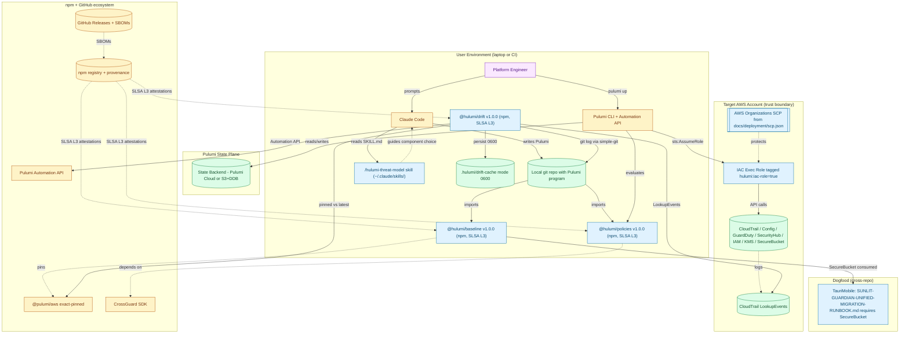

# Hulumi v1 — AI-First Runbook v3

> **Purpose**: Deliver Hulumi v1 — a hardened-Pulumi library + CrossGuard pack + drift classifier + Claude Code skill — from greenfield bootstrap to SLSA-L3-attested npm release, with cross-repo UDM dogfood binding, in five milestones.
> **Audience**: AI coding agents first, humans second. This document is written to reduce ambiguity, prevent scope drift, and improve code quality with the same model capability.
> **How to use**: Work through milestones sequentially. Before starting any milestone, read its full section and the Global Execution Rules. After completing it, follow the Global Exit Rules. Never skip ahead. Never silently widen scope.
> **Prerequisite reading — Hulumi planning corpus**: The authoritative pre-implementation artifacts (idea doc, research dossier with 140+ sources, architecture, stack decision, interfaces, TLA+ spec and verified-design, critique) were produced in the upstream planning repo before Hulumi was bootstrapped in M1. They are not checked into this repo as of v0.1 (M1 allow-list scoped-out); importing them into this repo (or publishing to a dedicated archive) is tracked as an M5 follow-up. Maintainers executing later milestones MUST read: `docs/idea/hulumi.md`, `docs/research/hulumi/{dossier,sources,synthesis}.md`, `docs/design/hulumi/{ARCHITECTURE,stack-decision,interfaces,hulumi-overview}.md`, `docs/TLAdocs/hulumi/{HulumiDrift.tla,HulumiDrift.trace.md,HulumiDrift-verified.md}`, `docs/critique/hulumi.md` from the upstream corpus before opening a PR that materially changes architecture. Each milestone file under [`docs/runbook-milestones/`](./runbook-milestones/) cites the relevant subset in its "Files to read before changing anything" row.

---

## Runbook Metadata

- **Runbook ID**: `hulumi-v1`
- **Prefix for test files and lessons files**: `hulumi`
- **Primary stack**: TypeScript 5.x on Node 20 LTS, pnpm workspaces, Pulumi CrossGuard v2+, Vitest, Apache-2.0
- **Primary package/app names**: `@hulumi/baseline`, `@hulumi/policies`, `@hulumi/drift`; Claude Code skill `hulumi-threat-model` (monorepo at `~/Documents/Dev/GitHub/Hulumi/` bootstrapped in M1)
- **Default test commands**:
  - Unit (mocks, every PR): `pnpm -r test`
  - E2E (policy + drift): `pnpm -r test:e2e`
  - Integration (weekly, real AWS sandbox): `pnpm -r test:integration -- --aws-sandbox`
  - Build: `pnpm -r build`
  - Lint / typecheck: `pnpm -r lint && pnpm -r typecheck`
  - TLA+ spec re-verify: `~/.sldo/tla/tlc -config docs/TLAdocs/hulumi/HulumiDriftHardened.cfg docs/TLAdocs/hulumi/HulumiDrift.tla`
- **Allowed new dependencies by default**: `none` (per-milestone exceptions must be explicit in the Contract Block)
- **Schema/config migration allowed by default**: `no`
- **Public interfaces that must remain stable unless explicitly listed otherwise**:
  - `hulumi.baseline.aws.AccountFoundation` + `Args` + `Outputs` (stable from M3)
  - `hulumi.baseline.aws.SecureBucket` + `Args` + `Outputs` (stable from M2)
  - `hulumi.baseline.aws.Tier` string union (stable from M2)
  - `hulumi.policies.aws.CisV5Pack` (scope expands in M3; name stable)
  - `hulumi.policies.aws.HulumiHardeningPack` (H3 advisory→mandatory in M5)
  - `hulumi.policies.PackMetadata`, `hulumi.policies.Suppression`
  - `hulumi.drift.DriftClassifier`, `DriftSource` enum, `DriftAdapter` interface, the four adapter classes (stable from M4)
  - AWS resource tag keys `hulumi:iac-role`, `hulumi:tier`, `hulumi:component`, `hulumi:controls`
  - `SKILL.md` frontmatter (agentskills.io spec) + skill name `/hulumi-threat-model`
  - Cache schema `schemaVersion: 1` for `.hulumi/drift-cache/*.json`

---

## Milestone Tracker

Update this table as each milestone is completed. This is the single source of truth for progress.

| #   | Milestone                                                                                    | Status        | Started    | Completed  | Lessons File                                        | Completion Summary                                        |
| --- | -------------------------------------------------------------------------------------------- | ------------- | ---------- | ---------- | --------------------------------------------------- | --------------------------------------------------------- |
| 1   | `/hulumi-threat-model` Claude Code skill + Hulumi repo bootstrap                             | `done`        | 2026-04-24 | 2026-04-24 | [docs/lessons/hulumi-m1.md](./lessons/hulumi-m1.md) | [docs/completion/hulumi-m1.md](./completion/hulumi-m1.md) |
| 2   | `SecureBucket` component + tiered defaults + `HulumiHardeningPack`                           | `done`        | 2026-04-24 | 2026-04-24 | [docs/lessons/hulumi-m2.md](./lessons/hulumi-m2.md) | [docs/completion/hulumi-m2.md](./completion/hulumi-m2.md) |
| 3   | `AccountFoundation` component + full `CisV5Pack` (sections 1–3) + weekly sandbox integration | `not_started` |            |            |                                                     |                                                           |
| 4   | Drift classifier + 4 adapters + TLA+-bound verdict matrix + security BDDs                    | `not_started` |            |            |                                                     |                                                           |
| 5   | SLSA-L3 release + launch readiness + cross-repo UDM binding                                  | `not_started` |            |            |                                                     |                                                           |

<!-- Status values: not_started | in_progress | blocked | done -->
<!-- Lessons files go in docs/lessons/hulumi-m<N>.md -->
<!-- Completion summaries go in docs/completion/hulumi-m<N>.md -->

---

## End-to-End Architecture Diagram

Target end state after M5. Solid lines exist by end of v1; dashed lines are v1.1+ deferrals.

### Component Summary Table

| Component                                    | Milestone                                | Purpose                                                                               |
| -------------------------------------------- | ---------------------------------------- | ------------------------------------------------------------------------------------- |
| `/hulumi-threat-model` skill                 | M1                                       | Interactive cloud threat-modeling in Claude Code with CCM/NIST/ATLAS/CIS ID citations |
| `@hulumi/baseline.aws.SecureBucket`          | M2                                       | Hardened S3 bucket ComponentResource with Sandbox/Startup-Hardened tiers              |
| `@hulumi/policies.HulumiHardeningPack`       | M2 (H1/H2/H4), M5 (H3 mandatory)         | CrossGuard pack enforcing Hulumi invariants                                           |
| `@hulumi/baseline.aws.AccountFoundation`     | M3                                       | CloudTrail+Config+GuardDuty+SecHub+IAM+KMS composed with tier-differentiated config   |
| `@hulumi/policies.CisV5Pack`                 | M2 (bucket stub), M3 (sections 1–3 full) | CIS AWS Foundations v5.0.0 CrossGuard rules                                           |
| `@hulumi/drift.DriftClassifier` + 4 adapters | M4                                       | TLA+-verified 4-signal drift classifier, local-first                                  |
| SLSA-L3 release pipeline + SCP + UDM dogfood | M5                                       | npm launch, launch-readiness outreach, cross-repo UDM binding                         |

### Data Flow Summary

1. **Authoring (design-time)**: Engineer → Claude Code → `/hulumi-threat-model` skill → Claude writes Pulumi program importing `@hulumi/baseline` components.
2. **Plan/apply (deploy-time)**: `pulumi up` → `HulumiHardeningPack` + `CisV5Pack` evaluate → assume tagged IaC role → write AWS resources → state backend records + CloudTrail audits.
3. **Drift classify (triage-time)**: `DriftClassifier` → 4 adapters in parallel → `HardenedVerdict` compositor → cache (0600) → emit `DriftVerdict` with `DriftSource` + confidence.
4. **Release (v1.0.0)**: tag → GitHub Actions + SLSA reusable workflow → three npm packages with provenance + GitHub release with SBOMs.

---

## High-Level Design for Formal Verification (TLA+ Section)

### 1. System Goal

The drift classifier emits a verdict truthful with respect to ground truth under adversarial adapter-signal interleavings — specifically, it never labels a console break-glass as provider-API churn at high confidence, regardless of CloudTrail delivery latency.

### 2. Main Components

- Adapters (AutomationApi, CloudTrail, ProviderVersion, GitLog) — modeled collectively as four signals
- Verdict function (`HardenedVerdict`) — the composition logic
- Cache — persists verdicts subject to monotonicity

### 3. Abstract State

Per [HulumiDrift-verified.md](TLAdocs/hulumi/HulumiDrift-verified.md): `mutated`, `eventInTransit`, `eventDelivered`, `providerDrift` (booleans) + `verdict` record.

### 4. Key Actions / Transitions

`ConsoleMutate`, `CloudTrailDeliver`, `ProviderBump`, `Classify` (Naive or Hardened variant via CONSTANT).

### 5. Safety Properties

- **SafetyRealistic** (load-bearing): `verdict = ProviderApiChurn @ high` and `mutated` never coincide.
- **Monotonicity**: once a verdict reaches `high`, it is not silently demoted.

### 6. Liveness Assumptions

WF on `CloudTrailDeliver` + WF on `Classify`. Every enqueued event is eventually delivered; the classifier eventually runs.

### 7. Simplifications Made for TLA+

Nine explicit simplifications enumerated in [HulumiDrift-verified.md §Simplifications](TLAdocs/hulumi/HulumiDrift-verified.md). Each names a proof obligation delegated to code or deployment responsibility (tagged IaC role, CloudTrail filtering by tag, probe via sentinel event, etc.).

---

## Global Execution Rules

### 1) Stay inside scope

Every change must fall inside the current milestone's Contract Block's file allow-list. Cross-repo edits require explicit allow-list entries (M5 is the only cross-repo milestone in v1).

### 2) Tests define the contract

Write BDD scenarios first; make them fail for the expected reason; implement to pass. No production-path change without a matching test.

### 3) No placeholders in production paths

No `TODO`, no `// will fix later`, no `throw new Error("not implemented")` in shipped code. Forward-references in docs or skill output must say "available in Hulumi vN+" with an explicit version.

### 4) Preserve backwards compatibility

Interfaces listed in Runbook Metadata are stable. A change requires either an `ask` in critique (pre-v1.0.0) or a major-version bump (post-v1.0.0).

### 5) Prefer smallest safe change

A bug fix doesn't need surrounding cleanup. A one-shot operation doesn't need a helper. Three similar lines is better than a premature abstraction.

### 6) Record evidence, not claims

Every milestone fills the Evidence Log with actual command outputs, not "all tests pass ✓". `/slo-retro` refuses to close a milestone with blank Actual Result cells.

### 7) Keep .gitignore current and clean up test artifacts

TLA+ scratch (`states/`, `**/*_TTrace_*.{tla,bin}`, `*-run.log`), Pulumi checkpoints, integration-test state — all must be ignored. `git status` after a milestone must be clean.

---

## Global Entry Rules (Pre-Milestone Protocol)

1. Read the full milestone section + Global Execution Rules.
2. Read prior-milestone lessons files (`docs/lessons/hulumi-m<N-1>.md`).
3. Read files listed in "Files to read before changing anything."
4. Copy the Evidence Log template into the milestone's Evidence Log section.
5. Re-state the milestone's load-bearing constraints in your own words in working notes before coding.

## Global Exit Rules (Post-Milestone Protocol)

1. All BDD + E2E tests green.
2. Smoke tests checked off.
3. Compatibility checklist complete.
4. `git status` clean.
5. `.gitignore` updated.
6. `docs/lessons/hulumi-m<N>.md` written with surprises + decisions + deltas-from-plan.
7. `docs/completion/hulumi-m<N>.md` written with changed files + tests added + documentation updated.
8. Milestone Tracker updated to `done`.
9. Docs listed in Post-Flight updated.

---

## Background Context

### Current State

Greenfield. The Hulumi repo does not yet exist; M1 bootstraps it at `~/Documents/Dev/GitHub/Hulumi/`. Planning artifacts (idea, research, design, TLA+, critique) live in the TauriMobile repo's `docs/` tree and move or are referenced from the Hulumi repo after M1.

### Problem

Platform engineers authoring Pulumi with Claude Code ship insecure IaC because (a) the LLM has stale AWS knowledge, (b) no policy gate catches common footguns at write time, (c) drift between Pulumi state and AWS reality breaks IaC trust through the break-glass cascade, (d) hardened-default libraries take weeks to build per-team, (e) supply-chain risks go uncompensated by most OSS Pulumi components.

### Target Architecture

See the End-to-End Architecture Diagram above and [docs/design/hulumi/ARCHITECTURE.md](design/hulumi/ARCHITECTURE.md).

### Key Design Principles

From [docs/design/hulumi/stack-decision.md](design/hulumi/stack-decision.md):

- Apache-2.0 throughout.
- No verbatim framework text in source (IDs only).
- No hosted-service runtime dependency.
- Exact-version pinning + integrity hashes for `@pulumi/*`.
- SLSA Build L3 on releases.
- CIS v5.0.0 primary / v7.0.0 staged.
- `SKILL.md` per skill folder.
- `hulumi:iac-role=true` tag required.
- No telemetry phone-home.
- TypeScript-first public API.

### What to Keep

Not applicable — greenfield.

### What to Change

Not applicable — greenfield. (M5 does edit TauriMobile's UDM runbook; see M5 Contract.)

### Global Red Lines

- No `child_process.exec` in `packages/drift/src/` (S3 critique).
- No long-lived AWS credentials in CI (OIDC only).
- No integration-test retries on failure.
- No teardown skipped on test failure.
- No NPM_TOKEN long-lived secret; OIDC trusted publishing only.
- No verbatim CCM/AICM/CIS control text in source.
- No `sleep` / `setTimeout` in production paths (eventual-consistency via Pulumi `dependsOn` + dynamic resources).
- No demoting a `high`-confidence cache entry except via `CacheInvalidate`.
- No mandatory H3 before the SCP template ships (paired).
- No DriftSource enum value outside the TLA+ `Source` set.

---

## BDD and Runtime Validation Rules

### Write Tests Before Production Code

Every BDD row has a test stub committed before its production counterpart.

### Required Test Coverage Categories

Per milestone:

- Happy path
- Invalid input
- Empty state
- Dependency / partial failure
- Plus whichever of {concurrency, persistence, backward compat, security, schema} apply

### Scenario Structure

`Given <precondition>, when <action>, then <observable outcome>`. Specific, not generic.

### Test File Naming

- Unit / BDD: `packages/<pkg>/tests/<feature>.test.ts`
- Integration: `packages/<pkg>/tests/integration/<feature>.integration.test.ts`
- Feature files (drift verdict matrix): `packages/drift/tests/verdict-matrix.feature.test.ts`

### Test Artifact Cleanup Rules

- Pulumi stack state from integration tests: teardown in `afterAll`.
- TLA+ scratch: gitignored; cleaned post-run.
- Mock filesystems: `memfs`-backed, cleaned in test teardown.

### End-to-End Runtime Validation

Each milestone lists E2E tests with "What It Proves" + "Pass Criteria."

### E2E Test Design Rules

- No auto-retry.
- Real-resource tests run weekly (not per-PR) with OIDC + scoped IAM.
- Teardown runs on failure (cost safety).

---

## Dependency, Migration, and Refactor Policy

### Dependency policy

- Default: no new dependencies.
- Per-milestone exceptions explicit in Contract Block with exact pins + integrity hashes.
- Pulumi upstream bumps subject to 72h/24h cooling-off from M5 onward.

### Migration policy

- Default: no code or state migrations.
- Exceptions: M3 renames `cis-v5-bucket.ts` → `cis-v5-pack.ts` (file move, not data migration); M5 introduces a behavioural migration for H3 advisory → mandatory, documented in CHANGELOG.

### Refactor budget

- Each milestone states its budget explicitly.
- No refactors of prior-milestone files without an explicit exception in the current milestone's Contract Block.

---

## Evidence Log Template

See per-milestone Evidence Log sections.

---

## Self-Review Gate

Before closing a milestone:

- [ ] Every BDD scenario has a passing implementation.
- [ ] Every forbidden shortcut in the Contract Block has been verified absent (grep + AST checks where applicable).
- [ ] `git status` is clean.
- [ ] `.gitignore` is up to date.
- [ ] No in-code TODOs reference this milestone.
- [ ] No placeholders (`FIXME`, `XXX`, `console.log` debug leftovers) in production source.
- [ ] Evidence Log is filled with actual command outputs.
- [ ] Lessons file is written.
- [ ] Completion summary is written.
- [ ] Milestone Tracker is updated.

---

## Lessons-Learned File Template

See `docs/lessons/hulumi-m<N>.md`:

## What changed

<concrete diff summary>

## Design decisions and why

<decisions made during implementation that deviated from or clarified the plan>

## Template improvements suggested

<improvements to this runbook template or skill workflow>

---

## Completion Summary Template

See `docs/completion/hulumi-m<N>.md`:

## Goal completed

<achieved vs planned>

## Files changed

<actual file list>

## Tests added

<test names>

## Runtime validations added

<E2E validations>

## Compatibility checks performed

<prior-milestone regression results>

## Documentation updated

<docs changed>

## .gitignore changes

<patterns added>

## Test artifact cleanup verified

<`git status` output>

## Deferred follow-ups

<explicit deferrals, each with target milestone>

## Known non-blocking limitations

<flagged limitations with rationale>

---

## Milestone Plan

Each milestone is authored as a standalone file under [docs/runbook-milestones/](runbook-milestones/). Each file contains all fifteen v3-template sub-sections (Goal, Context, Important design rule, Refactor budget, Contract Block, Out of Scope, Pre-Flight, Files Allowed To Change, Step-by-Step, BDD Acceptance Scenarios, Regression Tests, Compatibility Checklist, E2E Runtime Validation, Smoke Tests, Evidence Log, Definition of Done, Post-Flight, Notes) and was confirmed by the user on 2026-04-24.

### [Milestone 1 — `/hulumi-threat-model` Claude Code skill + Hulumi repo bootstrap](runbook-milestones/hulumi-m1.md)

Demo-forward wedge. Bootstraps the Hulumi monorepo at `~/Documents/Dev/GitHub/Hulumi/`, ships `/hulumi-threat-model` skill that produces scenario-specific threat-model markdown citing CCM / NIST / ATLAS / CIS IDs (no verbatim prose). 5 prebuilt AWS scenarios.

### [Milestone 2 — `SecureBucket` component + tiered defaults + `HulumiHardeningPack`](runbook-milestones/hulumi-m2.md)

First Pulumi component + first CrossGuard pack. `SecureBucket` with ≥3 per-tier deltas (Sandbox vs Startup-Hardened). `HulumiHardeningPack` blocks raw `aws.s3.BucketV2` and unencrypted state backends.

### [Milestone 3 — `AccountFoundation` component + full `CisV5Pack` (sections 1–3) + weekly sandbox integration](runbook-milestones/hulumi-m3.md)

CloudTrail + Config + GuardDuty + Security Hub + IAM + KMS composed with ≥4 per-tier deltas. Weekly GitHub Actions integration against a sandbox AWS account via OIDC. `CisV5Pack` expands to CIS AWS v5.0.0 sections 1–3.

### [Milestone 4 — Drift classifier + 4 adapters + TLA+-bound verdict matrix + security BDDs](runbook-milestones/hulumi-m4.md)

`@hulumi/drift` with 4 pluggable adapters. TypeScript `HardenedVerdict` mirrors TLA+ `HardenedVerdict` exactly; a verdict-matrix BDD walks the 5-row matrix from [HulumiDrift.trace.md](TLAdocs/hulumi/HulumiDrift.trace.md). Six security BDDs: cache 0600 perms, shell-injection refusal, shallow-clone guard, probe-timeout degradation, namespace-rejection, rate-limit.

### [Milestone 5 — SLSA-L3 release + launch readiness + cross-repo UDM binding](runbook-milestones/hulumi-m5.md)

v1.0.0 to npm with SLSA Build L3 attestation on every package (atomic three-package release). Full SECURITY.md, Dependabot 72h/24h cooling-off (CI-enforced), `docs/deployment/scp.json` ready-to-apply SCP, H3 advisory→mandatory flip, five launch-readiness drafts, TauriMobile UDM runbook edited to require `SecureBucket`.

---

## Documentation Update Table

| Doc                                                             | Updated in            | Change                                                  |
| --------------------------------------------------------------- | --------------------- | ------------------------------------------------------- |
| `docs/idea/hulumi.md`                                           | pre-runbook           | Authoritative idea doc                                  |
| `docs/research/hulumi/`                                         | pre-runbook           | Research dossier (140+ sources)                         |
| `docs/design/hulumi/`                                           | pre-runbook           | Architecture, stack decision, interfaces, overview      |
| `docs/TLAdocs/hulumi/`                                          | pre-runbook           | TLA+ spec + verified design + trace                     |
| `docs/critique/hulumi.md`                                       | pre-runbook           | 18-finding critique                                     |
| Hulumi repo `ARCHITECTURE.md`                                   | M1 → M4 (progressive) | Reflects shipped components per milestone               |
| Hulumi repo `README.md`                                         | every milestone       | Quick-start for shipped components                      |
| `docs/components/*.md`                                          | M2, M3, M4            | Per-component docs                                      |
| `docs/tiers.md`                                                 | M2, M3                | Tier matrix for shipped components                      |
| `docs/integration-testing.md`                                   | M3                    | Weekly integration workflow                             |
| `docs/deployment/sandbox-account.md`                            | M3                    | Sandbox setup                                           |
| `docs/deployment/scp.json` + `scp-guide.md`                     | M5                    | SCP template + guide                                    |
| `SECURITY.md`                                                   | M1 (stub) → M5 (full) | Disclosure, cooling-off, provenance gap, typosquat, SCP |
| `CHANGELOG.md`                                                  | M5                    | v1.0.0 release notes with breaking changes              |
| `docs/launch/`                                                  | M5                    | CSA outreach, Pulumi Discussion, CFPs, blog pitch       |
| TauriMobile `docs/SUNLIT-GUARDIAN-UNIFIED-MIGRATION-RUNBOOK.md` | M5 (cross-repo)       | IaC Component Requirements section                      |

---

## Optional Fast-Fail Review Prompt for Agents

When in doubt, ask yourself and the user:

- Am I about to touch a file outside the current milestone's allow-list? Stop.
- Am I adding a `TODO` in production code? Stop.
- Am I silently widening the scope? Stop.
- Am I introducing a dependency not in the Contract Block? Stop.
- Am I running integration tests on every PR? Stop — weekly only.
- Am I pushing a release tag without SLSA attestation success? Stop.
- Am I consuming `@pulumi/*` inside the 72h / 24h cooling-off window? Stop.
