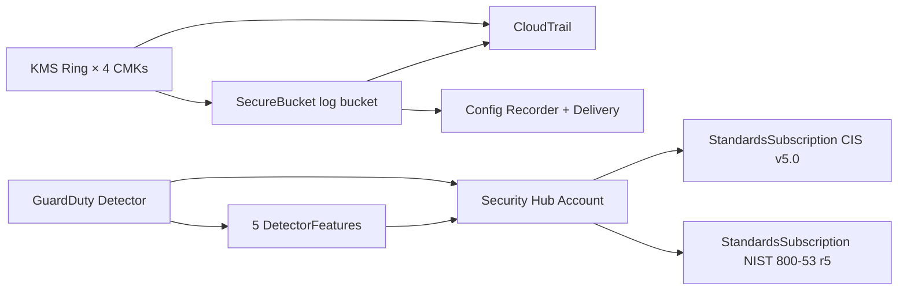

# `hulumi.baseline.aws.AccountFoundation`

Hardened AWS account baseline — composes CloudTrail, AWS Config,
GuardDuty, Security Hub, IAM password policy + Access Analyzer, and a
KMS key ring into one tiered Pulumi `ComponentResource`. All
sub-resources are children of the
`hulumi:baseline:aws:AccountFoundation` component; every taggable child
carries the `hulumi:component`, `hulumi:tier`, and `hulumi:controls`
tag triple.

**Stability**: `stable` from v0.3 per
[interfaces.md §1](../slo/design/hulumi/interfaces.md).
**Ships**: M3.
**Paired policies**: `HulumiHardeningPack` H1–H4 (M2),
`CisV5Pack` sections 1–3 (M3).

## Quick-start

### Sandbox tier

```ts
import { AccountFoundation } from "@hulumi/baseline/aws";

const sandbox = new AccountFoundation("baseline", {
  tier: "sandbox",
  iacRoleArn: "arn:aws:iam::111122223333:role/hulumi-sandbox-iac-role",
});

export const detectorId = sandbox.guardDutyDetectorId;
```

Emits: 4 KMS CMKs (logs / data / secrets / config) with rotation,
account password policy, single-region CloudTrail, AWS Config recorder

- delivery channel, GuardDuty basic detector, Security Hub + CIS v5.0.

### Startup-Hardened tier

```ts
import { AccountFoundation } from "@hulumi/baseline/aws";

const baseline = new AccountFoundation("baseline", {
  tier: "startup-hardened",
  iacRoleArn: "arn:aws:iam::111122223333:role/hulumi-prod-iac-role",
  cisVersion: "v5.0.0",
  region: "us-east-1",
  orgAccountIds: ["111111111111", "222222222222"],
});

export const detectorId = baseline.guardDutyDetectorId;
export const trailArn = baseline.cloudTrailArn;
```

Emits everything in the Sandbox tier PLUS:

- Multi-region CloudTrail with log-file validation + S3 data events on
  the log bucket.
- AWS Config aggregator pulling from `orgAccountIds`.
- GuardDuty 5 extended features (S3 data events, EKS audit logs, EBS
  malware protection, RDS login events, runtime monitoring).
- Security Hub NIST 800-53 Rev 5 standard subscribed alongside CIS v5.0.
- IAM Access Analyzer at account scope.
- KMS deny-without-tag policy on every CMK (requires
  `aws:PrincipalTag/hulumi:iac-role=true` to perform encrypt/decrypt
  actions, but only when `orgAccountIds` is supplied — bootstrap
  paradox in single-account stacks).
- CloudWatch Logs group for CloudTrail integration (CIS §3.4).

The full tier matrix lives in
[../tiers.md § AccountFoundation — tier matrix](../tiers.md#accountfoundation--tier-matrix).

## Args

| Arg                     | Type                              | Required?                  | Default                                                                      |
| ----------------------- | --------------------------------- | -------------------------- | ---------------------------------------------------------------------------- |
| `tier`                  | `"sandbox" \| "startup-hardened"` | yes                        | —                                                                            |
| `iacRoleArn`            | `Input<string>`                   | yes                        | — (must be non-empty; should carry `hulumi:iac-role=true`)                   |
| `cisVersion`            | `"v5.0.0" \| "v7.0.0"`            | no                         | `v5.0.0` (v7.0.0 accepted with a warning — AWS Security Hub maxes at v5.0.0) |
| `region`                | `Input<string>`                   | no                         | Pulumi provider's region                                                     |
| `logBucketForceDestroy` | `Input<boolean>`                  | no                         | `false`; intended only for ephemeral test stacks                             |
| `orgAccountIds`         | `readonly string[]`               | no (Startup-Hardened only) | —                                                                            |

## Outputs

| Output                  | Type                             | Description                                                          |
| ----------------------- | -------------------------------- | -------------------------------------------------------------------- |
| `cloudTrailArn`         | `Output<string>`                 | Multi-region (Startup-Hardened) or single-region trail ARN.          |
| `configRecorderArn`     | `Output<string>`                 | Config recorder ARN.                                                 |
| `guardDutyDetectorId`   | `Output<string>`                 | GuardDuty detector ID.                                               |
| `securityHubHubArn`     | `Output<string>`                 | Security Hub hub ARN.                                                |
| `kmsKeyArns`            | `Output<Record<string, string>>` | KMS CMK ARNs keyed by service: `logs`, `data`, `secrets`, `config`.  |
| `iamBaselinePolicyArns` | `Output<string[]>`               | Account password policy ID + (Startup-Hardened) Access Analyzer ARN. |

## Tags emitted

All taggable children carry:

| Tag key            | Example value                   | Purpose                                                                    |
| ------------------ | ------------------------------- | -------------------------------------------------------------------------- |
| `hulumi:component` | `AccountFoundation`             | Attribution.                                                               |
| `hulumi:tier`      | `sandbox` \| `startup-hardened` | Tier metadata; consumed by H4 / H3 + the M4 drift classifier.              |
| `hulumi:controls`  | comma-separated framework IDs   | Which CCM / CIS / NIST IDs this component claims to address (≥18 entries). |

Tag-key schema is `stable` per
[interfaces.md §6](../slo/design/hulumi/interfaces.md).

## Framework IDs cited

AccountFoundation addresses the union of SecureBucket's IDs (since the
log bucket is a SecureBucket child) plus the AccountFoundation-specific
ones:

- **CCM v4.1**: DSP-01, CEK-04, CEK-01, DSP-17, LOG-01, IAM-01, LOG-02.
- **CIS AWS v5.0.0**: 2.1.1, 2.1.2, 2.1.4, 2.1.5, 2.1.6, 1.6, 1.19, 3.1, 3.2, 3.7, 3.8.
- **NIST 800-53 Rev 5**: AC-3, SC-8, SC-12, SC-13, SC-28, AU-2, AU-12, CP-9, CA-7.
- **MITRE ATLAS v5.1**: AML.T0001 (via SecureBucket).

IDs only — prose is intentionally NOT embedded (per the IDs-only
license boundary in [../licensing.md](../licensing.md)).

## Eventual-consistency contract

AWS service enablement is asynchronous. AccountFoundation orders its
sub-resources via Pulumi `dependsOn`:



The original M3 design used a `pulumi.dynamic.Resource` polling probe
between GuardDuty and Security Hub. That conflicts with vitest's
worker pool — Pulumi's closure-serialization needs Node's
`trace_events`. We dropped the probe in favor of direct `dependsOn` on
the Detector + every DetectorFeature; AWS's `CreateDetector` API call
itself blocks until `status === ENABLED`, which gives us equivalent
ordering for real deployments. The escape hatch
(`packages/baseline/src/aws/probes/poll.ts`) is preserved for v1.1+
probes where dependsOn alone is insufficient. See
[M3 lessons](../slo/lessons/hulumi-m3.md) for the full
rationale.

## Input validation

- `tier` outside the union → constructor throws `Invalid Hulumi tier
"..."; expected one of: sandbox, startup-hardened`.
- `iacRoleArn` empty string → constructor throws `iacRoleArn must be a
non-empty string ARN`.
- `cisVersion: "v7.0.0"` accepted but logs a warning that AWS Security
  Hub currently maxes at v5.0.0; falls through to v5.0.0 behaviour.

## Mock-unit testing

The component instantiates normally under
`pulumi.runtime.setMocks()`. See
[../../packages/baseline/tests/account-foundation.test.ts](../../packages/baseline/tests/account-foundation.test.ts)
for the BDD test suite and
[../../examples/account-foundation-smoke/](../../examples/account-foundation-smoke/)
for a minimal end-to-end example.

Real-AWS integration runs **weekly** via
[`.github/workflows/weekly-integration.yml`](../../.github/workflows/weekly-integration.yml).
See [../integration-testing.md](../integration-testing.md) for the
auth, cost, and teardown contract.

## Planned deltas

- **v0.4 (M4)**: Drift classifier wires the `hulumi:iac-role`
  principal-attribution into its CloudTrail adapter.
- **v1.0 (M5)**: SLSA Build L3 attestation on the published
  `@hulumi/baseline` package; SCP template
  [`docs/deployment/scp.json`](../deployment/) pairs with H3→mandatory.
