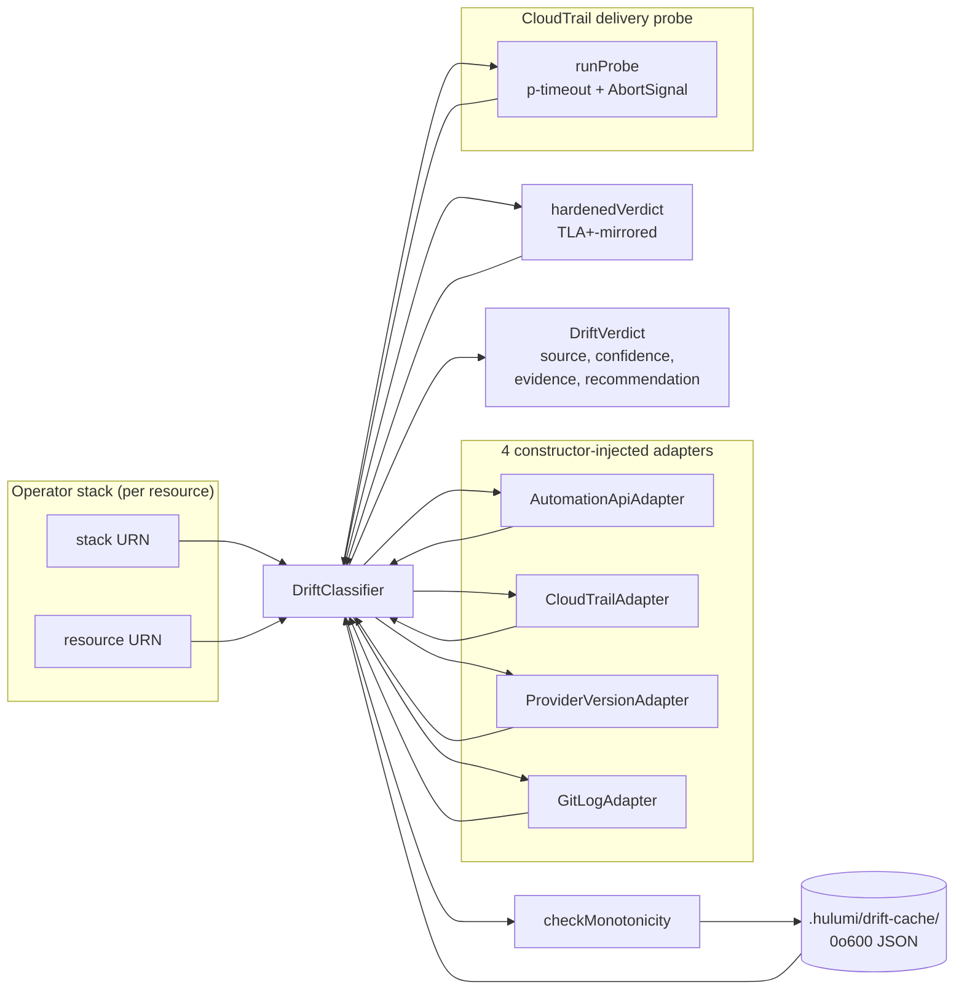

# TLA+-Verified Drift Detection for Pulumi

> **Companion to**: `@hulumi/drift@1.0.0` ([source](../../packages/drift/), [component reference](../components/drift-classifier.md), [deployment guide](../drift-classifier-deployment.md)). This paper is the long-form basis for the [FWD CloudSec](../launch/cfp-fwd-cloudsec.md) and [BSides](../launch/cfp-bsides.md) talks; either talk pulls its narrative spine from §3, §4, and §6 below.
>
> **Also available**: [Drift detection that actually tells you what happened](./drift-detection-narrative.md) — same material as a narrative tour. Reads start-to-finish; builds intuition through analogies. Good as a first read, a blog draft, or a handout.

## Abstract

Drift detection in infrastructure-as-code (IaC) is usually a heuristic: re-run a `preview` and assume any diff is drift. That collapses three distinct classes of change — out-of-band human action, upstream-provider API churn, and genuine local-IaC divergence — into one undifferentiated alert. Under AI-agent-authored IaC, where the agent re-pins providers eagerly and humans console-click frequently, the conflation drives operators to ignore the signal entirely.

This paper describes `@hulumi/drift`, an Apache-2.0 drift classifier whose verdict logic is mirrored from a TLA+ specification (`HulumiDrift.tla`) and whose 5-row trace is asserted by a CI-gating BDD test. The classifier:

- Runs **locally**, with no hosted-service runtime dependency.
- Composes **four pluggable adapters** — Pulumi Automation API, AWS CloudTrail, provider-version semver compare, Git log — each constructor-injectable so production-vs-stub setups share one classifier code path.
- Emits a **structured verdict** (`source`, `confidence`, `evidence[]`, optional `recommendation`) per resource, persisted to a `0o600`-mode local cache that doubles as the rate limit.
- Enforces a **TLA+-proven upper bound**: `ProviderApiChurn` confidence is provably capped at `medium`; the verdict-matrix BDD fails any drift in CI.

The TLA+ model surfaces eventual-consistency races between AWS CloudTrail event delivery and the IaC pipeline that no test-suite-only design would have caught. The TypeScript mirror is ~50 lines; the model is ~150 lines; the meta-test that holds them in lockstep is ~30 lines. We argue this is a tractable budget for any OSS classifier where a wrong answer drives operator behaviour.

## Contents

- [1. Why drift detection is harder than it looks](#1-why-drift-detection-is-harder-than-it-looks)
- [2. System overview](#2-system-overview)
- [3. The verdict matrix and what TLA+-validated means](#3-the-verdict-matrix-and-what-tla-validated-means)
- [4. Adapter design](#4-adapter-design)
- [5. The eventual-consistency probe](#5-the-eventual-consistency-probe)
- [6. Security guardrails](#6-security-guardrails)
- [7. Cache, rate-limiting, and monotonicity](#7-cache-rate-limiting-and-monotonicity)
- [8. Failure modes and graceful degradation](#8-failure-modes-and-graceful-degradation)
- [9. Limits and future work](#9-limits-and-future-work)
- [10. References](#10-references)

---

## 1. Why drift detection is harder than it looks

Three forces make 2026-vintage IaC drift detection genuinely hard:

### 1.1 AI-agent authoring inflates churn

Claude, Cursor, Copilot, and Devin are now writing significant fractions of new IaC. They make plausible code quickly. They also re-pin `@pulumi/aws` opportunistically, silently swap deprecated resource names (`aws.s3.BucketV2` → `aws.s3.Bucket`), and happily author wildcards if not constrained. Every churn event looks like drift to a naive classifier.

### 1.2 Cloud-side eventual consistency makes "now" ambiguous

CloudTrail event delivery is asynchronous. AWS commits the API call long before the event lands in `LookupEvents`. A naive "did anything change in the last hour?" classifier will see the IaC pipeline's own writes show up as drift — because the pipeline updated state at T+0 and CloudTrail surfaces the event at T+30s, well after the classifier's snapshot.

The naive fix — "wait long enough" — interacts badly with the classifier's required latency budget. A drift detector that waits 15 minutes per run cannot run inside a PR pipeline.

### 1.3 Existing tools conflate three distinct sources

When a `pulumi refresh --preview` shows changes, those changes can come from:

| Source                  | What actually happened                                                               | What the operator should do                       |
| ----------------------- | ------------------------------------------------------------------------------------ | ------------------------------------------------- |
| **Console break-glass** | A human (or non-IaC automation) edited the resource in the AWS console.              | Investigate intent; codify in IaC if intentional. |
| **Provider-API churn**  | `@pulumi/aws` released a version that renames a field or changes a default.          | Re-pin after cooling-off; re-run preview.         |
| **Genuine IaC drift**   | A teammate landed an IaC PR; your local checkout is behind.                          | `git pull` + `pulumi up`.                         |
| **Cache poisoning**     | A previous probe failure left a stale Unknown verdict; the underlying state is fine. | Re-run; ensure probe sentinel is delivering.      |

Off-the-shelf scanners flatten all four into "we found 23 drifted resources." A useful classifier names the source — and quantifies its confidence — so the operator can pick the right response.

### 1.4 The implication for design

The classifier needs to:

1. **Distinguish sources by signal kind**, not by manual triage.
2. **Treat the eventual-consistency window as a first-class object** in the model, not an implicit assumption.
3. **Have provable upper bounds on confidence** in cases where the signals are ambiguous.
4. **Run locally** so the operator owns the verdict and the data path is auditable.

`@hulumi/drift` is built around those four constraints.

---

## 2. System overview

### 2.1 Architecture



Code map:

| Concern                                    | File                                                                                                             | Lines |
| ------------------------------------------ | ---------------------------------------------------------------------------------------------------------------- | ----- |
| Public types + adapter interface           | [packages/drift/src/types.ts](../../packages/drift/src/types.ts)                                                 | ~80   |
| Verdict logic (TLA+ mirror)                | [packages/drift/src/verdict.ts](../../packages/drift/src/verdict.ts)                                             | ~50   |
| Orchestration + cache write                | [packages/drift/src/classifier.ts](../../packages/drift/src/classifier.ts)                                       | ~240  |
| Probe wrapper (p-timeout)                  | [packages/drift/src/probe.ts](../../packages/drift/src/probe.ts)                                                 | ~55   |
| On-disk cache (0o600 + UID)                | [packages/drift/src/cache.ts](../../packages/drift/src/cache.ts)                                                 | ~90   |
| Monotonicity guard                         | [packages/drift/src/monotonicity.ts](../../packages/drift/src/monotonicity.ts)                                   | ~50   |
| URN sanitization (defense-in-depth)        | [packages/drift/src/urn-sanitize.ts](../../packages/drift/src/urn-sanitize.ts)                                   | ~55   |
| 4 adapters                                 | [packages/drift/src/adapters/](../../packages/drift/src/adapters/)                                               | ~340  |
| Verdict-matrix BDD (TLA+ trace walk)       | [packages/drift/tests/verdict-matrix.feature.test.ts](../../packages/drift/tests/verdict-matrix.feature.test.ts) | ~40   |
| 6 security BDDs + alignment + monotonicity | [packages/drift/tests/](../../packages/drift/tests/)                                                             | ~600  |

The user-facing API is one method:

```ts
classifier.classify(stack: string, resource: string, options?: ClassifyOptions): Promise<DriftVerdict>
```

### 2.2 What "local-first" means concretely

- **No hosted backend.** No Hulumi server, no telemetry, no phone-home.
- **No Pulumi Cloud requirement.** The Automation API adapter accepts a `preview()` callback the operator wires to whatever Pulumi backend they use (Pulumi Cloud, S3+DDB, file).
- **No long-lived AWS credentials.** The CloudTrail adapter takes a `lookup()` callback; in CI we use OIDC to assume a read-only role and pass the SDK in. The drift package never owns AWS credentials.
- **One on-disk cache file per (stack, resource).** Mode `0o600`. Path is `sha256(stack||resource)` truncated to 32 hex chars under `cacheDir` (default `.hulumi/drift-cache/`).
- **Deterministic output.** Every verdict has explicit `evidence` entries; the verdict is reproducible from the snapshot + cache state alone.

### 2.3 What the operator gets back

```ts
interface DriftVerdict {
  resource: string; // Pulumi URN
  source: DriftSource; // None | ProviderApiChurn | ConsoleBreakGlass | GenuineIacDrift | Mixed | Unknown
  confidence: Confidence; // none | low | medium | high
  evidence: Evidence[]; // adapter-by-adapter trace
  recommendation?: RemediationHint; // human-readable next action + doc URL
}
```

`Evidence` is structured (one entry per adapter call, plus probe + cache entries when relevant). The verdict is a function of the snapshot; the snapshot is a function of the adapter signals.

---

## 3. The verdict matrix and what TLA+-validated means

This is the most-asked question about the classifier, so it gets its own section.

### 3.1 What TLA+ is, briefly

TLA+ is a formal specification language for systems whose correctness depends on concurrent or temporal behaviour. You write the system as a state machine — a state record, an initial state, and a `Next` action that defines all legal state transitions — and a model checker (TLC) explores every reachable state, looking for violations of properties you assert (`invariants` for "always true", `temporal properties` for "eventually true").

For our purposes the value of TLA+ is one specific thing: it forces us to enumerate the reachable states of the verdict snapshot and prove that some combinations _cannot_ occur. That's not a property a vitest suite can give you with finite test cases — TLC explores the entire state space.

### 3.2 The model

The classifier's verdict snapshot is a four-field record:

```ts
interface VerdictSnapshot {
  mutated: boolean; // The Automation API preview surfaced a diff
  eventInTransit: boolean; // Probe says: CloudTrail saw the sentinel but it hasn't been delivered to LookupEvents yet
  eventDelivered: boolean; // Probe says: sentinel event has been delivered to LookupEvents
  providerDrift: boolean; // ProviderVersionAdapter says: pinned < latest
}
```

Mapped to TLA+: a state record with four boolean fields, transition rules that flip them according to actor actions (operator runs preview, AWS surfaces the event, npm publishes a provider release, etc.), and an output function `HardenedVerdict(state) → ⟨Source, Confidence⟩`.

The TLA+ spec lives in the upstream Hulumi planning corpus as `docs/TLAdocs/hulumi/HulumiDrift.tla` (referenced in [verdict.ts:3-4](../../packages/drift/src/verdict.ts#L3-L4)). The verified-design summary lives in `docs/TLAdocs/hulumi/HulumiDrift-verified.md`. Both are kept in a separate planning repo by design — they're authored once during model-checking and don't need to ship in every consumer's `node_modules`.

### 3.3 The 5 reachable verdict rows

TLC's reachability analysis collapses the 16-cell truth table over four booleans into **five reachable rows** (the others are unreachable because of constraints between the booleans — e.g. `eventDelivered` implies `!eventInTransit`):

| Row | Snapshot                                       | Verdict                         | Operator action                         |
| --- | ---------------------------------------------- | ------------------------------- | --------------------------------------- |
| 1   | `!mutated`                                     | `None / none`                   | Nothing.                                |
| 2   | `mutated && eventDelivered`                    | `ConsoleBreakGlass / high`      | Investigate the console mutation.       |
| 3   | `mutated && eventInTransit && !eventDelivered` | `Unknown / low` (probe pending) | Re-run after probe window expires.      |
| 4   | `mutated && providerDrift && !event*`          | `ProviderApiChurn / medium`     | Re-pin `@pulumi/aws` after cooling-off. |
| 5   | `mutated && !providerDrift && !event*`         | `Unknown / low`                 | `git pull` + check teammate PRs.        |

This is the matrix the TypeScript classifier mirrors, and the [verdict-matrix BDD](../../packages/drift/tests/verdict-matrix.feature.test.ts) walks cell-by-cell on every PR. The vendored copy of the trace (in [`tests/_utils/trace-matrix.ts`](../../packages/drift/tests/_utils/trace-matrix.ts)) is the test's data source; the upstream `HulumiDrift.trace.md` is the authority.

### 3.4 What the formal verification actually proves

TLC verified two properties that change how the classifier is allowed to behave:

#### Property 1: `SafetyRealistic` — `ProviderApiChurn` never reaches `high`

The invariant: in **no reachable state** can `verdict.source = ProviderApiChurn ∧ verdict.confidence = high`. The model checker enumerates every reachable state and reports zero violations.

This is the _cap_ you see in [verdict.ts:39-44](../../packages/drift/src/verdict.ts#L39-L44):

```ts
if (snapshot.providerDrift) {
  // TLA+-proven UPPER BOUND: ProviderApiChurn never reaches `high` in any
  // reachable state (SafetyRealistic invariant). The classifier MUST cap
  // at `medium`.
  return { source: "ProviderApiChurn", confidence: "medium" };
}
```

Why this matters operationally: an alerting rule that says "page when `confidence == high`" is, by virtue of the cap, immune to false positives from upstream `@pulumi/aws` releases. You can wire the alert without filtering. That's a _behaviour guarantee_, not a "we tried hard not to" guarantee.

The verdict-matrix BDD has a brute-force check that ranges every probe state with `mutated && providerDrift`:

```ts
// packages/drift/tests/verdict-matrix.feature.test.ts:23-31
it("Row 4 — ProviderApiChurn never reaches high (TLA+ SafetyRealistic upper bound)", () => {
  for (const eventInTransit of [false, true]) {
    const v = hardenedVerdict({
      mutated: true,
      eventInTransit,
      eventDelivered: false,
      providerDrift: true,
    });
    if (v.source === "ProviderApiChurn") {
      expect(v.confidence).not.toBe("high");
    }
  }
});
```

If a future maintainer "improves" the classifier to escalate `ProviderApiChurn` to `high` on a strong signal, the test fails immediately and the TLA+ alignment meta-test demands a paired re-verification.

#### Property 2: `Monotonicity` — `high` is never silently demoted

The invariant: if a verdict for resource R reached confidence `high` at time T, then no subsequent classify call may _silently_ overwrite R's cache entry with a lower confidence at time T+Δ. Demotion must go through an explicit `CacheInvalidate` event.

The TS mirror is in [monotonicity.ts](../../packages/drift/src/monotonicity.ts) — a 50-line guard that compares `existing.confidence` against `incoming.confidence` and refuses the cache write if it would demote. The classifier consults the guard before every cache write.

Why this matters operationally: imagine a CloudTrail event surfaced last night → `ConsoleBreakGlass / high`. This morning the probe times out → naive classifier overwrites with `Unknown / low`. The high-severity alert has been silently downgraded by a probe failure. The monotonicity guard refuses that write; the operator still sees `ConsoleBreakGlass / high` until they explicitly invalidate.

### 3.5 The TS-mirror discipline

TLA+ verifies a model. The model is only useful if the production code matches the model. We hold them in lockstep with three mechanisms:

1. **The verdict-matrix BDD** ([verdict-matrix.feature.test.ts](../../packages/drift/tests/verdict-matrix.feature.test.ts)) walks every row of the trace. If `verdict.ts` drifts from the trace, the test fails and the PR is blocked.

2. **The TLA+ alignment meta-test** ([tla-alignment.test.ts](../../packages/drift/tests/tla-alignment.test.ts)) asserts that `verdict.ts` cites both `HulumiDrift.tla` and `HulumiDrift-verified.md` in its top-of-file documentation, and that the `DRIFT_SOURCES` enum exactly matches the upstream `Source` set. If a maintainer rewrites `verdict.ts` and forgets the citation, the test fails.

3. **A documented re-sync convention.** Any TLA+ trace edit must (a) be reflected in the vendored `tests/_utils/trace-matrix.ts`, AND (b) bump the `verified_at` timestamp in the upstream `HulumiDrift-verified.md`. If the upstream is updated without re-syncing the vendored copy, the next PR run fails the verdict-matrix BDD.

### 3.6 The cost-benefit honesty check

Concrete sizes:

- TLA+ spec: ~150 LOC.
- TypeScript verdict mirror: ~50 LOC.
- Verdict-matrix BDD + alignment meta-test: ~80 LOC combined.
- Total formal-methods overhead: **roughly two days of focused work** for the maintainer who wrote it, plus an hour or so per future change.

In return: two operationally-load-bearing invariants (`SafetyRealistic`, `Monotonicity`) that no test-only design would have proven, plus a CI gate that catches accidental escapes. We argue this is well within the budget any OSS classifier can afford, and we'd encourage other Pulumi/Terraform community packs to adopt the same pattern.

---

## 4. Adapter design

The classifier composes four adapters. Each implements `DriftAdapter`:

```ts
interface DriftAdapter {
  name(): string;
  available(): Promise<boolean>;
  signal(
    stack: string,
    resource: string,
    window: { before: string; after: string },
  ): Promise<AdapterSignal>;
}

interface AdapterSignal {
  detected: boolean; // adapter saw a thing
  ok: boolean; // underlying call succeeded; false = degraded
  data: Record<string, unknown>; // opaque to classifier; for evidence
}
```

All adapters are **constructor-injected** with their underlying dependency (a Pulumi preview function, an AWS SDK call, a `simple-git` instance, an npm fetcher). This means production wires the real dependency and tests pass stubs — no environment swap, no `vi.mock`, no spy proliferation.

### 4.1 AutomationApiAdapter — does anything diverge?

**Job**: tell the classifier whether `pulumi preview --refresh-only` shows any change.

**Dependency**: a `preview(stack)` callback returning a `ChangeSummary` keyed by op kind (`create`, `update`, `delete`, `replace`, `same`) plus a `detailedDiff` map keyed by resource URN.

**Detection logic** ([automation-api.ts:35-50](../../packages/drift/src/adapters/automation-api.ts)):

- `detected = true` iff the resource has any entry in `detailedDiff`, OR there are any `update`/`replace` ops in the change summary.
- `ok = false` iff the preview call itself threw.

**Why it's the right shape**: Pulumi's Automation API exposes preview as a function call rather than a CLI invocation. Wrapping it lets us call it from inside vitest workers without spawning subprocesses (which would re-introduce the `pulumi.dynamic.Resource` / `trace_events` issue documented in [M3 lessons](../slo/lessons/hulumi-m3.md)).

### 4.2 CloudTrailAdapter — was a non-IaC principal involved?

**Job**: tell the classifier whether any non-IaC principal touched the resource in the window.

**Dependency**: a `lookup({ resourceArn, before, after })` callback returning `CloudTrailEvent[]`.

**Detection logic** ([cloudtrail.ts:43-46](../../packages/drift/src/adapters/cloudtrail.ts)):

```ts
export function shouldFilterPrincipal(principalTags: Record<string, string> | undefined): boolean {
  if (!principalTags) return false;
  return principalTags["hulumi:iac-role"] === "true";
}
```

The adapter filters out events whose principal carries the **fully-qualified `hulumi:iac-role=true` tag**. Bare `iac-role=true` is rejected — see §6.4 for why.

**Why it's the right shape**: CloudTrail is the only signal that distinguishes "the IaC pipeline did this" from "a human did this." The principal-attribution tag is the hinge; the SCP shipped in [`docs/deployment/scp.json`](../deployment/scp.json) makes the tag tamper-evident at the AWS Organizations layer (only the IaC role list in the SCP can add or remove the tag). Without the SCP, the tag is still useful but not authoritative — see §8.

### 4.3 ProviderVersionAdapter — is the pin behind upstream?

**Job**: tell the classifier whether a `@pulumi/aws` release between the resource's last apply and now could explain a diff.

**Dependency**: a `fetcher` with `pinned()` and `latest()` methods. In production, `pinned()` reads from `pnpm-lock.yaml`; `latest()` hits `https://registry.npmjs.org/@pulumi/aws/latest`.

**Detection logic** ([provider-version.ts:41-58](../../packages/drift/src/adapters/provider-version.ts)):

- `compareSemver(pinned, latest)` returns `-1` when the pin is older.
- `detected = true` iff `compareSemver < 0` (pinned older than latest).

The semver comparator is intentionally hand-rolled (split on `.`, parse-int, compare component-wise with `?? 0` fallback). No dependency on `semver` for a 25-line job.

**Why it's the right shape**: provider-API churn is overwhelmingly about renamed fields, changed defaults, and deprecated resource types. A version delta is the cheapest leading indicator; the classifier doesn't need to know _which_ field changed, only that _something might have_. Combined with `mutated && !event*` in the verdict matrix (Row 4), the medium-confidence verdict tells the operator "investigate the bump" without false-positive paging.

### 4.4 GitLogAdapter — did a teammate land an IaC change?

**Job**: tell the classifier whether the local `pulumi/**/*.ts` files have commits the operator hasn't yet `pulumi up`'d.

**Dependency**: a `simpleGit` instance + an array of glob `paths`.

**Detection logic** ([git-log.ts:65-80](../../packages/drift/src/adapters/git-log.ts)):

- `git log --since=<after> --until=<before> -- <paths>` (argv-form).
- `detected = true` iff the log returns any commits.

**Shallow-clone guard** (E5): if `revparse('--is-shallow-repository')` returns `'true'`, `available()` returns `false` and the classifier degrades. This catches the common CI mis-config of `actions/checkout` with default `fetch-depth: 1`, which would silently report "no commits in window."

**Why it's the right shape**: when `pulumi preview` shows a diff but neither CloudTrail nor `@pulumi/aws` explain it, the most likely cause is a teammate's PR. A git-log signal closes that gap and lets the classifier promote `Unknown` to `GenuineIacDrift / medium` (see classifier.ts:139-142).

### 4.5 What happens when adapters disagree

The classifier runs all four adapters via `Promise.allSettled` ([classifier.ts:82-87](../../packages/drift/src/classifier.ts#L82-L87)). Failures degrade to `ok=false` signals; they don't crash the classify call. The verdict snapshot is then built from the four signals in priority order:

1. **Probe-driven path** (TLA+ matrix): `hardenedVerdict(snapshot)` returns the verdict per the 5-row table.
2. **CloudTrail late-event override** ([classifier.ts:131-137](../../packages/drift/src/classifier.ts#L131-L137)): if the probe was unavailable but the long-window CloudTrail lookup surfaced events, promote to `ConsoleBreakGlass / high`. The TLA+ matrix assumes a working probe; in practice the long lookup can catch events the probe missed.
3. **GitLog promotion** ([classifier.ts:139-142](../../packages/drift/src/classifier.ts#L139-L142)): if the verdict is `Unknown` AND git-log shows commits, promote to `GenuineIacDrift / medium`.

Step 1 is TLA+-bound. Steps 2 and 3 are operational refinements documented in [M4 lessons § Cache promotes ConsoleBreakGlass](../slo/lessons/hulumi-m4.md) — they extend the verdict beyond what the model says, in the conservative direction (more-confident, not less). The monotonicity guard makes this safe: a refined verdict can only raise confidence, never demote.

---

## 5. The eventual-consistency probe

The probe is the part of the system that takes AWS's eventual-consistency contract seriously.

### 5.1 The race condition the probe handles

CloudTrail's path from API call to `LookupEvents`:

```
T+0    : Operator (or attacker) calls aws s3 put-bucket-tagging
T+~50ms: AWS commits the change to the resource
T+~5s  : CloudTrail captures the event into the trail
T+~30s : Event lands in CloudTrail Lake / Athena
T+~60-300s: Event surfaces in LookupEvents
```

The classifier needs to know: at the moment we ran `pulumi preview`, _had any console events for this resource been delivered to `LookupEvents`?_ The answer is "yes" / "no" / "in transit" — three states, not two.

### 5.2 The probe sentinel

The probe ([probe.ts](../../packages/drift/src/probe.ts), [docs/drift-classifier-deployment.md § Probe sentinel](../drift-classifier-deployment.md#probe-sentinel)) writes a tagged sentinel event before each classify cycle:

- Event source: `aws.s3` (a `PutObjectTagging` on a tiny Hulumi-owned object — created once via `SecureBucket` in startup-hardened tier).
- Tag: `hulumi:probe-sentinel=true`.

The probe then polls `LookupEvents` filtered on the sentinel tag until the event surfaces or `probeTimeoutMs` (default 60s) fires. The result is one of:

| `ok`  | `eventDelivered` | `eventInTransit` | Meaning                                                                                                      |
| ----- | ---------------- | ---------------- | ------------------------------------------------------------------------------------------------------------ |
| true  | true             | (any)            | Sentinel landed → CloudTrail is current; trust event-based verdicts.                                         |
| true  | false            | true             | Sentinel still in transit → events from the same window may not yet have landed; degrade to `Unknown / low`. |
| true  | false            | false            | Sentinel not in transit → CloudTrail probably has nothing; matrix Row 4/5 applies.                           |
| false | (unused)         | (unused)         | Probe timed out → `probeFailedAt` set; degrade to `Unknown / low` (E1).                                      |

### 5.3 Why `p-timeout` + AbortSignal, not `setTimeout`

A `setTimeout`-based polling loop is the obvious shape. It's also forbidden by the [`no-shell-exec.test.ts`](../../packages/drift/tests/no-shell-exec.test.ts) lint, which scans `packages/drift/src/` for `setTimeout`/`sleep` outside `src/probe.ts` and fails the build on a hit.

Why: in the M3 baseline package, `pulumi.dynamic.Resource` triggers Pulumi's closure serialization at registration, which calls `computeBuiltInModules` inside `createClosure.ts`, which requires Node's `trace_events` module — and vitest's worker pool reports `ERR_TRACE_EVENTS_UNAVAILABLE` for that import. We carried the lesson over to the drift package: any unbounded waiting must go through `p-timeout` with an explicit `AbortSignal`, in `probe.ts` only.

The result is a probe that can't accidentally hang the classify call, can't accidentally introduce a timer in the wrong file, and is testable via [`probe-timeout.test.ts`](../../packages/drift/tests/probe-timeout.test.ts) without any real AWS or fake-timer machinery.

### 5.4 Cost contract

The sentinel write is a single `PutObjectTagging` per classify cycle on a tiny Hulumi-owned object. AWS pricing: free at this volume; CloudTrail data-events on the sentinel object are well under the free tier even at one-classify-per-resource-per-hour. Operators concerned about cost can scope the sentinel object to its own bucket and exclude it from their broader CloudTrail data-events configuration — see [docs/drift-classifier-deployment.md](../drift-classifier-deployment.md).

---

## 6. Security guardrails

The drift package ships with six security BDDs (S2, S3, S7, E1, E4, E5) plus the monotonicity guard plus a forbidden-shortcut lint. Each enforces one specific property the classifier needs to be trustworthy.

### 6.1 S2 — cache file mode `0o600` and owner UID check

**Threat**: a foreign-UID process plants a malicious cache file at the predictable hash path, poisoning a future classify run.

**Guard** ([cache.ts:43-49](../../packages/drift/src/cache.ts#L43-L49)):

- Every write opens with explicit mode `0o600` and an explicit `chmod(0o600)` to close any umask window.
- Every read calls `statSync(path)` and compares the file's `uid` to `process.getuid()`. Mismatch → treat the file as absent and re-run with a `cacheOwnershipMismatch` evidence entry.

**Test**: [`cache-permissions.test.ts`](../../packages/drift/tests/cache-permissions.test.ts).

### 6.2 S3 — shell-injection refusal at the URN boundary

**Threat**: a crafted Pulumi URN containing `$()`, backticks, or pipes reaches a subprocess as part of a shell-interpreted command line.

**Primary guard**: no Hulumi adapter passes URNs to a shell. `simple-git` is argv-based; the AWS SDK takes typed parameters; we never call `child_process.exec`.

**Defense in depth** ([urn-sanitize.ts:12-13](../../packages/drift/src/urn-sanitize.ts#L12-L13)):

```ts
const SAFE_URN_PATTERN = /^[A-Za-z0-9:/$._\-+]+$/;
```

Any URN-handling boundary calls `validateUrn(urn)` first. The pattern rejects whitespace, quotes, backticks, parens, semicolons, and every other shell metacharacter. `GitLogAdapter` runs the URN through it before calling `simple-git`.

**Lint** ([no-shell-exec.test.ts](../../packages/drift/tests/no-shell-exec.test.ts)): scans `packages/drift/src/` for `child_process` imports and `exec()`/`spawn()` call sites. Strips comments before scanning so prose mentioning the forbidden APIs (e.g. urn-sanitize.ts:10's "child_process slip-up" comment) doesn't false-positive.

**Test**: [`shell-injection.test.ts`](../../packages/drift/tests/shell-injection.test.ts).

### 6.3 S7 — cache TTL is the rate limit

**Threat**: a noisy CI loop calls `classify()` thousands of times per hour, hammering CloudTrail / npm registry / git, and the operator's AWS bill notices.

**Guard** ([classifier.ts:60-63](../../packages/drift/src/classifier.ts#L60-L63)): within `cacheTtlSeconds` (default 21600 = 6 hours) of the last write, repeated `classify()` calls short-circuit to the cached verdict and adapters are **not re-invoked**. The cache _is_ the rate limit.

**Test**: [`rate-limit.test.ts`](../../packages/drift/tests/rate-limit.test.ts) uses class-based counting adapters — each call increments a counter; the test asserts the second `classify()` call leaves the counters unchanged.

### 6.4 E4 — namespace rejection on the CloudTrail filter

**Threat**: an attacker tags their own role with bare `iac-role=true` (no namespace), hoping the filter will accept it and let their console events pass through as IaC events.

**Guard** ([cloudtrail.ts:43-46](../../packages/drift/src/adapters/cloudtrail.ts#L43-L46)): the filter requires the _fully-qualified_ `hulumi:iac-role=true` key. Bare `iac-role` is treated as a non-IaC principal and the event flows through as a console mutation, contributing to the `ConsoleBreakGlass / high` verdict.

**Test**: [`namespace-rejection.test.ts`](../../packages/drift/tests/namespace-rejection.test.ts).

The E4 guard is paired with the v1.0 SCP template ([`docs/deployment/scp.json`](../deployment/scp.json)), which makes the namespaced tag tamper-evident at the AWS Organizations layer: only the IaC role list in the SCP can add or remove the `hulumi:iac-role` tag from any IAM principal. With the SCP applied, the namespace check is the only thing the attacker would have to bypass — and they'd need org-level write access to do that.

### 6.5 E5 — shallow-clone guard on GitLogAdapter

**Threat**: CI runs with `actions/checkout` default `fetch-depth: 1`. A shallow clone has only one commit; `git log` reports zero commits in any window; the classifier silently misses the GitLog signal and gives a less-confident verdict.

**Guard** ([git-log.ts:36-40](../../packages/drift/src/adapters/git-log.ts#L36-L40)):

```ts
const shallowFlag = (await this.args.git.revparse(["--is-shallow-repository"])).trim();
return shallowFlag !== "true";
```

If `available()` returns `false`, the classifier records a `degraded` evidence entry with the remediation (`git fetch --unshallow`) and degrades the verdict honestly — not silently.

**Test**: [`shallow-clone.test.ts`](../../packages/drift/tests/shallow-clone.test.ts).

### 6.6 E1 — probe timeout graceful degradation

**Threat**: CloudTrail delivery is slow today; the probe hangs; the classifier hangs; the CI job's 10-minute timeout fires and the operator has no signal.

**Guard** ([probe.ts:30-52](../../packages/drift/src/probe.ts#L30-L52)): every probe call is wrapped in `pTimeout(probeFn, { milliseconds: timeoutMs })` with an explicit `AbortController`. On timeout, `runProbe` returns `ok: false` with `probeFailedAt` set, and the classifier degrades to `Unknown / low` with the probe-failure evidence captured.

**Test**: [`probe-timeout.test.ts`](../../packages/drift/tests/probe-timeout.test.ts).

The E1 + S7 combination means a hung probe doesn't cascade across calls — the next classify within TTL serves from cache; the probe failure is bounded to one classify cycle.

### 6.7 Monotonicity guard — no silent demotion of `high`

Covered in §3.4 above. The TLA+ property is the _why_; [`monotonicity.test.ts`](../../packages/drift/tests/monotonicity.test.ts) is the _enforcement_. The monotonicity guard refuses to overwrite an existing `high`-confidence cache entry with a lower-confidence verdict; demotion must go through an explicit `invalidateCache(path)` call.

### 6.8 Threat-model traceability

Each guard is identified by an ID (S2, S3, S7, E1, E4, E5) that maps to the corresponding row in the `s3-public-bucket-hardening` and `aws-multi-account-baseline` threat models generated by `/hulumi-threat-model`. The drift component doc's [Security guarantees table](../components/drift-classifier.md#security-guarantees) is the canonical mapping.

---

## 7. Cache, rate-limiting, and monotonicity

The cache file is the durable state of the classifier. It carries three responsibilities:

1. **Performance**: avoid re-running expensive adapters within the TTL.
2. **Rate-limit (S7)**: bound the AWS / npm / git API call volume.
3. **Monotonicity guarantee**: hold `high`-confidence verdicts until explicitly invalidated.

### 7.1 Schema

Each cache file is a JSON envelope ([cache.ts:18-24](../../packages/drift/src/cache.ts#L18-L24)):

```jsonc
{
  "schemaVersion": 1,
  "writtenAt": "2026-04-25T20:30:00.000Z",
  "verdict": {
    "resource": "urn:pulumi:prod::stack::aws:s3/bucketV2:BucketV2::prod-uploads",
    "source": "ConsoleBreakGlass",
    "confidence": "high",
    "evidence": [...],
    "recommendation": { "action": "...", "doc": "https://..." }
  }
}
```

`schemaVersion` is checked on read; mismatch → treat as absent and re-classify.

### 7.2 Path derivation

```ts
// cache.ts:32-35
export function cachePathFor(cacheDir: string, stackUrn: string, resource: string): string {
  const hash = createHash("sha256").update(`${stackUrn}::${resource}`).digest("hex").slice(0, 32);
  return join(cacheDir, `${hash}.json`);
}
```

The path is deterministic but un-guessable without the (stack, resource) pair. This is intentional: a foreign-UID process can't predict which file to plant. Combined with the `0o600` mode + UID check (§6.1), an attacker with shell access to the operator's machine still can't poison a specific verdict.

### 7.3 TTL semantics

Default TTL: 21600 seconds (6 hours). Tunable per call via `cacheTtlSeconds`.

A read call is one of:

- `envelope` set: cache hit → return verdict; **adapters not invoked**.
- `absenceReason: "missing"`: cache miss → run adapters.
- `absenceReason: "expired"`: cache aged out → run adapters; old verdict still on disk for monotonicity comparison.
- `absenceReason: "ownership-mismatch"`: foreign UID → run adapters; record evidence.
- `absenceReason: "schema-mismatch"`: future schema → run adapters; treat as absent.
- `absenceReason: "parse-error"`: corrupt file → run adapters; treat as absent.

### 7.4 Write path

Before every cache write, the classifier:

1. Reads any existing envelope (ignoring TTL — see [`readCacheEnvelopeIgnoreTtl`](../../packages/drift/src/classifier.ts#L235-L241)).
2. Calls `checkMonotonicity(existing, incoming)`.
3. If `allowWrite=true`, opens with `flags: "w"`, mode `0o600`, writes the JSON, explicit `chmod(0o600)`.
4. If `allowWrite=false`, returns the verdict without writing — the existing high-confidence entry stays.

The minconfidence guard ([classifier.ts:154-158](../../packages/drift/src/classifier.ts#L154-L158)) further short-circuits: a verdict below the caller's `minConfidence` threshold is returned without writing, so a low-confidence verdict can't become the cached canonical entry.

### 7.5 Operator-facing behaviour

- **First run on a fresh resource**: full adapter sweep (~2-5 seconds); cache populated.
- **Subsequent runs within TTL**: cache hit; ~10ms.
- **First run after TTL expires**: full adapter sweep; cache replaced (subject to monotonicity).
- **Run after a `high`-confidence verdict**: if the new verdict is also `high` or higher, write through; otherwise return new verdict but keep cache pinned.
- **Explicit invalidation**: operator runs `invalidateCache(path)` (or deletes the file by hand); next classify writes fresh.

---

## 8. Failure modes and graceful degradation

The classifier is designed to **degrade honestly** rather than silently fail. Every degradation path produces an explicit evidence entry and a downgraded confidence — the operator always sees the failure in the verdict.

### 8.1 Per-adapter failure

If an adapter throws or returns `ok=false`, the classifier records the failure in evidence and treats the signal as `detected=false`. The verdict still computes, with the missing signal contributing zero. The verdict's confidence reflects the missing input — a `mutated && !providerDrift && !event*` snapshot becomes `Unknown / low` regardless of _why_ the event signal is missing.

### 8.2 Probe failure (E1)

Covered in §5 + §6.6. `Unknown / low` with `probeFailedAt` populated.

### 8.3 Shallow-clone (E5)

Covered in §6.5. `GitLogAdapter.available()=false` → `degraded` evidence entry, no GitLog promotion in the final verdict.

### 8.4 CloudTrail `AccessDeniedException`

The CloudTrail adapter catches the SDK exception and returns `ok=false` with the error message in `data.error`. The classifier proceeds without the CloudTrail signal; the verdict reflects the missing input.

In CI, `AccessDeniedException` is the dominant cause of "all my verdicts are `Unknown / low`" tickets. The fix is granting `cloudtrail:LookupEvents` on the principal running the classifier — the [drift-classifier-deployment doc](../drift-classifier-deployment.md#auth) lists this explicitly.

### 8.5 npm registry unreachable

The `ProviderVersionAdapter`'s `latest()` call reaches `https://registry.npmjs.org/@pulumi/aws/latest` in production. If the registry is unreachable, the fetcher throws, the adapter returns `ok=false`, and `providerDrift` is treated as `false` for the snapshot. Effect: false negatives on Row 4 — a real provider-version drift is missed. The classifier doesn't try to compensate; it surfaces the failure in evidence and lets the operator decide.

### 8.6 Cache-poisoning attempt (S2)

The UID check refuses to honour foreign-owned cache files. Attempted poisoning: silent → operator sees a `cacheOwnershipMismatch` evidence entry and a cleanly-classified verdict. The poison file is left in place (we don't delete other users' files); the operator can `rm` it after investigation.

### 8.7 The `Mixed` source — a known under-coverage

The `DriftSource` enum includes `Mixed` (per the TLA+ spec), but `hardenedVerdict()` does not currently emit it. The TLA+ trace's 5-row matrix doesn't cover the case where multiple adapters report drift simultaneously (e.g., a console event AND a provider bump in the same window). This is tracked as [issue #18](https://github.com/kerberosmansour/hulumi/issues/18) for v1.1+; the trace would need a sixth row, the BDD extension, and a paired re-verification of the TLA+ properties.

---

## 9. Limits and future work

We try to be honest about what the classifier doesn't do.

### 9.1 What v1.0 doesn't ship

- **`Mixed` source emission** ([#18](https://github.com/kerberosmansour/hulumi/issues/18)): see §8.7.
- **Bounded retry on CloudTrail throttling** ([#19](https://github.com/kerberosmansour/hulumi/issues/19)): the current adapter doesn't retry. A bounded retry budget (e.g. 3 attempts with exponential backoff capped at `probeTimeoutMs / 4`) would handle transient `LookupEvents` throttling without changing the verdict semantics.
- **Region-aware probe timeout default** ([#20](https://github.com/kerberosmansour/hulumi/issues/20)): the 60s default works for `us-east-1` most of the time but spikes past 60s in some regions during heavy load. A per-region default table would reduce false-positive `Unknown / low` verdicts.
- **Real-AWS integration test body** ([#21](https://github.com/kerberosmansour/hulumi/issues/21)): the integration test placeholder asserts only the env-var gate. The full body lands when the sandbox account's `PULUMI_ACCESS_TOKEN` is configured.
- **Standalone CLI / `hulumi-drift` Claude Code skill**: tracked for v1.1+. The classifier today is a library; a CLI wrapper is a small follow-on.

### 9.2 What the classifier deliberately doesn't do

- **It doesn't _fix_ drift.** The verdict tells the operator what kind of drift it is and what action is appropriate; the operator (or their automation) takes that action. We don't believe an automated remediation that triggers on a verdict above some confidence threshold is operationally safe today — drift can be intentional, and the SCP / approval flows for "actually run `pulumi up` in prod" live above the classifier's pay grade.
- **It doesn't handle multi-cloud.** v1.x is AWS-only. The four adapters generalise — `CloudTrailAdapter` becomes `AzureActivityLogAdapter` or `GCPCloudAuditAdapter` — but the v1 commitment is AWS-only.
- **It doesn't replace your CSPM.** A CSPM scans the _deployed_ account for misconfigurations; the drift classifier asks whether your IaC is the source of truth for the deployed account. Both belong in a mature security posture.

### 9.3 Where we'd like community input

- **The `Mixed` row design** ([#18](https://github.com/kerberosmansour/hulumi/issues/18)). The TLA+ spec allows it; the operator-facing semantics ("which source dominates the verdict?") need careful thought.
- **Adapter contributions**. Cloud-specific adapters (Azure, GCP) could land independently of the v1.x core. The interface (`DriftAdapter`) is intentionally narrow.
- **The semantic license-boundary lint** ([#29](https://github.com/kerberosmansour/hulumi/issues/29)). Today's lint is fragment-based; an embedding-based check would catch a wider class of leaks. Open design discussion.

---

## 10. References

### Hulumi project

- **Source**: [packages/drift/](../../packages/drift/)
- **Component reference**: [docs/components/drift-classifier.md](../components/drift-classifier.md)
- **Deployment guide**: [docs/drift-classifier-deployment.md](../drift-classifier-deployment.md)
- **Integration testing contract**: [docs/integration-testing.md](../integration-testing.md)
- **Why Hulumi exists**: [docs/why-hulumi.md](../why-hulumi.md)
- **CHANGELOG**: [CHANGELOG.md](../../CHANGELOG.md)

### TLA+ artifacts (upstream planning corpus)

- `HulumiDrift.tla` — the spec (referenced in [verdict.ts:3-4](../../packages/drift/src/verdict.ts#L3-L4); lives in the upstream corpus).
- `HulumiDrift.trace.md` — the 5-row trace that the BDD walks (vendored at [tests/\_utils/trace-matrix.ts](../../packages/drift/tests/_utils/trace-matrix.ts)).
- `HulumiDrift-verified.md` — the verified-design summary (referenced in [verdict.ts:3-4](../../packages/drift/src/verdict.ts) and [monotonicity.ts:1-4](../../packages/drift/src/monotonicity.ts#L1-L4)).

### Test suite (the "executable contract")

| Property                                | Test                                                                                        |
| --------------------------------------- | ------------------------------------------------------------------------------------------- |
| Verdict matrix walk + Row 4 brute-force | [verdict-matrix.feature.test.ts](../../packages/drift/tests/verdict-matrix.feature.test.ts) |
| TLA+ alignment meta-test                | [tla-alignment.test.ts](../../packages/drift/tests/tla-alignment.test.ts)                   |
| Monotonicity                            | [monotonicity.test.ts](../../packages/drift/tests/monotonicity.test.ts)                     |
| S2 — cache mode + UID check             | [cache-permissions.test.ts](../../packages/drift/tests/cache-permissions.test.ts)           |
| S3 — URN sanitization                   | [shell-injection.test.ts](../../packages/drift/tests/shell-injection.test.ts)               |
| S7 — TTL rate limit                     | [rate-limit.test.ts](../../packages/drift/tests/rate-limit.test.ts)                         |
| E1 — probe timeout                      | [probe-timeout.test.ts](../../packages/drift/tests/probe-timeout.test.ts)                   |
| E4 — namespace rejection                | [namespace-rejection.test.ts](../../packages/drift/tests/namespace-rejection.test.ts)       |
| E5 — shallow clone guard                | [shallow-clone.test.ts](../../packages/drift/tests/shallow-clone.test.ts)                   |
| Forbidden-shortcut lint                 | [no-shell-exec.test.ts](../../packages/drift/tests/no-shell-exec.test.ts)                   |

### Talks

- **FWD CloudSec**: [Hardened Pulumi for the AI-Agent Era — What TLA+ Verification Taught Us About Drift](../launch/cfp-fwd-cloudsec.md) (30-min slot; this paper §1, §3, §5 are the spine).
- **BSides**: [TLA+-Verified Drift Detection for Pulumi (in 20 minutes)](../launch/cfp-bsides.md) (20-min lightning; demo-led, this paper §3 + §6 are the spine).

### External

- [TLA+ — Lamport's specification language](https://lamport.azurewebsites.net/tla/tla.html)
- [TLC model checker](https://github.com/tlaplus/tlaplus)
- [Pulumi Automation API](https://www.pulumi.com/docs/iac/packages-and-automation/automation-api/)
- [AWS CloudTrail LookupEvents API](https://docs.aws.amazon.com/awscloudtrail/latest/APIReference/API_LookupEvents.html)
- [SLSA Build L3](https://slsa.dev/spec/v1.0/levels#build-l3) (Hulumi's release attestation level)
- [`p-timeout`](https://github.com/sindresorhus/p-timeout) — the timeout helper the probe wraps
- [`simple-git`](https://github.com/steveukx/git-js) — the argv-based git wrapper the GitLog adapter uses

### Issues raised against the v1.0 implementation

The drift-related backlog mined from the M4 milestone retrospective and tracked in [docs/issue-candidates.md](../issue-candidates.md):

- [#18](https://github.com/kerberosmansour/hulumi/issues/18) — `Mixed` DriftSource emission.
- [#19](https://github.com/kerberosmansour/hulumi/issues/19) — Bounded-retry budget for CloudTrail lookups.
- [#20](https://github.com/kerberosmansour/hulumi/issues/20) — Region-aware default for `probeTimeoutMs`.
- [#21](https://github.com/kerberosmansour/hulumi/issues/21) — Real-AWS integration test body.

---

## Appendix A: Verdict matrix as truth table

Sixteen possible boolean combinations of `(mutated, eventInTransit, eventDelivered, providerDrift)`. Of those, eleven are unreachable (the boolean fields aren't independent — `eventDelivered` implies `!eventInTransit`, and `!mutated` collapses every other field). The five reachable rows are exactly the matrix in §3.3.

The verdict-matrix BDD's brute-force assertion (Row 4) ranges every probe state with `mutated && providerDrift && !eventDelivered` — that's two combinations of `eventInTransit`. In both, the verdict is `ProviderApiChurn`, never `high`. This is the operator-visible expression of the `SafetyRealistic` invariant.

## Appendix B: Why we chose four adapters, not three or five

Four adapters is the smallest set that distinguishes the three named drift sources:

- `AutomationApi` answers _"does anything diverge?"_ — necessary, by itself useless.
- `CloudTrail` answers _"was a non-IaC principal involved?"_ — distinguishes ConsoleBreakGlass.
- `ProviderVersion` answers _"could a recent provider release explain it?"_ — distinguishes ProviderApiChurn.
- `GitLog` answers _"did a teammate land an IaC change?"_ — distinguishes GenuineIacDrift.

Removing any one collapses two sources into `Unknown`. Adding a fifth (e.g. CloudFormation drift detection, AWS Config recorded changes) is plausible but redundant for the v1.x verdict matrix — those signals overlap with CloudTrail at the cost of more deployment surface.

## Appendix C: Talk runbook

For the 30-minute FWD CloudSec slot, the spine is:

1. **Minutes 0-5 — The problem.** §1 of this paper. Live `pulumi preview` showing a drift, ask the room "is this console drift, provider drift, or git drift?"
2. **Minutes 5-10 — System overview.** §2's mermaid diagram on screen; walk the four adapters.
3. **Minutes 10-20 — TLA+, in plain English.** §3.1-§3.4. Show the model on screen, run TLC live, show the BDD asserting the trace.
4. **Minutes 20-25 — One adapter in detail.** Pick CloudTrail (§4.2 + §6.4 + §6.6); show the namespace check + the SCP that backs it.
5. **Minutes 25-28 — Live demo.** `examples/drift-classify-smoke/` — `ConsoleBreakGlass / high` then `ProviderApiChurn / medium`, side by side.
6. **Minutes 28-30 — Q+A.**

For the 20-minute BSides slot: drop §4 detail, lean on the live demo. The TLA+ section is still 5 minutes — it's the talk.
